# CRM+OKR公司经营管理全域 - 流程分析

## 基本信息

- **业务域名称**: CRM+OKR公司经营管理全域
- **业务域描述**: 描述单一公司从线索、合同资金、分类交付到复盘续约的经营主过程，以及项目、工单、人员与会议排期、目标绩效、员工生命周期和知识治理等支撑过程。
- **分析时间**: 2026-07-21

## 主流程分析

### 主流程概述

- **流程名称**: 公司经营与执行闭环
- **流程目的**: 把客户机会、合同资金、交付执行、人员协作和经营复盘连接为可追溯闭环。
- **流程范围**: 从潜在线索或内部经营任务产生开始，到客户交付、收款核验、复盘、售后或续约结束；员工、绩效、排期和知识过程贯穿支持。
- **涉及的业务事件**: 潜在线索产生, 客户机会成交或流失, 合同生效与收款条件满足, 项目立项与资源承诺, 分类交付启动, 客户验收或周期确认, 经营复盘与售后续约

### 主流程节点

| 节点编号 | 节点名称 | 节点描述 | 节点类型 |
|---------|---------|---------|---------|
| MP-001 | 经营事项产生 | 潜在客户机会、已签约交付需求或内部管理事项产生，相关内部人员确定事项来源和初始责任。 | 开始 |
| MP-002 | 客户机会经营 | 全员录入线索，普通公共线索按权限抢领，重点客户或已筛选商机由市场销售中心分配；主负责人持续跟进直至成交、流失或退回。 | 子流程 |
| MP-003 | 合同与资金条件确认 | 商务责任人推进合同和付款约定，财务完成合同审核、应收、收款、开票及必要核验，明确是否满足交付启动条件。 | 子流程 |
| MP-004 | 是否进入交付 | 判断客户机会是否成交且合同、收款或其他约定条件是否满足；未满足时返回商务或财务处理。 | 判断 |
| MP-005 | 项目立项与资源承诺 | 项目发起人提交立项，财务核验条件，涉及部门确认成员投入和排期，确认项目负责人并形成计划基线。 | 子流程 |
| MP-006 | 选择交付模式 | 根据合同业务类型选择AI产品销售、AI定制开发或自媒体代运营交付过程；内部协作、工单和排期按需并行发生。 | 判断 |
| MP-007 | 分类交付与协作执行 | 项目团队按对应交付过程执行任务、提交成果、处理工单、风险与变更，并使用人员及会议排期协调资源。 | 并行 |
| MP-008 | 验收与业务结论 | 项目负责人汇总交付物，商务责任人记录客户验收或月度确认；未通过时返回整改或变更，通过后进入结项。 | 判断 |
| MP-009 | 结项与财务核对 | 项目负责人提交结项，项目发起人确认业务结果，财务核对未收款、退款、成本和利润事项，保留遗留问题。 | 活动 |
| MP-010 | 经营复盘与组织沉淀 | 管理层和负责人复盘销售、回款、交付、人员、绩效与协作结果，形成纠偏行动，并将可复用内容纳入知识治理。 | 子流程 |
| MP-011 | 售后续约或流程结束 | 形成售后责任、维护期限、续约机会或明确结束结论；相关数据继续作为目标、绩效和经营分析依据。 | 结束 |

### 主流程图

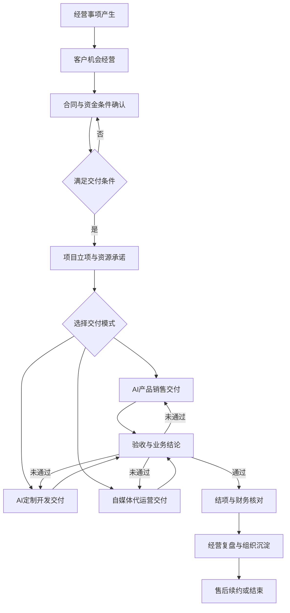

### 主流程说明

- **流程启动条件**: 公司获得潜在线索、已签约交付需求或需要纳入系统管理的内部经营事项。
- **流程结束条件**: 业务完成验收和必要财务核对，售后、维护、续约或终止责任明确，复盘结果已形成。
- **流程异常处理**: 线索、合同、收款、资源、交付或验收条件不满足时返回对应责任环节；重大延期、资源冲突或验收争议升级经营管理角色。
- **流程参与者**: 全体员工, 市场销售中心, 商务责任人, 财务, 项目发起人, 项目负责人, 部门负责人, 交付团队, 综合管理部, 经营管理层

## 子流程分析

### 子流程 1

#### 子流程概述

- **子流程名称**: 线索到成交与合同资金
- **子流程目的**: 把全员发现的机会转化为责任明确、过程可追踪且满足交付条件的成交业务。
- **子流程范围**: 从线索录入到成交移交、流失或退回，包含合同和资金条件核验。
- **关联的主流程节点**: MP-002

#### 子流程节点

| 节点编号 | 节点名称 | 节点描述 | 节点类型 |
|---------|---------|---------|---------|
| SP01-001 | 录入与查重 | 员工录入手机号、客户或公司名称、来源和需求摘要；按手机号优先、名称辅助进行查重并保留记录。 | 开始 |
| SP01-002 | 确定分配方式 | 普通公共线索向具备权限人员开放抢领；重点客户或已筛选商机由市场销售中心分配，每个客户仅保留一个主负责人。 | 判断 |
| SP01-003 | 保护期跟进 | 主负责人在30天保护期内记录沟通、客户状态和下一步行动，推进需求、方案、报价和谈判。 | 活动 |
| SP01-004 | 判断机会结果 | 成交则进入合同；明确无效则记录流失；主动放弃或超期则退回公共线索池。 | 判断 |
| SP01-005 | 合同与应收计划 | 商务责任人提交合同、付款约定和交付承诺，财务按权限完成审核并建立应收计划。 | 活动 |
| SP01-006 | 财务业务处理 | 财务记录收款、开票、退款、成本、利润及核验结果，并判断合同约定的交付启动条件。 | 活动 |
| SP01-007 | 成交移交 | 主客户负责人向项目发起人移交客户承诺、合同、付款条件、交付范围和联系人信息。 | 结束 |

#### 子流程图

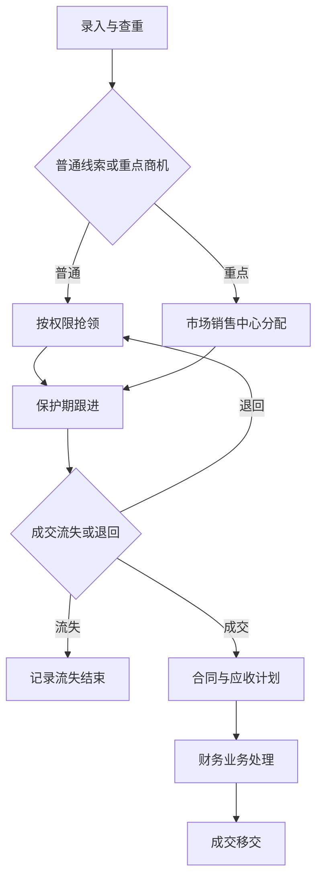

#### 子流程说明

- **子流程启动条件**: 任意员工获得潜在客户信息并提交线索。
- **子流程结束条件**: 线索完成成交移交、明确流失或退回线索池，所有操作形成历史。
- **子流程异常处理**: 重复线索进入合并判断；抢领冲突以先成功结果为准；合同或收款条件不满足时不得进入正式交付。
- **子流程参与者**: 全体员工, 线索责任人, 市场销售中心, 商务责任人, 财务, 项目发起人

### 子流程 2

#### 子流程概述

- **子流程名称**: 跨部门项目立项与计划
- **子流程目的**: 在正式执行前明确项目依据、负责人、成员投入、排期和交付基线。
- **子流程范围**: 从项目发起到计划获准进入执行。
- **关联的主流程节点**: MP-005

#### 子流程节点

| 节点编号 | 节点名称 | 节点描述 | 节点类型 |
|---------|---------|---------|---------|
| SP02-001 | 提交立项 | 项目发起人引用客户、合同、收款条件和交付范围，提出目标、期望时间及成员需求。 | 开始 |
| SP02-002 | 财务条件核验 | 财务核验合同状态和约定收款条件，只确认财务前提，不审批交付结果。 | 活动 |
| SP02-003 | 部门资源确认 | 涉及部门负责人查看成员能力、预计投入、已有排期和部门任务，同意、拒绝或提出替代人员。 | 并行 |
| SP02-004 | 项目负责人确认 | 项目发起人提议项目负责人，由其直属负责人或经营管理角色确认。 | 活动 |
| SP02-005 | 制定项目计划 | 项目负责人制定里程碑、任务、依赖、责任人、计划工时、排期、成果和验收节点。 | 活动 |
| SP02-006 | 处理计划冲突 | 发现人员冲突、重大延期风险或交付条件缺口时先协调，无法解决则升级经营管理角色。 | 判断 |
| SP02-007 | 形成计划基线 | 参与部门和项目负责人确认计划，项目进入执行；后续变更保留原因、影响和确认记录。 | 结束 |

#### 子流程图

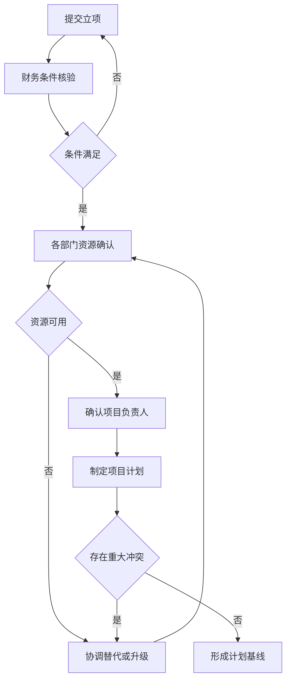

#### 子流程说明

- **子流程启动条件**: 成交业务完成商务移交，具备立项所需客户、合同和交付信息。
- **子流程结束条件**: 项目负责人、成员、投入、里程碑、任务和验收节点形成可执行基线。
- **子流程异常处理**: 财务条件不满足退回发起人；部门拒绝成员时提供原因或替代方案；重大冲突升级管理层。
- **子流程参与者**: 项目发起人, 财务, 部门负责人, 项目负责人, 经营管理角色

### 子流程 3

#### 子流程概述

- **子流程名称**: AI产品销售交付
- **子流程目的**: 让客户按合同获得可使用的AI产品和必要指导。
- **子流程范围**: 从商务交接到售后承接。
- **关联的主流程节点**: MP-007

#### 子流程节点

| 节点编号 | 节点名称 | 节点描述 | 节点类型 |
|---------|---------|---------|---------|
| SP03-001 | 商务交接 | 商务责任人移交客户、产品版本、数量、期限、承诺、联系人和交付日期。 | 开始 |
| SP03-002 | 交付条件核验 | 财务与产品交付负责人核对合同生效、收款条件和产品可交付性。 | 判断 |
| SP03-003 | 开通或部署 | 产品或技术角色完成账号、许可、配置、环境或交付包，并形成交付清单。 | 活动 |
| SP03-004 | 使用指导 | 产品交付角色或讲师提供手册、培训和首次使用支持，记录培训结果。 | 活动 |
| SP03-005 | 客户确认 | 商务责任人对照合同清单记录客户对产品、权限、期限和材料的确认结果。 | 判断 |
| SP03-006 | 售后承接 | 明确服务期限、问题入口、售后责任、续费或升级机会，完成交付移交。 | 结束 |

#### 子流程图

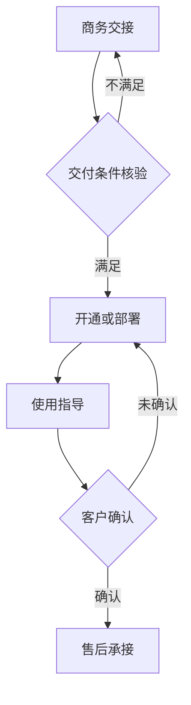

#### 子流程说明

- **子流程启动条件**: 合同生效并达到约定的交付或收款条件。
- **子流程结束条件**: 产品可用、客户确认、售后责任和服务期限明确。
- **子流程异常处理**: 条件不足时暂停；产品不可用或客户未确认时返回交付处理并记录原因。
- **子流程参与者**: 商务责任人, 财务, 产品交付负责人, 技术角色, 讲师, 售后角色

### 子流程 4

#### 子流程概述

- **子流程名称**: AI定制开发交付
- **子流程目的**: 把客户定制需求转化为范围受控、质量可验收的上线成果。
- **子流程范围**: 从项目启动到维护与复盘。
- **关联的主流程节点**: MP-007

#### 子流程节点

| 节点编号 | 节点名称 | 节点描述 | 节点类型 |
|---------|---------|---------|---------|
| SP04-001 | 项目启动 | 项目负责人明确目标、范围、项目功能角色、里程碑和沟通机制；同一员工可兼任角色但责任必须明确。 | 开始 |
| SP04-002 | 需求与验收基线 | 需求或产品角色完成调研、业务范围、规则和验收口径，并记录客户确认。 | 活动 |
| SP04-003 | 方案与原型确认 | 产品、设计和技术角色形成方案与原型，客户确认范围和关键业务规则。 | 活动 |
| SP04-004 | 开发迭代 | 技术负责人拆分开发任务，开发角色实现并提交阶段版本，项目负责人跟踪进度和变更。 | 活动 |
| SP04-005 | 测试与修复 | 测试角色执行测试、登记缺陷并验证修复，形成发布候选结论。 | 活动 |
| SP04-006 | 客户验收测试 | 客户按验收基线验证结果；缺陷返回修复，新增需求进入变更流程。 | 判断 |
| SP04-007 | 上线与培训 | 技术运维角色完成部署上线和监控准备，讲师提供使用培训并记录确认。 | 活动 |
| SP04-008 | 正式验收 | 项目负责人和商务责任人汇总交付清单、遗留问题和客户正式验收结论。 | 判断 |
| SP04-009 | 维护与复盘 | 售后角色承接维护期问题和客户服务，项目团队复盘范围、质量、进度和协作偏差。 | 结束 |

#### 子流程图

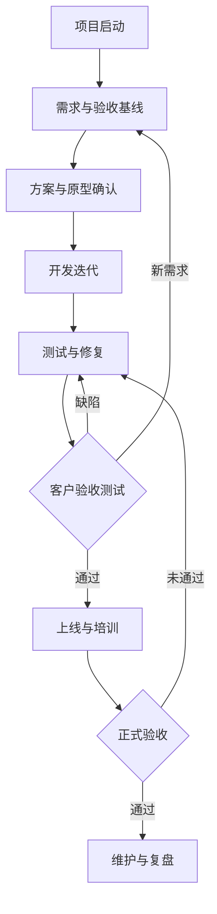

#### 子流程说明

- **子流程启动条件**: 项目已立项，目标、功能角色、合同范围和启动条件明确。
- **子流程结束条件**: 系统上线并正式验收，维护范围、售后角色和遗留问题明确。
- **子流程异常处理**: 缺陷返回测试修复；新增需求进入变更；上线失败回退并处理；重大延期或验收争议升级。
- **子流程参与者**: 项目负责人, 需求或产品角色, 技术负责人, 开发角色, 测试角色, 技术运维角色, 售后角色, 讲师, 商务责任人

### 子流程 5

#### 子流程概述

- **子流程名称**: 自媒体代运营交付
- **子流程目的**: 按月稳定完成内容、直播、运营和线索协同并形成客户可确认结果。
- **子流程范围**: 从账号诊断到月度确认和下期计划。
- **关联的主流程节点**: MP-007

#### 子流程节点

| 节点编号 | 节点名称 | 节点描述 | 节点类型 |
|---------|---------|---------|---------|
| SP05-001 | 账号与业务诊断 | 代运营PM汇总产品、受众、账号现状、历史数据、授权和资料缺口。 | 开始 |
| SP05-002 | 月度策略与排期 | 确定选题、发布、直播、投放和线索目标，形成内容日历、人员排期和客户确认的月度计划。 | 活动 |
| SP05-003 | 脚本与素材准备 | 编导、主播和相关责任人完成脚本、卖点、拍摄清单、产品和素材准备。 | 活动 |
| SP05-004 | 拍摄与制作 | 拍摄、后期和设计岗位按排期产出素材、成片、封面或配图并处理返工。 | 活动 |
| SP05-005 | 发布运营与投放 | 账号运营、主播、直播运营和投手按计划发布、互动、直播或投放并记录结果。 | 并行 |
| SP05-006 | 线索流转 | 运营人员把留资录入线索池并按线索规则移交市场或业务责任人跟进。 | 活动 |
| SP05-007 | 数据复盘 | 汇总内容、粉丝、曝光、互动、GMV、线索和满意度，形成问题与改进建议。 | 活动 |
| SP05-008 | 月度确认与下期计划 | 对照合同和月度计划记录客户确认、遗留事项、续约判断和下期计划。 | 结束 |

#### 子流程图

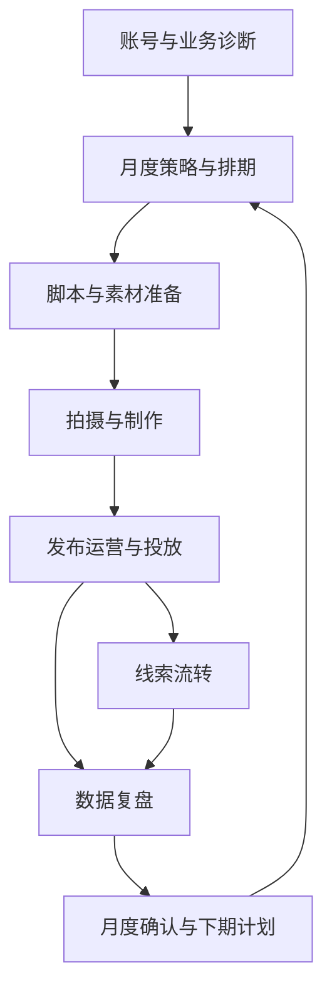

#### 子流程说明

- **子流程启动条件**: 合同生效、账号授权完成、服务周期和月度目标可确定。
- **子流程结束条件**: 当月约定交付完成并形成客户确认、遗留事项和下期计划。
- **子流程异常处理**: 资料或客户确认缺失时记录阻塞；错发、舆情、版权或投产异常进入问题处理；未达成项进入改进或合同边界确认。
- **子流程参与者**: 代运营PM, 编导, 拍摄后期, 设计, 主播, 账号运营, 直播运营, 投手, 市场或业务责任人, 商务责任人

### 子流程 6

#### 子流程概述

- **子流程名称**: 跨部门工单处理
- **子流程目的**: 让跨部门请求具备明确责任、处理时限、交付结果和升级闭环。
- **子流程范围**: 从工单创建到关闭、评价或重新打开。
- **关联的主流程节点**: MP-007

#### 子流程节点

| 节点编号 | 节点名称 | 节点描述 | 节点类型 |
|---------|---------|---------|---------|
| SP06-001 | 创建与分类 | 任意员工描述请求、期望结果、关联业务、目标部门和附件，选择普通协作、项目交付或紧急问题类型。 | 开始 |
| SP06-002 | 确定时限 | 按工单类型应用可配置时限：普通协作默认4工作小时响应和2工作日完成；项目交付默认2工作小时响应且按项目计划完成；紧急问题默认30分钟响应和4小时给出方案。 | 活动 |
| SP06-003 | 分派与受理 | 目标部门负责人分派处理人，处理人确认理解、处理计划或指出信息缺口。 | 活动 |
| SP06-004 | 提醒与升级 | 达到时限50%和80%时提醒；超时先升级处理人部门负责人，再升级项目负责人或发起部门负责人。 | 并行 |
| SP06-005 | 处理与提交结果 | 处理人完成任务、提交产出物或解决方案；必要时转派、协作或升级。 | 活动 |
| SP06-006 | 发起人确认 | 发起人对照期望结果确认通过或退回处理；通过后抄送处理人部门负责人。 | 判断 |
| SP06-007 | 关闭评价与重开 | 工单关闭归档；跨部门服务工单支持1至5分评价；发起人可在3个工作日内重新打开。 | 结束 |

#### 子流程图

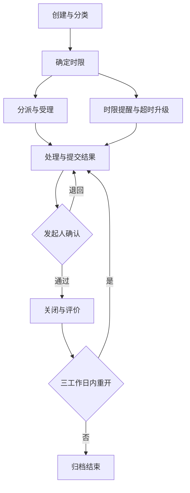

#### 子流程说明

- **子流程启动条件**: 员工产生需要其他部门处理的请求、问题或成果需求。
- **子流程结束条件**: 发起人确认结果，工单关闭且重开窗口结束，完整记录归档。
- **子流程异常处理**: 信息不足退回补充；无人受理或超时自动提醒升级；结果不符合要求返回处理；允许转派和重新打开。
- **子流程参与者**: 发起人, 目标部门负责人, 处理人, 协作人, 项目负责人, 发起部门负责人

### 子流程 7

#### 子流程概述

- **子流程名称**: 人员与会议联合排期
- **子流程目的**: 统一管理讲师及其他交付人员占用，并保持会议安排与飞书日历一致。
- **子流程范围**: 从资源或会议需求提出到确认、变更、取消、完成和实际工时记录。
- **关联的主流程节点**: MP-007

#### 子流程节点

| 节点编号 | 节点名称 | 节点描述 | 节点类型 |
|---------|---------|---------|---------|
| SP07-001 | 提出排期需求 | 项目、培训、直播、拍摄或会议组织者提出人员、时间、地点、预计工时和关联业务需求。 | 开始 |
| SP07-002 | 识别会议类型 | 会议排期区分内部培训会议和外部沙龙线下产品会议；不管理会议室，仅记录线下地址。 | 判断 |
| SP07-003 | 检查人员冲突 | 检查讲师或其他人员在项目、培训、会议、直播和已确认安排中的重叠占用及负荷。 | 判断 |
| SP07-004 | 确认讲师档期 | 讲师确认本人时间；存在冲突时部门负责人协调优先级、替代人员或调整时间。 | 活动 |
| SP07-005 | 确认排期 | 无未处理冲突时确认人员占用；会议状态从草稿进入待讲师确认并在确认后成为已确认。 | 活动 |
| SP07-006 | 同步飞书日历 | 已确认会议将讲师和内部参与人员加入飞书日历；外部联系信息由系统记录，组织者负责线下通知。 | 活动 |
| SP07-007 | 处理同步异常 | 同步失败时保留会议排期并标记失败，自动重试并通知组织者和系统管理员；同一会议更新原事件以避免重复。 | 判断 |
| SP07-008 | 变更或取消 | 会议时间或讲师变化时重新确认档期并更新飞书事件；取消后同步取消事件并释放人员占用。 | 活动 |
| SP07-009 | 完成与工时确认 | 活动完成后记录实际投入和结果，会议进入已完成，计划工时与实际工时可比较。 | 结束 |

#### 子流程图

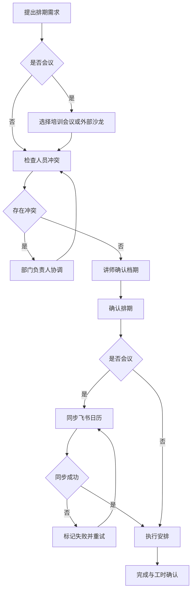

#### 子流程说明

- **子流程启动条件**: 项目或业务活动需要占用讲师、主播或其他交付人员，或需要安排内部培训会议及外部沙龙会。
- **子流程结束条件**: 排期完成或取消，人员占用和飞书日历状态一致，实际工时与业务结果已记录。
- **子流程异常处理**: 冲突不得静默确认；同步失败保留业务排期并重试；变更更新原事件；取消释放人员占用。
- **子流程参与者**: 项目负责人, 部门负责人, 培训部, 市场销售中心, 会议组织者, 讲师, 内部参与人员, 系统管理员

### 子流程 8

#### 子流程概述

- **子流程名称**: 月度OKR绩效与工资衔接
- **子流程目的**: 把目标执行、证据、评分和工资处理连接成可解释、可申诉且可追溯的月度闭环。
- **子流程范围**: 从规则生效到工资条发布和下周期复盘。
- **关联的主流程节点**: MP-010

#### 子流程节点

| 节点编号 | 节点名称 | 节点描述 | 节点类型 |
|---------|---------|---------|---------|
| SP08-001 | 规则版本生效 | 综合管理部维护岗位KPI、OKR、项目协作权重和特殊情况规则，明确适用岗位及月度周期。 | 开始 |
| SP08-002 | 目标逐级对齐 | 管理层制定公司目标，部门目标强制对齐公司，每名参评员工至少一项目标对齐部门。 | 活动 |
| SP08-003 | 执行更新与证据 | 员工更新目标进度并关联项目、工单、业务数据或补充证据，同一成果只能有一个计分归属。 | 活动 |
| SP08-004 | 直属负责人初评 | 直属负责人按生效规则和证据逐项评分并填写理由。 | 活动 |
| SP08-005 | 综合校准 | 综合管理部校验规则、证据、评分尺度、重复计分和特殊情况，形成校准结果。 | 活动 |
| SP08-006 | 员工确认或申诉 | 员工查看评分明细和理由，确认结果或提交申诉；综合管理部处理后形成结论。 | 判断 |
| SP08-007 | 绩效结果锁定 | 申诉完成后锁定结果，锁定结果只影响绩效工资或奖金，固定工资不变。 | 活动 |
| SP08-008 | 财务工资处理 | 财务读取锁定绩效结果和工资数据，完成工资核算、复核和发放状态记录。 | 活动 |
| SP08-009 | 发布工资条 | 绩效和财务流程均完成后向员工本人发布工资条，并保留处理记录。 | 结束 |

#### 子流程图

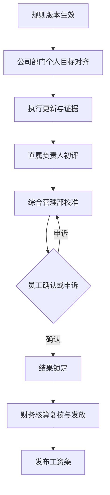

#### 子流程说明

- **子流程启动条件**: 新月度考核周期开始，适用规则版本已生效。
- **子流程结束条件**: 绩效结果锁定，财务完成核算复核和发放状态，工资条向本人发布。
- **子流程异常处理**: 缺少证据、重复计分或规则不适用时退回；申诉未结案不得锁定；未锁定结果或未完成财务复核不得发布工资条。
- **子流程参与者**: 管理层, 综合管理部, 部门负责人, 直属负责人, 员工, 财务

### 子流程 9

#### 子流程概述

- **子流程名称**: 员工生命周期与考勤
- **子流程目的**: 保持员工身份、组织关系、合同档案、权限、考勤和工资使用的基础信息一致。
- **子流程范围**: 覆盖入职、在职维护、转岗、离职和考勤确认，不含候选人招聘。
- **关联的主流程节点**: MP-010

#### 子流程节点

| 节点编号 | 节点名称 | 节点描述 | 节点类型 |
|---------|---------|---------|---------|
| SP09-001 | 入职建档 | 综合管理部建立员工、部门、岗位、劳动合同、必要档案和考勤身份，并触发账号建立。 | 开始 |
| SP09-002 | 在职维护 | 员工和综合管理部维护合同、档案及必要信息，部门负责人处理日常组织关系和考勤事项。 | 活动 |
| SP09-003 | 考勤确认 | 汇总打卡、外出和异常记录，由员工说明、部门负责人处理、综合管理部形成确认结果。 | 活动 |
| SP09-004 | 人员变动判断 | 员工发生转岗、合同变化或离职时进入相应处理；无变化则继续在职维护。 | 判断 |
| SP09-005 | 转岗生效 | 记录原部门岗位、新部门岗位、生效时间和交接事项，调整目标、审批、排期和权限关系并保留历史。 | 活动 |
| SP09-006 | 离职交接 | 完成客户、项目、工单、会议、线索和知识责任移交，核对未结工资事项并确定账号停用时间。 | 活动 |
| SP09-007 | 离职生效 | 离职关系生效后停用账号和权限，保留历史责任和业务记录。 | 结束 |

#### 子流程图

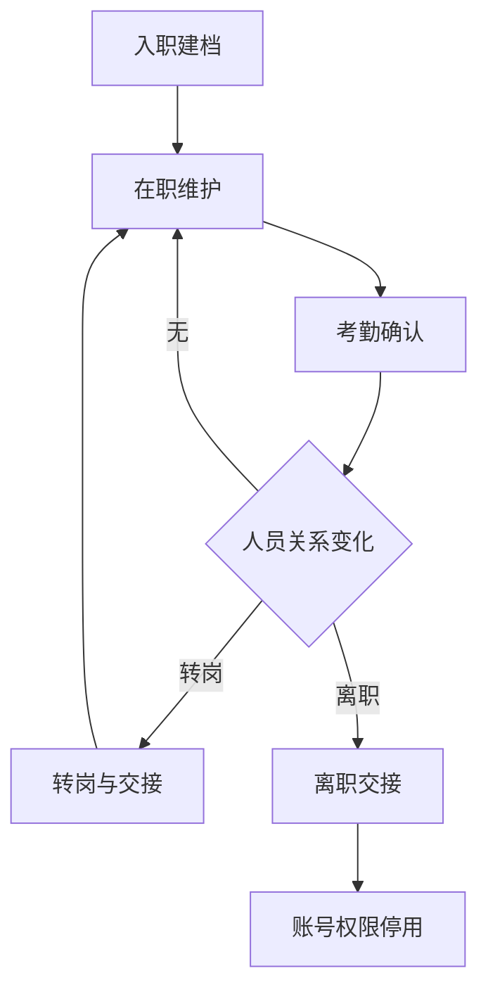

#### 子流程说明

- **子流程启动条件**: 员工正式入职或已在职员工纳入系统管理。
- **子流程结束条件**: 员工持续保持有效在职数据，或离职交接完成且账号权限停用。
- **子流程异常处理**: 档案或合同缺失标记待补；考勤异常未确认不得直接作为工资结论；离职存在未移交责任时不得静默停用。
- **子流程参与者**: 综合管理部, 员工, 部门负责人, 系统管理员, 财务, 责任接收人

### 子流程 10

#### 子流程概述

- **子流程名称**: 员工每日工作与部门管理
- **子流程目的**: 让员工明确每日责任并以最小填报形成可追溯工作记录。
- **子流程范围**: 从查看个人安排到日终记录和部门异常处理。
- **关联的主流程节点**: MP-007

#### 子流程节点

| 节点编号 | 节点名称 | 节点描述 | 节点类型 |
|---------|---------|---------|---------|
| SP10-001 | 汇总个人安排 | 员工查看本人目标、项目任务、工单、会议、培训、直播、排期和考勤安排。 | 开始 |
| SP10-002 | 处理时间冲突 | 员工发现重叠安排后与部门负责人或项目负责人协调优先级、时间或替代资源。 | 判断 |
| SP10-003 | 执行与更新 | 员工按业务事项更新进度、问题和成果，优先复用项目、工单或会议记录。 | 活动 |
| SP10-004 | 日终最小记录 | 员工填写今日工作、明日计划和产出物，不重复填报已有业务结果。 | 活动 |
| SP10-005 | 部门查看与纠偏 | 部门负责人查看未完成、逾期、负荷和冲突，对异常安排协调或发起处理。 | 结束 |

#### 子流程图

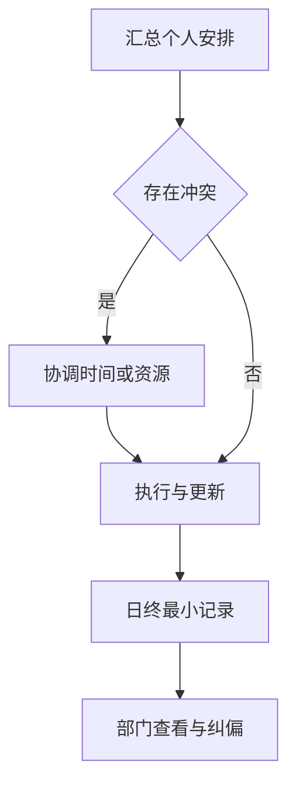

#### 子流程说明

- **子流程启动条件**: 员工在工作日或业务执行周期内存在目标、任务、工单、会议或排期。
- **子流程结束条件**: 当日工作、明日计划和必要产出物形成记录，部门异常得到识别。
- **子流程异常处理**: 时间冲突先协调；业务系统已有结果时直接引用；缺少成果或进度时标记待补充。
- **子流程参与者**: 员工, 部门负责人, 项目负责人

### 子流程 11

#### 子流程概述

- **子流程名称**: AI知识来源治理与使用
- **子流程目的**: 让企业文件、飞书工作群和云文档在授权范围内沉淀为可信知识。
- **子流程范围**: 从来源申请授权到采集、使用、纠错、下架或删除。
- **关联的主流程节点**: MP-010

#### 子流程节点

| 节点编号 | 节点名称 | 节点描述 | 节点类型 |
|---------|---------|---------|---------|
| SP11-001 | 来源申请 | 工作群由群主或业务责任人申请，云文档由所有者或知识责任人申请，企业文件由上传人声明来源和范围。 | 开始 |
| SP11-002 | 部门授权 | 所属部门负责人批准来源和查看范围；跨部门或敏感内容由相关责任部门共同批准。 | 判断 |
| SP11-003 | 技术接入与采集 | 系统管理员仅执行技术接入；默认从授权后采集工作群、云文档或企业文件，不采集个人聊天。 | 活动 |
| SP11-004 | 整理与发布 | 知识责任人处理重复、失效和敏感内容，设置公司、部门、岗位或指定人员的最小查看范围。 | 活动 |
| SP11-005 | 授权检索使用 | 员工在授权范围内检索和查看知识，并能够追溯来源、版本和更新时间。 | 活动 |
| SP11-006 | 反馈与治理 | 员工反馈错误或过期内容，知识责任人纠错、合并、标记失效或下架，并保留版本和原因。 | 活动 |
| SP11-007 | 撤权或删除 | 来源撤销授权后停止新增采集；删除原始文件或飞书内容需来源所有者或部门负责人确认，由系统管理员执行。 | 结束 |

#### 子流程图

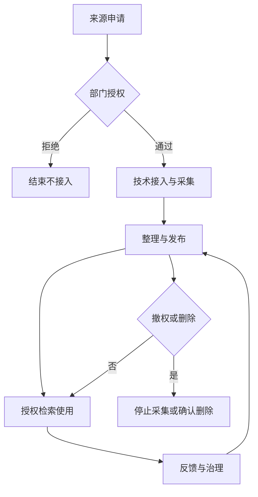

#### 子流程说明

- **子流程启动条件**: 存在需要沉淀的企业文件、飞书工作群或云文档来源。
- **子流程结束条件**: 来源持续受控使用，或撤权、下架、删除并保留治理记录。
- **子流程异常处理**: 未经授权不采集；历史回溯需单独批准；同步失败暂停或重试；越权访问必须被阻止并记录。
- **子流程参与者**: 来源所有者, 业务责任人, 部门负责人, 知识内容责任人, 系统管理员, 员工

### 子流程 12

#### 子流程概述

- **子流程名称**: 经营复盘与纠偏
- **子流程目的**: 让管理层从经营指标下钻到业务事实并推动责任人完成改进。
- **子流程范围**: 从周期性查看经营状态到纠偏事项闭环。
- **关联的主流程节点**: MP-010

#### 子流程节点

| 节点编号 | 节点名称 | 节点描述 | 节点类型 |
|---------|---------|---------|---------|
| SP12-001 | 选择复盘范围 | 管理层按公司、部门、项目、员工、客户、业务类型和时间选择复盘范围。 | 开始 |
| SP12-002 | 查看经营与执行指标 | 查看线索转化、回款、项目交付、目标绩效、人员负荷、工单、排期和知识风险。 | 并行 |
| SP12-003 | 识别异常 | 识别线索超期、应收逾期、项目延期、目标偏差、资源冲突、工单超时或同步失败。 | 判断 |
| SP12-004 | 下钻业务事实 | 从异常指标追溯到部门、项目、员工和原始业务记录，核对口径和责任。 | 活动 |
| SP12-005 | 形成纠偏行动 | 明确责任人、行动、截止时间和预期结果，可通过项目任务或工单承接。 | 活动 |
| SP12-006 | 跟踪与沉淀 | 跟踪纠偏结果，关闭后形成复盘结论，并将可复用经验按知识治理流程沉淀。 | 结束 |

#### 子流程图

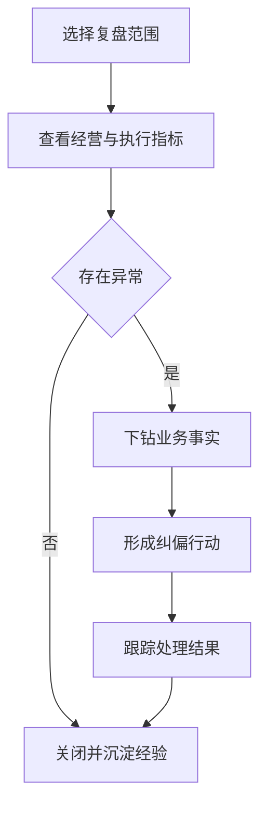

#### 子流程说明

- **子流程启动条件**: 进入日、周、月等经营复盘周期，或管理层主动查看异常。
- **子流程结束条件**: 异常形成明确行动并完成跟踪，或确认无异常并记录复盘结论。
- **子流程异常处理**: 汇总与明细不一致时先核对数据口径；责任不清时升级协调；纠偏未完成继续保留待办。
- **子流程参与者**: 董事会, 经营管理层, 部门负责人, 项目负责人, 业务责任人, 财务, 综合管理部
