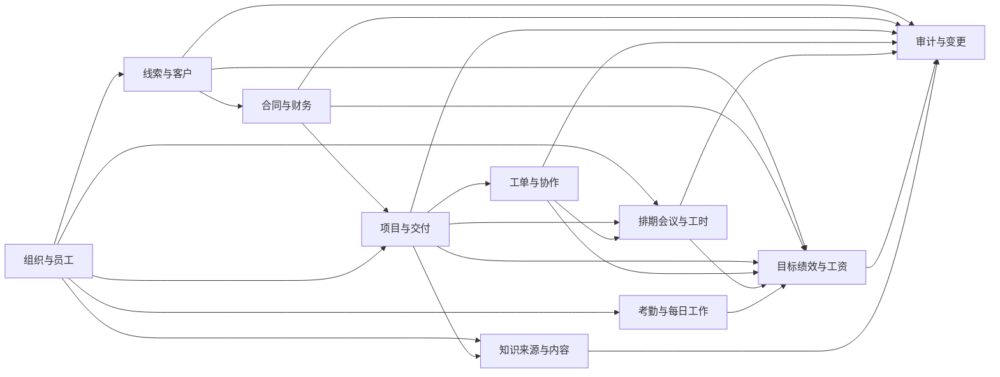

# CRM+OKR公司经营管理全域 - 数据字典分析

## 基本信息

- **业务域名称**: CRM+OKR公司经营管理全域
- **业务域描述**: 统一定义单一公司在线索客户、合同资金、项目交付、工单协作、人员与会议排期、OKR绩效工资、员工考勤、每日工作和AI知识治理中的核心业务数据口径。
- **分析时间**: 2026-07-21

## 数据字典总览

- **业务含义**: 将B1.2的10类业务数据存储和44条数据流拆解为可复用、可追溯的业务数据项，明确名称、含义、来源、用途、约束、枚举和责任边界。
- **适用范围**: 用于后续逻辑数据模型、决策规则、对象分析和系统数据需求；不等同于数据库字段、接口参数或物理存储设计。
- **分类说明**: 按组织员工、线索客户、合同财务、项目交付、工单协作、排期会议、目标绩效工资、考勤日报、知识治理和审计追溯十类业务信息组织。

## 数据流定义

| 数据流范围 | 业务主题 | 主要来源 | 主要去向 | 对应数据结构 |
|---|---|---|---|---|
| F01-F06 | 线索录入、查重、分配、跟进、成交移交和客户确认 | 员工、管理者、客户、D02 | P01、P02、D02、D03 | DS01线索客户、DS02合同资金 |
| F07-F10 | 合同应收、资金核验、启动结论和项目立项输入 | P02、E05、D02、D03 | D03、P03、D04 | DS01、DS02、DS03项目交付 |
| F11-F15 | 项目资源、计划、执行、交付和验收 | D01、D06、员工、客户 | P03、D04、客户 | DS03、DS05排期会议、DS07员工考勤 |
| F16-F18 | 项目工单、工单流转和结果回流 | P03、员工、管理者、D05 | P04、D05、P03、P10 | DS03、DS04工单协作 |
| F19-F23 | 排期需求、冲突检查、日历同步和工时确认 | P03、P04、员工、飞书、D01、D04、D05、D08 | P05、D06、飞书 | DS05、DS07 |
| F24-F29 | 逐级目标、规则、证据、评分、绩效转工资和结果发布 | 管理者、员工、D02-D08 | P06、D07、员工 | DS06目标绩效工资 |
| F30-F32 | 员工生命周期、考勤和有效人员基线 | 员工、管理者、D01 | P07、D01、D08及各业务过程 | DS07 |
| F33-F35 | 个人安排、日报和部门工作异常 | D04-D08、员工 | P08、D08、员工、管理者 | DS08每日工作 |
| F36-F39 | 知识来源、授权发布、检索反馈和结果返回 | 员工、管理者、飞书、D09 | P09、D09、员工 | DS09知识治理 |
| F40-F44 | 经营汇总、审计下钻、纠偏、复盘知识和关键操作留痕 | D02-D10、管理者、P01-P10 | P10、P03、P04、P09、D09、D10 | DS09、DS10经营复盘与审计 |

> F01-F44逐条来源、去向和约束保存在同名JSON中，并与B1.2数据流编号保持一致。

## 数据存储定义

| 编号 | 业务数据存储 | 核心内容 | 维护责任 |
|---|---|---|---|
| D01 | 组织与员工档案 | 员工身份、组织岗位、劳动合同和人员变动历史 | 综合管理部 |
| D02 | 线索与客户档案 | 线索、客户、联系人、主负责人、保护期和跟进历史 | 市场销售中心、线索主负责人 |
| D03 | 合同与财务业务台账 | 合同、应收、收款、开票、退款、成本、利润和核验结论 | 财务、商务责任人 |
| D04 | 项目与交付档案 | 立项、计划、任务、工时、成果、验收、结项和售后 | 项目负责人、业务责任人 |
| D05 | 工单与协作档案 | 工单责任、时限、流转、产出物、确认和满意度 | 发起部门、处理部门 |
| D06 | 排期会议与工时档案 | 人员占用、会议、讲师确认、飞书同步和实际工时 | 组织者、讲师、部门负责人 |
| D07 | 目标绩效与工资结果 | 规则、目标、证据、评分、申诉、锁定结果和工资处理 | 综合管理部、财务 |
| D08 | 考勤与每日工作记录 | 考勤事实、异常确认、今日工作、明日计划和产出引用 | 综合管理部、员工、部门负责人 |
| D09 | 知识来源与内容库 | 来源授权、知识内容、可见范围、版本和治理状态 | 来源所有者、知识责任人、系统管理员 |
| D10 | 全域审计与变更记录（推定） | 关键动作、操作人、时间、变更摘要和原因 | 各业务责任人、系统管理员 |

**推定说明**：D10及其5个数据项延续B1.2的推定设计，用于满足关键操作追溯和经营异常下钻；只定义业务信息，不预设独立审计中心或技术日志实现。

## 数据结构定义

| 编号 | 数据结构 | 对应存储 | 主要组成 | 关联数据流 |
|---|---|---|---|---|
| DS01 | 线索客户结构 | D02 | 线索、客户、联系人、来源、主负责人、保护期和状态 | F01-F06 |
| DS02 | 合同资金结构 | D03 | 合同、金额、付款条件、应收、收款和启动结论 | F05-F10 |
| DS03 | 项目交付结构 | D04 | 项目、类型、负责人、角色、计划、任务、工时、成果、验收和状态 | F09-F16 |
| DS04 | 工单协作结构 | D05 | 工单、级别、发起/处理责任、时限、状态、产出和满意度 | F16-F18 |
| DS05 | 排期会议结构 | D06 | 排期、会议、组织者、讲师、时间、地址、确认和飞书同步 | F19-F23 |
| DS06 | 目标绩效工资结构 | D07 | 周期、规则、目标、证据、评分、校准、申诉、锁定和工资状态 | F24-F29 |
| DS07 | 员工考勤结构 | D01、D08 | 员工、部门岗位、在职状态、变动时间和考勤结论 | F30-F32 |
| DS08 | 每日工作结构 | D08 | 今日工作、明日计划和产出物引用 | F33-F35 |
| DS09 | 知识治理结构 | D09 | 来源、授权、所有者、知识、可见范围、版本和状态 | F36-F39、F43 |
| DS10 | 经营复盘与审计结构 | D02-D10 | 经营范围、指标明细引用、审计记录、纠偏和复盘结论 | F40-F44 |

## 编码、枚举与业务口径

| 口径 | 主要取值 | 业务用途 |
|---|---|---|
| 线索状态 | 待查重、公共池、待分配、跟进中、已成交、已流失、已退回、已合并 | 控制领取、跟进、移交和结束 |
| 合同状态 | 草稿、审核中、已生效、已变更、已终止、已完成 | 控制合同有效性和交付前提 |
| 应收状态 | 未到期、部分收款、已收清、已逾期、已退款调整 | 表达付款计划履行结果 |
| 项目状态 | 待立项、审批中、待启动、执行中、暂停、验收中、已完成、已终止、售后中 | 表达项目主生命周期 |
| 工单状态 | 待分派、待受理、处理中、待确认、已关闭、已转派、已升级、已重开、已取消 | 表达跨部门协作流转 |
| 排期状态 | 草稿、待讲师确认、已确认、已变更、已取消、已完成 | 表达人员和会议安排生命周期 |
| 飞书同步状态 | 未同步、同步中、同步成功、同步失败、取消同步成功 | 表达排期与飞书事件一致性 |
| 绩效结果状态 | 待评分、待校准、待员工确认、申诉中、已锁定 | 控制绩效结果向工资传递 |
| 工资处理状态 | 待核算、核算中、待复核、已复核、已发放、工资条已发布 | 控制工资处理和发布 |
| 知识来源状态 | 待申请、审批中、已授权、采集中、已暂停、已撤权、已删除 | 控制知识来源采集 |
| 知识内容状态 | 整理中、已发布、已失效、已下架、已删除 | 控制授权检索结果 |

## 数据项定义表

| 数据项名称 | 业务含义 | 数据类型 | 数据长度 | 取值范围 | 枚举值 | 业务规则 | 数据来源 | 数据用途 | 关联实体 | 关联功能 | 关联状态 |
|-----------|---------|---------|---------|---------|-------|---------|---------|---------|---------|---------|---------|
| 员工业务标识 | 在公司范围内唯一识别一名员工的业务编号 | 文本 | 按业务内容 | 公司内唯一 |  | 转岗不变，离职后不得复用 | 综合管理部入职建档 | 关联责任、排期、考核和历史记录 | 组织与员工档案 | 员工生命周期与考勤 | 员工在职状态 |
| 员工姓名 | 员工在公司业务活动中使用的姓名 | 文本 | 按业务内容 | 非空 |  | 姓名变更保留历史 | 员工档案 | 人员识别与业务展示 | 组织与员工档案 | 员工生命周期与考勤 |  |
| 所属部门 | 员工当前归属的正式部门 | 文本 | 按业务内容 | 有效部门 |  | 转岗按生效时间更新，历史记录不覆盖 | 综合管理部与转岗记录 | 管理范围、资源确认和目标对齐 | 组织与员工档案 | 员工生命周期与考勤 | 员工在职状态 |
| 岗位名称 | 员工当前承担的正式岗位 | 文本 | 按业务内容 | 有效岗位 |  | 一人兼任项目功能角色不改变正式岗位 | 综合管理部 | 岗位KPI和工作责任适用 | 组织与员工档案 | 员工生命周期与考勤 |  |
| 直属负责人 | 员工当前直接管理责任人 | 文本 | 按业务内容 | 有效在职员工 |  | 变更按生效时间记录 | 组织关系维护 | 目标确认、初评和日常管理 | 组织与员工档案 | 员工生命周期与考勤 |  |
| 员工在职状态 | 员工在人事生命周期中的当前状态 | 枚举 | 按枚举编码 | 预入职至已离职 | 待入职, 在职, 转岗处理中, 离职交接中, 已离职 | 已离职员工不能承接新业务，但历史责任保留 | 综合管理部 | 控制业务责任、排期和账号状态 | 组织与员工档案 | 员工生命周期与考勤 | 员工在职状态 |
| 劳动合同有效期 | 当前劳动合同的起止日期及有效性 | 文本 | 按业务内容 | 合法日期区间 |  | 合同变化保留历史版本 | 劳动合同档案 | 员工档案与到期管理 | 组织与员工档案 | 员工生命周期与考勤 |  |
| 人员变动生效时间 | 入职、转岗或离职正式生效的时间 | 日期时间 | YYYY-MM-DD HH:mm:ss | 有效时间 |  | 业务关系以生效时间切换 | 综合管理部确认 | 同步责任、排期、目标和权限基线 | 组织与员工档案 | 员工生命周期与考勤 | 员工在职状态 |
| 线索业务标识 | 唯一识别一条线索记录的业务编号 | 文本 | 按业务内容 | 公司内唯一 |  | 合并后原线索标识仍保留用于追溯 | 线索录入 | 关联全部线索操作 | 线索与客户档案 | 线索与客户机会经营 | 线索状态 |
| 客户业务标识 | 唯一识别一个客户主体的业务编号 | 文本 | 按业务内容 | 公司内唯一 |  | 同一客户可关联多条线索、联系人、合同和项目 | 查重或客户建档 | 贯通销售、合同和交付 | 线索与客户档案 | 线索与客户机会经营 |  |
| 客户或公司名称 | 客户个人名称或企业全称 | 文本 | 按业务内容 | 非空 |  | 名称标准化与同名合并细则由业务规则控制 | 录入人或客户资料 | 查重、展示和合同关联 | 线索与客户档案 | 线索与客户机会经营 |  |
| 联系人姓名 | 客户侧具体联系人的姓名 | 文本 | 按业务内容 | 可为空 |  | 企业客户可维护多个联系人 | 录入人或主负责人 | 沟通和交付联系 | 线索与客户档案 | 线索与客户机会经营 |  |
| 联系人手机号 | 客户联系人手机号 | 文本 | 按业务内容 | 合法手机号或空 |  | 已确认以手机号作为优先查重依据 | 录入人 | 查重和联系 | 线索与客户档案 | 线索与客户机会经营 |  |
| 线索来源 | 线索最初进入公司的来源分类 | 枚举 | 按枚举编码 | 首期已确认来源 | 人工录入 | 首期线索来源为全员人工录入，来源变化保留原始记录 | 录入人 | 渠道分析和转化分析 | 线索与客户档案 | 线索与客户机会经营 |  |
| 线索主负责人 | 当前对客户机会承担主要跟进责任的员工 | 文本 | 按业务内容 | 有效在职员工 |  | 每个客户同一时点只保留一个主负责人 | 抢领或市场销售中心分配 | 责任归属和保护期控制 | 线索与客户档案 | 线索与客户机会经营 | 线索状态 |
| 保护期截止时间 | 当前主负责人享有线索保护的截止时间 | 日期时间 | YYYY-MM-DD HH:mm:ss | 领取或分配后30天 |  | 保护期按已确认30天计算；延长条件由规则阶段定义 | 抢领或分配时间 | 退回线索池和超期判断 | 线索与客户档案 | 线索与客户机会经营 | 线索状态 |
| 线索状态 | 线索在销售经营过程中的当前结果 | 枚举 | 按枚举编码 | 有效线索状态 | 待查重, 公共池, 待分配, 跟进中, 已成交, 已流失, 已退回, 已合并 | 状态变化必须保留操作者、时间和原因 | 线索主负责人或市场销售中心 | 控制抢领、跟进和成交移交 | 线索与客户档案 | 线索与客户机会经营 | 线索状态 |
| 下一步跟进行动 | 主负责人承诺的下一次行动及时间 | 文本 | 按业务内容 | 跟进中时应明确 |  | 每次跟进后更新，历史沟通不覆盖 | 线索主负责人 | 销售推进和逾期提醒 | 线索与客户档案 | 线索与客户机会经营 | 线索状态 |
| 流失或退回原因 | 线索结束或返回公共池的业务原因 | 文本 | 按业务内容 | 流失或退回时必填 |  | 原因需与对应状态同步记录 | 线索主负责人或系统规则 | 复盘和重新分配 | 线索与客户档案 | 线索与客户机会经营 | 线索状态 |
| 合同业务标识 | 唯一识别一份客户合同的业务编号 | 文本 | 按业务内容 | 公司内唯一 |  | 一个客户可有多份合同 | 商务责任人 | 关联应收、项目和验收 | 合同与财务业务台账 | 合同与资金处理 | 合同状态 |
| 合同金额 | 合同约定的含税或业务确认金额 | 金额 | 人民币元，保留2位小数 | 大于等于0 |  | 金额口径以合同记录为准，变更保留版本 | 合同 | 应收、收入和利润分析 | 合同与财务业务台账 | 合同与资金处理 |  |
| 合同状态 | 合同从草拟到结束的当前业务状态 | 枚举 | 按枚举编码 | 有效合同状态 | 草稿, 审核中, 已生效, 已变更, 已终止, 已完成 | 只有已生效且满足约定条件的合同可进入正式交付 | 商务责任人与财务 | 交付前提和经营统计 | 合同与财务业务台账 | 合同与资金处理 | 合同状态 |
| 付款条件 | 合同约定的付款节点、比例、金额或时间条件 | 文本 | 按业务内容 | 非空 |  | 应收计划必须与付款条件一致 | 合同 | 建立应收和判断启动条件 | 合同与财务业务台账 | 合同与资金处理 |  |
| 应收金额 | 截至当前应向客户收取但尚未核销的金额 | 金额 | 人民币元，保留2位小数 | 大于等于0 |  | 按合同付款计划减去已核销收款计算 | 财务 | 回款跟踪和逾期识别 | 合同与财务业务台账 | 合同与资金处理 | 应收状态 |
| 应收截止日期 | 本期应收应完成的日期 | 日期 | YYYY-MM-DD | 有效日期 |  | 超过日期且未收足时标记逾期 | 合同付款计划 | 回款提醒和逾期分析 | 合同与财务业务台账 | 合同与资金处理 | 应收状态 |
| 已收金额 | 经财务核验并归属到合同的累计收款 | 金额 | 人民币元，保留2位小数 | 大于等于0 |  | 只有财务核验通过的到账事实计入 | 外部到账事实与财务核验 | 交付条件和回款统计 | 合同与财务业务台账 | 合同与资金处理 | 应收状态 |
| 应收状态 | 付款计划的当前履行状态 | 枚举 | 按枚举编码 | 有效应收状态 | 未到期, 部分收款, 已收清, 已逾期, 已退款调整 | 由应收截止日期、应收金额、已收金额和退款共同形成 | 财务 | 回款风险和项目启动判断 | 合同与财务业务台账 | 合同与资金处理 | 应收状态 |
| 开票状态 | 合同相关发票的当前处理结论 | 枚举 | 按枚举编码 | 有效开票状态 | 未申请, 待开票, 已开票, 已作废, 已红冲 | 由财务维护，项目团队只读 | 财务 | 财务跟踪和客户服务 | 合同与财务业务台账 | 合同与资金处理 |  |
| 项目财务启动结论 | 合同和收款条件是否允许进入正式项目交付 | 枚举 | 按枚举编码 | 有效核验结论 | 待核验, 满足, 不满足, 特批满足 | 财务只确认财务前提，不审批交付结果 | 财务核验 | 项目立项门禁 | 合同与财务业务台账 | 合同与资金处理 | 合同状态 |
| 项目成本金额 | 归集到项目的经确认成本 | 金额 | 人民币元，保留2位小数 | 大于等于0 |  | 成本口径由财务维护 | 财务与项目成本凭证 | 项目利润分析 | 合同与财务业务台账 | 合同与资金处理 |  |
| 项目利润金额 | 项目收入减去已确认项目成本后的经营结果 | 金额 | 人民币元，保留2位小数 | 允许负数 |  | 以财务确认口径计算，不等同法定会计利润 | 财务 | 经营复盘和项目分析 | 合同与财务业务台账 | 合同与资金处理 |  |
| 项目业务标识 | 唯一识别一个交付项目的业务编号 | 文本 | 按业务内容 | 公司内唯一 |  | 一份合同可关联一个或多个项目 | 项目立项 | 贯通计划、任务、工单、排期和验收 | 项目与交付档案 | 项目与分类交付 | 项目状态 |
| 项目业务类型 | 项目对应的主营业务交付类型 | 枚举 | 按枚举编码 | 三类主营业务 | AI产品销售, AI定制开发, 自媒体代运营 | 立项时必须选择且决定后续交付过程 | 合同与项目发起人 | 选择交付过程和统计口径 | 项目与交付档案 | 项目与分类交付 |  |
| 项目负责人 | 对项目计划、进度、协调和结项负责的员工 | 文本 | 按业务内容 | 有效在职员工 |  | 由发起人提议并经直属负责人或经营管理角色确认 | 项目立项确认 | 责任归属和项目管理 | 项目与交付档案 | 项目与分类交付 | 项目状态 |
| 项目功能角色 | AI定制项目中承担PM、需求、技术、开发等职责的角色安排 | 文本 | 按业务内容 | 一个员工可承担多个角色 |  | 兼任必须分别记录责任，角色不等同正式部门岗位 | 项目负责人和部门负责人 | 明确交付职责和历史责任 | 项目与交付档案 | 项目与分类交付 |  |
| 项目计划起止时间 | 项目基线中的计划开始和计划结束日期 | 文本 | 按业务内容 | 有效日期区间 |  | 变更必须保留原基线、原因和影响 | 项目负责人 | 进度、排期和延期判断 | 项目与交付档案 | 项目与分类交付 |  |
| 项目里程碑 | 项目阶段性目标、计划日期和成果要求 | 文本 | 按业务内容 | 至少一个有效里程碑 |  | 里程碑应关联负责人和可确认成果 | 项目负责人 | 阶段跟踪和交接确认 | 项目与交付档案 | 项目与分类交付 | 项目状态 |
| 项目任务 | 可执行的工作事项及责任、计划时间和成果要求 | 文本 | 按业务内容 | 非空 |  | 任务应归属项目或里程碑并有唯一责任人 | 项目负责人或授权成员 | 每日执行和进度汇总 | 项目与交付档案 | 项目与分类交付 | 任务状态 |
| 计划工时 | 业务事项预估需要投入的工作时长 | 小数 | 按业务精度 | 大于等于0小时 |  | 用于资源确认和负荷比较，不直接等同绩效得分 | 项目负责人或任务责任人 | 排期和负荷管理 | 项目与交付档案 | 项目与分类交付 |  |
| 实际工时 | 业务事项完成后确认的实际投入时长 | 小数 | 按业务精度 | 大于等于0小时 |  | 来源应关联任务、会议、直播或其他业务事项 | 执行员工与负责人确认 | 计划偏差和成本分析 | 项目与交付档案 | 项目与分类交付 |  |
| 交付成果引用 | 项目实际产出的文件、版本、账号、内容或确认记录 | 文本 | 按业务内容 | 可追溯引用 |  | 验收前必须能够定位成果及版本 | 交付责任人 | 验收、复盘和知识沉淀 | 项目与交付档案 | 项目与分类交付 |  |
| 客户验收结论 | 客户对合同范围或周期成果的确认结果 | 枚举 | 按枚举编码 | 有效验收结论 | 待确认, 部分通过, 已通过, 未通过, 有条件通过 | 外部客户不登录时由内部商务责任人记录证据 | 客户反馈与内部记录 | 整改、变更、结项和收款 | 项目与交付档案 | 项目与分类交付 | 验收状态 |
| 项目状态 | 项目从立项到售后的当前业务状态 | 枚举 | 按枚举编码 | 有效项目状态 | 待立项, 审批中, 待启动, 执行中, 暂停, 验收中, 已完成, 已终止, 售后中 | 状态变化需关联业务依据，不得以工单状态替代项目状态 | 项目负责人及确认角色 | 项目控制和经营看板 | 项目与交付档案 | 项目与分类交付 | 项目状态 |
| 工单业务标识 | 唯一识别一张跨部门协作工单的业务编号 | 文本 | 按业务内容 | 公司内唯一 |  | 重开沿用原工单并保留重开次数 | 工单创建 | 贯通流转和评价 | 工单与协作档案 | 跨部门工单协作 | 工单状态 |
| 工单级别 | 决定响应和完成时限的业务类型 | 枚举 | 按枚举编码 | 已确认的三级规则 | 普通跨部门, 项目交付, 紧急客户或生产 | 不同级别使用不同响应和完成时限 | 发起人并由负责人确认 | SLA计算、提醒和升级 | 工单与协作档案 | 跨部门工单协作 |  |
| 工单发起人 | 提出跨部门协作要求并确认结果的员工 | 文本 | 按业务内容 | 有效员工 |  | 所有员工可创建，关闭前由发起人确认 | 员工 | 责任追溯和结果确认 | 工单与协作档案 | 跨部门工单协作 |  |
| 工单处理人 | 当前承担工单处理责任的员工 | 文本 | 按业务内容 | 有效员工 |  | 由目标部门负责人分配，转派保留历史 | 目标部门负责人 | 处理责任和时限跟踪 | 工单与协作档案 | 跨部门工单协作 | 工单状态 |
| 工单响应截止时间 | 处理人应完成受理响应的最晚时间 | 日期时间 | YYYY-MM-DD HH:mm:ss | 按工单级别计算 |  | 普通4工作小时、项目2工作小时、紧急30分钟 | 工单级别与创建时间 | 响应提醒和升级 | 工单与协作档案 | 跨部门工单协作 | 工单状态 |
| 工单完成截止时间 | 工单应提交可确认结果的最晚时间 | 日期时间 | YYYY-MM-DD HH:mm:ss | 按工单级别或项目计划计算 |  | 普通2工作日、项目按项目计划、紧急4小时给方案且完成时间另行确认 | 工单级别、项目计划或双方确认 | 完成提醒和逾期升级 | 工单与协作档案 | 跨部门工单协作 | 工单状态 |
| 工单状态 | 工单在协作流程中的当前状态 | 枚举 | 按枚举编码 | 有效工单状态 | 待分派, 待受理, 处理中, 待确认, 已关闭, 已转派, 已升级, 已重开, 已取消 | 关闭后3工作日内允许按规则重开 | 工单参与者 | 控制流转、提醒和统计 | 工单与协作档案 | 跨部门工单协作 | 工单状态 |
| 工单产出物引用 | 处理人提交的成果或完成证明 | 文本 | 按业务内容 | 待确认前应非空 |  | 发起人依据产出物确认结果 | 工单处理人 | 验收、项目回填和复盘 | 工单与协作档案 | 跨部门工单协作 |  |
| 工单满意度 | 发起人对跨部门服务结果的评分 | 整数 | 非负整数 | 1至5 |  | 关闭后由发起人评价，可配置是否必填 | 工单发起人 | 协作质量分析 | 工单与协作档案 | 跨部门工单协作 |  |
| 排期业务标识 | 唯一识别一项人员占用或会议安排的业务编号 | 文本 | 按业务内容 | 公司内唯一 |  | 变更沿用原排期并保留版本 | 排期创建 | 关联人员、项目、会议和工时 | 排期会议与工时档案 | 人员与会议排期 | 排期状态 |
| 排期类型 | 人员占用对应的业务活动分类 | 枚举 | 按枚举编码 | 有效活动类型 | 项目任务, 内部培训, 外部沙龙, 直播, 拍摄, 其他业务安排 | 会议排期必须进一步明确会议类型 | 组织者 | 冲突检查和分类统计 | 排期会议与工时档案 | 人员与会议排期 |  |
| 会议类型 | 会议排期的内部或外部业务类型 | 枚举 | 按枚举编码 | 两类会议或不适用 | 内部培训会议, 外部沙龙线下产品会议, 不适用 | 不管理会议室，仅记录线下地址 | 会议组织者 | 决定创建权限和通知方式 | 排期会议与工时档案 | 人员与会议排期 |  |
| 会议组织者 | 对会议创建、变更、取消和通知负责的员工 | 文本 | 按业务内容 | 授权员工 |  | 内部培训由培训部或授权组织者负责，外部沙龙由市场销售中心或授权组织者负责 | 会议创建 | 责任与通知追溯 | 排期会议与工时档案 | 人员与会议排期 |  |
| 讲师 | 需要确认本人档期并参与活动的员工 | 文本 | 按业务内容 | 有效讲师 |  | 讲师确认本人时间，部门负责人仅处理冲突和替代 | 排期需求 | 冲突检查和日历参与人 | 排期会议与工时档案 | 人员与会议排期 | 讲师确认状态 |
| 排期开始结束时间 | 人员被占用或会议举行的起止时间 | 文本 | 按业务内容 | 结束晚于开始 |  | 时间变化需重新检查冲突；会议还需讲师重新确认 | 组织者或项目负责人 | 人员占用和日历同步 | 排期会议与工时档案 | 人员与会议排期 |  |
| 线下地址 | 内部培训或外部沙龙举行的地点文本 | 文本 | 按业务内容 | 会议时可填写 |  | 只记录地址，不分配或管理会议室 | 会议组织者 | 参与人通知 | 排期会议与工时档案 | 人员与会议排期 |  |
| 讲师确认状态 | 讲师对本人档期的确认结果 | 枚举 | 按枚举编码 | 有效确认状态 | 待确认, 已确认, 已拒绝, 需协调, 已失效 | 时间或讲师变化后原确认失效 | 讲师 | 控制会议确认与日历同步 | 排期会议与工时档案 | 人员与会议排期 | 讲师确认状态 |
| 排期状态 | 排期或会议的当前业务状态 | 枚举 | 按枚举编码 | 有效排期状态 | 草稿, 待讲师确认, 已确认, 已变更, 已取消, 已完成 | 只有已确认会议进入飞书日历同步；取消释放人员占用 | 组织者与讲师 | 控制人员占用和业务执行 | 排期会议与工时档案 | 人员与会议排期 | 排期状态 |
| 飞书日历事件标识 | 飞书中对应同一会议事件的业务引用 | 文本 | 按业务内容 | 同步成功后存在 |  | 变更更新原事件，不重复创建 | 飞书同步结果 | 保持系统排期与飞书事件对应 | 排期会议与工时档案 | 人员与会议排期 | 飞书同步状态 |
| 飞书同步状态 | 会议排期向飞书日历同步的当前结果 | 枚举 | 按枚举编码 | 有效同步状态 | 未同步, 同步中, 同步成功, 同步失败, 取消同步成功 | 失败保留系统排期、自动重试并通知组织者和管理员 | 飞书 | 异常处理和一致性监控 | 排期会议与工时档案 | 人员与会议排期 | 飞书同步状态 |
| 考核周期 | OKR、KPI和绩效结果适用的月份 | 文本 | 按业务内容 | YYYY-MM |  | 按月管理，同一规则版本明确适用周期 | 综合管理部 | 目标、评分和工资归属 | 目标绩效与工资结果 | OKR绩效与工资衔接 |  |
| 绩效规则版本 | 一套已生效考核口径的唯一版本 | 文本 | 按业务内容 | 周期内唯一有效 |  | 评分必须引用生效版本，变更不覆盖历史结果 | 综合管理部 | 评分、校准和申诉依据 | 目标绩效与工资结果 | OKR绩效与工资衔接 |  |
| 目标业务标识 | 唯一识别一项公司、部门或个人目标的业务编号 | 文本 | 按业务内容 | 公司内唯一 |  | 个人至少一项目标对齐部门，部门目标对齐公司 | 目标制定者 | 建立逐级目标关系 | 目标绩效与工资结果 | OKR绩效与工资衔接 | 目标状态 |
| 目标层级 | 目标所属的组织层级 | 枚举 | 按枚举编码 | 三级目标 | 公司, 部门, 个人 | 部门和个人目标必须记录上级目标引用 | 目标制定者 | 逐级对齐和汇总 | 目标绩效与工资结果 | OKR绩效与工资衔接 |  |
| 上级目标引用 | 当前目标直接对齐的上一级目标 | 文本 | 按业务内容 | 部门或个人目标必填 |  | 公司目标无上级；部门指向公司；个人指向部门 | 目标制定者 | 对齐检查和贡献汇总 | 目标绩效与工资结果 | OKR绩效与工资衔接 |  |
| 目标进度 | 目标在周期内的完成比例 | 百分比 | 0-100，保留2位小数 | 0至100 |  | 自动业务数据优先，人工更新需保留说明 | 员工及业务事实 | 过程跟踪和周期评估 | 目标绩效与工资结果 | OKR绩效与工资衔接 | 目标状态 |
| 绩效证据引用 | 支撑目标或KPI完成情况的项目、工单、销售、回款、工时或产出记录 | 文本 | 按业务内容 | 可追溯引用 |  | 同一成果只能有一个计分归属 | 员工与业务存储 | 评分、校准和申诉 | 目标绩效与工资结果 | OKR绩效与工资衔接 |  |
| 指标权重 | 某项目标或KPI在综合评分中的占比 | 百分比 | 0-100，保留2位小数 | 0至100 |  | 同一适用范围内权重合计按生效规则校验 | 综合管理部 | 计算综合评分 | 目标绩效与工资结果 | OKR绩效与工资衔接 |  |
| 绩效评分 | 依据生效规则和证据形成的单项或综合得分 | 小数 | 按业务精度 | 按规则配置 |  | 必须保留评分人、理由和规则版本 | 直属负责人及系统计算 | 校准、申诉和绩效结果 | 目标绩效与工资结果 | OKR绩效与工资衔接 | 绩效结果状态 |
| 校准结论 | 综合管理部对规则适用、证据和评分尺度的处理结论 | 文本 | 按业务内容 | 评分进入确认前必需 |  | 重复计分、证据不足或尺度不一致时退回或调整并说明 | 综合管理部 | 形成员工可确认结果 | 目标绩效与工资结果 | OKR绩效与工资衔接 | 绩效结果状态 |
| 申诉结论 | 员工申诉及综合管理部最终处理结果 | 文本 | 按业务内容 | 有申诉时必填 |  | 申诉未结案不得锁定绩效结果 | 员工与综合管理部 | 锁定控制和结果解释 | 目标绩效与工资结果 | OKR绩效与工资衔接 | 绩效结果状态 |
| 绩效结果状态 | 月度绩效结果当前所处状态 | 枚举 | 按枚举编码 | 有效绩效状态 | 待评分, 待校准, 待员工确认, 申诉中, 已锁定 | 只有已锁定结果可传给财务工资处理 | 综合管理部 | 控制工资核算前提 | 目标绩效与工资结果 | OKR绩效与工资衔接 | 绩效结果状态 |
| 绩效工资或奖金结果 | 依据已锁定绩效结果形成的可计入工资处理的金额或系数结论 | 文本 | 按业务内容 | 按生效规则 |  | 不改变固定工资；具体换算由后续业务规则定义 | 已锁定绩效结果 | 财务工资核算 | 目标绩效与工资结果 | OKR绩效与工资衔接 |  |
| 工资处理状态 | 财务对当月工资核算、复核、发放和工资条的当前状态 | 枚举 | 按枚举编码 | 有效工资状态 | 待核算, 核算中, 待复核, 已复核, 已发放, 工资条已发布 | 绩效未锁定或财务未复核不得发布工资条 | 财务 | 控制发放记录和工资条发布 | 目标绩效与工资结果 | OKR绩效与工资衔接 | 工资处理状态 |
| 工资条发布对象 | 工资条允许查看的员工本人 | 文本 | 按业务内容 | 对应唯一员工 |  | 工资条仅向本人及授权财务人员开放 | 财务与员工档案 | 工资结果安全发布 | 目标绩效与工资结果 | OKR绩效与工资衔接 | 工资处理状态 |
| 考勤日期 | 考勤事实所属工作日期 | 日期 | YYYY-MM-DD | 有效日期 |  | 按员工和日期形成记录 | 考勤来源 | 考勤汇总和异常处理 | 考勤与每日工作记录 | 员工生命周期与考勤 | 考勤确认状态 |
| 考勤确认状态 | 员工当日考勤的处理结果 | 枚举 | 按枚举编码 | 有效状态 | 正常, 异常待说明, 待负责人确认, 待综合管理部确认, 已确认 | 异常未确认不得直接作为工资结论 | 员工、部门负责人和综合管理部 | 考勤管理和工资依据准备 | 考勤与每日工作记录 | 员工生命周期与考勤 | 考勤确认状态 |
| 考勤异常说明 | 员工对缺卡、迟到、外出等异常的说明及凭证引用 | 文本 | 按业务内容 | 异常时填写 |  | 说明和确认过程保留记录 | 员工 | 异常审核 | 考勤与每日工作记录 | 员工生命周期与考勤 |  |
| 今日工作 | 员工对当日已完成或推进事项的最小记录 | 文本 | 按业务内容 | 工作日填写 |  | 优先引用项目、工单、会议等已有结果，避免重复填报 | 员工 | 个人工作回顾和部门查看 | 考勤与每日工作记录 | 每日工作与部门管理 |  |
| 明日计划 | 员工计划在下一工作日推进的事项 | 文本 | 按业务内容 | 工作日填写 |  | 可关联已有目标、任务或工单 | 员工 | 个人安排和部门协调 | 考勤与每日工作记录 | 每日工作与部门管理 |  |
| 日报产出物引用 | 员工当日成果在项目、工单、文件或知识中的引用 | 文本 | 按业务内容 | 有产出时填写 |  | 不复制已有成果正文，只保存可追溯引用 | 员工 | 成果核验和减少重复填报 | 考勤与每日工作记录 | 每日工作与部门管理 |  |
| 知识来源业务标识 | 唯一识别一个文件、工作群或云文档来源的业务编号 | 文本 | 按业务内容 | 公司内唯一 |  | 撤权或删除后标识不复用 | 来源申请 | 关联授权、采集和版本 | 知识来源与内容库 | AI知识来源治理与使用 | 知识来源状态 |
| 知识来源类型 | 知识内容原始载体的分类 | 枚举 | 按枚举编码 | 首期三类来源 | 企业文件, 飞书工作群, 飞书云文档 | 不包含飞书个人聊天 | 来源所有者 | 决定授权与采集方式 | 知识来源与内容库 | AI知识来源治理与使用 |  |
| 来源所有者 | 有权申请、撤权或确认删除知识来源的责任人 | 文本 | 按业务内容 | 有效员工或业务责任人 |  | 工作群由群主或业务责任人，云文档由所有者或知识责任人负责 | 来源申请 | 授权和删除责任 | 知识来源与内容库 | AI知识来源治理与使用 |  |
| 来源授权范围 | 允许采集和查看来源内容的组织或人员范围 | 文本 | 按业务内容 | 公司、部门、岗位或指定人员 |  | 跨部门或敏感内容需相关责任部门共同批准 | 部门负责人或共同审批人 | 控制采集与最小可见范围 | 知识来源与内容库 | AI知识来源治理与使用 | 知识来源状态 |
| 知识来源状态 | 来源授权和采集的当前状态 | 枚举 | 按枚举编码 | 有效状态 | 待申请, 审批中, 已授权, 采集中, 已暂停, 已撤权, 已删除 | 未授权不采集；撤权后停止新增采集 | 来源所有者、部门负责人和管理员 | 控制采集和治理 | 知识来源与内容库 | AI知识来源治理与使用 | 知识来源状态 |
| 知识内容业务标识 | 唯一识别一条可检索知识内容的业务编号 | 文本 | 按业务内容 | 公司内唯一 |  | 内容更新形成版本，不覆盖来源关系 | 知识整理发布 | 检索、反馈和版本管理 | 知识来源与内容库 | AI知识来源治理与使用 | 知识内容状态 |
| 知识标题 | 用于识别和检索知识主题的标题 | 文本 | 按业务内容 | 非空 |  | 标题应反映业务主题，不替代原始来源 | 知识责任人或来源内容 | 检索和展示 | 知识来源与内容库 | AI知识来源治理与使用 |  |
| 知识来源引用 | 知识内容对应的原始文件、群消息范围或云文档位置 | 文本 | 按业务内容 | 可追溯引用 |  | 员工查看时可追溯来源、版本和更新时间 | 采集过程 | 可信核验和撤权影响分析 | 知识来源与内容库 | AI知识来源治理与使用 |  |
| 知识可见范围 | 某版本知识允许查看的最小人员范围 | 文本 | 按业务内容 | 不得超过来源授权范围 |  | 按公司、部门、岗位或指定人员控制 | 知识责任人 | 授权检索 | 知识来源与内容库 | AI知识来源治理与使用 |  |
| 知识版本 | 知识内容发布或更新的业务版本标识 | 文本 | 按业务内容 | 同一知识内唯一 |  | 纠错、合并和重大更新产生新版本并保留原因 | 知识责任人 | 版本追溯和检索可信度 | 知识来源与内容库 | AI知识来源治理与使用 |  |
| 知识内容状态 | 知识内容当前是否可被授权检索 | 枚举 | 按枚举编码 | 有效状态 | 整理中, 已发布, 已失效, 已下架, 已删除 | 失效或下架内容不作为正常检索结果 | 知识责任人 | 检索过滤和治理 | 知识来源与内容库 | AI知识来源治理与使用 | 知识内容状态 |
| 审计记录业务标识 | 唯一识别一次关键业务操作的记录编号 | 文本 | 按业务内容 | 公司内唯一 |  | 记录生成后不得复用 | 关键业务操作 | 串联操作轨迹 | 全域审计与变更记录 | 经营复盘与纠偏 |  |
| 关键操作类型 | 对业务数据执行的关键动作分类 | 枚举 | 按枚举编码 | 受审计动作 | 创建, 分配, 审批, 转派, 变更, 锁定, 发布, 撤权, 删除 | 只定义业务审计范围，不预设技术日志实现 | 各业务过程 | 操作筛选和风险追溯 | 全域审计与变更记录 | 经营复盘与纠偏 |  |
| 关键操作人 | 执行关键业务动作的员工或责任角色 | 文本 | 按业务内容 | 有效身份 |  | 需与操作发生时的组织身份一并追溯 | 各业务过程 | 责任下钻和申诉核验 | 全域审计与变更记录 | 经营复盘与纠偏 |  |
| 关键操作时间 | 关键业务动作实际发生的时间 | 日期时间 | YYYY-MM-DD HH:mm:ss | 有效时间 |  | 不得以数据更新时间替代业务操作时间 | 各业务过程 | 时序还原和时限核验 | 全域审计与变更记录 | 经营复盘与纠偏 |  |
| 变更前后业务摘要 | 关键字段或状态变更前后的业务可读摘要及原因 | 文本 | 按业务内容 | 按业务对象记录 |  | 敏感内容按原业务权限查看 | 各业务过程 | 解释审批、锁定、撤权和删除 | 全域审计与变更记录 | 经营复盘与纠偏 |  |

## 数据字典与业务实体映射表

| 业务实体名称 | 对应数据字典名称 | 映射关系说明 |
|-------------|-----------------|-------------|
| 组织与员工档案 | 员工业务标识、所属部门、岗位名称、员工在职状态 | 定义员工及组织关系的稳定业务口径 |
| 线索与客户档案 | 线索业务标识、客户业务标识、线索状态、线索主负责人 | 定义客户机会和唯一主负责人 |
| 合同与财务业务台账 | 合同业务标识、合同金额、应收状态、项目财务启动结论 | 定义合同、回款和交付财务前提 |
| 项目与交付档案 | 项目业务标识、项目状态、项目任务、客户验收结论 | 定义三类交付的计划与结果 |
| 工单与协作档案 | 工单业务标识、工单级别、工单状态、工单满意度 | 定义跨部门协作及SLA结果 |
| 排期会议与工时档案 | 排期业务标识、排期状态、讲师确认状态、飞书同步状态 | 定义人员占用和会议日历同步 |
| 目标绩效与工资结果 | 考核周期、绩效规则版本、绩效结果状态、工资处理状态 | 定义绩效到工资的受控传递 |
| 考勤与每日工作记录 | 考勤日期、考勤确认状态、今日工作、明日计划 | 定义员工出勤和最小日报 |
| 知识来源与内容库 | 知识来源业务标识、知识来源状态、知识内容业务标识、知识内容状态 | 定义来源授权、内容和治理 |
| 全域审计与变更记录 | 审计记录业务标识、关键操作类型、关键操作人、关键操作时间 | 定义关键业务操作追溯 |

## 数据字典与功能模块映射表

| 功能模块名称 | 对应数据字典名称 | 映射关系说明 |
|-------------|-----------------|-------------|
| 员工生命周期与考勤 | 员工业务标识、所属部门、员工在职状态、考勤日期、考勤确认状态 | 维护员工组织基线、合同档案、变动和考勤 |
| 线索与客户机会经营 | 线索业务标识、客户业务标识、联系人手机号、线索主负责人、保护期截止时间、线索状态 | 支持录入、查重、抢领/分配、保护期跟进和成交移交 |
| 合同与资金处理 | 合同业务标识、合同金额、合同状态、付款条件、应收状态、项目财务启动结论 | 支持合同、应收、收款、开票、退款、成本和利润处理 |
| 项目与分类交付 | 项目业务标识、项目业务类型、项目负责人、项目状态、项目任务、交付成果引用、客户验收结论 | 支持立项、计划、三类交付、验收、结项和售后 |
| 跨部门工单协作 | 工单业务标识、工单级别、工单处理人、工单状态、工单产出物引用、工单满意度 | 支持工单流转、SLA、升级和重开 |
| 人员与会议排期 | 排期业务标识、会议类型、讲师、讲师确认状态、排期状态、飞书同步状态 | 支持人员冲突检查、会议确认和飞书同步 |
| OKR绩效与工资衔接 | 考核周期、绩效规则版本、目标业务标识、绩效证据引用、绩效结果状态、工资处理状态 | 支持逐级目标、评分校准、申诉、锁定和工资条 |
| 每日工作与部门管理 | 今日工作、明日计划、日报产出物引用 | 支持个人安排汇总和部门异常查看 |
| AI知识来源治理与使用 | 知识来源业务标识、来源授权范围、知识来源状态、知识内容业务标识、知识可见范围、知识内容状态 | 支持授权采集、发布、检索、纠错和撤权 |
| 经营复盘与纠偏 | 项目利润金额、工单满意度、绩效评分、审计记录业务标识、变更前后业务摘要 | 支持经营汇总、异常下钻、纠偏和知识沉淀 |

## 数据字典与状态模型映射表

| 状态名称 | 对应数据字典名称 | 映射关系说明 |
|---------|-----------------|-------------|
| 员工在职状态 | 员工在职状态、人员变动生效时间 | 约束员工能否承接新责任并保留历史 |
| 线索状态 | 线索状态、线索主负责人、保护期截止时间 | 约束抢领、跟进、成交、退回和合并 |
| 合同状态 | 合同状态、项目财务启动结论 | 约束合同有效性和项目启动 |
| 应收状态 | 应收金额、应收截止日期、已收金额、应收状态 | 表达收款履行和逾期 |
| 项目状态 | 项目状态、项目里程碑、客户验收结论 | 约束计划、执行、验收、结项和售后 |
| 任务状态 | 项目任务、交付成果引用 | 表达任务执行及成果提交 |
| 验收状态 | 客户验收结论、交付成果引用 | 约束整改、变更或结项 |
| 工单状态 | 工单状态、工单响应截止时间、工单完成截止时间 | 约束分派、受理、处理、确认、关闭和重开 |
| 排期状态 | 排期状态、排期开始结束时间 | 约束人员占用、变更、取消和完成 |
| 讲师确认状态 | 讲师确认状态、讲师、排期开始结束时间 | 约束会议确认和日历同步 |
| 飞书同步状态 | 飞书日历事件标识、飞书同步状态 | 表达日历同步、失败重试和取消 |
| 目标状态 | 目标业务标识、目标进度、上级目标引用 | 表达目标执行和对齐 |
| 绩效结果状态 | 绩效评分、校准结论、申诉结论、绩效结果状态 | 约束锁定及工资处理前提 |
| 工资处理状态 | 绩效工资或奖金结果、工资处理状态、工资条发布对象 | 约束核算、复核、发放和发布 |
| 考勤确认状态 | 考勤日期、考勤确认状态、考勤异常说明 | 约束异常确认及工资依据准备 |
| 知识来源状态 | 知识来源状态、来源授权范围 | 约束采集、暂停、撤权和删除 |
| 知识内容状态 | 知识内容状态、知识版本、知识可见范围 | 约束发布、检索、失效和下架 |

## 数据字典关系图

