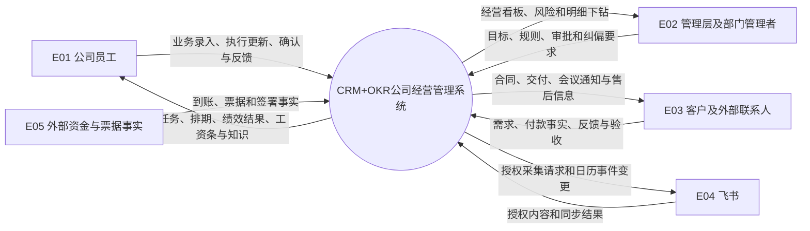
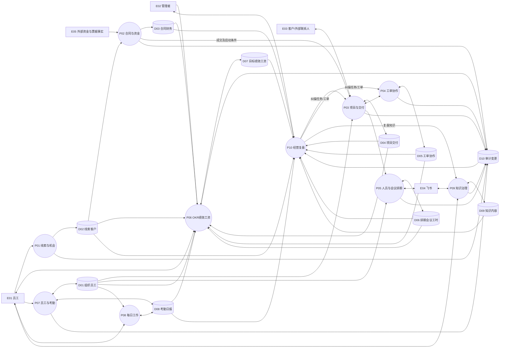
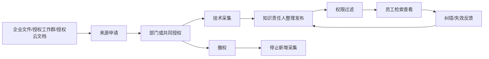

# CRM+OKR公司经营管理全域 - 数据流分析

## 1. 基本信息

- **阶段**：B1.2 数据流分析
- **分析对象**：单一公司内的客户经营、合同资金、项目交付、跨部门协作、排期、绩效工资、员工管理和知识治理
- **标准输入**：已验证的 B1.1《业务过程-CRM+OKR公司经营管理全域》及 A1-A6 需求理解基线
- **输入模式**：模式1：标准输入
- **分析日期**：2026-07-21
- **边界声明**：本产物只定义业务数据从哪里产生、由谁处理、流向哪里以及形成什么业务结果；不定义数据库表、接口字段、技术组件或部署架构。

## 2. 数据流分析目标

1. 打通“线索—成交—合同资金—立项—交付—验收—续约”的经营数据链。
2. 打通“公司目标—部门目标—个人目标—证据—评分—申诉—绩效工资—工资条”的考核数据链。
3. 打通“业务需求—人员占用—讲师确认—会议排期—飞书日历—实际工时”的排期数据链。
4. 打通“企业文件/飞书授权来源—采集—治理—发布—检索—纠错”的知识数据链。
5. 让管理层能够从汇总指标下钻到原始业务事实和责任记录。

## 3. 外部实体

| 编号 | 外部实体 | 向系统提供的数据 | 从系统获得的数据 | 边界说明 |
|---|---|---|---|---|
| E01 | 公司员工 | 线索、跟进、任务进度、工单、排期确认、目标进度、考勤说明、日报、知识反馈 | 个人任务、排期、目标结果、工资条、授权知识、处理提醒 | 按员工身份、岗位和业务责任访问 |
| E02 | 管理层及部门管理者 | 经营目标、资源决策、审批确认、评分与纠偏要求 | 公司/部门看板、项目和员工下钻数据、风险与异常 | 管理范围由后续权限模型确定 |
| E03 | 客户及外部联系人 | 需求、合同确认、付款事实、交付反馈、验收结论、会议参与信息 | 方案、合同、交付成果、通知和售后信息 | 首期由内部责任人代为记录，不假设外部用户登录系统 |
| E04 | 飞书 | 已授权工作群/云文档内容、日历同步结果、原事件状态 | 经授权的采集请求、会议日历创建/更新/取消信息 | 日历只同步会议；不做会议室管理；知识只采集授权来源，不采集个人聊天 |
| E05 | 外部资金与票据事实 | 银行到账凭证、发票和退款事实、合同外部签署结果 | 无直接系统输出 | 首期由财务核验后录入；是否对接外部财务或电子签系统留到集成阶段确定 |

## 4. 业务处理过程

| 编号 | 业务处理过程 | 核心职责 | 主要责任角色 |
|---|---|---|---|
| P01 | 线索与客户机会经营 | 录入查重、分配/抢领、保护期跟进、商机转化、流失或退回 | 全体员工、市场销售中心、线索主负责人 |
| P02 | 合同与资金处理 | 合同审核、应收计划、收款、开票、退款、成本、利润和启动条件核验 | 商务责任人、财务 |
| P03 | 项目与分类交付 | 立项、资源承诺、计划、三类业务交付、变更、验收、结项、售后 | 项目发起人、项目负责人、交付团队、商务责任人 |
| P04 | 跨部门工单协作 | 创建、分派、受理、处理、确认、关闭、转派、升级和重开 | 发起人、部门负责人、处理人、协作人 |
| P05 | 人员与会议排期 | 人员冲突检查、讲师确认、会议排期、飞书日历同步、变更取消和工时确认 | 组织者、讲师、部门负责人、项目负责人 |
| P06 | OKR绩效与工资衔接 | 规则版本、逐级对齐、证据、评分、校准、申诉、锁定、工资核算和工资条发布 | 管理层、综合管理部、直属负责人、员工、财务 |
| P07 | 员工生命周期与考勤 | 入职、转岗、离职、劳动合同、档案、组织关系、交接和考勤确认 | 综合管理部、员工、部门负责人、财务 |
| P08 | 每日工作与部门管理 | 汇总个人安排、日终最小记录、负荷和逾期查看、部门纠偏 | 员工、部门负责人、项目负责人 |
| P09 | AI知识来源治理与使用 | 来源申请、授权、采集、整理、发布、检索、纠错、撤权和删除 | 来源所有者、部门负责人、知识责任人、系统管理员、员工 |
| P10 | 经营复盘与纠偏 | 汇总经营与执行指标、异常下钻、形成行动、跟踪关闭和经验沉淀 | 管理层、部门负责人、业务责任人 |

## 5. 业务数据存储

> 下列“存储”指业务上需要持续保存和追溯的信息集合，不等同于数据库表。

| 编号 | 业务数据存储 | 保存的业务信息 | 主要维护责任 |
|---|---|---|---|
| D01 | 组织与员工档案 | 员工身份、部门岗位、汇报/管理关系、劳动合同、在离职状态、历史变动 | 综合管理部 |
| D02 | 线索与客户档案 | 线索来源、客户/联系人、查重结果、主负责人、保护期、跟进、商机状态、流失/退回、操作历史 | 市场销售中心、线索主负责人 |
| D03 | 合同与财务业务台账 | 合同、付款约定、应收、收款、开票、退款、成本、利润和核验结果 | 财务、商务责任人 |
| D04 | 项目与交付档案 | 立项依据、项目角色、计划基线、任务、里程碑、风险、变更、交付物、验收、结项和售后 | 项目负责人、对应业务责任人 |
| D05 | 工单与协作档案 | 工单类型、发起/处理责任、时限、流转、产出物、确认、满意度、升级和重开记录 | 发起部门和处理部门 |
| D06 | 排期、会议与工时档案 | 人员占用、会议类型、地址、参与人、讲师确认、冲突、飞书同步状态、计划/实际工时 | 组织者、讲师、部门负责人 |
| D07 | 目标、绩效与工资结果 | 规则版本、公司/部门/个人目标、进度、证据、评分、校准、申诉、锁定结果、工资核算与工资条 | 综合管理部、财务 |
| D08 | 考勤与每日工作记录 | 打卡、外出、异常说明和确认；今日工作、明日计划、产出物引用 | 综合管理部、员工、部门负责人 |
| D09 | 知识来源与内容库 | 来源授权、采集范围、原始来源引用、知识内容、查看范围、版本、反馈、下架和删除记录 | 来源所有者、知识责任人、系统管理员 |
| D10 | 全域审计与变更记录 | 关键数据的创建、分配、转派、审批、修改、锁定、发布、撤销及操作者和时间 | 各业务责任人、系统管理员 |

**推定说明**：D10将分散在各模块的关键操作统一抽象为全域审计数据，是为满足“操作可追溯、管理层可下钻、敏感结果可解释”提出的业务设计方案；是否独立呈现为一个审计中心，待后续系统功能阶段确认。

## 6. 上下文级数据流图

## 7. 0层数据流图

## 8. 关键数据流清单

| 编号 | 来源 | 数据内容 | 处理过程 | 去向 | 触发/业务结果 | 依据 |
|---|---|---|---|---|---|---|
| F01 | E01 | 客户/公司、联系人、手机号、来源、需求摘要 | P01 | D02 | 全员录入后形成待查重线索 | 已确认需求 |
| F02 | D02 | 已有客户、联系人和线索记录 | P01 | D02 | 按手机号优先、名称辅助查重，保留处理记录 | B1.1 |
| F03 | E01/E02 | 抢领、重点商机分配、权限和责任调整 | P01 | D02 | 普通线索抢领或重点商机分配，每个客户一个主负责人 | 已确认需求 |
| F04 | E01 | 沟通、状态、下一步、方案报价、流失/退回原因 | P01 | D02 | 保护期经营过程持续留痕 | B1.1 |
| F05 | D02 | 成交客户、承诺、联系人和交付意向 | P01 | P02 | 成交机会进入合同及资金处理 | B1.1 |
| F06 | E03 | 需求确认、合同确认及业务反馈 | P01/P02 | D02/D03 | 内部责任人代录客户侧结论 | 范围边界 |
| F07 | P02 | 合同、付款条件、应收计划 | P02 | D03 | 合同审核后形成应收和交付条件 | B1.1 |
| F08 | E05 | 到账、开票、退款、成本和外部签署凭证 | P02 | D03 | 财务核验并登记业务事实 | 已确认需求 |
| F09 | D03 | 合同状态、收款条件和财务核验结论 | P02 | P03 | 满足约定后允许立项或交付 | B1.1 |
| F10 | D02/D03 | 客户、合同、付款条件、交付范围和承诺 | P03 | D04 | 项目发起人提交立项 | B1.1 |
| F11 | D01/D06 | 成员组织关系、能力责任和已有占用 | P03 | D04 | 部门确认成员投入及排期 | B1.1 |
| F12 | P03 | 负责人、角色、里程碑、任务、工时、成果和验收点 | P03 | D04 | 形成项目计划基线 | B1.1 |
| F13 | E01 | 进度、风险、变更、交付物和问题 | P03 | D04 | 三类业务按计划执行并保留版本 | B1.1 |
| F14 | P03 | 产品/系统/运营成果和培训材料 | P03 | E03 | 向客户交付并申请确认 | B1.1 |
| F15 | E03 | 验收、月度确认、缺陷、新增需求和满意度 | P03 | D04 | 形成整改、变更、通过或结项结论 | B1.1 |
| F16 | P03 | 跨部门协作要求、期望时间、验收标准 | P04 | D05 | 创建与项目关联的工单 | B1.1 |
| F17 | E01/E02 | 分派、受理、转派、处理、确认、升级、重开和评价 | P04 | D05 | 工单按时限流转并形成闭环 | 已确认规则 |
| F18 | D05 | 工单产出物、状态和时限风险 | P04 | P03/P10 | 回填项目进度并进入异常复盘 | B1.1 |
| F19 | P03/P04/E01 | 人员、时间、地址、活动类型和预计工时需求 | P05 | D06 | 形成待冲突检查的排期 | B1.1 |
| F20 | D01/D04/D05/D08 | 人员身份、项目/工单占用、考勤可用性 | P05 | D06 | 检查重叠和负荷，讲师确认或协调替代 | B1.1 |
| F21 | P05 | 已确认内部培训或外部沙龙会议事件 | P05 | E04 | 创建或更新同一飞书日历事件 | 已确认规则 |
| F22 | E04 | 日历事件标识、同步成功/失败和取消结果 | P05 | D06 | 更新同步状态，失败保留排期并重试 | 已确认规则 |
| F23 | E01 | 讲师确认、变更确认、完成结果和实际工时 | P05 | D06 | 确认/变更/取消/完成排期 | 已确认规则 |
| F24 | E02 | 公司目标、部门目标要求和考核方向 | P06 | D07 | 建立月度公司—部门—个人对齐关系 | 已确认规则 |
| F25 | E01（综合管理部/财务） | 绩效规则版本、岗位适用范围和工资处理状态 | P06 | D07 | 生效规则控制评分，财务状态控制工资条发布 | 已确认规则 |
| F26 | D02/D03/D04/D05/D06/D08 | 销售、回款、项目、工单、工时、考勤和产出证据 | P06 | D07 | 目标/KPI引用业务事实，避免重复填报 | B1.1 |
| F27 | E01/E02 | 进度更新、员工证据、初评理由、校准、确认或申诉 | P06 | D07 | 形成可解释的评分和申诉结论 | B1.1 |
| F28 | D07 | 已锁定绩效结果和工资基础信息 | P06 | D07 | 财务核算、复核、发放并生成工资条 | B1.1 |
| F29 | D07 | 绩效明细、申诉结论和工资条 | P06 | E01 | 仅向本人发布个人结果和工资条 | 已确认规则 |
| F30 | E01（综合管理部/员工） | 入职、合同、档案、转岗、离职和交接信息 | P07 | D01 | 建立或变更员工与组织关系并保留历史 | 已确认范围 |
| F31 | E01/E02 | 打卡、外出、异常说明及负责人确认 | P07 | D08 | 形成考勤确认结果 | B1.1 |
| F32 | D01 | 有效身份、部门岗位和在离职状态 | P07 | P03/P05/P06/P08/P09 | 为责任、排期、考核和知识授权提供人员基线 | B1.1 |
| F33 | D04/D05/D06/D07/D08 | 个人任务、工单、会议、目标和考勤安排 | P08 | E01 | 汇总员工当日工作入口 | B1.1 |
| F34 | E01 | 今日工作、明日计划、产出物引用 | P08 | D08 | 形成日终最小工作记录 | 已确认范围 |
| F35 | D04/D05/D06/D08 | 逾期、未完成、负荷和冲突 | P08 | E02 | 部门负责人查看异常并纠偏 | B1.1 |
| F36 | E01（来源所有者）/E04 | 企业文件、授权工作群、授权云文档及来源范围 | P09 | D09 | 授权后采集并保留来源引用 | 已确认范围 |
| F37 | E01/E02 | 授权范围、敏感性判断、整理、版本和发布决定 | P09 | D09 | 形成公司/部门/岗位/指定人员可见知识 | 已确认规则 |
| F38 | E01 | 检索请求、查看请求、错误/过期反馈 | P09 | D09 | 在授权范围内返回结果并进入纠错治理 | B1.1 |
| F39 | D09 | 知识正文、来源、版本和更新时间 | P09 | E01 | 返回可追溯的授权知识 | B1.1 |
| F40 | D02-D09 | 经营、财务、交付、协作、人员、绩效和知识事实 | P10 | E02 | 形成公司/部门/项目/员工多维经营视图 | B1.1 |
| F41 | D10 | 关键操作人、时间、前后状态和原因 | P10 | E02 | 管理层从异常下钻到责任事实 | 推定设计方案 |
| F42 | E02 | 纠偏责任人、行动、截止时间和预期结果 | P10 | P03/P04 | 通过项目任务或工单承接纠偏 | B1.1 |
| F43 | P10 | 复盘结论和可复用经验 | P09 | D09 | 经知识治理后沉淀组织经验 | B1.1 |
| F44 | P01-P07/P09 | 创建、分配、审批、变更、锁定、发布和撤销事件 | 各业务过程 | D10 | 保存关键操作轨迹供追溯 | 推定设计方案 |

## 9. 四条跨域关键数据链

### 9.1 线索到项目交付链

- **主关联键的业务含义**：客户是跨线索、合同和项目的主关联对象；单个客户只保留一个主负责人，但可有多条联系人、商机、合同和项目记录。
- **交接控制**：成交移交必须同时带出客户承诺、联系人、合同、付款条件和交付范围；缺少启动条件时不能进入正式交付。
- **追溯结果**：管理层可从项目追溯到合同、收款和原始线索，也可从线索查看最终收入与交付结果。

### 9.2 绩效到工资链

- **数据责任分离**：综合管理部维护规则、校准和申诉；财务负责工资核算、复核和发放。
- **发布前提**：绩效结果已锁定且财务流程完成后，才能发布工资条。
- **规则边界**：锁定结果只影响绩效工资或奖金，固定工资不变；本阶段只定义锁定结果向工资处理的数据传递，不定义得分换算公式。

### 9.3 会议与讲师排期到飞书日历链

- **业务主记录**：系统内会议排期是业务主记录，飞书日历是同步结果；同步失败不取消已确认排期。
- **人员范围**：已确认会议同步讲师和内部参与人员；外部联系人由系统记录，组织者负责线下通知。
- **变更控制**：时间或讲师变化需重新确认，并更新原飞书事件；取消后释放人员占用。

### 9.4 知识来源到授权检索链

- **来源边界**：不采集个人聊天；默认只采集授权后的工作群、云文档或企业文件。
- **权限继承**：知识查看范围不得高于来源授权范围；跨部门或敏感内容需相关责任部门共同批准。
- **可信要求**：检索结果可追溯到来源、版本和更新时间；撤权后停止新增采集，删除需来源责任人确认。

## 10. B1.1业务过程输入/输出矩阵

| B1.1业务过程 | 关键输入 | 核心处理 | 关键输出 | 主要数据存储 |
|---|---|---|---|---|
| 线索到成交与合同资金 | 员工线索、客户需求、分配规则 | 查重、抢领/分配、跟进、商机判断、合同资金处理 | 成交移交、流失或退回、交付启动结论 | D02、D03、D10 |
| 跨部门项目立项与计划 | 客户、合同、收款条件、交付范围、人员可用性 | 财务核验、部门资源确认、负责人确认、计划和冲突处理 | 项目计划基线 | D01、D03、D04、D06、D10 |
| AI产品销售交付 | 产品合同、交付条件、客户信息 | 开通/部署、使用指导、客户确认 | 交付清单、培训记录、售后责任 | D03、D04、D06 |
| AI定制开发交付 | 验收范围、项目角色和计划 | 需求、方案、开发、测试、上线、培训、验收 | 版本、缺陷、验收、维护和复盘结果 | D04、D05、D06、D09 |
| 自媒体代运营交付 | 账号、内容目标、月度计划、客户要求 | 策划、拍摄、剪辑、发布、直播、投放/运营和月度复盘 | 内容资产、运营数据、客户月度确认 | D04、D06、D09 |
| 跨部门工单协作 | 协作要求、期望时间、验收标准 | 分派、受理、处理、转派、升级、确认和重开 | 产出物、处理结论、满意度和时限结果 | D05、D10 |
| 人员与会议联合排期 | 活动需求、人员、时间、地址、预计工时 | 冲突检查、讲师确认、日历同步、变更取消 | 已确认排期、同步结果、实际工时 | D01、D04、D05、D06、D08 |
| 月度OKR绩效与工资衔接 | 规则、逐级目标、业务证据、工资基础信息 | 初评、校准、申诉、锁定、核算复核 | 绩效结果、申诉结论、发放状态、工资条 | D02-D08、D10 |
| 员工生命周期与考勤 | 入职/转岗/离职资料、合同档案、考勤事实 | 建档、变动、交接、异常确认和账号状态触发 | 有效组织关系、考勤结论、历史责任 | D01、D08、D10 |
| 员工每日工作与部门管理 | 个人任务、目标、工单、会议和考勤安排 | 汇总、冲突协调、日终记录、部门异常查看 | 日报、产出引用和纠偏事项 | D04-D08 |
| AI知识来源治理与使用 | 授权来源、查看范围、内容和反馈 | 采集、整理、发布、检索、纠错、撤权/删除 | 授权知识、来源追溯和治理记录 | D01、D09、D10 |
| 经营复盘与纠偏 | 各业务存储的汇总与明细事实 | 指标汇总、异常识别、下钻、行动和跟踪 | 纠偏任务/工单、复盘结论和知识经验 | D02-D10 |

## 11. 数据一致性与责任规则

1. **客户责任一致性**：同一客户只保留一个当前主负责人；负责人变化保留原责任和变更历史。
2. **成交交接完整性**：没有客户、合同、付款条件、交付范围和联系人信息时，不形成完整成交移交。
3. **财务事实责任**：合同和资金业务状态由财务核验维护；项目角色只能读取启动条件和业务结论，不能替代财务确认。
4. **项目基线责任**：项目负责人维护计划、任务、交付物和验收记录；部门负责人确认本部门资源投入。
5. **工单结果回流**：关联项目的工单状态、产出物和超时结果必须回流项目和经营复盘，避免协作过程成为孤立记录。
6. **排期主记录责任**：系统内排期保存人员占用和确认状态；飞书仅承接日历同步。同步失败时两者状态差异必须显式可见。
7. **绩效证据唯一归属**：同一业务成果只能有一个计分归属；评分必须关联生效规则和证据，锁定后修改需形成新处理记录。
8. **工资发布隔离**：绩效管理角色不能替代财务核算，财务不能跳过绩效锁定；工资条仅向员工本人和授权财务人员开放。
9. **员工历史连续性**：转岗、离职不得覆盖历史部门、岗位和业务责任；客户、项目、工单、会议和知识责任完成交接后再停用账号。
10. **知识授权不扩张**：知识库的查看范围不得超过原来源授权；撤权后停止新增采集，删除和下架保留原因与处理记录。
11. **经营汇总可下钻**：所有经营指标必须能够回到对应的客户、合同、项目、任务、工单、人员或绩效原始记录。
12. **关键操作可追溯**：分配、审批、转派、变更、锁定、发布、撤权和删除等关键动作保留操作者、时间、前后状态和原因。

## 12. 异常与边界数据流

| 场景 | 数据流处理原则 | 结果 |
|---|---|---|
| 线索疑似重复 | 暂不静默覆盖；进入合并判断并保留原录入与处理轨迹 | 客户主档统一，线索来源和操作历史不丢失 |
| 合同或收款条件不足 | 财务返回不满足原因，不向项目交付发送正式启动结论 | 业务停留在商务/财务处理 |
| 项目资源冲突 | 部门负责人返回拒绝原因、替代人员或可用时间，重大冲突升级 | 计划基线只保存已确认资源 |
| 工单超时 | 根据工单级别产生提醒和升级数据，同时保留原处理责任 | 项目和经营复盘可见超时影响 |
| 会议/讲师冲突 | 不生成已确认排期；协调优先级、替代讲师或时间 | 防止同一人员重复占用 |
| 飞书日历同步失败 | 保留系统排期，记录失败、重试和通知；不得重复创建会议 | 业务安排不丢失且差异可追踪 |
| 绩效证据不足或重复 | 退回补充或取消重复归属，未结申诉不得锁定 | 工资处理只读取已锁定结果 |
| 考勤异常未确认 | 保存异常和说明状态，不直接形成工资结论 | 等负责人和综合管理部完成确认 |
| 知识来源未授权或撤权 | 未授权不采集；撤权后停止新增采集，既有内容按治理决定下架或删除 | 防止权限外沉淀和访问 |
| 经营汇总与明细不一致 | 停止使用争议指标作结论，先下钻核对口径和原始记录 | 修正后重新形成复盘结论 |

## 13. 推定项与后续衔接

- **本阶段推定项共1项**：将各模块关键操作统一抽象为 D10“全域审计与变更记录”。该推定只表达业务追溯需要，不预设技术实现。
- **后续B1.3输入**：D01-D10业务数据存储、F01-F44关键数据流及四条跨域数据链，可用于正式定义业务数据项、口径、来源、责任和敏感等级。
