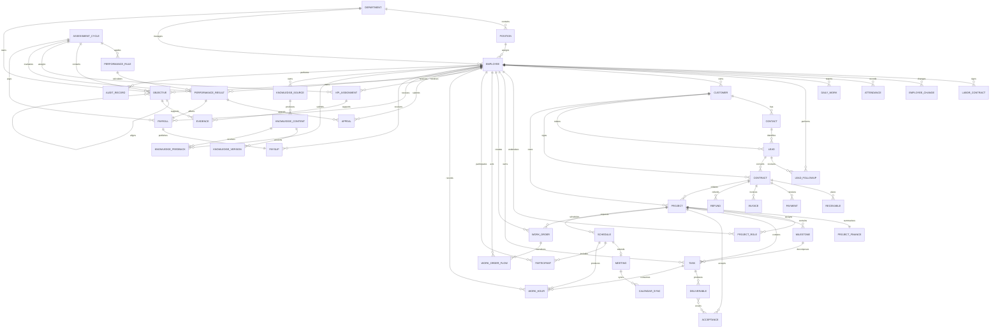

# CRM+OKR公司经营管理全域 - 逻辑数据模型分析

## 1. 基本信息

- **业务域名称**: CRM+OKR公司经营管理全域
- **业务域描述**: 基于B1.1业务过程、B1.2数据流和B1.3数据字典，建立单一公司的逻辑业务实体、关键属性、实体关系和基数约束。
- **分析时间**: 2026-07-21

## 2. 业务实体概述

### 2.1 业务实体定义
在业务上具有独立身份、生命周期、责任和可追溯关系的对象，包括客户、合同、项目、任务、排期、目标、绩效结果和知识内容等。

### 2.2 业务实体与数据库表的区别
本模型表达业务对象和关系，不规定数据库表、主外键、索引、范式、字段长度或物理存储方式；一个逻辑实体可由不同技术方案实现。

### 2.3 业务实体分析的业务价值
确保销售、财务、交付、人员、绩效、排期和知识数据能够以一致业务标识贯通，并明确一对一、一对多、多对多及完整性约束。

## 3. 业务实体列表

| 实体名称 | 实体描述 | 实体来源 |
|---------|---------|---------|
| 部门 | 公司内部承担业务责任和人员管理的组织单元 | D01组织与员工档案 |
| 岗位 | 部门内用于定义正式工作责任和KPI适用范围的岗位 | D01组织与员工档案 |
| 员工 | 公司内部承担业务、管理或支持责任的人员 | D01组织与员工档案 |
| 劳动合同 | 公司与员工之间生效的劳动合同业务记录 | D01组织与员工档案 |
| 员工变动 | 员工入职、转岗或离职的生效与交接记录 | D01组织与员工档案 |
| 考勤记录 | 员工某工作日的出勤事实和确认结论 | D08考勤与每日工作记录 |
| 每日工作记录 | 员工每日的今日工作、明日计划和产出引用 | D08考勤与每日工作记录 |
| 客户 | 公司持续经营和交付服务的客户主体 | D02线索与客户档案 |
| 联系人 | 客户主体下的具体沟通对象 | D02线索与客户档案 |
| 线索 | 员工发现并录入的潜在客户机会 | D02线索与客户档案 |
| 线索跟进 | 主负责人对线索的一次沟通、判断和下一步记录 | D02线索与客户档案 |
| 客户合同 | 公司与客户之间确定交易、付款和交付承诺的合同 | D03合同与财务业务台账 |
| 应收计划 | 合同付款条件形成的应收节点 | D03合同与财务业务台账 |
| 收款记录 | 财务核验后归属客户合同的到账业务事实 | D03合同与财务业务台账 |
| 开票记录 | 合同相关开票申请和财务处理记录 | D03合同与财务业务台账 |
| 退款记录 | 合同相关退款申请、审批和完成事实 | D03合同与财务业务台账 |
| 项目财务汇总 | 某项目收入、成本和利润的经营口径汇总 | D03合同与财务业务台账 |
| 项目 | 承接合同或内部经营目标的交付管理单元 | D04项目与交付档案 |
| 项目角色分配 | 员工在项目中承担的功能角色和责任 | D04项目与交付档案 |
| 项目里程碑 | 项目计划中的阶段性目标、日期和成果要求 | D04项目与交付档案 |
| 项目任务 | 项目或里程碑下可执行的工作事项 | D04项目与交付档案 |
| 交付成果 | 项目任务、阶段或项目形成的可追溯成果 | D04项目与交付档案 |
| 验收记录 | 客户或内部责任人对项目成果的确认记录 | D04项目与交付档案 |
| 工单 | 跨部门协作请求及其SLA和处理结果 | D05工单与协作档案 |
| 工单流转记录 | 工单一次分派、受理、处理、转派、升级、确认或重开动作 | D05工单与协作档案 |
| 排期 | 员工在项目、培训、沙龙、直播、拍摄等活动中的时间占用 | D06排期会议与工时档案 |
| 会议 | 排期中的内部培训会议或外部沙龙线下产品会议 | D06排期会议与工时档案 |
| 排期参与人 | 员工或外部联系人在排期/会议中的参与角色和确认状态 | D06排期会议与工时档案 |
| 日历同步记录 | 会议排期与飞书日历事件的一次同步结果 | D06排期会议与工时档案 |
| 工时记录 | 员工对任务、会议、直播等业务事项的计划或实际投入记录 | D04项目与交付档案和D06排期会议与工时档案 |
| 考核周期 | 一轮月度OKR、KPI、绩效和工资处理的时间范围 | D07目标绩效与工资结果 |
| 绩效规则 | 综合管理部维护的OKR、KPI、评分和特殊情况规则版本 | D07目标绩效与工资结果 |
| 目标 | 公司、部门或个人在考核周期内的OKR目标 | D07目标绩效与工资结果 |
| KPI任务 | 员工在考核周期内适用的岗位或业务KPI及权重 | D07目标绩效与工资结果 |
| 绩效证据 | 支撑目标或KPI结果的业务事实引用 | D07目标绩效与工资结果 |
| 绩效结果 | 员工在一个考核周期内的初评、校准、确认和锁定结果 | D07目标绩效与工资结果 |
| 绩效申诉 | 员工对绩效结果提出的异议和处理结论 | D07目标绩效与工资结果 |
| 工资核算记录 | 财务对员工某月工资的核算、复核和发放状态 | D07目标绩效与工资结果 |
| 工资条 | 向员工本人发布的月度工资结果明细 | D07目标绩效与工资结果 |
| 知识来源 | 获准进入知识治理的企业文件、飞书工作群或云文档来源 | D09知识来源与内容库 |
| 知识内容 | 从授权来源整理并可被检索的业务知识单元 | D09知识来源与内容库 |
| 知识版本 | 知识内容一次发布或纠错形成的版本 | D09知识来源与内容库 |
| 知识反馈 | 员工对知识错误、过期或缺失提出的治理反馈 | D09知识来源与内容库 |
| 审计记录 | 关键业务动作的操作者、时间、对象和变更摘要 | D10全域审计与变更记录（推定） |

## 4. 业务实体属性表

| 实体名称 | 属性名称 | 业务含义 | 业务类型 | 是否必填 | 业务约束 | 默认值 |
|---------|---------|---------|---------|---------|---------|--------|
| 部门 | 部门业务标识 | 唯一识别部门 | 文本 | 是 | 公司内唯一 | 无 |
| 部门 | 部门名称 | 部门业务名称 | 文本 | 是 | 同一有效层级内不得重复 | 无 |
| 部门 | 上级部门 | 部门的直接上级组织 | 文本 | 否 | 顶级部门为空 | 空 |
| 部门 | 部门状态 | 部门是否有效 | 枚举 | 是 | 有效或停用 | 有效 |
| 岗位 | 岗位业务标识 | 唯一识别岗位 | 文本 | 是 | 公司内唯一 | 无 |
| 岗位 | 岗位名称 | 岗位业务名称 | 文本 | 是 | 同部门有效岗位名称唯一 | 无 |
| 岗位 | 岗位状态 | 岗位是否有效 | 枚举 | 是 | 有效或停用 | 有效 |
| 员工 | 员工业务标识 | 唯一识别员工 | 文本 | 是 | 公司内唯一且不复用 | 无 |
| 员工 | 员工姓名 | 员工业务姓名 | 文本 | 是 | 姓名变化保留历史 | 无 |
| 员工 | 所属部门 | 当前正式部门 | 文本 | 是 | 必须为有效部门 | 无 |
| 员工 | 岗位名称 | 当前正式岗位 | 文本 | 是 | 必须为有效岗位 | 无 |
| 员工 | 直属负责人 | 当前直接管理人 | 文本 | 否 | 应为有效在职员工 | 空 |
| 员工 | 员工在职状态 | 当前人事状态 | 枚举 | 是 | 待入职、在职、转岗处理中、离职交接中、已离职 | 待入职 |
| 劳动合同 | 劳动合同业务标识 | 唯一识别劳动合同 | 文本 | 是 | 公司内唯一 | 无 |
| 劳动合同 | 合同有效期 | 合同开始和结束日期 | 文本 | 是 | 结束日期晚于开始日期 | 无 |
| 劳动合同 | 合同状态 | 劳动合同当前状态 | 枚举 | 是 | 草拟、生效、到期、终止 | 草拟 |
| 劳动合同 | 员工业务标识 | 合同对应员工 | 文本 | 是 | 员工必须存在 | 无 |
| 员工变动 | 员工变动业务标识 | 唯一识别一次人员变动 | 文本 | 是 | 公司内唯一 | 无 |
| 员工变动 | 变动类型 | 入职、转岗或离职 | 枚举 | 是 | 入职、转岗、离职 | 无 |
| 员工变动 | 变动生效时间 | 组织关系切换时间 | 日期时间 | 是 | 有效时间 | 无 |
| 员工变动 | 变动前后组织摘要 | 原部门岗位和新部门岗位 | 文本 | 是 | 转岗时必须完整 | 无 |
| 员工变动 | 交接状态 | 客户项目工单等责任交接结果 | 枚举 | 是 | 待交接、交接中、已完成 | 待交接 |
| 考勤记录 | 考勤记录业务标识 | 唯一识别考勤记录 | 文本 | 是 | 公司内唯一 | 无 |
| 考勤记录 | 考勤日期 | 事实所属工作日 | 日期 | 是 | 有效日期 | 无 |
| 考勤记录 | 考勤确认状态 | 考勤处理结果 | 枚举 | 是 | 正常、异常待说明、待负责人确认、待综合管理部确认、已确认 | 正常 |
| 考勤记录 | 考勤异常说明 | 员工对异常的说明 | 文本 | 否 | 异常时填写 | 空 |
| 每日工作记录 | 每日工作业务标识 | 唯一识别每日工作记录 | 文本 | 是 | 公司内唯一 | 无 |
| 每日工作记录 | 工作日期 | 日报所属日期 | 日期 | 是 | 有效工作日 | 无 |
| 每日工作记录 | 今日工作 | 当日完成或推进事项 | 文本 | 是 | 不得仅写无法追溯的空泛描述 | 无 |
| 每日工作记录 | 明日计划 | 下一工作日计划 | 文本 | 是 | 可关联业务事项 | 无 |
| 每日工作记录 | 产出物引用 | 已有成果的业务引用 | 文本 | 否 | 有成果时填写 | 空 |
| 客户 | 客户业务标识 | 唯一识别客户 | 文本 | 是 | 公司内唯一 | 无 |
| 客户 | 客户或公司名称 | 个人名称或企业全称 | 文本 | 是 | 名称标准化细则由规则阶段定义 | 无 |
| 客户 | 当前主负责人 | 当前客户经营主责任人 | 文本 | 是 | 必须为有效员工且同一时点唯一 | 无 |
| 客户 | 客户状态 | 客户当前经营状态 | 枚举 | 是 | 潜在、成交、存量、停用 | 潜在 |
| 联系人 | 联系人业务标识 | 唯一识别联系人 | 文本 | 是 | 公司内唯一 | 无 |
| 联系人 | 联系人姓名 | 联系人姓名 | 文本 | 是 | 非空 | 无 |
| 联系人 | 联系人手机号 | 联系人手机号 | 文本 | 否 | 合法手机号或空 | 空 |
| 联系人 | 联系人状态 | 联系人是否有效 | 枚举 | 是 | 有效或停用 | 有效 |
| 线索 | 线索业务标识 | 唯一识别线索 | 文本 | 是 | 公司内唯一且合并后保留 | 无 |
| 线索 | 线索来源 | 进入公司的来源 | 枚举 | 是 | 首期为人工录入 | 人工录入 |
| 线索 | 线索主负责人 | 当前跟进主责任人 | 文本 | 否 | 客户同一时点只允许一个主负责人 | 空 |
| 线索 | 保护期截止时间 | 当前保护期截止时间 | 日期时间 | 否 | 领取或分配后30天 | 空 |
| 线索 | 线索状态 | 线索当前状态 | 枚举 | 是 | 待查重、公共池、待分配、跟进中、已成交、已流失、已退回、已合并 | 待查重 |
| 线索 | 流失或退回原因 | 线索结束或退回原因 | 文本 | 否 | 对应状态时必填 | 空 |
| 线索跟进 | 线索跟进业务标识 | 唯一识别一次跟进 | 文本 | 是 | 公司内唯一 | 无 |
| 线索跟进 | 跟进时间 | 沟通或行动发生时间 | 日期时间 | 是 | 有效时间 | 无 |
| 线索跟进 | 跟进内容 | 沟通事实和业务判断 | 文本 | 是 | 应可解释状态变化 | 无 |
| 线索跟进 | 下一步跟进行动 | 后续动作和计划时间 | 文本 | 否 | 跟进中应明确 | 空 |
| 线索跟进 | 跟进员工 | 执行跟进的员工 | 文本 | 是 | 有效员工 | 无 |
| 客户合同 | 合同业务标识 | 唯一识别客户合同 | 文本 | 是 | 公司内唯一 | 无 |
| 客户合同 | 合同金额 | 合同约定金额 | 金额 | 是 | 大于等于0 | 0 |
| 客户合同 | 合同状态 | 合同当前状态 | 枚举 | 是 | 草稿、审核中、已生效、已变更、已终止、已完成 | 草稿 |
| 客户合同 | 付款条件 | 约定的付款节点和条件 | 文本 | 是 | 应收计划与其一致 | 无 |
| 客户合同 | 交付范围 | 合同约定的交付内容 | 文本 | 是 | 项目立项必须引用 | 无 |
| 应收计划 | 应收计划业务标识 | 唯一识别应收节点 | 文本 | 是 | 公司内唯一 | 无 |
| 应收计划 | 应收金额 | 本节点应收金额 | 金额 | 是 | 大于等于0 | 0 |
| 应收计划 | 应收截止日期 | 本节点到期日 | 日期 | 是 | 有效日期 | 无 |
| 应收计划 | 应收状态 | 当前履行结果 | 枚举 | 是 | 未到期、部分收款、已收清、已逾期、已退款调整 | 未到期 |
| 收款记录 | 收款记录业务标识 | 唯一识别收款事实 | 文本 | 是 | 公司内唯一 | 无 |
| 收款记录 | 收款金额 | 本次到账并确认的金额 | 金额 | 是 | 大于0 | 0 |
| 收款记录 | 收款时间 | 到账或确认时间 | 日期时间 | 是 | 有效时间 | 无 |
| 收款记录 | 核验状态 | 财务核验结论 | 枚举 | 是 | 待核验、通过、不通过 | 待核验 |
| 收款记录 | 到账凭证引用 | 外部到账凭证 | 文本 | 否 | 核验时应可追溯 | 空 |
| 开票记录 | 开票记录业务标识 | 唯一识别开票事项 | 文本 | 是 | 公司内唯一 | 无 |
| 开票记录 | 开票金额 | 本次开票金额 | 金额 | 是 | 大于0 | 0 |
| 开票记录 | 开票状态 | 当前处理状态 | 枚举 | 是 | 未申请、待开票、已开票、已作废、已红冲 | 未申请 |
| 开票记录 | 票据引用 | 发票或处理凭证 | 文本 | 否 | 已开票时应可追溯 | 空 |
| 退款记录 | 退款记录业务标识 | 唯一识别退款事项 | 文本 | 是 | 公司内唯一 | 无 |
| 退款记录 | 退款金额 | 退款金额 | 金额 | 是 | 大于0 | 0 |
| 退款记录 | 退款状态 | 退款处理状态 | 枚举 | 是 | 申请中、审核中、执行中、已完成、已驳回 | 申请中 |
| 退款记录 | 退款原因 | 退款业务原因 | 文本 | 是 | 非空 | 无 |
| 项目财务汇总 | 项目财务汇总业务标识 | 唯一识别项目财务汇总 | 文本 | 是 | 公司内唯一 | 无 |
| 项目财务汇总 | 确认收入金额 | 归属项目的经营收入 | 金额 | 是 | 大于等于0 | 0 |
| 项目财务汇总 | 项目成本金额 | 经确认项目成本 | 金额 | 是 | 大于等于0 | 0 |
| 项目财务汇总 | 项目利润金额 | 收入减成本的经营结果 | 金额 | 是 | 允许负数 | 0 |
| 项目财务汇总 | 财务启动结论 | 合同和收款条件是否满足 | 枚举 | 是 | 待核验、满足、不满足、特批满足 | 待核验 |
| 项目 | 项目业务标识 | 唯一识别项目 | 文本 | 是 | 公司内唯一 | 无 |
| 项目 | 项目名称 | 项目业务名称 | 文本 | 是 | 非空 | 无 |
| 项目 | 项目业务类型 | 主营业务交付类型 | 枚举 | 是 | AI产品销售、AI定制开发、自媒体代运营 | 无 |
| 项目 | 项目负责人 | 项目管理责任人 | 文本 | 是 | 须经确认且为有效员工 | 无 |
| 项目 | 项目计划起止时间 | 计划基线起止日期 | 文本 | 是 | 结束晚于开始 | 无 |
| 项目 | 项目状态 | 项目当前状态 | 枚举 | 是 | 待立项、审批中、待启动、执行中、暂停、验收中、已完成、已终止、售后中 | 待立项 |
| 项目角色分配 | 项目角色分配业务标识 | 唯一识别角色安排 | 文本 | 是 | 公司内唯一 | 无 |
| 项目角色分配 | 项目功能角色 | PM、需求、技术等角色 | 枚举 | 是 | PM、需求或产品、技术负责人、开发、测试、运维、售后、讲师 | 无 |
| 项目角色分配 | 责任说明 | 该角色在项目中的具体责任 | 文本 | 是 | 非空 | 无 |
| 项目角色分配 | 投入承诺 | 计划投入和时间范围 | 文本 | 否 | 部门确认后生效 | 空 |
| 项目里程碑 | 里程碑业务标识 | 唯一识别里程碑 | 文本 | 是 | 公司内唯一 | 无 |
| 项目里程碑 | 里程碑名称 | 阶段性目标名称 | 文本 | 是 | 项目内可区分 | 无 |
| 项目里程碑 | 计划完成时间 | 里程碑计划日期 | 日期时间 | 是 | 有效时间 | 无 |
| 项目里程碑 | 里程碑状态 | 当前完成状态 | 枚举 | 是 | 未开始、进行中、已完成、已延期、已取消 | 未开始 |
| 项目里程碑 | 成果要求 | 达到里程碑需形成的成果 | 文本 | 是 | 可验收 | 无 |
| 项目任务 | 项目任务业务标识 | 唯一识别任务 | 文本 | 是 | 公司内唯一 | 无 |
| 项目任务 | 任务名称 | 可执行事项名称 | 文本 | 是 | 非空 | 无 |
| 项目任务 | 任务责任人 | 当前唯一责任员工 | 文本 | 是 | 有效员工 | 无 |
| 项目任务 | 任务状态 | 当前执行状态 | 枚举 | 是 | 待开始、进行中、阻塞、待确认、已完成、已取消 | 待开始 |
| 项目任务 | 计划工时 | 预估投入小时 | 数值 | 否 | 大于等于0 | 0 |
| 项目任务 | 实际工时 | 确认投入小时 | 数值 | 否 | 大于等于0 | 0 |
| 交付成果 | 交付成果业务标识 | 唯一识别成果 | 文本 | 是 | 公司内唯一 | 无 |
| 交付成果 | 成果名称 | 交付成果名称 | 文本 | 是 | 非空 | 无 |
| 交付成果 | 成果类型 | 文件、版本、账号、内容、报告等 | 枚举 | 是 | 文件、版本、账号、内容、报告、其他 | 无 |
| 交付成果 | 成果引用 | 成果位置或业务引用 | 文本 | 是 | 必须可追溯 | 无 |
| 交付成果 | 成果状态 | 成果当前有效性 | 枚举 | 是 | 已提交、已确认、需修改、已失效 | 已提交 |
| 验收记录 | 验收记录业务标识 | 唯一识别验收事项 | 文本 | 是 | 公司内唯一 | 无 |
| 验收记录 | 验收结论 | 客户确认结果 | 枚举 | 是 | 待确认、部分通过、已通过、未通过、有条件通过 | 待确认 |
| 验收记录 | 验收时间 | 形成结论的时间 | 日期时间 | 否 | 完成确认时必填 | 空 |
| 验收记录 | 验收证据引用 | 确认材料或沟通证据 | 文本 | 否 | 外部确认时应可追溯 | 空 |
| 验收记录 | 遗留问题 | 验收后的遗留事项 | 文本 | 否 | 有条件通过时应填写 | 空 |
| 工单 | 工单业务标识 | 唯一识别工单 | 文本 | 是 | 公司内唯一，重开不更换 | 无 |
| 工单 | 工单级别 | SLA业务类型 | 枚举 | 是 | 普通跨部门、项目交付、紧急客户或生产 | 普通跨部门 |
| 工单 | 工单发起人 | 提出协作要求的员工 | 文本 | 是 | 有效员工 | 无 |
| 工单 | 工单处理人 | 当前处理责任人 | 文本 | 否 | 分派后必须存在 | 空 |
| 工单 | 响应截止时间 | 最晚受理时间 | 日期时间 | 是 | 按级别计算 | 无 |
| 工单 | 完成截止时间 | 最晚完成时间 | 日期时间 | 是 | 按级别或项目计划计算 | 无 |
| 工单 | 工单状态 | 当前流转状态 | 枚举 | 是 | 待分派、待受理、处理中、待确认、已关闭、已转派、已升级、已重开、已取消 | 待分派 |
| 工单 | 工单满意度 | 发起人评分 | 数值 | 否 | 1至5 | 空 |
| 工单流转记录 | 工单流转业务标识 | 唯一识别流转动作 | 文本 | 是 | 公司内唯一 | 无 |
| 工单流转记录 | 流转动作 | 本次业务动作 | 枚举 | 是 | 分派、受理、处理、转派、升级、提交确认、关闭、重开 | 无 |
| 工单流转记录 | 动作员工 | 执行动作的员工 | 文本 | 是 | 有效员工 | 无 |
| 工单流转记录 | 动作时间 | 动作发生时间 | 日期时间 | 是 | 有效时间 | 无 |
| 工单流转记录 | 工单产出物引用 | 本次提交成果 | 文本 | 否 | 待确认前应存在 | 空 |
| 排期 | 排期业务标识 | 唯一识别排期 | 文本 | 是 | 公司内唯一 | 无 |
| 排期 | 排期类型 | 业务活动分类 | 枚举 | 是 | 项目任务、内部培训、外部沙龙、直播、拍摄、其他业务安排 | 无 |
| 排期 | 开始结束时间 | 人员占用起止时间 | 文本 | 是 | 结束晚于开始 | 无 |
| 排期 | 排期状态 | 当前业务状态 | 枚举 | 是 | 草稿、待讲师确认、已确认、已变更、已取消、已完成 | 草稿 |
| 排期 | 冲突结论 | 时间与负荷检查结论 | 枚举 | 是 | 未检查、无冲突、有冲突、已协调 | 未检查 |
| 会议 | 会议业务标识 | 唯一识别会议 | 文本 | 是 | 公司内唯一 | 无 |
| 会议 | 会议类型 | 内部或外部会议类型 | 枚举 | 是 | 内部培训会议、外部沙龙线下产品会议 | 无 |
| 会议 | 会议组织者 | 创建变更取消责任人 | 文本 | 是 | 须具备对应业务授权 | 无 |
| 会议 | 线下地址 | 会议举行地址 | 文本 | 否 | 不作为会议室资源 | 空 |
| 会议 | 会议状态 | 会议当前状态 | 枚举 | 是 | 草稿、待讲师确认、已确认、已变更、已取消、已完成 | 草稿 |
| 排期参与人 | 排期参与人业务标识 | 唯一识别参与关系 | 文本 | 是 | 公司内唯一 | 无 |
| 排期参与人 | 参与人类型 | 内部员工或外部联系人 | 枚举 | 是 | 内部员工、外部联系人 | 无 |
| 排期参与人 | 参与角色 | 讲师、内部参与人、外部参与人等 | 枚举 | 是 | 讲师、内部参与人、外部参与人、组织者 | 无 |
| 排期参与人 | 确认状态 | 参与或讲师档期确认结论 | 枚举 | 是 | 待确认、已确认、已拒绝、需协调、已失效 | 待确认 |
| 日历同步记录 | 日历同步业务标识 | 唯一识别同步尝试 | 文本 | 是 | 公司内唯一 | 无 |
| 日历同步记录 | 飞书日历事件标识 | 对应飞书事件引用 | 文本 | 否 | 首次成功后存在并持续复用 | 空 |
| 日历同步记录 | 同步动作 | 创建、更新或取消 | 枚举 | 是 | 创建、更新、取消 | 创建 |
| 日历同步记录 | 同步状态 | 本次同步结果 | 枚举 | 是 | 未同步、同步中、同步成功、同步失败、取消同步成功 | 未同步 |
| 日历同步记录 | 失败原因 | 同步失败业务摘要 | 文本 | 否 | 失败时必填 | 空 |
| 工时记录 | 工时记录业务标识 | 唯一识别工时记录 | 文本 | 是 | 公司内唯一 | 无 |
| 工时记录 | 工时类型 | 计划或实际 | 枚举 | 是 | 计划工时、实际工时 | 计划工时 |
| 工时记录 | 工时数 | 投入小时数 | 数值 | 是 | 大于等于0 | 0 |
| 工时记录 | 业务事项类型 | 任务、会议、直播等来源类型 | 枚举 | 是 | 项目任务、会议、直播、拍摄、培训、其他 | 无 |
| 工时记录 | 业务事项引用 | 对应业务记录 | 文本 | 是 | 必须可追溯 | 无 |
| 考核周期 | 考核周期业务标识 | 唯一识别月度周期 | 文本 | 是 | 公司内唯一 | 无 |
| 考核周期 | 周期月份 | 周期所属月份 | 文本 | 是 | YYYY-MM | 无 |
| 考核周期 | 周期状态 | 周期当前状态 | 枚举 | 是 | 准备中、执行中、评估中、已锁定、已结束 | 准备中 |
| 绩效规则 | 绩效规则业务标识 | 唯一识别规则版本 | 文本 | 是 | 公司内唯一 | 无 |
| 绩效规则 | 规则版本 | 业务版本号 | 文本 | 是 | 同一适用范围内唯一 | 无 |
| 绩效规则 | 适用岗位范围 | 规则适用岗位或人员范围 | 文本 | 是 | 必须可识别 | 无 |
| 绩效规则 | 规则状态 | 规则当前状态 | 枚举 | 是 | 草稿、待确认、已生效、已失效 | 草稿 |
| 目标 | 目标业务标识 | 唯一识别目标 | 文本 | 是 | 公司内唯一 | 无 |
| 目标 | 目标层级 | 公司、部门或个人 | 枚举 | 是 | 公司、部门、个人 | 无 |
| 目标 | 目标名称 | 目标业务描述 | 文本 | 是 | 非空 | 无 |
| 目标 | 上级目标引用 | 直接对齐目标 | 文本 | 否 | 部门和个人目标必填 | 空 |
| 目标 | 目标进度 | 完成比例 | 百分比 | 是 | 0至100 | 0 |
| 目标 | 目标状态 | 目标当前状态 | 枚举 | 是 | 草稿、已确认、执行中、评估中、已结束 | 草稿 |
| KPI任务 | KPI任务业务标识 | 唯一识别KPI任务 | 文本 | 是 | 公司内唯一 | 无 |
| KPI任务 | KPI名称 | 指标业务名称 | 文本 | 是 | 非空 | 无 |
| KPI任务 | 目标值 | 指标期望值 | 文本 | 是 | 口径明确 | 无 |
| KPI任务 | 实际值 | 周期实际结果 | 文本 | 否 | 由业务事实或人工证据形成 | 空 |
| KPI任务 | 指标权重 | 综合评分占比 | 百分比 | 是 | 0至100 | 0 |
| 绩效证据 | 绩效证据业务标识 | 唯一识别证据 | 文本 | 是 | 公司内唯一 | 无 |
| 绩效证据 | 证据来源类型 | 业务事实分类 | 枚举 | 是 | 线索、合同、收款、项目、任务、工单、排期、工时、日报、其他 | 无 |
| 绩效证据 | 证据来源引用 | 原始业务记录引用 | 文本 | 是 | 必须可追溯 | 无 |
| 绩效证据 | 证据状态 | 核验结论 | 枚举 | 是 | 待核验、已采纳、已退回、重复计分 | 待核验 |
| 绩效结果 | 绩效结果业务标识 | 唯一识别员工周期结果 | 文本 | 是 | 员工与周期唯一 | 无 |
| 绩效结果 | 绩效评分 | 综合得分 | 数值 | 是 | 按生效规则 | 0 |
| 绩效结果 | 评分理由 | 直属负责人评分说明 | 文本 | 是 | 必须可解释 | 无 |
| 绩效结果 | 校准结论 | 综合管理部校准说明 | 文本 | 否 | 进入员工确认前应完成 | 空 |
| 绩效结果 | 绩效结果状态 | 当前处理状态 | 枚举 | 是 | 待评分、待校准、待员工确认、申诉中、已锁定 | 待评分 |
| 绩效申诉 | 绩效申诉业务标识 | 唯一识别申诉 | 文本 | 是 | 公司内唯一 | 无 |
| 绩效申诉 | 申诉理由 | 员工提出的异议 | 文本 | 是 | 非空 | 无 |
| 绩效申诉 | 申诉状态 | 当前处理状态 | 枚举 | 是 | 已提交、处理中、已结案、已撤回 | 已提交 |
| 绩效申诉 | 申诉结论 | 综合管理部处理结论 | 文本 | 否 | 结案时必填 | 空 |
| 工资核算记录 | 工资核算业务标识 | 唯一识别员工月度工资处理 | 文本 | 是 | 员工与周期唯一 | 无 |
| 工资核算记录 | 固定工资金额 | 不受本期绩效评分调整的金额 | 金额 | 是 | 大于等于0 | 0 |
| 工资核算记录 | 绩效工资或奖金结果 | 绩效影响金额或系数结论 | 文本 | 是 | 按生效规则 | 无 |
| 工资核算记录 | 应发金额 | 本期核算应发结果 | 金额 | 是 | 大于等于0 | 0 |
| 工资核算记录 | 工资处理状态 | 当前财务状态 | 枚举 | 是 | 待核算、核算中、待复核、已复核、已发放、工资条已发布 | 待核算 |
| 工资条 | 工资条业务标识 | 唯一识别工资条 | 文本 | 是 | 员工与周期唯一 | 无 |
| 工资条 | 发布对象 | 工资条对应员工 | 文本 | 是 | 唯一员工 | 无 |
| 工资条 | 工资明细摘要 | 固定工资、绩效结果和其他工资组成 | 文本 | 是 | 与工资核算一致 | 无 |
| 工资条 | 发布时间 | 实际发布时间 | 日期时间 | 否 | 发布后必填 | 空 |
| 工资条 | 工资条状态 | 当前发布状态 | 枚举 | 是 | 待发布、已发布 | 待发布 |
| 知识来源 | 知识来源业务标识 | 唯一识别知识来源 | 文本 | 是 | 公司内唯一 | 无 |
| 知识来源 | 知识来源类型 | 原始载体类型 | 枚举 | 是 | 企业文件、飞书工作群、飞书云文档 | 无 |
| 知识来源 | 来源所有者 | 授权和撤权责任人 | 文本 | 是 | 有效责任人 | 无 |
| 知识来源 | 来源授权范围 | 允许采集和查看的范围 | 文本 | 是 | 公司、部门、岗位或指定人员 | 无 |
| 知识来源 | 知识来源状态 | 授权采集状态 | 枚举 | 是 | 待申请、审批中、已授权、采集中、已暂停、已撤权、已删除 | 待申请 |
| 知识内容 | 知识内容业务标识 | 唯一识别知识内容 | 文本 | 是 | 公司内唯一 | 无 |
| 知识内容 | 知识标题 | 知识主题标题 | 文本 | 是 | 非空 | 无 |
| 知识内容 | 知识来源引用 | 原始文件、群消息范围或文档位置 | 文本 | 是 | 必须可追溯 | 无 |
| 知识内容 | 知识可见范围 | 授权查看范围 | 文本 | 是 | 不超过来源授权 | 无 |
| 知识内容 | 知识内容状态 | 当前治理状态 | 枚举 | 是 | 整理中、已发布、已失效、已下架、已删除 | 整理中 |
| 知识版本 | 知识版本业务标识 | 唯一识别版本 | 文本 | 是 | 内容内唯一 | 无 |
| 知识版本 | 版本号 | 业务版本标识 | 文本 | 是 | 同一内容内唯一 | 无 |
| 知识版本 | 版本摘要 | 本版主要内容或变更摘要 | 文本 | 是 | 可解释差异 | 无 |
| 知识版本 | 版本状态 | 版本当前状态 | 枚举 | 是 | 草稿、已发布、已失效 | 草稿 |
| 知识版本 | 更新时间 | 版本形成时间 | 日期时间 | 是 | 有效时间 | 无 |
| 知识反馈 | 知识反馈业务标识 | 唯一识别反馈 | 文本 | 是 | 公司内唯一 | 无 |
| 知识反馈 | 反馈类型 | 错误、过期、重复或缺失 | 枚举 | 是 | 错误、过期、重复、缺失、其他 | 无 |
| 知识反馈 | 反馈内容 | 具体问题说明 | 文本 | 是 | 非空 | 无 |
| 知识反馈 | 反馈状态 | 当前处理状态 | 枚举 | 是 | 已提交、处理中、已处理、已关闭 | 已提交 |
| 知识反馈 | 处理结论 | 知识责任人处理结果 | 文本 | 否 | 处理完成时必填 | 空 |
| 审计记录 | 审计记录业务标识 | 唯一识别审计记录 | 文本 | 是 | 公司内唯一 | 无 |
| 审计记录 | 关键操作类型 | 创建、分配、审批等动作 | 枚举 | 是 | 创建、分配、审批、转派、变更、锁定、发布、撤权、删除 | 无 |
| 审计记录 | 关键操作人 | 执行动作的员工或角色 | 文本 | 是 | 必须可追溯 | 无 |
| 审计记录 | 关键操作时间 | 动作发生时间 | 日期时间 | 是 | 有效时间 | 无 |
| 审计记录 | 目标业务对象 | 被操作实体类型和业务标识 | 文本 | 是 | 必须可定位 | 无 |
| 审计记录 | 变更前后业务摘要 | 前后状态、关键值及原因 | 文本 | 是 | 敏感内容按原权限 | 无 |

## 5. 业务实体关系表

| 源实体 | 目标实体 | 关联类型 | 业务含义 | 业务规则 |
|-------|---------|---------|---------|---------|
| 部门 | 岗位 | 一对多 | 部门设置多个正式岗位 | 每个岗位同一时点归属一个有效部门 |
| 部门 | 员工 | 一对多 | 部门管理多名员工 | 员工同一时点归属一个正式部门，转岗保留历史 |
| 岗位 | 员工 | 一对多 | 同一岗位可由多名员工承担 | 员工同一时点具有一个主要正式岗位 |
| 员工 | 劳动合同 | 一对多 | 员工可有多期劳动合同 | 有效期冲突需提示，历史合同不覆盖 |
| 员工 | 员工变动 | 一对多 | 员工可发生多次入职、转岗或离职变动 | 按生效时间切换当前组织关系 |
| 员工 | 考勤记录 | 一对多 | 员工按工作日产生考勤记录 | 员工与考勤日期组合应唯一 |
| 员工 | 每日工作记录 | 一对多 | 员工按工作日形成最小日报 | 员工与工作日期组合应唯一 |
| 客户 | 联系人 | 一对多 | 一个客户可维护多个联系人 | 联系人必须归属一个客户 |
| 客户 | 线索 | 一对多 | 同一客户可在不同时间或来源形成多条线索 | 合并不删除原线索来源和历史 |
| 联系人 | 线索 | 一对多 | 一个联系人可关联多次机会线索 | 线索可暂不关联联系人，但手机号查重时应尝试匹配 |
| 线索 | 线索跟进 | 一对多 | 线索产生多次跟进记录 | 跟进历史不得被覆盖 |
| 员工 | 线索跟进 | 一对多 | 员工执行多次线索跟进 | 每条跟进记录必须记录执行员工 |
| 员工 | 客户 | 一对多 | 员工可担任多个客户的当前主负责人 | 每个客户同一时点仅一个主负责人 |
| 客户 | 客户合同 | 一对多 | 客户可签署多份合同 | 合同必须归属一个客户 |
| 线索 | 客户合同 | 一对多 | 一条成交线索可形成一份或多份后续合同 | 合同可记录来源线索；存量续签无新线索时允许为空 |
| 客户合同 | 应收计划 | 一对多 | 合同付款条件形成多个应收节点 | 各节点金额和期限需与合同付款条件一致 |
| 客户合同 | 收款记录 | 一对多 | 合同可有多笔经财务核验的收款 | 只有核验通过的记录计入已收金额 |
| 客户合同 | 开票记录 | 一对多 | 合同可发生多次开票处理 | 开票记录由财务维护并保留作废红冲历史 |
| 客户合同 | 退款记录 | 一对多 | 合同可发生多次退款处理 | 退款影响应收和项目财务结果 |
| 客户合同 | 项目 | 一对多 | 一份合同可拆分为一个或多个交付项目 | 项目立项必须引用合同交付范围；内部项目可不关联客户合同 |
| 客户 | 项目 | 一对多 | 客户可拥有多个交付项目 | 外部交付项目必须归属一个客户 |
| 项目 | 项目财务汇总 | 一对一 | 项目形成一份当前财务经营汇总 | 财务调整保留轨迹，不等同法定会计利润 |
| 项目 | 项目角色分配 | 一对多 | 项目配置多个功能角色安排 | 每个分配关系对应一个项目和一名员工 |
| 员工 | 项目角色分配 | 一对多 | 员工可参与多个项目并兼任不同角色 | 兼任职责分别记录 |
| 项目 | 项目里程碑 | 一对多 | 项目包含多个阶段里程碑 | 项目至少一个有效里程碑 |
| 项目里程碑 | 项目任务 | 一对多 | 里程碑可拆分多个任务 | 任务也可直接归属项目而暂不挂里程碑 |
| 项目 | 项目任务 | 一对多 | 项目包含多个执行任务 | 任务必须归属一个项目 |
| 员工 | 项目任务 | 一对多 | 员工可负责多个项目任务 | 每个任务同一时点只有一个当前责任人 |
| 项目任务 | 交付成果 | 一对多 | 任务可形成多个成果版本或类型 | 成果必须可追溯 |
| 项目 | 验收记录 | 一对多 | 项目可经历阶段验收和正式验收 | 正式结项前必须有有效验收结论 |
| 交付成果 | 验收记录 | 多对多 | 一次验收可覆盖多个成果，一个成果可参与多次验收 | 关系表达验收范围，不预设物理关联表 |
| 项目 | 工单 | 一对多 | 项目可发起多个跨部门工单 | 非项目工单允许不关联项目 |
| 员工 | 工单 | 一对多 | 员工可发起多张工单 | 每张工单有一个发起人 |
| 工单 | 工单流转记录 | 一对多 | 工单由连续流转动作形成当前状态 | 重开沿用原工单并新增流转记录 |
| 员工 | 工单流转记录 | 一对多 | 员工可执行多个工单动作 | 动作必须记录员工和时间 |
| 项目 | 排期 | 一对多 | 项目任务或活动可产生多项人员排期 | 内部培训等非项目排期允许不关联项目 |
| 排期 | 会议 | 一对一 | 会议作为排期的会议业务扩展 | 每个会议必须对应一项主排期，普通人员排期无会议 |
| 排期 | 排期参与人 | 一对多 | 排期包含讲师、内部参与人和外部联系人 | 讲师确认状态独立记录 |
| 员工 | 排期参与人 | 一对多 | 员工可参与多项排期 | 外部联系人参与关系不指向员工 |
| 会议 | 日历同步记录 | 一对多 | 会议可因创建、重试、变更和取消形成多次同步记录 | 成功后复用同一飞书事件标识 |
| 排期 | 工时记录 | 一对多 | 排期完成后可形成计划或实际工时 | 实际工时需确认 |
| 员工 | 工时记录 | 一对多 | 员工可在不同业务事项上形成工时记录 | 每条工时记录只归属一名员工 |
| 项目任务 | 工时记录 | 一对多 | 项目任务可产生多条成员工时记录 | 非任务工时通过业务事项引用关联其他活动 |
| 考核周期 | 绩效规则 | 一对多 | 周期可引用一套或多套岗位规则版本 | 同一岗位范围同一周期只允许一个生效规则 |
| 考核周期 | 目标 | 一对多 | 月度周期包含公司、部门和个人目标 | 目标不得跨周期直接改变历史结果 |
| 目标 | 目标 | 一对多 | 上级目标分解为多个下级目标 | 部门对齐公司、个人对齐部门，禁止循环 |
| 部门 | 目标 | 一对多 | 部门可在每个周期承担多个部门目标 | 公司级目标不归属具体部门 |
| 员工 | 目标 | 一对多 | 员工可在每个周期承担多个个人目标 | 每名参评员工至少一项目标对齐部门 |
| 考核周期 | KPI任务 | 一对多 | 周期向员工分配岗位或业务KPI | KPI必须引用适用规则 |
| 员工 | KPI任务 | 一对多 | 员工可承担多个KPI任务 | 同一指标在同一周期不得重复分配 |
| 目标 | 绩效证据 | 一对多 | 目标可引用多条业务证据 | 同一成果只能有一个计分归属 |
| KPI任务 | 绩效证据 | 一对多 | KPI可引用多条业务证据 | 证据需核验并可追溯原始业务记录 |
| 考核周期 | 绩效结果 | 一对多 | 周期为每名参评员工形成绩效结果 | 员工与周期组合唯一 |
| 员工 | 绩效结果 | 一对多 | 员工按周期形成多期绩效结果 | 只有已锁定结果可传财务 |
| 绩效规则 | 绩效结果 | 一对多 | 规则版本用于计算和解释多个员工结果 | 已锁定结果保留原规则引用 |
| 绩效结果 | 绩效申诉 | 一对多 | 员工可对结果提出申诉 | 存在未结申诉时不得锁定 |
| 员工 | 绩效申诉 | 一对多 | 员工可在不同周期提出申诉 | 申诉必须归属本人的绩效结果 |
| 考核周期 | 工资核算记录 | 一对多 | 财务按周期处理多名员工工资 | 员工与周期组合唯一 |
| 员工 | 工资核算记录 | 一对多 | 员工按月形成工资核算记录 | 固定工资不由绩效评分直接修改 |
| 绩效结果 | 工资核算记录 | 一对一 | 已锁定绩效结果传递到当期工资处理 | 未锁定不得核算绩效工资或奖金 |
| 工资核算记录 | 工资条 | 一对一 | 完成复核和发放状态后生成工资条 | 工资条内容必须与核算记录一致 |
| 员工 | 工资条 | 一对多 | 员工按月获得工资条 | 工资条只向本人和授权财务人员开放 |
| 知识来源 | 知识内容 | 一对多 | 授权来源可整理出多条知识内容 | 内容可见范围不得超过来源授权 |
| 知识内容 | 知识版本 | 一对多 | 知识内容通过多个版本保留演进 | 同一时间只有一个当前发布版本 |
| 知识内容 | 知识反馈 | 一对多 | 知识内容可收到多个纠错或过期反馈 | 反馈处理后形成治理结论 |
| 员工 | 知识反馈 | 一对多 | 员工可提交多条知识反馈 | 反馈必须记录提出人 |
| 员工 | 知识来源 | 一对多 | 员工可作为多个知识来源的所有者或责任人 | 跨部门敏感来源需共同审批 |
| 员工 | 审计记录 | 一对多 | 员工关键业务动作形成审计记录 | 系统动作需记录业务责任角色或系统身份 |

## 6. 业务实体关系图

## 7. 业务实体说明

### 7.1 部门

**实体详细说明**: 公司内部承担业务责任和人员管理的组织单元

**业务规则**: 正式组织架构未最终确认前只定义抽象部门，不写负责人姓名和人数

**生命周期**: 建立后持续有效，可调整名称或层级

**关键约束**: 部门标识唯一；历史归属不得被覆盖

### 7.2 岗位

**实体详细说明**: 部门内用于定义正式工作责任和KPI适用范围的岗位

**业务规则**: 项目功能角色不等同正式岗位

**生命周期**: 建立、调整、停用

**关键约束**: 岗位归属一个部门；停用后不得分配新员工

### 7.3 员工

**实体详细说明**: 公司内部承担业务、管理或支持责任的人员

**业务规则**: 员工标识在转岗和离职后保持不变

**生命周期**: 待入职、在职、转岗处理中、离职交接中、已离职

**关键约束**: 已离职不能承接新责任；历史业务记录保留

### 7.4 劳动合同

**实体详细说明**: 公司与员工之间生效的劳动合同业务记录

**业务规则**: 一名员工可有多期劳动合同

**生命周期**: 草拟、生效、变更、到期或终止

**关键约束**: 同一时间有效期冲突需提示；历史版本不覆盖

### 7.5 员工变动

**实体详细说明**: 员工入职、转岗或离职的生效与交接记录

**业务规则**: 变动按生效时间切换组织关系

**生命周期**: 提出、处理中、已生效或取消

**关键约束**: 不得覆盖变动前部门岗位和责任

### 7.6 考勤记录

**实体详细说明**: 员工某工作日的出勤事实和确认结论

**业务规则**: 异常未确认不得直接成为工资结论

**生命周期**: 产生、异常待说明、待确认、已确认

**关键约束**: 每名员工每个考勤日形成可追溯记录

### 7.7 每日工作记录

**实体详细说明**: 员工每日的今日工作、明日计划和产出引用

**业务规则**: 优先引用项目工单会议等已有成果

**生命周期**: 当日创建并形成历史

**关键约束**: 同一员工同一工作日仅保留一份当前记录及修改轨迹

### 7.8 客户

**实体详细说明**: 公司持续经营和交付服务的客户主体

**业务规则**: 每个客户同一时点只有一个主负责人

**生命周期**: 由查重或成交过程建立，持续维护

**关键约束**: 客户可关联多个联系人、线索、合同和项目

### 7.9 联系人

**实体详细说明**: 客户主体下的具体沟通对象

**业务规则**: 企业客户可有多个联系人

**生命周期**: 建立、更新、停用

**关键约束**: 手机号作为线索查重优先依据之一

### 7.10 线索

**实体详细说明**: 员工发现并录入的潜在客户机会

**业务规则**: 全员可录入；普通线索抢领，重点商机分配

**生命周期**: 待查重、公共池、待分配、跟进中、成交、流失、退回或合并

**关键约束**: 保护期30天；全部操作保留历史

### 7.11 线索跟进

**实体详细说明**: 主负责人对线索的一次沟通、判断和下一步记录

**业务规则**: 历史跟进不得被下一次记录覆盖

**生命周期**: 随每次跟进行为产生并保留

**关键约束**: 跟进记录必须归属线索和操作员工

### 7.12 客户合同

**实体详细说明**: 公司与客户之间确定交易、付款和交付承诺的合同

**业务规则**: 已生效且满足约定条件才可进入正式交付

**生命周期**: 草稿、审核中、生效、变更、终止或完成

**关键约束**: 合同变更保留版本和业务影响

### 7.13 应收计划

**实体详细说明**: 合同付款条件形成的应收节点

**业务规则**: 财务负责维护和核验

**生命周期**: 未到期、部分收款、收清、逾期或退款调整

**关键约束**: 一个合同可有多个应收节点；逾期由日期和收款结果形成

### 7.14 收款记录

**实体详细说明**: 财务核验后归属客户合同的到账业务事实

**业务规则**: 只有财务核验通过的记录计入已收金额

**生命周期**: 待核验、核验通过或核验不通过

**关键约束**: 记录外部到账事实及合同归属，不预设银行接口

### 7.15 开票记录

**实体详细说明**: 合同相关开票申请和财务处理记录

**业务规则**: 由财务维护，项目团队只读

**生命周期**: 未申请、待开票、已开票、作废或红冲

**关键约束**: 开票记录必须归属客户合同

### 7.16 退款记录

**实体详细说明**: 合同相关退款申请、审批和完成事实

**业务规则**: 由财务维护并影响应收和项目财务结果

**生命周期**: 申请、审核、执行、完成或驳回

**关键约束**: 退款必须归属客户合同并记录原因

### 7.17 项目财务汇总

**实体详细说明**: 某项目收入、成本和利润的经营口径汇总

**业务规则**: 财务负责口径；不等同法定会计利润

**生命周期**: 随财务核验持续更新，结项时核对

**关键约束**: 每个项目同一统计口径形成一份当前汇总并保留调整轨迹

### 7.18 项目

**实体详细说明**: 承接合同或内部经营目标的交付管理单元

**业务规则**: 首期覆盖AI产品销售、AI定制开发和自媒体代运营

**生命周期**: 待立项、审批中、待启动、执行、暂停、验收、完成、终止或售后

**关键约束**: 项目负责人、计划基线和验收结果必须明确

### 7.19 项目角色分配

**实体详细说明**: 员工在项目中承担的功能角色和责任

**业务规则**: AI定制角色为功能角色，不等同部门岗位

**生命周期**: 项目立项或变更时建立，项目结束后保留

**关键约束**: 同一员工可兼任多个角色，但每项责任独立记录

### 7.20 项目里程碑

**实体详细说明**: 项目计划中的阶段性目标、日期和成果要求

**业务规则**: 里程碑应关联可确认成果

**生命周期**: 计划、执行、完成、延期或取消

**关键约束**: 项目至少具有一个有效里程碑

### 7.21 项目任务

**实体详细说明**: 项目或里程碑下可执行的工作事项

**业务规则**: 任务有唯一当前责任人并可关联计划与实际工时

**生命周期**: 待开始、进行中、阻塞、待确认、完成或取消

**关键约束**: 状态和成果需回流项目进度

### 7.22 交付成果

**实体详细说明**: 项目任务、阶段或项目形成的可追溯成果

**业务规则**: 验收必须定位成果及版本

**生命周期**: 提交、修改、确认、失效

**关键约束**: 成果可被任务、验收、日报和知识沉淀引用

### 7.23 验收记录

**实体详细说明**: 客户或内部责任人对项目成果的确认记录

**业务规则**: 外部客户不登录时由内部商务责任人记录证据

**生命周期**: 待确认、部分通过、通过、未通过或有条件通过

**关键约束**: 验收结论必须关联项目和成果范围

### 7.24 工单

**实体详细说明**: 跨部门协作请求及其SLA和处理结果

**业务规则**: 所有人可创建，部门负责人分配，发起人确认

**生命周期**: 待分派、待受理、处理、待确认、关闭、转派、升级、重开或取消

**关键约束**: 级别决定响应和完成时限；关闭后3工作日内可按规则重开

### 7.25 工单流转记录

**实体详细说明**: 工单一次分派、受理、处理、转派、升级、确认或重开动作

**业务规则**: 工单当前状态由合法流转形成

**生命周期**: 随动作产生并永久保留

**关键约束**: 每次流转记录动作人、时间、前后状态和产出

### 7.26 排期

**实体详细说明**: 员工在项目、培训、沙龙、直播、拍摄等活动中的时间占用

**业务规则**: 冲突不得静默确认；取消释放人员占用

**生命周期**: 草稿、待确认、确认、变更、取消或完成

**关键约束**: 排期与业务事项、人员和计划实际工时可追溯

### 7.27 会议

**实体详细说明**: 排期中的内部培训会议或外部沙龙线下产品会议

**业务规则**: 不管理会议室，只记录线下地址

**生命周期**: 草稿、待讲师确认、确认、变更、取消或完成

**关键约束**: 每个会议对应一项主排期；时间或讲师变化需重新确认

### 7.28 排期参与人

**实体详细说明**: 员工或外部联系人在排期/会议中的参与角色和确认状态

**业务规则**: 讲师必须确认本人档期；外部联系人不登录系统

**生命周期**: 加入、确认、变更、取消

**关键约束**: 每个参与关系明确人员类型、角色和通知责任

### 7.29 日历同步记录

**实体详细说明**: 会议排期与飞书日历事件的一次同步结果

**业务规则**: 同步失败保留业务排期并自动重试

**生命周期**: 未同步、同步中、成功、失败或取消成功

**关键约束**: 变更更新原飞书事件，避免重复事件

### 7.30 工时记录

**实体详细说明**: 员工对任务、会议、直播等业务事项的计划或实际投入记录

**业务规则**: 实际工时必须关联员工和业务事项

**生命周期**: 计划、待确认、已确认或调整

**关键约束**: 工时用于负荷和偏差分析，不直接等同绩效得分

### 7.31 考核周期

**实体详细说明**: 一轮月度OKR、KPI、绩效和工资处理的时间范围

**业务规则**: OKR按月管理

**生命周期**: 创建、进行、评估、锁定和结束

**关键约束**: 周期内关联生效规则、目标、结果和工资处理

### 7.32 绩效规则

**实体详细说明**: 综合管理部维护的OKR、KPI、评分和特殊情况规则版本

**业务规则**: 评分必须引用当期生效版本

**生命周期**: 草稿、审批、生效、失效

**关键约束**: 规则变更不覆盖已锁定结果

### 7.33 目标

**实体详细说明**: 公司、部门或个人在考核周期内的OKR目标

**业务规则**: 部门目标对齐公司；每名参评员工至少一项目标对齐部门

**生命周期**: 草稿、已确认、执行、评估和结束

**关键约束**: 同一目标可分解多个下级目标，不能形成循环

### 7.34 KPI任务

**实体详细说明**: 员工在考核周期内适用的岗位或业务KPI及权重

**业务规则**: 规则由综合管理部维护，具体指标可关联业务事实

**生命周期**: 分配、执行、评估和结束

**关键约束**: 同一适用范围权重合计按生效规则校验

### 7.35 绩效证据

**实体详细说明**: 支撑目标或KPI结果的业务事实引用

**业务规则**: 同一成果只能有一个计分归属

**生命周期**: 提交、核验、采纳或退回

**关键约束**: 证据必须指向项目、工单、销售、回款、工时或产出等原始记录

### 7.36 绩效结果

**实体详细说明**: 员工在一个考核周期内的初评、校准、确认和锁定结果

**业务规则**: 只有锁定结果可传给财务

**生命周期**: 待评分、待校准、待确认、申诉中或锁定

**关键约束**: 结果关联规则版本、证据、评分人和理由

### 7.37 绩效申诉

**实体详细说明**: 员工对绩效结果提出的异议和处理结论

**业务规则**: 申诉未结案不得锁定绩效结果

**生命周期**: 提交、处理中、结案或撤回

**关键约束**: 申诉和处理理由完整保留

### 7.38 工资核算记录

**实体详细说明**: 财务对员工某月工资的核算、复核和发放状态

**业务规则**: 读取已锁定绩效结果和工资基础信息

**生命周期**: 待核算、核算、待复核、复核、发放

**关键约束**: 固定工资不因OKR评分改变；绩效工资或奖金按后续规则计算

### 7.39 工资条

**实体详细说明**: 向员工本人发布的月度工资结果明细

**业务规则**: 绩效流程和财务流程均完成后发布

**生命周期**: 待发布或已发布

**关键约束**: 仅员工本人和授权财务人员可查看

### 7.40 知识来源

**实体详细说明**: 获准进入知识治理的企业文件、飞书工作群或云文档来源

**业务规则**: 不采集个人聊天；默认从授权后开始采集

**生命周期**: 申请、审批、授权、采集、暂停、撤权或删除

**关键约束**: 查看范围不得超过来源授权范围

### 7.41 知识内容

**实体详细说明**: 从授权来源整理并可被检索的业务知识单元

**业务规则**: 知识可见范围不得高于来源授权

**生命周期**: 整理、发布、失效、下架或删除

**关键约束**: 每条内容可追溯原始来源和当前版本

### 7.42 知识版本

**实体详细说明**: 知识内容一次发布或纠错形成的版本

**业务规则**: 纠错、合并和重大更新产生新版本

**生命周期**: 草稿、发布、失效

**关键约束**: 历史版本及变更原因保留

### 7.43 知识反馈

**实体详细说明**: 员工对知识错误、过期或缺失提出的治理反馈

**业务规则**: 反馈处理形成纠错、合并、失效或下架结论

**生命周期**: 提交、处理中、已处理或关闭

**关键约束**: 反馈必须关联知识内容和提出员工

### 7.44 审计记录

**实体详细说明**: 关键业务动作的操作者、时间、对象和变更摘要

**业务规则**: 仅表达业务追溯，不预设独立技术日志中心

**生命周期**: 随关键操作产生并持续保留

**关键约束**: 敏感内容沿用原业务对象查看权限

## 8. 与B1.3数据字典映射

| B1.3业务数据存储 | 逻辑实体 |
|---|---|
| D01组织与员工档案 | 部门、岗位、员工、劳动合同、员工变动 |
| D02线索与客户档案 | 客户、联系人、线索、线索跟进 |
| D03合同与财务业务台账 | 客户合同、应收计划、收款记录、开票记录、退款记录、项目财务汇总 |
| D04项目与交付档案 | 项目、项目角色分配、项目里程碑、项目任务、交付成果、验收记录、工时记录 |
| D05工单与协作档案 | 工单、工单流转记录 |
| D06排期会议与工时档案 | 排期、会议、排期参与人、日历同步记录、工时记录 |
| D07目标绩效与工资结果 | 考核周期、绩效规则、目标、KPI任务、绩效证据、绩效结果、绩效申诉、工资核算记录、工资条 |
| D08考勤与每日工作记录 | 考勤记录、每日工作记录 |
| D09知识来源与内容库 | 知识来源、知识内容、知识版本、知识反馈 |
| D10全域审计与变更记录 | 审计记录（推定） |

## 9. 推定说明

本阶段只延续一个推定主题：将D10“全域审计与变更记录”表达为“审计记录”逻辑实体，并建立员工执行关键操作的关系。该推定用于业务追溯，不预设独立审计中心、技术日志、数据库表或物理关联方案。

---

*文档生成时间: 2026-07-21 16:13:54*
