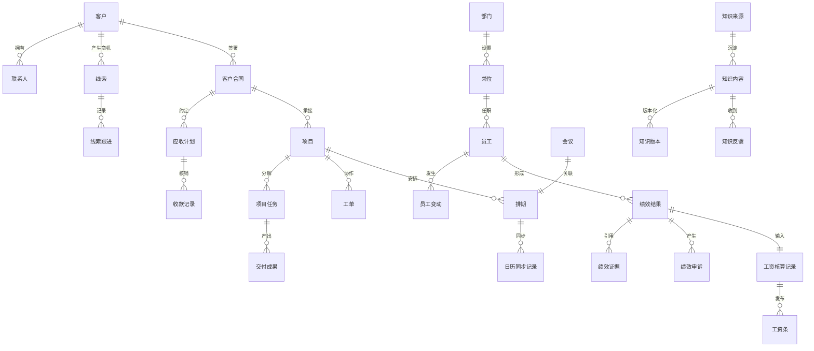

# CRM+OKR公司经营管理全域（业务对象识别） - 业务实体分析

## 1. 基本信息

- **业务域名称**: CRM+OKR公司经营管理全域（业务对象识别）
- **业务域描述**: 基于已验证用例，识别单一公司主系统、线索池子系统和AI知识库子系统共同使用的业务对象、职责、关键属性及边界。
- **分析时间**: 2026-07-21

## 2. 业务实体概述

### 2.1 业务实体定义
本阶段的业务实体等同于业务对象，是业务人员能够识别、具有独立业务含义、责任和持续业务记录的概念。

### 2.2 业务实体与数据库表的区别
业务对象表达业务含义和责任边界，不代表数据库表、接口字段、页面组件或技术服务；一个对象后续可能由多个技术结构实现。

### 2.3 业务实体分析的业务价值
为对象关系、生命周期、状态、行为、权限和系统功能提供统一词汇，避免客户与线索、会议与排期、绩效与工资等概念相互混用。

## 3. 业务实体列表

| 实体名称 | 实体描述 | 实体来源 |
|---------|---------|---------|
| 部门 | 承接公司目标、人员归属、资源确认和管理责任的组织对象。 | B2.1 ACT-003、UC-DEPT-001至002；B1.4 |
| 岗位 | 定义员工职责、适用KPI和业务角色边界的工作位置对象。 | B2.1 UC-PERF-004、UC-HR-001至003；B1.4 |
| 员工 | 在单一公司内承担业务责任、目标、任务和数据访问责任的人员对象。 | B2.1 ACT-001至016、UC-HR-001；B1.4 |
| 劳动合同 | 记录员工与公司的劳动关系期限和有效性的业务对象，不等同客户合同。 | B2.1 UC-HR-001至002；B1.4 |
| 员工变动 | 记录员工入职、转岗、离职及其生效时间与交接结果的对象。 | B2.1 UC-HR-001、003、004、007；B1.4 |
| 考勤记录 | 记录员工工作日出勤事实、异常及确认结果的对象。 | B2.1 UC-HR-005至006；B1.4 |
| 每日工作记录 | 记录员工今日工作、明日计划和产出引用的日常工作对象。 | B2.1 UC-EMP-002；US-029；B1.4 |
| 客户 | 公司持续经营的客户主体，是联系人、线索、合同和项目的共同归属对象。 | B2.1 UC-LEAD-002、UC-FIN-001、UC-PROJ-001；B1.4 |
| 联系人 | 代表客户或个人客户参与沟通的自然人对象，以手机号等信息识别。 | B2.1 UC-LEAD-001至002、UC-LEAD-011；B1.4 |
| 线索 | 一次潜在商机及其来源、负责人、保护期和经营进展的对象，与客户主体分离。 | B2.1 UC-LEAD-001至013；B1.4 |
| 线索跟进 | 对线索发生的沟通事实、下一步行动和有效跟进判断记录。 | B2.1 UC-LEAD-007至010；B1.4 |
| 客户合同 | 客户成交后约定服务范围、金额、付款条件和生效事实的合同对象。 | B2.1 UC-FIN-001至002；B1.4 |
| 应收计划 | 由客户合同付款条件形成的应收金额、到期日和收款进展对象。 | B2.1 UC-FIN-002、UC-FIN-008；B1.4 |
| 收款记录 | 记录实际到账金额、时间及财务核验结论的对象。 | B2.1 UC-FIN-003、UC-FIN-009；B1.4 |
| 开票记录 | 记录客户开票申请、完成、作废或红冲业务事实的对象。 | B2.1 UC-FIN-004；B1.4 |
| 退款记录 | 记录退款原因、金额、审批及完成结果的对象。 | B2.1 UC-FIN-005；B1.4 |
| 项目财务汇总 | 按项目聚合合同收入、实收、成本和利润结果的经营对象。 | B2.1 UC-FIN-006、UC-FIN-010；B1.4 |
| 项目 | 承接成交范围并组织目标、责任、计划、交付和验收的核心交付对象。 | B2.1 UC-PROJ-001至015；B1.4 |
| 项目角色分配 | 记录员工在特定项目中的负责人或成员责任及有效期间。 | B2.1 UC-PROJ-002至003；B1.4 |
| 项目里程碑 | 项目计划中的阶段目标、计划日期和完成判断对象。 | B2.1 UC-PROJ-004、UC-PROJ-006；B1.4 |
| 项目任务 | 项目内可分派、执行、提交成果和记录工时的工作单元。 | B2.1 UC-PROJ-004至006；B1.4 |
| 交付成果 | 由项目任务产生、具有类型、版本、引用和验收状态的业务成果。 | B2.1 UC-PROJ-010、UC-PROJ-012；B1.4 |
| 验收记录 | 记录客户或内部验收主体对交付成果作出的通过、整改或变更结论。 | B2.1 UC-PROJ-012至013；B1.4 |
| 工单 | 承接跨部门协作请求、处理责任、SLA和验收结果的独立协作对象。 | B2.1 UC-WO-001至008；B1.4 |
| 工单流转记录 | 保存工单分派、受理、转派、升级、退回、关闭和重开的连续轨迹。 | B2.1 UC-WO-002至007；B1.4 |
| 排期 | 对项目、培训、沙龙、直播或拍摄占用人员时间的业务安排对象。 | B2.1 UC-SCH-001至010；B1.4 |
| 会议 | 内部培训或外部沙龙活动的业务对象，关联排期但不承担会议室管理。 | B2.1 UC-SCH-004至008；B1.4 |
| 排期参与人 | 记录员工、讲师或外部联系人在排期中的角色、确认和占用关系。 | B2.1 UC-SCH-001至003；B1.4 |
| 日历同步记录 | 记录系统排期与飞书日历创建、更新、取消、失败和重试结果。 | B2.1 UC-SCH-006至009、UC-SYS-004；B1.4 |
| 工时记录 | 员工对项目任务、工单或活动投入的计划与实际时间记录。 | B2.1 UC-PROJ-011、UC-SCH-010；B1.4 |
| 考核周期 | 组织月度目标、评分、校准、锁定和工资核算的时间范围对象。 | B2.1 UC-PERF-001至011；B1.4 |
| 绩效规则 | 定义岗位KPI、OKR、协作权重、客观数据下限及工资系数的版本化规则对象。 | B2.1 UC-PERF-001、UC-PERF-011；B1.5 |
| 目标 | 公司、部门或个人在考核周期内承诺的结果及对齐关系对象。 | B2.1 UC-PERF-002至005；B1.4 |
| KPI任务 | 由岗位绩效规则产生、具有口径、目标值、权重和结果的考核项。 | B2.1 UC-PERF-004至006；B1.4 |
| 绩效证据 | 从项目、任务、工单、目标或其他业务事实引用的评分依据对象。 | B2.1 UC-PERF-005至007；B1.4 |
| 绩效结果 | 员工在考核周期内经初评、校准、确认和锁定形成的评分与系数对象。 | B2.1 UC-PERF-006至011；B1.4 |
| 绩效申诉 | 员工对绩效结果提出异议并由综合管理部处理的闭环对象。 | B2.1 UC-PERF-008、UC-PERF-012；B1.4 |
| 工资核算记录 | 财务依据锁定绩效结果核算、复核和记录发放结果的业务对象。 | B2.1 UC-PAY-001至003；B1.4 |
| 工资条 | 向员工本人发布的工资核算结果版本，支持更正但保留原版。 | B2.1 UC-PAY-002至003；B1.6 |
| 知识来源 | 经申请授权的企业文件、飞书工作群或飞书云文档来源对象。 | B2.1 UC-KNOW-001至003、007至008；B1.4 |
| 知识内容 | 由授权来源沉淀并按可见范围发布、检索和治理的知识单元。 | B2.1 UC-KNOW-004至009；B1.4 |
| 知识版本 | 知识内容每次整理、纠正或失效处理形成的可追溯版本对象。 | B2.1 UC-KNOW-004、006；B1.4 |
| 知识反馈 | 员工对知识错误、过期、重复或缺失提出的治理事项对象。 | B2.1 UC-KNOW-006；B1.4 |
| 审计记录 | 保存关键业务操作主体、时间、对象和变更结果的追溯对象。 | B2.1 UC-SYS-002；B1.4；既有审计推定主题 |

## 4. 业务实体属性表

| 实体名称 | 属性名称 | 业务含义 | 业务类型 | 是否必填 | 业务约束 | 默认值 |
|---------|---------|---------|---------|---------|---------|--------|
| 部门 | 部门名称 | 公司内部组织单元的正式业务名称。 | 文本 | 是 | 同一有效组织范围内不得重名。 | 无 |
| 岗位 | 岗位名称 | 用于区分岗位职责和适用绩效规则。 | 文本 | 是 | 须明确所属部门或适用范围。 | 无 |
| 员工 | 员工编号 | 员工在公司范围内的稳定业务识别编号。 | 文本 | 是 | 单公司内唯一，离职后不复用。 | 无 |
| 劳动合同 | 合同期限 | 劳动关系约定的开始和结束范围。 | 文本 | 是 | 须与员工及有效状态对应。 | 无 |
| 员工变动 | 生效时间 | 入职、转岗或离职正式改变责任的时间。 | 日期时间 | 是 | 历史变动不得被覆盖。 | 无 |
| 考勤记录 | 考勤日期 | 考勤事实所属工作日。 | 日期 | 是 | 按公司工作日历判断。 | 无 |
| 每日工作记录 | 工作日期 | 今日工作和明日计划所属日期。 | 日期 | 是 | 员工按本人工作日记录。 | 当日 |
| 客户 | 客户名称 | 客户主体的原始名称及标准化比对依据。 | 文本 | 是 | 标准化只处理空格、全半角和英文大小写，不删除法定后缀。 | 无 |
| 联系人 | 手机号 | 联系人查重的第一识别依据。 | 文本 | 是 | 相同手机号自动判定同一联系人并保留合并历史。 | 无 |
| 线索 | 当前主负责人 | 当前负责该线索经营的唯一员工。 | 文本 | 否 | 同一时点只允许一个主负责人。 | 公共池无负责人 |
| 线索跟进 | 跟进时间 | 有效沟通或推进动作发生时间。 | 日期时间 | 是 | 用于首次跟进和连续未跟进期限计算。 | 无 |
| 客户合同 | 合同编号 | 客户合同的业务识别编号。 | 文本 | 是 | 公司范围内唯一。 | 无 |
| 应收计划 | 应收日期 | 合同约定款项应到账日期。 | 日期 | 是 | 由生效付款条件形成。 | 无 |
| 收款记录 | 到账金额 | 经财务核验的实际到账金额。 | 金额 | 是 | 错误金额通过更正记录处理，不覆盖原记录。 | 0 |
| 开票记录 | 开票金额 | 本次开票对应金额。 | 金额 | 是 | 须关联客户合同及开票状态。 | 0 |
| 退款记录 | 退款金额 | 本次申请并处理的退款金额。 | 金额 | 是 | 不得超过可退款业务金额。 | 0 |
| 项目财务汇总 | 项目利润 | 项目确认收入减去项目归集成本的结果。 | 金额 | 是 | 随有效收入或成本更正重新计算。 | 0 |
| 项目 | 项目类型 | 区分AI产品销售、AI定制开发和自媒体代运营。 | 枚举 | 是 | 决定适用交付阶段，但共享项目管理基线。 | 无 |
| 项目角色分配 | 项目角色 | 员工在项目中承担的负责人或成员责任。 | 枚举 | 是 | 项目启动前必须确认项目负责人。 | 成员 |
| 项目里程碑 | 计划完成时间 | 里程碑在基线中承诺完成的时间。 | 日期时间 | 是 | 变更后保留原基线。 | 无 |
| 项目任务 | 任务名称 | 可执行工作单元的明确名称。 | 文本 | 是 | 正式任务须有责任人和计划时间。 | 无 |
| 交付成果 | 成果版本 | 交付物提交或整改后的版本标识。 | 文本 | 是 | 新版本不得覆盖历史版本。 | 初版 |
| 验收记录 | 验收结论 | 对成果作出的通过、整改或变更结论。 | 枚举 | 是 | 须明确验收主体、范围和时间。 | 无 |
| 工单 | 工单类型与级别 | 决定默认响应、完成和升级规则。 | 枚举 | 是 | 普通、项目交付、紧急客户或生产问题采用对应规则。 | 普通跨部门协作 |
| 工单流转记录 | 流转动作 | 一次分派、受理、转派、升级、退回、关闭或重开动作。 | 枚举 | 是 | 按发生顺序保留完整历史。 | 无 |
| 排期 | 起止时间 | 人员被业务事项占用的时间范围。 | 文本 | 是 | 确认前检查重叠与负荷冲突。 | 无 |
| 会议 | 会议类型 | 区分内部培训和外部沙龙。 | 枚举 | 是 | 不包含会议室管理。 | 无 |
| 排期参与人 | 确认状态 | 参与人或讲师对档期的确认结果。 | 枚举 | 是 | 讲师未确认时会议不得转已确认。 | 待确认 |
| 日历同步记录 | 同步状态 | 飞书日历创建、更新或取消的结果。 | 枚举 | 是 | 失败时保留业务排期并可重试，不重复创建事件。 | 待同步 |
| 工时记录 | 实际工时 | 员工对业务事项实际投入的时间。 | 数值 | 是 | 须关联员工和项目任务、工单或活动。 | 0 |
| 考核周期 | 周期月份 | 绩效目标和结果所属自然月。 | 日期 | 是 | 当前确认按月管理。 | 当月 |
| 绩效规则 | 权重方案 | 岗位KPI、OKR、项目交付与协作的占比。 | 文本 | 是 | 总计100%，客观数据权重不得低于50%。 | 60%/30%/10% |
| 目标 | 上级目标引用 | 公司、部门、个人目标之间的对齐来源。 | 文本 | 否 | 部门必须对齐公司；个人至少一项目标对齐部门。 | 无 |
| KPI任务 | 指标口径 | KPI计算范围、公式和数据来源。 | 文本 | 是 | 规则生效前须明确且版本化。 | 无 |
| 绩效证据 | 来源业务事项 | 证据对应的项目、任务、工单、目标或其他业务事实。 | 文本 | 是 | 同一成果不得重复计分。 | 无 |
| 绩效结果 | 综合评分 | 按规则、证据、初评和校准形成的最终评分。 | 数值 | 是 | 锁定后才可传递财务。 | 0 |
| 绩效申诉 | 申诉状态 | 员工异议从提交到结案的处理状态。 | 枚举 | 是 | 未结案不得锁定绩效或进入工资核算。 | 待受理 |
| 工资核算记录 | 应发金额 | 财务依据工资结构和锁定绩效系数计算的结果。 | 金额 | 是 | 绩效系数只影响绩效工资或奖金，固定工资不变。 | 0 |
| 工资条 | 发布版本 | 员工本人可见的工资结果版本。 | 文本 | 是 | 更正时发布新版本并保留原版。 | 初版 |
| 知识来源 | 来源类型 | 企业文件、飞书工作群或飞书云文档。 | 枚举 | 是 | 排除飞书个人聊天，采集前必须授权。 | 无 |
| 知识内容 | 可见范围 | 允许查看该知识的员工、部门、岗位或指定范围。 | 文本 | 是 | 不得超过来源授权范围。 | 最小授权范围 |
| 知识版本 | 版本号 | 知识整理、纠正或失效形成的版本标识。 | 文本 | 是 | 历史版本可追溯。 | 初版 |
| 知识反馈 | 反馈类型 | 错误、过期、重复或缺失等治理原因。 | 枚举 | 是 | 须关联知识内容和反馈人。 | 无 |
| 审计记录 | 操作时间 | 关键业务动作实际发生的时间。 | 日期时间 | 是 | 与操作人、业务对象和变更结果共同保留。 | 动作发生时间 |

## 5. 业务实体关系表

| 源实体 | 目标实体 | 关联类型 | 业务含义 | 业务规则 |
|-------|---------|---------|---------|---------|
| 部门 | 岗位 | 一对多 | 部门设置多个岗位。 | 岗位须处于有效组织范围。 |
| 岗位 | 员工 | 一对多 | 岗位可由多名员工任职。 | 员工当前岗位随入转离生效。 |
| 员工 | 劳动合同 | 一对多 | 员工可有连续的劳动合同版本。 | 历史合同不得覆盖。 |
| 员工 | 员工变动 | 一对多 | 员工产生入职、转岗和离职记录。 | 按生效时间改变当前责任。 |
| 员工 | 考勤记录 | 一对多 | 员工按工作日形成考勤事实。 | 异常需确认后才进入工资相关处理。 |
| 员工 | 每日工作记录 | 一对多 | 员工按日期记录每日工作。 | 首期仅今日工作、明日计划和产出引用。 |
| 客户 | 联系人 | 一对多 | 一个客户主体可有多个联系人。 | 同公司不同联系人分别保留。 |
| 客户 | 线索 | 一对多 | 一个客户可对应多次独立商机。 | 同客户不同联系人不自动合并线索。 |
| 线索 | 线索跟进 | 一对多 | 线索包含连续跟进事实。 | 历史跟进和操作记录必须保留。 |
| 客户 | 客户合同 | 一对多 | 客户可签署多个业务合同。 | 合同独立记录范围和付款条件。 |
| 客户合同 | 应收计划 | 一对多 | 合同形成一个或多个应收节点。 | 应收节点来源于合同付款条件。 |
| 应收计划 | 收款记录 | 一对多 | 一个应收节点可由多笔收款满足。 | 仅核验通过金额计入实收。 |
| 客户合同 | 开票记录 | 一对多 | 合同可产生多次开票处理。 | 作废和红冲保留历史。 |
| 客户合同 | 退款记录 | 一对多 | 合同可产生退款事项。 | 退款须有原因和处理结论。 |
| 客户合同 | 项目 | 一对多 | 一个合同可承接一个或多个交付项目。 | 项目引用明确合同和交付范围。 |
| 项目 | 项目财务汇总 | 一对一 | 每个项目形成一个当前财务汇总。 | 汇总随有效财务记录重算。 |
| 项目 | 项目角色分配 | 一对多 | 项目由多个角色分配组成。 | 同一时点项目负责人唯一。 |
| 员工 | 项目角色分配 | 一对多 | 员工可在多个项目承担角色。 | 角色分配须记录有效期间。 |
| 项目 | 项目里程碑 | 一对多 | 项目基线包含多个里程碑。 | 基线变更保留原计划。 |
| 项目 | 项目任务 | 一对多 | 项目分解为可执行任务。 | 正式任务明确责任和期限。 |
| 项目任务 | 交付成果 | 一对多 | 任务可提交多个成果或版本。 | 成果版本不得覆盖。 |
| 项目 | 验收记录 | 一对多 | 项目可经历多次验收和整改。 | 结项前须形成明确验收结论。 |
| 项目 | 工单 | 一对多 | 项目可关联跨部门协作工单。 | 非项目工单可以不关联项目。 |
| 工单 | 工单流转记录 | 一对多 | 工单由连续流转动作构成。 | 转派、升级、关闭和重开均留痕。 |
| 项目 | 排期 | 一对多 | 项目可形成多个人员活动排期。 | 培训、沙龙等非项目排期允许不关联项目。 |
| 排期 | 排期参与人 | 一对多 | 排期包含一个或多个参与人。 | 讲师档期须独立确认。 |
| 员工 | 排期参与人 | 一对多 | 员工可参加多个排期。 | 确认前检查时间冲突和负荷。 |
| 会议 | 排期 | 一对一 | 内部培训或外部沙龙以排期承载时间占用。 | 不创建会议室对象。 |
| 排期 | 日历同步记录 | 一对多 | 排期创建、变更和取消形成同步尝试。 | 系统排期是业务主记录。 |
| 员工 | 工时记录 | 一对多 | 员工记录多个业务事项的投入。 | 工时须关联实际业务事项。 |
| 项目任务 | 工时记录 | 一对多 | 任务可由多个员工分次记录工时。 | 计划与实际工时分开保留。 |
| 考核周期 | 绩效规则 | 一对多 | 周期引用一个或多个岗位规则版本。 | 评分须使用当期生效版本。 |
| 考核周期 | 目标 | 一对多 | 月度周期包含公司、部门和个人目标。 | 目标按确认的逐级对齐规则建立。 |
| 目标 | KPI任务 | 一对多 | 个人考核可关联多个KPI考核项。 | KPI口径和权重来自生效规则。 |
| 员工 | 绩效结果 | 一对多 | 员工每个考核周期形成绩效结果。 | 同一员工同一周期仅一个当前锁定结果。 |
| 绩效结果 | 绩效证据 | 一对多 | 绩效结果由多项业务证据支撑。 | 同一成果不得重复计分。 |
| 绩效结果 | 绩效申诉 | 一对多 | 绩效结果可产生申诉及复核记录。 | 申诉结案前不得锁定或进入工资。 |
| 绩效结果 | 工资核算记录 | 一对一 | 锁定绩效结果进入当期工资核算。 | 固定工资不受绩效系数影响。 |
| 工资核算记录 | 工资条 | 一对多 | 一次核算可形成初版和更正版工资条。 | 工资条仅本人可见且原版保留。 |
| 知识来源 | 知识内容 | 一对多 | 授权来源沉淀多个知识内容。 | 内容范围不得超过来源授权。 |
| 知识内容 | 知识版本 | 一对多 | 知识内容随整理和纠正形成多个版本。 | 检索结果展示来源、版本和更新时间。 |
| 知识内容 | 知识反馈 | 一对多 | 知识内容可收到多次治理反馈。 | 反馈处理形成纠正、失效或下架结论。 |
| 员工 | 审计记录 | 一对多 | 员工关键操作形成审计记录。 | 审计可见范围留待权限阶段确定。 |

## 6. 业务实体关系图

## 7. 业务实体说明

### 7.1 员工

**实体详细说明**: 员工是账号、组织、业务责任、目标、绩效和工资的共同人员基线；角色是员工在具体情境中的责任，不另造重复人员对象。

**业务规则**: 入转离按生效时间调整责任；离职前完成客户、线索、项目、工单、排期和知识责任交接。

**生命周期**: 待入职→在职→转岗生效或离职处理中→已离职；详细状态在B2.4定义。

**关键约束**: 单公司范围内稳定识别；离职后不得承接新业务；历史责任保留。

### 7.2 客户

**实体详细说明**: 客户代表被公司持续经营的主体，不等同某个联系人或某一条线索。

**业务规则**: 同公司不同联系人归入同一客户但保留独立联系人和线索；名称仅按确认规则标准化。

**生命周期**: 潜在客户→经营中→成交或暂不经营；详细状态在B2.4定义。

**关键约束**: 不能因名称近似直接合并；误合并必须可撤销并保留历史。

### 7.3 线索

**实体详细说明**: 线索代表一次可领取、分配、跟进、释放、退回或转化的商机，是线索池的核心对象。

**业务规则**: 公共线索按配置窗口和批次数开放；每人每日最多抢领20条、保护期内最多100条；本人可释放自己领取或被分配的线索。

**生命周期**: 待查重→公共池→保护跟进中→释放/退回/成交/流失；详细状态在B2.4定义。

**关键约束**: 当前主负责人唯一；全部操作记录保留；重点分配不计每日抢领但计保护期上限。

### 7.4 客户合同

**实体详细说明**: 客户合同把成交承诺转成服务范围、金额和付款条件，并为应收和项目提供业务依据。

**业务规则**: 审核生效后形成应收计划；项目启动须核验合同和财务条件。

**生命周期**: 草拟→审核中→生效/退回→履行中→完成或终止；详细状态在B2.4定义。

**关键约束**: 与劳动合同概念分离；金额更正不覆盖原财务事实。

### 7.5 项目

**实体详细说明**: 项目是AI产品销售、AI定制开发和自媒体代运营三类交付的统一管理对象，各类型共享责任、计划、任务、风险、成果、工时和验收基线。

**业务规则**: 正式启动前完成财务核验、部门资源确认、负责人确认和计划基线；新增范围必须受控变更。

**生命周期**: 拟立项→条件确认→执行中→验收中→已完成/终止；详细状态在B2.4定义。

**关键约束**: 每个项目当前负责人唯一；原基线和历史成果版本不得覆盖。

### 7.6 工单

**实体详细说明**: 工单用于承接跨部门协作，不替代项目任务；项目型工单可以关联项目。

**业务规则**: 创建时明确目标部门、要求、期限和验收标准；按类型执行SLA提醒、升级、满意度和重开。

**生命周期**: 草稿→待分派→处理中→待确认→已关闭，可转派、升级、退回或重开；详细状态在B2.4定义。

**关键约束**: 正式SLA从完整提交后开始；关闭后3个工作日内允许发起人重开。

### 7.7 排期

**实体详细说明**: 排期统一承载项目、培训、沙龙、直播和拍摄的人员时间占用；会议是部分排期的业务活动信息。

**业务规则**: 确认前检查人员冲突和讲师确认；确认后同步飞书日历；变更或取消更新原事件。

**生命周期**: 草稿→待协调/待讲师确认→已确认→已完成/已取消；详细状态在B2.4定义。

**关键约束**: 系统排期为业务主记录；同步失败不得丢失排期或重复创建事件；不管理会议室。

### 7.8 绩效规则

**实体详细说明**: 绩效规则由综合管理部维护，以版本形式定义岗位KPI、OKR、项目协作权重、证据要求和工资系数。

**业务规则**: 默认60%/30%/10%，可按岗位配置；总权重100%，客观数据至少50%；分档系数按已确认决策表执行。

**生命周期**: 草拟→审核/确认→生效→停用；已被周期使用的版本保留。

**关键约束**: 规则变化不得追溯覆盖已锁定周期；一票否决须具备证据和联合确认。

### 7.9 目标

**实体详细说明**: 目标承载公司、部门和个人在月度周期内的结果承诺及对齐关系。

**业务规则**: 公司到部门强制对齐；个人至少一项目标对齐部门；进度需引用实际业务证据。

**生命周期**: 草拟→对齐中→已确认→执行中→待评估→已复盘；详细状态在B2.4定义。

**关键约束**: 中途调整须保留调整原因和前后版本；同一成果不得重复计分。

### 7.10 绩效结果

**实体详细说明**: 绩效结果汇总岗位KPI、OKR和项目协作评分，经初评、综合管理部校准、员工确认或申诉后锁定。

**业务规则**: 锁定前校验证据、规则版本、权重、申诉和一票否决；锁定后计算0至1.2工资系数。

**生命周期**: 待初评→待校准→待员工确认/申诉中→已锁定；详细状态在B2.4定义。

**关键约束**: 申诉未结不得锁定或进入工资；系数只影响绩效工资或奖金。

### 7.11 工资核算记录

**实体详细说明**: 工资核算记录由财务负责，读取已锁定绩效结果并完成核算、复核和发放记录。

**业务规则**: 综合管理部完成绩效治理，财务完成核算复核发放；双方流程完成后发布工资条。

**生命周期**: 待核算→待复核→待发放→已发放/更正中；详细状态在B2.4定义。

**关键约束**: 固定工资不被绩效系数改变；个人工资仅本人和授权财务角色可见。

### 7.12 工资条

**实体详细说明**: 工资条是工资核算结果面向员工个人的发布版本。

**业务规则**: 发放完成后向本人发布；错误时生成更正版本并保留原版本。

**生命周期**: 待发布→已发布→已更正；详细状态在B2.4定义。

**关键约束**: 不得向无权人员展示；任何更正必须可追溯。

### 7.13 知识来源

**实体详细说明**: 知识来源是AI知识库采集边界和授权责任的起点，限企业文件、授权飞书工作群和授权飞书云文档。

**业务规则**: 先申请审批，再技术接入；跨部门或敏感来源按既定共同授权；撤权后停止新增采集。

**生命周期**: 待申请→审批中→已授权→接入中→采集中→已撤权/已删除；详细状态在B2.4定义。

**关键约束**: 不采集个人聊天；历史回溯须单独授权；查看范围不得超出来源授权。

### 7.14 知识内容

**实体详细说明**: 知识内容是从授权来源中整理、发布、检索和治理的知识单元，始终保留来源与版本信息。

**业务规则**: 发布前处理重复、失效和敏感内容；检索前按员工、部门、岗位和指定授权过滤。

**生命周期**: 待整理→待发布→已发布→已纠正/已下架/已失效/已删除；详细状态在B2.4定义。

**关键约束**: 无来源或版本信息不得作为可信结果；来源撤权后按治理结论处理既有内容。

### 7.15 审计记录

**实体详细说明**: 审计记录用于还原关键业务变更的操作主体、时间、对象和结果，是争议处理的事实依据。

**业务规则**: 线索、合同财务、项目、工单、绩效工资、员工和知识治理的关键动作均保留历史。

**生命周期**: 随业务动作产生后保持可追溯；不参与业务状态流转。

**关键约束**: 本阶段不确定具体查看权限、保留期限和技术日志实现，这些在C3/C5确认。

---

*文档生成时间: 2026-07-21 17:33:05*