# CRM+OKR公司经营管理全域（生命周期与状态分析） - 状态模型分析

## 基本信息

- **业务域名称**: CRM+OKR公司经营管理全域（生命周期与状态分析）
- **业务域描述**: 对状态会影响责任、权限、期限、财务、交付或知识治理的13个核心业务对象建模；不描述页面状态或技术状态机。
- **分析时间**: 2026-07-21

## 1. 状态实体列表

基于业务实体分析，识别出以下具有状态属性的实体：

| 实体名称 | 实体描述 | 实体来源 |
|---------|---------|---------|
| 员工 | 员工状态决定组织归属、业务承接、交接和账号使用边界。 | B2.2员工；UC-HR-001至007 |
| 线索 | 线索在查重、公共池、保护跟进、延期、成交和流失间流转。 | B2.2线索；UC-LEAD-001至013；LEAD规则 |
| 客户合同 | 客户合同状态控制应收计划形成和项目启动依据。 | B2.2客户合同；UC-FIN-001至002 |
| 项目 | 项目状态覆盖立项条件、执行、验收、完成和取消。 | B2.2项目；UC-PROJ-001至015 |
| 项目任务 | 项目任务状态用于分派、执行、成果确认、阻塞和完成。 | B2.2项目任务；UC-PROJ-004至006、010至011 |
| 工单 | 工单状态覆盖提交、分派、处理、确认、关闭和重开。 | B2.2工单；UC-WO-001至008；WO规则 |
| 排期 | 排期统一管理项目、培训、沙龙、直播和拍摄的人员时间，会议主状态跟随其关联排期。 | B2.2排期与会议；UC-SCH-001至010；SCH规则 |
| 目标 | 目标从草拟、对齐、确认、执行到评估和复盘形成月度闭环。 | B2.2目标；UC-PERF-002至005 |
| 绩效结果 | 绩效结果经初评、校准、员工确认或申诉后锁定并进入工资。 | B2.2绩效结果；UC-PERF-006至011 |
| 绩效申诉 | 绩效申诉从提交、受理、处理到结案，阻断绩效锁定。 | B2.2绩效申诉；UC-PERF-008、012 |
| 工资核算记录 | 工资核算记录从核算、复核、发放到更正，并控制工资条发布版本。 | B2.2工资核算记录与工资条；UC-PAY-001至003 |
| 知识来源 | 知识来源从申请授权到接入采集，并支持撤权和删除。 | B2.2知识来源；UC-KNOW-001至003、007至008 |
| 知识内容 | 知识内容从整理发布到纠正、下架、失效或删除。 | B2.2知识内容；UC-KNOW-004至009 |

## 2. 状态流转图

### 2.1 员工 - 员工生命周期 (主流程)

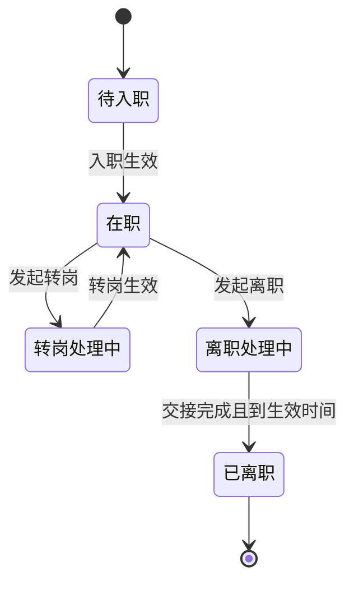

### 2.2 线索 - 线索池生命周期 (主流程)

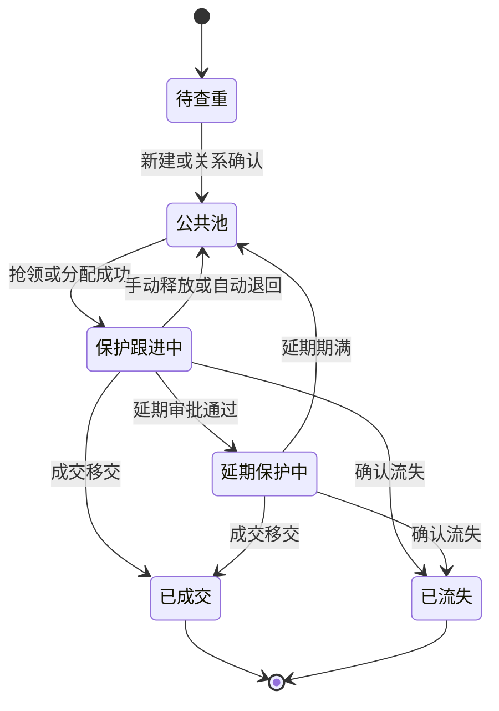

### 2.3 客户合同 - 客户合同生命周期 (主流程)

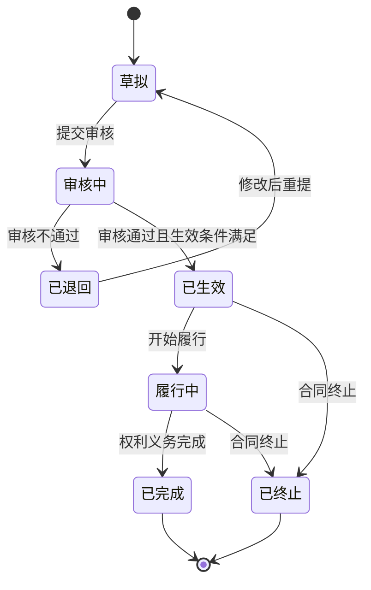

### 2.4 项目 - 项目交付生命周期 (主流程)

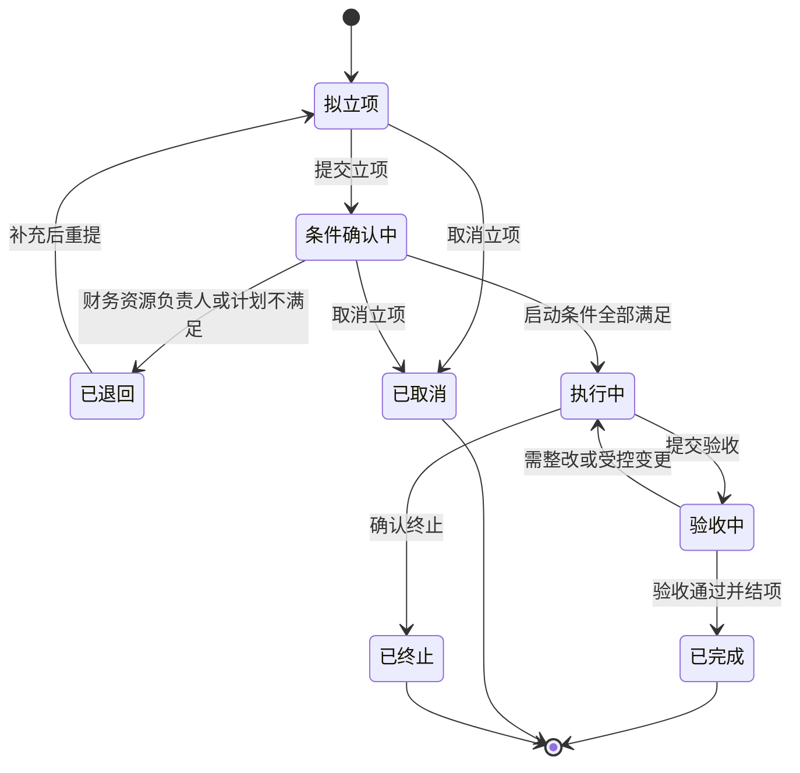

### 2.5 项目任务 - 项目任务生命周期 (子流程)

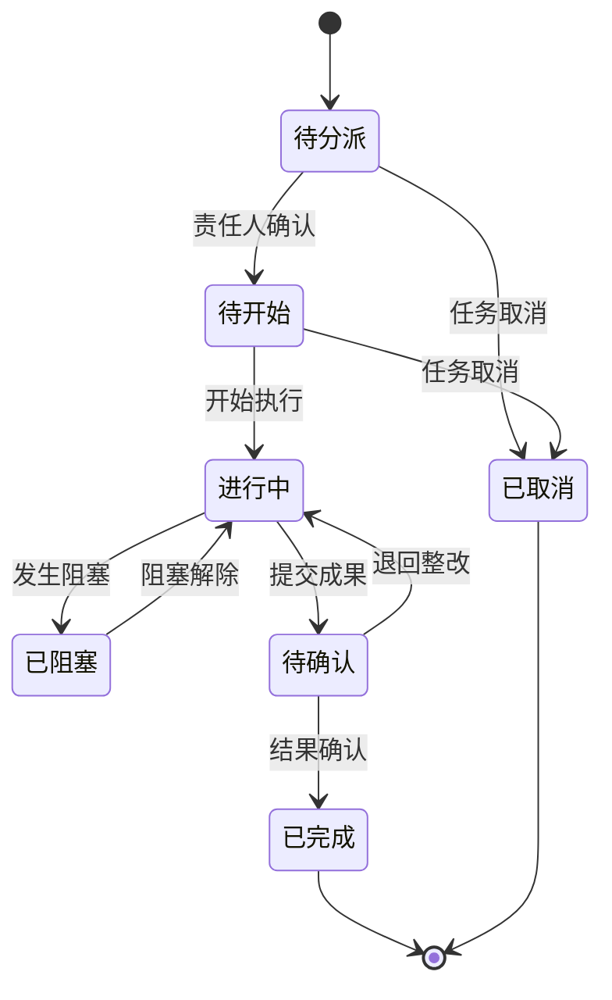

### 2.6 工单 - 跨部门工单生命周期 (主流程)

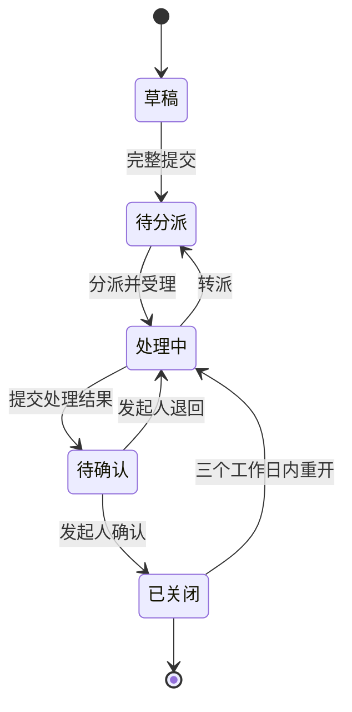

### 2.7 排期 - 人员与会议排期生命周期 (主流程)

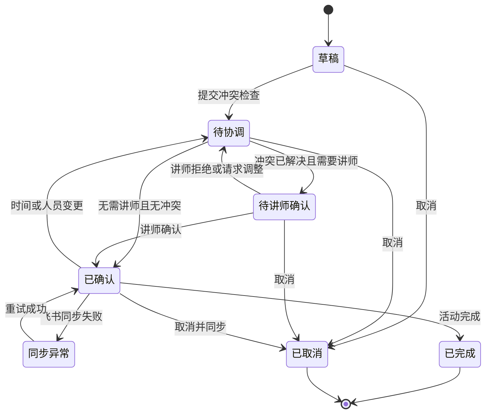

### 2.8 目标 - 月度目标生命周期 (主流程)

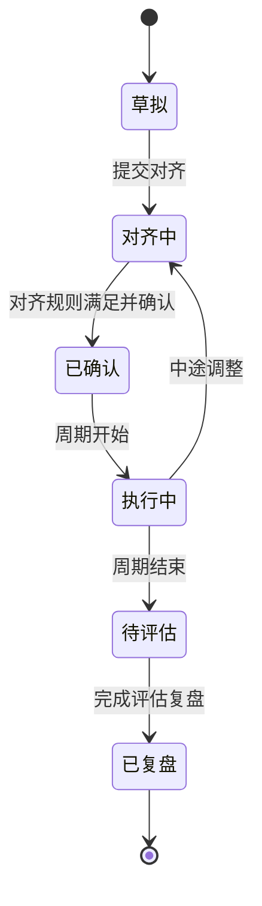

### 2.9 绩效结果 - 绩效结果生命周期 (主流程)

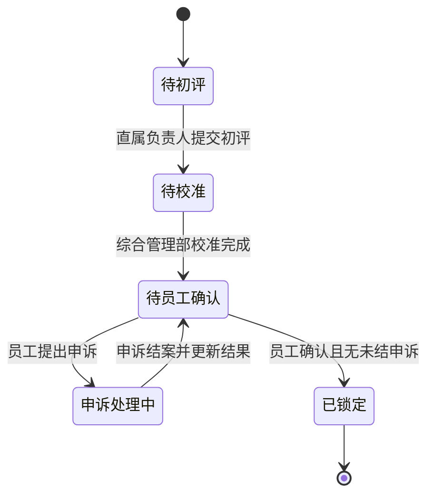

### 2.10 绩效申诉 - 绩效申诉生命周期 (子流程)

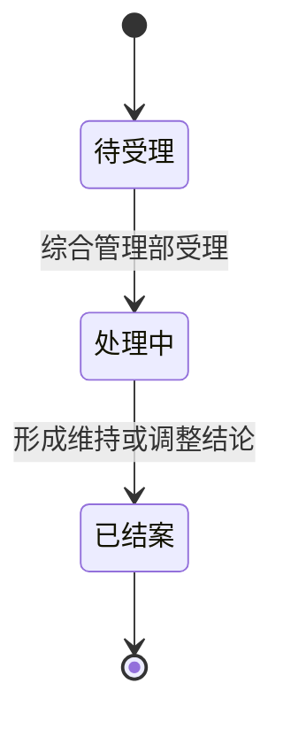

### 2.11 工资核算记录 - 工资核算与工资条生命周期 (主流程)

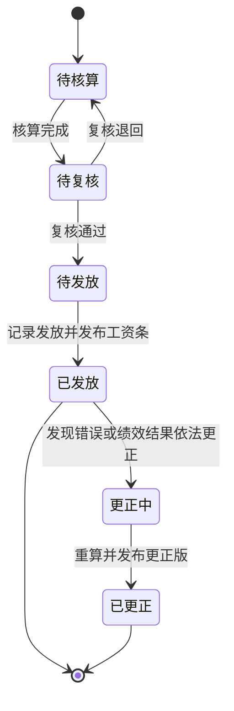

### 2.12 知识来源 - 知识来源授权采集生命周期 (主流程)

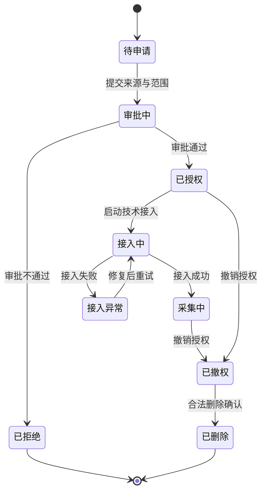

### 2.13 知识内容 - 知识内容治理生命周期 (主流程)

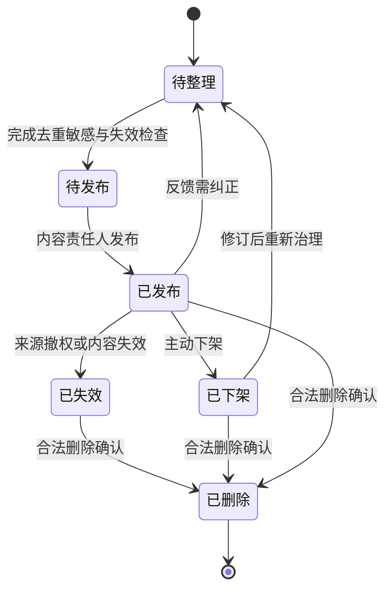

## 3. 状态说明表

| 实体名称 | 状态名称 | 状态描述 | 允许的操作 | 允许的角色 | 进入条件 | 退出条件 |
|---------|---------|---------|-----------|-----------|---------|---------|
| 员工 | 待入职 | 已建立入职事项但尚未到生效时间。 | 补充档案, 配置部门岗位, 准备交接事项 | 综合管理部, 系统管理员 | 入职事项已确认。 | 到达生效时间且基础资料满足。 |
| 员工 | 在职 | 可承担公司业务、目标和排期。 | 承担业务, 记录工作, 发起转岗, 发起离职 | 员工, 部门负责人, 综合管理部 | 入职或转岗生效。 | 进入转岗或离职处理。 |
| 员工 | 转岗处理中 | 原岗位与新岗位责任处于受控切换期。 | 确认新部门岗位, 调整目标与排期, 移交责任 | 综合管理部, 原部门负责人, 新部门负责人 | 转岗事项确认。 | 到达生效时间且责任调整完成。 |
| 员工 | 离职处理中 | 正在移交客户、线索、项目、工单、排期和知识责任。 | 移交责任, 核对考勤工资, 调整未来排期 | 综合管理部, 部门负责人, 接收人 | 离职事项确认。 | 交接完成并到离职生效时间。 |
| 员工 | 已离职 | 不再承接新业务，账号按规则停用，历史责任保留。 | 查看授权历史, 更正历史责任记录 | 综合管理部, 系统管理员 | 交接完成且离职生效。 | 终止状态。 |
| 线索 | 待查重 | 线索已录入，尚未完成客户联系人关系判断。 | 查重, 合并, 建立客户关系 | 市场销售中心/线索管理角色 | 全员提交新线索。 | 完成查重和关系处理。 |
| 线索 | 公共池 | 无当前主负责人，可按规则开放抢领或分配。 | 抢领, 分配, 查看历史 | 线索责任人, 市场销售中心/线索管理角色 | 查重完成、新建、释放或自动退回。 | 抢领或分配成功。 |
| 线索 | 保护跟进中 | 已有唯一主负责人并处于30天保护期。 | 记录跟进, 成交移交, 标记流失, 手动释放, 申请延期 | 当前线索责任人, 市场销售中心/线索管理角色 | 抢领或分配成功且未超过100条上限。 | 释放、退回、延期、成交或流失。 |
| 线索 | 延期保护中 | 持续谈判获批的一次性延长保护期。 | 记录跟进, 成交移交, 标记流失, 手动释放 | 当前线索责任人, 市场销售中心/线索管理角色 | 原保护期未结束且延期审批通过。 | 最长15天到期、释放、成交或流失。 |
| 线索 | 已成交 | 已完成成交信息移交。 | 查看历史, 建立合同与项目 | 线索责任人, 商务责任人, 授权管理角色 | 成交条件明确且移交完成。 | 终止状态。 |
| 线索 | 已流失 | 已确认当前商机不再继续推进。 | 查看历史, 记录流失原因 | 当前线索责任人, 市场销售中心/线索管理角色 | 形成流失判断和原因。 | 终止状态。 |
| 客户合同 | 草拟 | 合同范围、金额和付款条件正在准备。 | 编辑, 提交审核, 取消 | 商务责任人 | 成交移交后创建合同。 | 提交审核。 |
| 客户合同 | 审核中 | 财务或授权责任人正在核验合同。 | 审核通过, 退回修改 | 财务人员, 授权审核角色 | 合同信息完整并提交。 | 审核通过或退回。 |
| 客户合同 | 已退回 | 审核未通过，等待商务修改。 | 修改, 重新提交, 取消 | 商务责任人 | 审核形成退回原因。 | 修改后重提或取消。 |
| 客户合同 | 已生效 | 合同已具备生效事实，可形成应收和项目依据。 | 建立应收计划, 发起项目, 开始履行, 终止 | 商务责任人, 财务人员, 项目发起人 | 审核通过且生效条件满足。 | 开始履行或确认终止。 |
| 客户合同 | 履行中 | 合同交付和收款义务正在执行。 | 收款开票, 交付, 退款, 完成, 终止 | 商务责任人, 财务人员, 项目负责人 | 合同开始实际履行。 | 义务完成或终止。 |
| 客户合同 | 已完成 | 合同约定义务已完成。 | 查看, 归档, 依法更正关联记录 | 商务责任人, 财务人员, 授权管理角色 | 交付与财务事项完成。 | 终止状态。 |
| 客户合同 | 已终止 | 合同经确认停止继续履行。 | 查看, 处理遗留事项 | 商务责任人, 财务人员, 授权管理角色 | 形成终止结论和遗留责任。 | 终止状态。 |
| 项目 | 拟立项 | 正在准备客户合同、目标、范围、时间和成员需求。 | 编辑申请, 提交条件确认, 取消 | 项目发起人 | 成交移交后提出项目。 | 提交立项或取消。 |
| 项目 | 条件确认中 | 财务、资源、负责人和计划基线正在确认。 | 财务核验, 资源确认, 负责人确认, 制定计划, 退回, 取消 | 财务人员, 部门负责人, 项目发起人, 项目负责人 | 立项资料提交。 | 全部满足、退回或取消。 |
| 项目 | 已退回 | 启动条件未满足，等待补充。 | 补充信息, 调整资源与计划, 重新提交, 取消 | 项目发起人, 项目负责人 | 任一必要条件不满足。 | 重新提交或取消。 |
| 项目 | 执行中 | 项目按基线执行任务、成果、工时和风险变更。 | 分派任务, 提交成果, 记录工时, 管理风险变更, 提交验收, 终止 | 项目负责人, 交付人员, 部门负责人 | 财务、资源、负责人和计划基线均满足。 | 提交验收或确认终止。 |
| 项目 | 验收中 | 客户或内部验收主体正在确认成果。 | 确认通过, 退回整改, 提出受控变更 | 项目负责人, 商务责任人, 验收责任人 | 成果和验收材料提交。 | 通过结项或退回执行。 |
| 项目 | 已完成 | 验收、结项和遗留责任已确认。 | 复盘, 查看, 承接售后续约 | 项目负责人, 项目发起人, 财务人员, 授权管理角色 | 验收通过并完成结项核对。 | 终止状态。 |
| 项目 | 已取消/已终止 | 项目在启动前取消或执行中确认终止。 | 查看, 处理遗留事项 | 项目发起人, 项目负责人, 授权管理角色 | 形成取消或终止结论。 | 终止状态。 |
| 项目任务 | 待分派 | 任务已建立但未确认责任人。 | 分派, 编辑, 取消 | 项目负责人 | 计划基线创建任务。 | 责任人确认或取消。 |
| 项目任务 | 待开始 | 责任人已确认但尚未开始执行。 | 开始, 调整计划, 取消 | 任务责任人, 项目负责人 | 责任与计划明确。 | 开始执行或取消。 |
| 项目任务 | 进行中 | 任务正在执行。 | 更新进度, 记录工时, 提交成果, 报告阻塞 | 任务责任人, 项目负责人 | 责任人开始执行或阻塞解除。 | 提交成果或进入阻塞。 |
| 项目任务 | 已阻塞 | 因依赖、资源或问题暂时无法继续。 | 记录原因, 协调资源, 解除阻塞, 升级 | 任务责任人, 项目负责人, 部门负责人 | 记录明确阻塞原因。 | 阻塞解除。 |
| 项目任务 | 待确认 | 成果已提交，等待项目责任人确认。 | 确认完成, 退回整改 | 项目负责人, 验收责任人 | 成果和实际工时提交。 | 确认或退回。 |
| 项目任务 | 已完成/已取消 | 任务已确认完成或在执行前受控取消。 | 查看, 引用成果 | 项目负责人, 交付人员 | 结果确认或取消结论成立。 | 终止状态。 |
| 工单 | 草稿 | 协作请求尚未正式进入SLA。 | 编辑, 提交, 删除草稿 | 发起人 | 创建工单。 | 目标部门、要求、期限和验收标准完整。 |
| 工单 | 待分派 | 已进入正式SLA，等待目标部门确定处理人。 | 分派, 转派, 升级 | 目标部门负责人, 授权管理角色 | 完整提交或处理中转派。 | 处理人受理。 |
| 工单 | 处理中 | 处理人按SLA执行并提交结果。 | 处理, 提交成果, 记录工时, 转派, 升级 | 处理人, 部门负责人 | 分派并受理，或工单重开。 | 提交结果或转派。 |
| 工单 | 待确认 | 处理结果等待发起人验收。 | 确认关闭, 退回处理 | 发起人 | 处理人提交结果和成果。 | 确认或退回。 |
| 工单 | 已关闭 | 协作结果已确认，可评价并在期限内重开。 | 评价, 查看, 三工作日内重开 | 发起人, 相关部门负责人 | 发起人确认结果。 | 期限内重开或保持终止。 |
| 排期 | 草稿 | 人员、时间或活动信息尚未提交协调。 | 编辑, 提交检查, 取消 | 项目负责人, 会议组织者 | 创建排期。 | 提交冲突检查或取消。 |
| 排期 | 待协调 | 存在待检查或待处理的人员时间冲突。 | 调整时间, 替换人员, 提交讲师确认, 确认无冲突, 取消 | 会议组织者, 项目负责人, 部门负责人 | 提交排期或已确认排期发生变更。 | 冲突解决后进入讲师确认或直接确认。 |
| 排期 | 待讲师确认 | 无冲突但讲师尚未确认档期。 | 讲师确认, 讲师拒绝, 请求协调, 取消 | 讲师, 会议组织者 | 排期需要讲师且冲突已处理。 | 讲师确认、拒绝或取消。 |
| 排期 | 已确认 | 业务排期成立，会议类排期应同步飞书。 | 执行活动, 变更, 取消, 同步飞书, 确认完成 | 会议组织者, 项目负责人, 讲师, 参与人 | 无冲突且必要讲师已确认。 | 完成、取消、变更或同步异常。 |
| 排期 | 同步异常 | 业务排期仍有效，但飞书创建、更新或取消失败。 | 重试, 查看失败原因, 通知组织者 | 系统管理员, 会议组织者 | 飞书同步失败。 | 重试成功或排期业务状态改变。 |
| 排期 | 已完成/已取消 | 活动完成并确认工时，或活动取消且占用释放。 | 记录结果与工时, 查看 | 会议组织者, 项目负责人, 参与人 | 活动结束或取消结论成立。 | 终止状态。 |
| 目标 | 草拟 | 目标内容、衡量方式和责任尚在准备。 | 编辑, 提交对齐 | 管理层, 部门负责人, 员工 | 创建月度目标。 | 提交对齐。 |
| 目标 | 对齐中 | 正在校验公司、部门和个人对齐关系。 | 建立对齐, 调整目标, 确认 | 管理层, 部门负责人, 员工 | 目标提交或执行中受控调整。 | 对齐要求满足并确认。 |
| 目标 | 已确认 | 目标及对齐关系已确定，等待周期执行。 | 查看, 启动执行 | 目标责任人, 部门负责人 | 部门对齐公司、个人至少一项对齐部门。 | 周期开始。 |
| 目标 | 执行中 | 责任人更新进度并引用证据。 | 更新进度, 关联证据, 申请调整 | 目标责任人, 部门负责人 | 考核周期开始。 | 周期结束或中途调整。 |
| 目标 | 待评估 | 周期已结束，等待结果评估。 | 提交结果, 引用证据, 评价 | 目标责任人, 直属负责人 | 周期结束。 | 评估和复盘完成。 |
| 目标 | 已复盘 | 目标结果和经验已确认。 | 查看, 引用到下周期 | 员工, 部门负责人, 管理层 | 完成评估复盘。 | 终止状态。 |
| 绩效结果 | 待初评 | 当期证据已汇集，等待直属负责人评分。 | 查看证据, 提交初评 | 直属负责人 | 周期评估开始且规则生效。 | 初评提交。 |
| 绩效结果 | 待校准 | 综合管理部正在校准尺度、证据和重复计分。 | 校准, 处理一票否决, 退回补证 | 综合管理部, 必要联合确认角色 | 直属负责人完成初评。 | 校准完成。 |
| 绩效结果 | 待员工确认 | 员工可确认结果或发起申诉。 | 确认, 发起申诉, 查看评分理由 | 员工 | 校准完成或申诉结案后结果更新。 | 员工确认或发起申诉。 |
| 绩效结果 | 申诉处理中 | 存在未结绩效申诉，禁止锁定。 | 查看申诉, 补充材料 | 员工, 综合管理部 | 员工不认可结果并提交申诉。 | 申诉结案。 |
| 绩效结果 | 已锁定 | 最终评分、理由、规则版本和工资系数已确定。 | 传递财务, 查看, 依法更正 | 综合管理部, 财务人员, 员工本人 | 校准完成、员工确认且无未结申诉。 | 终止状态；错误更正保留原结果。 |
| 绩效申诉 | 待受理 | 员工申诉已提交，等待综合管理部受理。 | 受理, 补充材料 | 综合管理部, 员工 | 员工不确认绩效结果并提交理由。 | 综合管理部受理。 |
| 绩效申诉 | 处理中 | 正在复核规则、证据、评分或一票否决。 | 复核, 补证, 形成结论 | 综合管理部, 必要复核角色 | 申诉受理。 | 形成维持或调整结论。 |
| 绩效申诉 | 已结案 | 申诉结论已应用到绩效结果。 | 查看结论 | 员工, 综合管理部, 必要授权角色 | 复核完成并更新结果。 | 终止状态。 |
| 工资核算记录 | 待核算 | 等待财务读取锁定绩效结果并计算。 | 核算, 更正输入 | 财务人员 | 绩效结果已锁定。 | 核算完成。 |
| 工资核算记录 | 待复核 | 工资结果等待财务复核。 | 复核通过, 退回核算 | 财务复核角色 | 核算完成。 | 复核通过或退回。 |
| 工资核算记录 | 待发放 | 复核通过，等待记录发放。 | 记录发放, 停止发放 | 财务人员 | 复核通过且无未结申诉。 | 发放完成。 |
| 工资核算记录 | 已发放 | 工资已发放且初版工资条已向本人发布。 | 查看, 发起更正 | 员工本人, 财务人员, 综合管理部按职责 | 记录发放并发布工资条。 | 保持终止或进入更正。 |
| 工资核算记录 | 更正中 | 正在重算错误工资或处理已确认结果变化。 | 重算, 复核更正, 生成更正版 | 财务人员, 综合管理部按职责 | 发现错误或有效更正依据。 | 更正复核完成。 |
| 工资核算记录 | 已更正 | 更正结果和更正版工资条已发布，原版保留。 | 查看原版与更正版 | 员工本人, 财务人员 | 更正核算复核并发布。 | 终止状态。 |
| 知识来源 | 待申请/审批中 | 来源范围、责任人和查看范围正在申请审批。 | 提交申请, 审批, 拒绝, 补充范围 | 来源责任人, 部门负责人, 共同授权角色 | 发现可沉淀来源或提交申请。 | 审批通过或拒绝。 |
| 知识来源 | 已授权 | 业务授权完成，等待技术接入。 | 启动接入, 撤权 | 来源责任人, 系统管理员, 授权审批角色 | 采集和查看范围审批通过。 | 启动接入或撤权。 |
| 知识来源 | 接入中/接入异常 | 系统管理员正在接入，或接入失败等待恢复。 | 配置接入, 查看失败原因, 重试, 撤权 | 系统管理员, 来源责任人 | 已授权后启动接入，或接入失败。 | 接入成功、重试或撤权。 |
| 知识来源 | 采集中 | 在授权范围内持续采集企业文件、工作群或云文档。 | 监控采集, 调整已审批范围, 撤权, 申请删除 | 系统管理员, 来源责任人, 授权管理角色 | 技术接入成功。 | 撤权或删除。 |
| 知识来源 | 已拒绝/已撤权/已删除 | 申请未获批、授权已撤销或来源已合法删除。 | 查看治理历史, 按新申请重新发起 | 来源责任人, 授权管理角色, 系统管理员 | 拒绝、撤权或删除结论成立。 | 已删除为终止；其他情况须重新申请。 |
| 知识内容 | 待整理 | 已采集或需纠正，等待去重、敏感和有效性处理。 | 整理, 去重, 标记敏感, 提交发布 | 内容责任人 | 采集形成内容或已发布内容需纠正。 | 完成治理检查。 |
| 知识内容 | 待发布 | 治理完成，等待内容责任人发布。 | 发布, 退回整理 | 内容责任人 | 来源、版本和可见范围完整。 | 发布或退回。 |
| 知识内容 | 已发布 | 在授权范围内可被检索查看。 | 检索, 查看, 反馈, 下架, 标记失效, 申请删除 | 授权员工, 内容责任人, 授权管理角色 | 内容责任人发布。 | 纠正、下架、失效或删除。 |
| 知识内容 | 已下架/已失效 | 内容不再作为有效检索结果，但治理历史保留。 | 查看历史, 重新整理, 申请删除 | 内容责任人, 授权管理角色 | 主动下架、来源撤权或内容失效。 | 重新治理或删除。 |
| 知识内容 | 已删除 | 合法删除已执行，保留必要治理轨迹。 | 查看治理轨迹 | 授权管理角色, 系统管理员 | 删除申请合法确认。 | 终止状态。 |

## 4. 状态转换规则

| 实体名称 | 源状态 | 目标状态 | 触发事件 | 前置条件 | 后置条件 | 权限控制 |
|---------|-------|---------|---------|---------|---------|---------|
| 员工 | 待入职 | 在职 | 入职生效 | 员工档案、部门岗位、劳动合同和考勤身份已建立。 | 员工可承接业务并使用有效账号。 | 综合管理部确认，系统管理员执行账号状态。 |
| 员工 | 在职 | 转岗处理中 | 转岗事项确认 | 明确新部门、岗位和生效时间。 | 开始调整目标、审批、排期和责任关系。 | 综合管理部与相关部门负责人。 |
| 员工 | 转岗处理中 | 在职 | 转岗生效 | 责任调整完成且到达生效时间。 | 新部门岗位成为当前关系，历史保留。 | 综合管理部确认。 |
| 员工 | 在职 | 离职处理中 | 离职事项确认 | 明确计划生效时间和交接范围。 | 启动业务责任交接。 | 综合管理部与部门负责人。 |
| 员工 | 离职处理中 | 已离职 | 离职生效 | 交接完成并到生效时间。 | 停止新业务权限，历史责任保留。 | 综合管理部确认，系统管理员停用账号。 |
| 线索 | 待查重 | 公共池 | 完成查重与关系判断 | 按手机号、客户名称和联系人规则完成处理。 | 线索可进入开放或分配。 | 线索管理角色。 |
| 线索 | 公共池 | 保护跟进中 | 抢领或分配成功 | 开放/分配权限有效；抢领满足20条日限额；负责人保护期总数少于100条。 | 设置唯一主负责人并开始30天保护期。 | 员工抢领本人；重点商机由线索管理角色分配。 |
| 线索 | 保护跟进中 | 公共池 | 手动释放或自动退回 | 本人释放自己线索，或命中首次/连续未跟进/保护期到期规则。 | 清除当前主负责人并保存原因和历史。 | 本人可手动释放；系统按规则自动退回。 |
| 线索 | 保护跟进中 | 延期保护中 | 延期审批通过 | 持续谈判、原保护期未结束且未使用过延期。 | 延长一次且最长15天。 | 市场销售中心审批。 |
| 线索 | 延期保护中 | 公共池 | 延期期满或释放 | 到达延长期限或本人释放。 | 回公共池并保留历史。 | 系统自动或本人操作。 |
| 线索 | 保护跟进中/延期保护中 | 已成交 | 完成成交移交 | 客户承诺、合同条件和交付信息明确。 | 可进入合同建立和项目准备。 | 当前线索责任人与商务责任人。 |
| 线索 | 保护跟进中/延期保护中 | 已流失 | 确认流失 | 记录流失原因。 | 停止当前商机跟进并保留历史。 | 当前线索责任人或授权线索管理角色。 |
| 客户合同 | 草拟/已退回 | 审核中 | 提交合同审核 | 范围、金额、付款条件和客户信息完整。 | 合同等待审核结论。 | 商务责任人提交。 |
| 客户合同 | 审核中 | 已生效 | 审核通过并生效 | 审核通过且约定生效条件满足。 | 可建立应收计划并作为项目依据。 | 财务或授权审核角色。 |
| 客户合同 | 审核中 | 已退回 | 审核退回 | 存在明确退回原因。 | 商务可修改后重提。 | 授权审核角色。 |
| 客户合同 | 已生效 | 履行中 | 开始履行 | 产生实际交付或财务履行动作。 | 持续跟踪交付与财务义务。 | 商务、财务或项目责任角色按职责。 |
| 客户合同 | 履行中 | 已完成 | 确认履行完成 | 合同约定义务和遗留事项处理完成。 | 合同归档并可持续追溯。 | 商务与财务按职责确认。 |
| 项目 | 拟立项/已退回 | 条件确认中 | 提交立项 | 客户、合同、付款条件、范围、目标时间和成员需求完整。 | 进入财务、资源、负责人和计划确认。 | 项目发起人提交。 |
| 项目 | 条件确认中 | 执行中 | 正式启动 | 财务满足或特批、资源确认、负责人确认、计划基线完整。 | 任务可进入执行。 | 相关确认角色完成确认，项目负责人启动。 |
| 项目 | 条件确认中 | 已退回 | 启动条件不满足 | 任一必要条件缺失或拒绝。 | 项目保持未启动并记录原因。 | 财务、部门负责人或确认角色按职责。 |
| 项目 | 执行中 | 验收中 | 提交验收 | 计划成果和验收材料已提交。 | 等待客户或内部验收结论。 | 项目负责人。 |
| 项目 | 验收中 | 执行中 | 整改或受控变更 | 验收未通过或确认新增范围。 | 形成整改任务或新基线。 | 项目负责人协调，范围变更按确认责任执行。 |
| 项目 | 验收中 | 已完成 | 验收结项 | 验收通过、财务事项和遗留责任已核对。 | 项目完成并进入复盘售后。 | 项目负责人、项目发起人和财务按职责确认。 |
| 项目任务 | 待分派 | 待开始 | 责任人确认 | 任务目标、期限和责任明确。 | 任务等待执行。 | 项目负责人分派，任务责任人确认。 |
| 项目任务 | 待开始 | 进行中 | 开始执行 | 前置依赖满足。 | 允许更新进度和工时。 | 任务责任人。 |
| 项目任务 | 进行中 | 已阻塞 | 报告阻塞 | 记录依赖、资源或问题原因。 | 形成协调或升级事项。 | 任务责任人或项目负责人。 |
| 项目任务 | 进行中 | 待确认 | 提交成果 | 成果、实际工时和完成说明已提交。 | 等待项目负责人确认。 | 任务责任人。 |
| 项目任务 | 待确认 | 已完成 | 确认结果 | 成果满足任务验收要求。 | 任务完成，成果可用于项目验收。 | 项目负责人或验收责任人。 |
| 工单 | 草稿 | 待分派 | 完整提交 | 目标部门、要求、时限和验收标准完整。 | 开始正式SLA。 | 发起人。 |
| 工单 | 待分派 | 处理中 | 分派并受理 | 目标部门负责人确定处理人。 | 处理人承担SLA责任。 | 部门负责人分派，处理人受理。 |
| 工单 | 处理中 | 待分派 | 转派 | 能力不足、责任变化或需要替代处理人。 | 保存原处理历史并重新确定责任。 | 处理人申请或部门负责人执行。 |
| 工单 | 处理中 | 待确认 | 提交处理结果 | 产出物或完成说明已提交。 | 等待发起人确认。 | 处理人。 |
| 工单 | 待确认 | 已关闭 | 确认结果 | 发起人接受处理结果。 | 可评价，三工作日内可重开。 | 发起人。 |
| 工单 | 已关闭 | 处理中 | 重开 | 关闭后3个工作日内问题复发或结果不足。 | 原工单继续处理并保留历史。 | 原发起人。 |
| 排期 | 草稿 | 待协调 | 提交排期 | 业务类型、时间和参与人已填写。 | 执行冲突和负荷检查。 | 项目负责人或会议组织者。 |
| 排期 | 待协调 | 待讲师确认 | 提交讲师确认 | 冲突已解决且业务需要讲师。 | 等待讲师结论。 | 会议组织者。 |
| 排期 | 待协调/待讲师确认 | 已确认 | 确认排期 | 无人员冲突且必要讲师已确认。 | 人员占用生效，会议类排期同步飞书。 | 组织者确认，讲师仅确认本人档期。 |
| 排期 | 已确认 | 同步异常 | 飞书同步失败 | 业务排期已确认。 | 保留业务排期，记录失败并通知。 | 系统自动。 |
| 排期 | 同步异常 | 已确认 | 重试成功 | 仍引用同一业务排期和飞书事件。 | 同步状态恢复一致。 | 系统管理员或系统重试。 |
| 排期 | 已确认 | 待协调 | 变更时间或人员 | 变更内容影响占用或讲师。 | 重新检查冲突并更新原飞书事件。 | 会议组织者或项目负责人。 |
| 排期 | 已确认 | 已完成 | 活动完成 | 活动实际结束。 | 确认业务结果和实际工时。 | 组织者、项目负责人或参与责任人。 |
| 目标 | 草拟 | 对齐中 | 提交对齐 | 目标、衡量方式和责任明确。 | 校验公司部门个人关系。 | 目标责任人。 |
| 目标 | 对齐中 | 已确认 | 目标确认 | 部门目标对齐公司，个人至少一项目标对齐部门。 | 目标进入当期执行基线。 | 相应管理角色与目标责任人。 |
| 目标 | 已确认 | 执行中 | 周期开始 | 考核周期生效。 | 可更新进度和证据。 | 系统按周期或授权管理角色。 |
| 目标 | 执行中 | 对齐中 | 受控调整 | 记录调整原因和影响。 | 形成新版本并重新确认。 | 目标责任人申请，管理角色确认。 |
| 目标 | 执行中 | 待评估 | 周期结束 | 当期进度和证据已汇集。 | 进入结果评估。 | 系统按周期。 |
| 目标 | 待评估 | 已复盘 | 完成评估复盘 | 结果、证据和经验已确认。 | 结果可进入绩效和下周期参考。 | 直属负责人、目标责任人和管理角色按职责。 |
| 绩效结果 | 待初评 | 待校准 | 提交初评 | 按规则和有效证据完成评分。 | 进入综合管理部校准。 | 直属负责人。 |
| 绩效结果 | 待校准 | 待员工确认 | 校准完成 | 权重100%、客观数据至少50%、重复计分和特殊情况已处理。 | 员工可查看理由并确认或申诉。 | 综合管理部。 |
| 绩效结果 | 待员工确认 | 申诉处理中 | 员工发起申诉 | 员工不认可本人结果并提交理由。 | 禁止锁定和工资核算。 | 员工本人。 |
| 绩效结果 | 申诉处理中 | 待员工确认 | 申诉结案 | 申诉形成维持或调整结论。 | 结果更新并重新等待员工确认。 | 综合管理部。 |
| 绩效结果 | 待员工确认 | 已锁定 | 锁定结果 | 员工确认、无未结申诉、一票否决必要确认完成。 | 评分、规则版本和0至1.2系数传递财务。 | 综合管理部。 |
| 绩效申诉 | 待受理 | 处理中 | 受理申诉 | 申诉关联本人当期绩效结果且理由明确。 | 启动规则、证据和评分复核。 | 综合管理部。 |
| 绩效申诉 | 处理中 | 已结案 | 形成申诉结论 | 复核完成。 | 更新绩效结果并允许重新确认。 | 综合管理部，必要角色按职责参与。 |
| 工资核算记录 | 待核算 | 待复核 | 完成核算 | 绩效结果已锁定，固定工资不受绩效系数改变。 | 形成待复核工资结果。 | 财务核算角色。 |
| 工资核算记录 | 待复核 | 待发放 | 复核通过 | 金额、系数和人员信息一致。 | 进入发放准备。 | 财务复核角色。 |
| 工资核算记录 | 待发放 | 已发放 | 完成发放并发布工资条 | 无未结申诉且双方流程完成。 | 工资条仅向员工本人可见。 | 财务人员。 |
| 工资核算记录 | 已发放 | 更正中 | 发现错误或结果更正 | 存在有效更正依据。 | 开始重算，原工资条保留。 | 财务与综合管理部按各自职责。 |
| 工资核算记录 | 更正中 | 已更正 | 更正复核发布 | 更正核算和复核完成。 | 发布更正版工资条并保留原版。 | 财务人员。 |
| 知识来源 | 待申请 | 审批中 | 提交接入申请 | 来源类型、所有者、采集和查看范围明确。 | 进入业务授权审批。 | 来源责任人。 |
| 知识来源 | 审批中 | 已授权 | 审批通过 | 部门或必要共同授权完成，且非个人聊天。 | 可启动技术接入。 | 授权审批角色。 |
| 知识来源 | 已授权 | 接入中 | 启动接入 | 授权仍有效。 | 系统管理员执行技术接入。 | 系统管理员。 |
| 知识来源 | 接入中 | 采集中 | 接入成功 | 采集范围未超过授权。 | 持续形成来源内容和采集状态。 | 系统管理员执行，来源责任人监督范围。 |
| 知识来源 | 接入中 | 接入异常 | 接入失败 | 授权有效但技术接入失败。 | 记录原因、通知并允许重试。 | 系统自动记录，系统管理员处理。 |
| 知识来源 | 已授权/接入中/采集中 | 已撤权 | 撤销授权 | 来源责任或授权角色确认撤权。 | 立即停止新增采集并治理既有内容。 | 来源责任人和授权管理角色。 |
| 知识内容 | 待整理 | 待发布 | 完成内容治理 | 来源、版本、可见范围、重复、敏感和有效性检查完成。 | 等待内容责任人发布。 | 内容责任人。 |
| 知识内容 | 待发布 | 已发布 | 发布知识 | 来源授权有效且查看范围不超授权。 | 授权员工可检索查看。 | 内容责任人。 |
| 知识内容 | 已发布 | 待整理 | 反馈需要纠正 | 反馈确认内容错误、过期、重复或缺失。 | 停止使用当前版本并进入新版本治理。 | 内容责任人。 |
| 知识内容 | 已发布 | 已下架/已失效 | 下架或来源撤权 | 主动下架、来源撤权或内容确认失效。 | 不再作为有效检索结果。 | 内容责任人或授权管理角色。 |
| 知识内容 | 已发布/已下架/已失效 | 已删除 | 合法删除 | 删除请求完成必要确认。 | 内容删除并保留必要治理轨迹。 | 授权管理角色确认，系统管理员执行。 |
| 客户合同 | 已退回 | 草拟 | 修改合同 | 已按退回原因补充或调整。 | 合同可再次提交审核。 | 商务责任人。 |
| 客户合同 | 已生效/履行中 | 已终止 | 确认合同终止 | 形成终止依据和遗留责任。 | 停止新增履行动作并处理遗留财务交付事项。 | 商务、财务及授权确认角色按职责。 |
| 项目 | 已退回 | 拟立项 | 补充立项资料 | 已处理原退回原因。 | 项目可重新提交条件确认。 | 项目发起人。 |
| 项目 | 拟立项/条件确认中 | 已取消 | 取消立项 | 项目尚未正式执行并记录取消原因。 | 停止立项处理并保留历史。 | 项目发起人及必要确认角色。 |
| 项目 | 执行中 | 已终止 | 确认项目终止 | 形成终止依据、客户处理和遗留责任。 | 停止新增执行并处理财务、成果和责任事项。 | 项目负责人、项目发起人和授权管理角色。 |
| 项目任务 | 已阻塞 | 进行中 | 解除阻塞 | 依赖、资源或问题已解决。 | 任务恢复执行并保留阻塞历史。 | 任务责任人或项目负责人。 |
| 项目任务 | 待确认 | 进行中 | 退回整改 | 成果不满足任务要求且给出原因。 | 任务继续执行并产生新成果版本。 | 项目负责人或验收责任人。 |
| 项目任务 | 待分派/待开始 | 已取消 | 取消任务 | 任务未进入执行且取消原因明确。 | 任务停止承接，历史保留。 | 项目负责人。 |
| 工单 | 待确认 | 处理中 | 退回处理 | 发起人认为结果不满足验收标准并说明原因。 | 原处理人继续处理，SLA轨迹保留。 | 发起人。 |
| 排期 | 待讲师确认 | 待协调 | 讲师拒绝或请求调整 | 讲师未接受当前档期。 | 重新协调时间或人员。 | 讲师反馈，会议组织者协调。 |
| 排期 | 草稿/待协调/待讲师确认/已确认 | 已取消 | 取消排期 | 记录取消原因；已确认会议需处理飞书事件。 | 释放人员占用并保存取消同步结果。 | 项目负责人或会议组织者。 |
| 工资核算记录 | 待复核 | 待核算 | 复核退回 | 发现金额、系数或人员信息不一致。 | 退回核算并记录差异。 | 财务复核角色。 |
| 知识来源 | 审批中 | 已拒绝 | 审批拒绝 | 来源、范围或授权条件不满足。 | 不得进入技术接入并保存拒绝原因。 | 授权审批角色。 |
| 知识来源 | 接入异常 | 接入中 | 修复后重试 | 授权仍有效且失败原因已处理。 | 重新执行同一授权范围的接入。 | 系统管理员。 |
| 知识来源 | 已撤权 | 已删除 | 合法删除来源 | 删除请求完成必要确认。 | 删除来源并保留必要治理轨迹。 | 授权管理角色确认，系统管理员执行。 |
| 知识内容 | 已下架 | 待整理 | 重新治理 | 内容责任人确认需要修订后重新发布。 | 创建新版本并重新执行治理检查。 | 内容责任人。 |

## 5. 状态约束说明

| 约束类型 | 约束描述 | 约束规则 |
|---------|---------|---------|
| 互斥关系 | 对象同一时点只有一个主业务状态。 | 线索、项目、工单、目标、绩效结果等不得同时处于两个相互冲突的主状态；同步异常作为排期主状态中的恢复状态。 |
| 必经路径 | 线索进入公共池前必须完成查重。 | 任何新录入线索不得绕过手机号、客户和联系人关系判断直接被抢领或分配。 |
| 循环规则 | 线索可从保护状态回到公共池。 | 本人释放、首次跟进超期、连续未跟进或保护期到期均保留历史后回公共池；成交和流失不走普通退回。 |
| 必经路径 | 项目不得绕过启动条件。 | 财务满足或特批、部门资源、项目负责人和计划基线全部确认后，项目才能进入执行中。 |
| 循环规则 | 项目验收不通过返回执行。 | 整改或新增范围必须形成任务或受控变更，不得直接覆盖原成果和基线。 |
| 循环规则 | 工单允许有限重开。 | 只有原发起人可在关闭后3个工作日内重开原工单，流转历史和SLA记录继续保留。 |
| 互斥关系 | 排期业务状态与飞书同步结果分层。 | 飞书同步失败不得把已确认业务排期变回草稿或取消；系统排期仍为主记录，并进入同步恢复。 |
| 循环规则 | 目标调整必须重新对齐。 | 执行中的目标发生受控调整时保留旧版本并回到对齐中，满足逐级对齐后才能继续执行。 |
| 必经路径 | 绩效结果必须先校准和确认。 | 初评、综合管理部校准、员工确认或申诉结案、一票否决必要确认均完成后才能锁定。 |
| 互斥关系 | 申诉与绩效锁定互斥。 | 存在任何未结申诉时，绩效结果不得进入已锁定，工资核算不得开始或发布。 |
| 必经路径 | 工资条发布必须完成双流程。 | 综合管理部完成绩效治理，财务完成核算复核和发放后，工资条才向员工本人发布。 |
| 循环规则 | 已发放工资只能版本化更正。 | 错误不得覆盖原核算或原工资条，必须重算、复核并发布更正版。 |
| 必经路径 | 知识来源必须先授权后接入。 | 个人聊天、未授权来源或超出授权范围的历史回溯不得进入接入和采集状态。 |
| 循环规则 | 知识纠正形成新版本。 | 已发布知识确认错误、过期、重复或缺失时回到整理，保留原版本和来源轨迹后重新发布。 |
| 终止条件 | 终止状态保留历史且禁止普通业务倒流。 | 已离职、已成交、已流失、项目已完成/取消/终止、知识已删除等状态不得通过普通编辑回到活动状态；需要恢复时必须新建合法业务事项或走明确更正。 |
