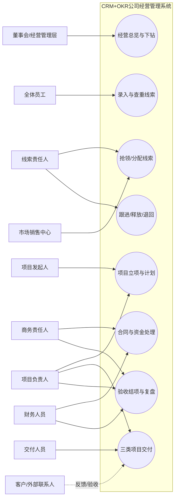
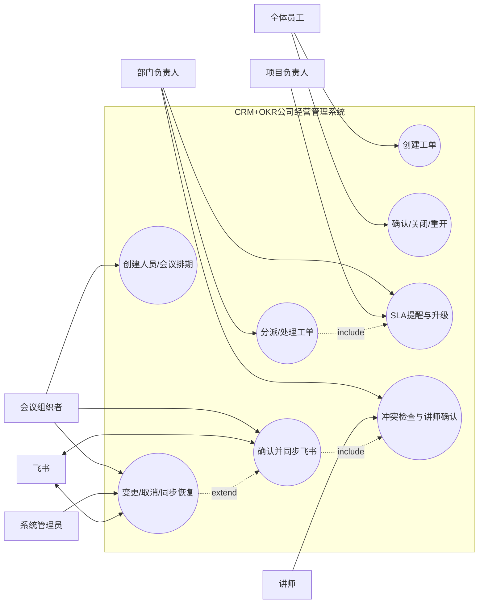
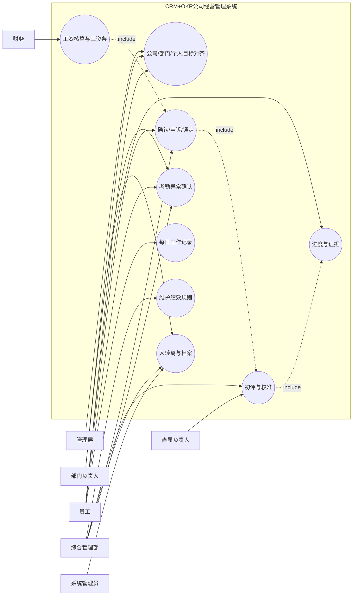
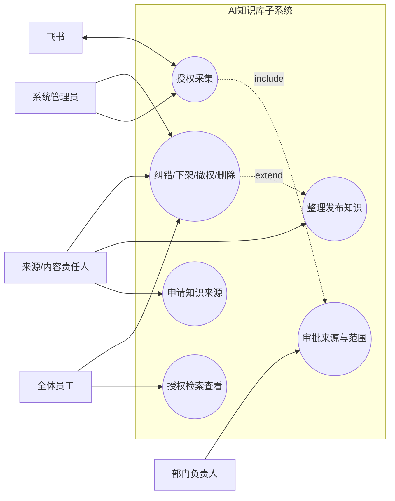

# CRM+OKR公司经营管理全域 - 用例分析

## 1. 基本信息

- **阶段**：B2.1 用例分析
- **分析对象**：单一公司主系统、线索池子系统和AI知识库子系统中的业务参与者与目标交互
- **标准输入**：A2干系人、A4用户旅程、A5用户故事、A6范围边界，以及B1.1至B1.6已验证业务模型
- **输入模式**：模式1：标准输入
- **分析日期**：2026-07-21
- **边界声明**：本产物定义Actor、用例目标、前后置条件、主/替代/异常流程和用例关系；不设计功能菜单、页面、按钮、接口或技术模块。

## 2. 系统边界

### 2.1 边界内

1. 主系统：客户经营、合同资金、项目交付、工单协作、排期、OKR绩效、工资、员工生命周期、每日工作和经营复盘。
2. 线索池子系统：全员录入、查重、普通线索开放抢领、重点商机分配、保护期、跟进、释放、退回和历史追溯。
3. AI知识库子系统：企业文件、授权飞书工作群和授权云文档的申请、授权、采集、治理、检索、反馈、撤权和删除。
4. 三个系统范围使用同一员工身份、组织关系和业务责任基线。

### 2.2 边界外

- 外部客户、合作方和外部联系人不登录系统，由内部责任人记录其确认和反馈。
- 不管理母子公司或多公司数据隔离。
- 不管理会议室、完整招聘候选人、供应链、法定会计总账税务、完整薪税社保申报和银行代发接口。
- 不采集飞书个人聊天。
- 除已确认飞书日历与授权知识来源外，其他系统集成在C6确认前不作为本阶段用例前提。

## 3. Actor定义

| Actor编号 | Actor | 类型 | 核心目标 | 说明 | 来源 |
|---|---|---|---|---|---|
| ACT-001 | 全体员工 | 通用主参与者 | 录入线索、执行目标任务、发起工单、记录工作和检索知识 | 其他内部岗位Actor均是员工的业务角色特化 | A2、A5 |
| ACT-002 | 董事会/经营管理层 | 管理角色 | 查看全公司经营、制定目标、协调重大资源和推动纠偏 | 不固化具体人员姓名 | A2、US-001、US-035 |
| ACT-003 | 部门负责人 | 管理角色 | 管理部门目标、员工、资源、项目、工单和排期 | 正式部门层级待C3权限阶段确认 | A2、US-002 |
| ACT-004 | 市场销售中心/线索管理角色 | 业务管理角色 | 配置线索开放、分配重点商机、处理客户和线索治理 | 使用角色名称，不预设最终岗位归属 | 已确认线索机制 |
| ACT-005 | 线索责任人 | 执行角色 | 抢领/接收、跟进、释放和转化本人线索 | 每个客户同一时点一个主负责人 | US-005、US-006、US-008 |
| ACT-006 | 商务责任人 | 执行角色 | 推进合同、收款协作、成交移交和客户确认 | 记录外部客户结论 | US-009、US-010 |
| ACT-007 | 财务人员 | 控制角色 | 审核合同、处理应收收款、核验成本利润和工资 | 具体细分权限由财务负责人后续分配 | US-011、US-028 |
| ACT-008 | 项目发起人 | 业务责任角色 | 发起项目、提出成员需求和确认业务结果 | 可由销售、商务或管理角色承担 | US-013 |
| ACT-009 | 项目负责人 | 交付管理角色 | 制定计划、推进交付、处理风险变更、验收结项 | 跨部门项目的主执行责任人 | US-015至US-020 |
| ACT-010 | 交付人员 | 执行角色 | 执行任务、提交成果、记录工时和参与验收 | 包括产品、研发、测试、运营、拍剪、主播等功能角色 | US-018、US-022 |
| ACT-011 | 讲师 | 专业交付角色 | 确认档期、执行培训/沙龙并记录投入结果 | 可参与项目或会议 | 已确认会议方案 |
| ACT-012 | 直属负责人 | 考核角色 | 按规则和证据完成员工绩效初评 | 不替代综合管理部校准 | US-026 |
| ACT-013 | 综合管理部 | 治理角色 | 维护绩效规则、校准申诉、管理员工生命周期和考勤 | 与财务职责分离 | US-027、US-040 |
| ACT-014 | 会议组织者 | 组织角色 | 创建、变更、取消会议并协调讲师和参与人 | 内部培训与外部沙龙创建权限不同 | US-041 |
| ACT-015 | 知识来源/内容责任人 | 知识治理角色 | 申请来源、授权范围、整理发布、纠错和下架 | 来源所有者和内容责任可由不同员工承担 | US-032、US-033 |
| ACT-016 | 系统管理员 | 支持角色 | 维护账号组织、执行知识接入、查看同步和操作历史 | 不替代业务授权 | US-037至US-039 |
| ACT-017 | 客户/外部联系人 | 外部次参与者 | 提供需求、付款事实、反馈、验收和会议参与信息 | 不直接登录，由内部人员记录结果 | A6、B1.1 |
| ACT-018 | 飞书 | 外部系统Actor | 返回授权内容与日历同步结果 | 只表达业务依赖，不定义接口 | B1.2、US-039、US-041 |

### 3.1 Actor泛化关系

- ACT-002至ACT-016均是ACT-001“全体员工”在特定业务情境中的角色特化。
- ACT-004可由获得线索管理授权的市场销售人员或管理角色承担。
- ACT-010“交付人员”可特化为产品交付、需求/产品、技术负责人、开发、测试、运维、售后、讲师、新媒体运营、拍剪、主播、投手和直播运营等功能角色。
- ACT-014“会议组织者”可特化为培训部/授权内部组织者和市场销售中心/授权业务组织者。

## 4. 用例总览

### 4.1 经营与员工工作

| 用例编号 | 用例名称 | 主Actor | 用例目标 | 触发/结果 | 用户故事 | 来源 |
|---|---|---|---|---|---|---|
| UC-MGT-001 | 查看全公司经营总览 | ACT-002 | 掌握销售、回款、交付、绩效、人员和协作状态 | 选择周期和范围；形成统一经营视图 | US-001、US-035 | A5、B1.1 |
| UC-MGT-002 | 下钻经营异常 | ACT-002 | 从异常指标定位部门、项目、员工和原始记录 | 选择异常；返回可追溯业务事实 | US-001、US-035 | A5、OPS规则 |
| UC-MGT-003 | 创建并跟踪纠偏行动 | ACT-002、ACT-003 | 把复盘问题转成有责任和期限的行动 | 确认异常；形成任务或工单并跟踪关闭 | US-001、US-002 | B1.1、B1.6 |
| UC-DEPT-001 | 查看部门执行总览 | ACT-003 | 掌握本部门目标、员工、项目、工单、排期和日报 | 进入部门范围；形成异常与负荷视图 | US-002 | A5 |
| UC-DEPT-002 | 协调部门资源与冲突 | ACT-003 | 处理人员负荷、项目和排期冲突 | 发现冲突；形成替代人员、时间或升级结论 | US-002、US-014、US-021 | B1.1、B1.5 |
| UC-EMP-001 | 查看个人工作总览 | ACT-001 | 汇总本人目标、任务、工单、会议、排期和考勤 | 员工开始工作；得到个人待办和异常 | US-003 | A5、B1.1 |
| UC-EMP-002 | 记录每日工作 | ACT-001 | 用最小填报记录今日工作、明日计划和产出引用 | 日终；形成每日工作记录 | US-029 | A5、HR-010 |
| UC-EMP-003 | 处理个人安排冲突 | ACT-001 | 对重叠任务、会议和排期发起协调 | 发现冲突；安排调整或升级 | US-003、US-021 | B1.1、B1.6 |

### 4.2 线索池与客户经营

| 用例编号 | 用例名称 | 主Actor | 用例目标 | 触发/结果 | 用户故事 | 来源 |
|---|---|---|---|---|---|---|
| UC-LEAD-001 | 录入新线索 | ACT-001 | 将潜在客户沉淀为公司资产 | 获得客户信息；形成待查重线索 | US-004 | A5 |
| UC-LEAD-002 | 查重并建立客户关系 | ACT-004 | 判断合并、同客户不同商机、疑似重复或新建 | 线索提交；形成客户/联系人/线索关系 | US-004 | LEAD-001至LEAD-005 |
| UC-LEAD-003 | 配置公共池开放规则 | ACT-004 | 设置开放时间和每批发放条数 | 管理规则；形成生效配置版本 | US-007 | 已确认Q-A1-017 |
| UC-LEAD-004 | 配置线索权限与分配原则 | ACT-002、ACT-004 | 控制普通抢领和重点商机分配 | 规则调整；形成授权范围 | US-007 | 已确认线索机制 |
| UC-LEAD-005 | 抢领普通公共线索 | ACT-005 | 在有效窗口公平获得客户机会 | 发起抢领；成为唯一主负责人或收到拒绝原因 | US-005 | LEAD-007至LEAD-013 |
| UC-LEAD-006 | 分配重点商机 | ACT-004 | 将重点客户交给确定主负责人 | 商机筛选完成；形成分配和保护期 | US-007 | LEAD-007、LEAD-010 |
| UC-LEAD-007 | 记录线索跟进 | ACT-005 | 保存沟通事实和下一步行动 | 完成沟通；形成有效跟进记录 | US-006 | LEAD-016至LEAD-019 |
| UC-LEAD-008 | 处理保护期提醒与延期 | ACT-005、ACT-004 | 防止线索因疏忽退回并处理持续谈判 | 达到提醒/到期；跟进、延期或退回 | US-008 | LEAD-018至LEAD-021 |
| UC-LEAD-009 | 手动释放本人线索 | ACT-005 | 主动放弃自己领取或被分配的线索 | 提交释放原因；线索回公共池 | US-005、US-008 | LEAD-014、LEAD-015 |
| UC-LEAD-010 | 自动退回超期线索 | ACT-004 | 释放未及时跟进或到期机会 | 命中退回规则；线索回公共池并留痕 | US-008 | LEAD-017至LEAD-020 |
| UC-LEAD-011 | 撤销错误合并 | ACT-004 | 恢复被误合并的客户/联系人和线索关系 | 确认误合并；恢复原关系并保留历史 | US-004 | 已确认Q-B1.6-001 |
| UC-LEAD-012 | 将成交线索移交商务与项目 | ACT-005、ACT-006 | 连续传递客户承诺、合同条件和交付信息 | 商机成交；形成完整成交移交 | US-009 | B1.1、B1.5 |
| UC-LEAD-013 | 校验公共线索抢领资格 | ACT-005 | 在抢领前校验窗口、权限、日限额和保护期上限 | 发起抢领；返回允许或明确拒绝原因 | US-005 | LEAD-009至LEAD-013 |

### 4.3 合同与财务

| 用例编号 | 用例名称 | 主Actor | 用例目标 | 触发/结果 | 用户故事 | 来源 |
|---|---|---|---|---|---|---|
| UC-FIN-001 | 建立并审核客户合同 | ACT-006、ACT-007 | 形成有效合同和交付范围 | 成交移交；合同生效或退回 | US-010、US-011 | FIN-001、FIN-002 |
| UC-FIN-002 | 建立应收计划 | ACT-006、ACT-007 | 将付款条件转成应收节点 | 合同审核；形成应收金额和日期 | US-010、US-011 | B1.3、B1.4 |
| UC-FIN-003 | 记录并核验收款 | ACT-007 | 形成可靠已收金额和项目启动依据 | 收到到账事实；核验通过或驳回 | US-011 | FIN-003 |
| UC-FIN-004 | 处理开票 | ACT-007 | 记录开票申请、完成、作废或红冲 | 业务申请；形成开票状态和凭证 | US-011 | B1.3、B1.4 |
| UC-FIN-005 | 处理退款 | ACT-007 | 管理退款原因、审批和财务影响 | 退款申请；形成完成/驳回结论 | US-011 | B1.3、B1.4 |
| UC-FIN-006 | 归集项目成本与利润 | ACT-007 | 形成项目经营财务结果 | 成本/收入确认；形成利润汇总 | US-011、US-012 | FIN-005 |
| UC-FIN-007 | 核验项目财务启动条件 | ACT-007 | 判断合同和收款是否允许正式交付 | 立项申请；返回满足/不满足/特批满足 | US-011、US-013 | FIN-006、FIN-007 |
| UC-FIN-008 | 跟踪应收逾期 | ACT-006、ACT-007 | 识别逾期并推动收款 | 应收到期；形成逾期或收清结论 | US-010至US-012 | FIN-004 |
| UC-FIN-009 | 更正财务业务记录 | ACT-007 | 修复错误金额并重算影响而不覆盖原记录 | 发现错误；形成更正版本 | US-011、US-012 | 已确认Q-B1.6-001 |
| UC-FIN-010 | 查看资金与利润分析 | ACT-002、ACT-007 | 按合同和项目追溯应收、实收、成本和利润 | 经营复盘；形成资金风险视图 | US-012、US-035 | A5、OPS规则 |

### 4.4 项目与分类交付

| 用例编号 | 用例名称 | 主Actor | 用例目标 | 触发/结果 | 用户故事 | 来源 |
|---|---|---|---|---|---|---|
| UC-PROJ-001 | 发起项目立项 | ACT-008 | 基于成交业务提出目标、范围、时间和成员需求 | 具备成交信息；形成立项申请 | US-013 | PROJ-001 |
| UC-PROJ-002 | 确认部门资源投入 | ACT-003 | 评估成员能力、负荷和排期并承诺资源 | 收到成员申请；同意、拒绝或替代 | US-014 | PROJ-003、PROJ-006 |
| UC-PROJ-003 | 确认项目负责人 | ACT-008、ACT-003、ACT-002 | 建立项目管理主责任 | 发起人提议；确认或重新提议 | US-013、US-015 | PROJ-004 |
| UC-PROJ-004 | 制定项目计划基线 | ACT-009 | 建立里程碑、任务、依赖、责任、工时和验收点 | 负责人确认；形成可执行基线 | US-015 | PROJ-005、PROJ-007 |
| UC-PROJ-005 | 分派并执行项目任务 | ACT-009、ACT-010 | 推进任务并提交成果和工时 | 项目启动；任务完成或暴露阻塞 | US-015、US-022 | B1.1、B1.4 |
| UC-PROJ-006 | 管理风险、问题与变更 | ACT-009 | 控制延期、资源和范围偏差 | 发现风险/新增需求；形成纠偏或新基线 | US-016 | PROJ-006、PROJ-008、PROJ-016 |
| UC-PROJ-007 | 执行AI产品销售交付 | ACT-009、ACT-010 | 完成开通/部署、指导、确认和售后承接 | 项目类型为AI产品；形成客户可用产品 | US-018 | PROJ-009 |
| UC-PROJ-008 | 执行AI定制开发交付 | ACT-009、ACT-010 | 完成需求、方案、开发、测试、上线和验收 | 项目类型为AI定制；形成上线成果 | US-019 | PROJ-010、PROJ-012 |
| UC-PROJ-009 | 执行自媒体代运营交付 | ACT-009、ACT-010 | 完成月度计划、内容生产、运营和复盘 | 项目类型为代运营；形成周期成果 | US-020 | PROJ-011 |
| UC-PROJ-010 | 提交和管理交付成果 | ACT-010、ACT-009 | 保存成果类型、引用、版本和状态 | 任务完成；形成可验收成果 | US-015、US-018至US-020 | B1.3、B1.4 |
| UC-PROJ-011 | 记录计划与实际工时 | ACT-010 | 支撑负荷、偏差、成本和绩效证据 | 计划或完成业务事项；形成工时记录 | US-022 | B1.4、SCH-014 |
| UC-PROJ-012 | 组织客户验收 | ACT-009、ACT-006 | 形成客户对成果范围的正式结论 | 成果提交；通过、整改或变更 | US-017至US-020 | PROJ-014、PROJ-016 |
| UC-PROJ-013 | 结项并核对财务 | ACT-009、ACT-008、ACT-007 | 确认业务结果、财务事项和遗留责任 | 验收通过；形成结项结论 | US-017 | PROJ-015 |
| UC-PROJ-014 | 复盘项目并沉淀经验 | ACT-009、ACT-003 | 识别范围、质量、进度和协作偏差 | 结项；形成纠偏和知识候选 | US-017 | B1.1、OPS-005 |
| UC-PROJ-015 | 管理售后与续约 | ACT-006、ACT-009、ACT-010 | 明确服务期限、问题入口和续约机会 | 项目完成；形成售后责任或续约线索 | US-017、US-018 | B1.1 |

### 4.5 跨部门工单

| 用例编号 | 用例名称 | 主Actor | 用例目标 | 触发/结果 | 用户故事 | 来源 |
|---|---|---|---|---|---|---|
| UC-WO-001 | 创建跨部门工单 | ACT-001 | 提出有目标部门、期限和验收标准的协作请求 | 产生协作需求；形成待分派工单 | US-030 | WO-001 |
| UC-WO-002 | 分派工单处理人 | ACT-003 | 为本部门工单确定处理责任 | 收到待分派工单；形成处理人 | US-031 | WO-002 |
| UC-WO-003 | 受理并处理工单 | ACT-010 | 在SLA内处理并提交成果 | 被分派；形成待确认结果 | US-030、US-031 | WO-002、WO-010 |
| UC-WO-004 | 转派或升级工单 | ACT-003、ACT-010 | 在能力不足、责任变化或超时时调整处理 | 触发转派/超时；形成新责任或升级 | US-031 | WO-007至WO-009 |
| UC-WO-005 | 确认并关闭工单 | ACT-001 | 验收处理结果并结束协作 | 处理人提交；关闭或退回处理 | US-030、US-031 | WO-003、WO-011 |
| UC-WO-006 | 评价跨部门服务 | ACT-001 | 对已关闭服务工单给出1至5分 | 工单关闭；形成满意度 | US-030 | WO-012 |
| UC-WO-007 | 重开工单 | ACT-001 | 在3个工作日内要求继续处理 | 关闭结果复发/不足；原工单重开 | US-030 | WO-013 |
| UC-WO-008 | 监控SLA与升级 | ACT-003、ACT-009 | 查看50%、80%提醒和超时影响 | 时限消耗；提醒或升级 | US-031 | WO-004至WO-008 |

### 4.6 人员、讲师与会议排期

| 用例编号 | 用例名称 | 主Actor | 用例目标 | 触发/结果 | 用户故事 | 来源 |
|---|---|---|---|---|---|---|
| UC-SCH-001 | 创建人员排期需求 | ACT-009、ACT-014 | 安排项目、培训、沙龙、直播或拍摄人员 | 业务需要人员；形成草稿排期 | US-021、US-041 | SCH-001 |
| UC-SCH-002 | 检查人员冲突与负荷 | ACT-003、ACT-014 | 识别重叠占用并协调替代 | 排期提交/变更；形成无冲突或待协调 | US-021 | SCH-005、SCH-006 |
| UC-SCH-003 | 确认讲师档期 | ACT-011 | 接受、拒绝或请求协调本人时间 | 收到待确认安排；形成确认结论 | US-021、US-041 | SCH-007 |
| UC-SCH-004 | 创建内部培训会议 | ACT-014 | 组织内部培训并关联讲师和内部参与人 | 培训需求；形成待确认会议 | US-041 | SCH-002 |
| UC-SCH-005 | 创建外部沙龙会议 | ACT-014 | 组织线下产品会议并记录外部联系人和地址 | 沙龙需求；形成待确认会议 | US-041 | SCH-003、SCH-004、SCH-011 |
| UC-SCH-006 | 确认会议并同步飞书 | ACT-014、ACT-018 | 在无冲突且讲师确认后保持一致日程 | 会议确认；创建飞书事件或记录失败 | US-041 | SCH-009、SCH-010、SCH-015至SCH-017 |
| UC-SCH-007 | 变更会议安排 | ACT-014、ACT-011 | 修改时间或讲师并重新确认 | 会议变化；更新原飞书事件 | US-041 | SCH-012、SCH-015 |
| UC-SCH-008 | 取消会议排期 | ACT-014 | 取消活动、释放人员并取消飞书事件 | 会议取消；占用释放并同步取消 | US-041 | SCH-013、SCH-018 |
| UC-SCH-009 | 处理飞书同步异常 | ACT-016、ACT-014 | 保留业务排期并恢复外部日历一致性 | 同步失败；重试并通知 | US-039、US-041 | SCH-016至SCH-020 |
| UC-SCH-010 | 完成活动并确认工时 | ACT-010、ACT-011、ACT-014 | 记录实际投入和业务结果 | 活动结束；排期完成并形成工时 | US-021、US-022、US-041 | SCH-014 |

### 4.7 OKR、绩效与工资

| 用例编号 | 用例名称 | 主Actor | 用例目标 | 触发/结果 | 用户故事 | 来源 |
|---|---|---|---|---|---|---|
| UC-PERF-001 | 维护绩效规则版本 | ACT-013 | 配置岗位KPI、OKR、协作权重和系数 | 新周期准备；规则生效或退回 | US-027、US-036 | PERF-003至PERF-007 |
| UC-PERF-002 | 制定公司月度目标 | ACT-002 | 明确公司经营方向 | 周期开始；形成公司目标 | US-023 | PERF-001、PERF-002 |
| UC-PERF-003 | 承接并分解部门目标 | ACT-003 | 对齐公司目标并形成部门责任 | 公司目标确认；形成部门目标 | US-024 | PERF-002 |
| UC-PERF-004 | 制定个人目标与KPI | ACT-001、ACT-003 | 确保员工目标对齐部门并适用岗位KPI | 部门目标/规则生效；形成个人考核项 | US-024、US-036 | PERF-002、PERF-004至PERF-006 |
| UC-PERF-005 | 更新目标进度与证据 | ACT-001 | 让绩效结果引用真实业务成果 | 周期执行；形成进度和证据 | US-025 | PERF-008、PERF-009 |
| UC-PERF-006 | 完成绩效初评 | ACT-012 | 按规则和证据形成有理由评分 | 周期评估；形成待校准结果 | US-026 | PERF-010 |
| UC-PERF-007 | 校准绩效结果 | ACT-013 | 处理尺度、证据、重复计分和特殊情况 | 初评完成；形成待员工确认结果 | US-027 | PERF-011 |
| UC-PERF-008 | 确认绩效结果 | ACT-001 | 让员工确认本人绩效结果或表达异议 | 员工查看评分；确认或发起申诉 | US-027 | PERF-012 |
| UC-PERF-009 | 处理一票否决 | ACT-012、ACT-013、ACT-002 | 对严重违规形成有证据的联合结论 | 提出否决；生效、撤销或进入申诉 | US-027 | PERF-013至PERF-015 |
| UC-PERF-010 | 锁定绩效结果 | ACT-013 | 形成财务可使用的最终绩效输入 | 校准和申诉完成；结果锁定 | US-027 | PERF-012、PAY-001 |
| UC-PERF-011 | 计算绩效工资系数 | ACT-013 | 按锁定评分和分档规则形成系数 | 结果锁定；形成0至1.2系数 | US-027、US-028 | B1.5系数决策表 |
| UC-PERF-012 | 处理绩效申诉 | ACT-001、ACT-013 | 对员工异议完成受理、复核和结案 | 员工不确认结果；维持或调整绩效结果 | US-027 | PERF-012至PERF-015 |
| UC-PAY-001 | 核算并复核工资 | ACT-007 | 将锁定绩效结果准确进入工资 | 收到锁定结果；形成已复核工资 | US-028 | PAY-001至PAY-005 |
| UC-PAY-002 | 记录工资发放并发布工资条 | ACT-007 | 在双方流程完成后向本人发布 | 发放完成；工资条向本人可见 | US-028 | PAY-006、PAY-007 |
| UC-PAY-003 | 更正工资结果与工资条 | ACT-007、ACT-013 | 对申诉或错误导致的结果变化形成更正版 | 发现差异；重算并发布更正版 | US-027、US-028 | PAY-008、Q-B1.6-001 |

### 4.8 员工生命周期与考勤

| 用例编号 | 用例名称 | 主Actor | 用例目标 | 触发/结果 | 用户故事 | 来源 |
|---|---|---|---|---|---|---|
| UC-HR-001 | 办理员工入职建档 | ACT-013 | 建立员工、部门岗位、劳动合同、档案和考勤身份 | 员工入职；形成有效基础数据 | US-040 | HR-001、HR-002 |
| UC-HR-002 | 维护劳动合同与员工档案 | ACT-013、ACT-001 | 保持合同和必要档案准确 | 信息变化/到期；形成新版本或待补 | US-040 | B1.1、B1.4 |
| UC-HR-003 | 办理员工转岗 | ACT-013、ACT-003 | 按生效时间切换组织关系和业务责任 | 转岗确认；新部门岗位生效 | US-040 | HR-004 |
| UC-HR-004 | 办理员工离职与责任交接 | ACT-013、ACT-003 | 移交业务责任并在确定时间停用账号 | 离职申请；完成交接和离职生效 | US-040 | HR-005至HR-007 |
| UC-HR-005 | 汇总员工考勤 | ACT-013 | 形成员工当期考勤事实 | 工作日结束/周期汇总；形成考勤记录 | US-040 | HR-008 |
| UC-HR-006 | 说明并确认考勤异常 | ACT-001、ACT-003、ACT-013 | 处理缺卡、外出等异常而不误入工资 | 出现异常；形成已确认或待处理结论 | US-040 | HR-008、HR-009 |
| UC-HR-007 | 调整变动后的业务关系 | ACT-013、ACT-003、ACT-016 | 同步目标、审批、排期和权限责任 | 转岗/离职生效；关系一致 | US-037、US-040 | HR-004至HR-006 |
| UC-HR-008 | 查看员工基础数据一致性 | ACT-013、ACT-016 | 发现账号、组织、绩效和工资人员基线差异 | 日常检查；形成纠正事项 | US-037、US-040 | B1.2、B1.6 |

### 4.9 AI知识库与系统治理

| 用例编号 | 用例名称 | 主Actor | 用例目标 | 触发/结果 | 用户故事 | 来源 |
|---|---|---|---|---|---|---|
| UC-KNOW-001 | 申请接入知识来源 | ACT-015 | 将企业文件、工作群或云文档提交授权 | 发现可沉淀来源；形成待审批申请 | US-032 | KNOW-001至KNOW-005 |
| UC-KNOW-002 | 审批知识来源与范围 | ACT-003、ACT-015 | 确认采集和最小查看范围 | 收到申请；批准、拒绝或待共同授权 | US-032 | KNOW-004、KNOW-005 |
| UC-KNOW-003 | 执行知识技术接入与采集 | ACT-016、ACT-018 | 在授权后采集且排除个人聊天 | 授权生效；形成采集状态和来源引用 | US-032、US-039 | KNOW-002、KNOW-006至KNOW-008 |
| UC-KNOW-004 | 整理并发布知识 | ACT-015 | 处理重复、失效和敏感内容并发布 | 采集完成；形成授权知识版本 | US-032、US-033 | KNOW-009、KNOW-010 |
| UC-KNOW-005 | 检索并查看授权知识 | ACT-001 | 获得有来源、版本和更新时间的可信内容 | 提交检索；返回授权结果或拒绝 | US-034 | KNOW-011、KNOW-012 |
| UC-KNOW-006 | 反馈并纠正知识 | ACT-001、ACT-015 | 处理错误、过期、重复或缺失内容 | 员工反馈；形成新版本、失效或下架 | US-033、US-034 | KNOW-013 |
| UC-KNOW-007 | 撤销知识来源授权 | ACT-015、ACT-003 | 停止新增采集并治理既有内容 | 来源撤权；停采并形成治理结论 | US-032、US-033 | KNOW-014 |
| UC-KNOW-008 | 删除知识来源或内容 | ACT-015、ACT-003、ACT-016 | 在合法确认后删除并保留治理轨迹 | 删除请求；执行或拒绝 | US-033 | KNOW-015、KNOW-016 |
| UC-KNOW-009 | 校验知识访问范围 | ACT-001 | 在返回知识前按员工、部门、岗位和指定授权过滤 | 发起检索；返回允许范围或拒绝 | US-034 | KNOW-011、KNOW-012 |
| UC-SYS-001 | 维护员工账号与组织基础 | ACT-016、ACT-013 | 让主系统和两个子系统使用一致身份 | 入转离/组织变化；账号关系一致 | US-037、US-040 | A5、HR规则 |
| UC-SYS-002 | 查看关键操作历史 | ACT-016、ACT-002 | 在争议时还原责任和变更过程 | 发生争议；返回权限内操作轨迹 | US-038 | OPS-006、OPS-007 |
| UC-SYS-003 | 监控知识来源与同步状态 | ACT-016 | 发现授权失效、采集失败或异常来源 | 状态异常；形成处理事项 | US-039 | KNOW规则、B1.6 |
| UC-SYS-004 | 监控飞书日历同步状态 | ACT-016 | 识别创建、更新或取消同步失败 | 同步异常；形成重试/通知记录 | US-039、US-041 | SCH-016至SCH-020 |

## 5. 用例关系

### 5.1 Include关系

| 主用例 | Include用例 | 关系说明 |
|---|---|---|
| UC-LEAD-001 录入新线索 | UC-LEAD-002 查重并建立客户关系 | 每条新线索先完成查重判断 |
| UC-LEAD-005 抢领公共线索 | UC-LEAD-013 校验抢领资格 | 检查开放窗口、权限、20条日限额和100条保护期上限 |
| UC-PROJ-001 发起项目 | UC-FIN-007、UC-PROJ-002、UC-PROJ-003 | 启动前必须完成财务、资源和负责人确认 |
| UC-PROJ-007至009 分类交付 | UC-PROJ-005、UC-PROJ-010、UC-PROJ-011、UC-PROJ-012 | 三类交付共同使用任务、成果、工时和验收 |
| UC-WO-003 处理工单 | UC-WO-008 监控SLA | 工单执行持续受SLA约束 |
| UC-SCH-006 确认会议并同步飞书 | UC-SCH-002、UC-SCH-003 | 确认前必须无冲突且讲师确认 |
| UC-PERF-006 初评 | UC-PERF-005 证据 | 评分必须基于有效证据 |
| UC-PERF-010 锁定结果 | UC-PERF-007、UC-PERF-008 | 校准和员工确认完成后才能锁定；存在申诉时还必须先结案 |
| UC-PAY-001 工资核算 | UC-PERF-010、UC-PERF-011 | 财务只读取锁定结果和确定系数 |
| UC-KNOW-003 技术接入 | UC-KNOW-001、UC-KNOW-002 | 只有申请和授权完成后才能采集 |
| UC-KNOW-005 授权检索 | UC-KNOW-009 校验知识访问范围 | 返回结果前必须执行权限过滤 |

### 5.2 Extend关系

| 基础用例 | Extend用例 | 扩展条件 |
|---|---|---|
| UC-MGT-001 查看经营总览 | UC-MGT-002 下钻经营异常 | 发现异常并需要定位原始业务事实 |
| UC-LEAD-002 查重 | UC-LEAD-011 撤销错误合并 | 合并后确认关系错误 |
| UC-LEAD-007 跟进线索 | UC-LEAD-008 保护期延期 | 持续谈判且原保护期未结束 |
| UC-LEAD-007 跟进线索 | UC-LEAD-009 手动释放 | 当前负责人主动放弃本人线索 |
| UC-LEAD-007 跟进线索 | UC-LEAD-010 自动退回 | 首次跟进、连续未跟进或保护期超时 |
| UC-PROJ-005 执行任务 | UC-PROJ-006 风险/变更 | 出现延期、资源冲突、问题或新增范围 |
| UC-WO-003 处理工单 | UC-WO-004 转派/升级 | 责任变化、能力不足或超时 |
| UC-WO-005 关闭工单 | UC-WO-007 重开 | 关闭后3个工作日内问题复发或结果不足 |
| UC-SCH-006 确认会议 | UC-SCH-007 变更、UC-SCH-008 取消 | 已确认会议发生变化或取消 |
| UC-SCH-006/007/008 | UC-SCH-009 同步异常处理 | 飞书创建、更新或取消失败 |
| UC-PERF-007 校准结果 | UC-PERF-009 一票否决 | 出现严重违规并有证据 |
| UC-PERF-008 确认绩效 | UC-PERF-012 处理绩效申诉 | 员工不认可结果 |
| UC-PAY-002 发布工资条 | UC-PAY-003 更正工资条 | 发布后发现错误或申诉改分 |
| UC-KNOW-004 发布知识 | UC-KNOW-006 纠错、UC-KNOW-007 撤权、UC-KNOW-008 删除 | 内容错误、来源撤权或合法删除请求 |

### 5.3 其他业务关联

| 上游用例 | 下游用例 | 关联说明 |
|---|---|---|
| UC-MGT-003 创建纠偏行动 | UC-WO-001或UC-PROJ-005 | 纠偏行动根据事项性质由工单或项目任务承接，不构成固定Include关系 |
| UC-LEAD-012 成交移交 | UC-FIN-001、UC-PROJ-001 | 成交移交为合同建立与项目发起提供输入，不代表后两者在同一用例内完成 |

### 5.4 用例泛化

| 通用用例 | 特化用例 | 说明 |
|---|---|---|
| 执行项目交付 | UC-PROJ-007 AI产品、UC-PROJ-008 AI定制、UC-PROJ-009自媒体代运营 | 共享任务、成果、排期、工时和验收，但阶段不同 |
| 创建会议排期 | UC-SCH-004内部培训、UC-SCH-005外部沙龙 | 创建授权、参与对象和通知方式不同 |
| 处理知识来源 | 企业文件、飞书工作群、飞书云文档来源处理 | 共享授权治理，采集方式不同 |
| 办理员工变动 | UC-HR-001入职、UC-HR-003转岗、UC-HR-004离职 | 共享员工基线和历史保留，生效动作不同 |

## 6. 核心用例规约

### UC-LEAD-005 抢领普通公共线索

| 项目 | 内容 |
|---|---|
| 目标 | 在线索开放窗口内取得一条普通公共线索的唯一主负责人资格 |
| 主Actor | 线索责任人 |
| 前置条件 | 员工具有抢领权限；处于配置开放窗口；当日成功抢领少于20条；保护期线索少于100条 |
| 触发 | 员工选择一条已开放普通线索发起抢领 |
| 主成功流程 | 1. 校验窗口和权限；2. 校验日限额与保护期上限；3. 校验线索仍在公共池；4. 设置员工为主负责人；5. 开始30天保护期；6. 保存操作历史 |
| 替代流程 | 线索已被他人先抢领时返回失败；达到20/100边界时返回对应原因；批次无可用线索时不产生结果 |
| 后置条件 | 成功时线索进入跟进中且客户主负责人唯一；失败时不改变任何责任和额度 |
| 关联规则/异常 | LEAD-007至LEAD-013；EX-LEAD-006至EX-LEAD-010 |
| 关联对象 | 员工、线索、客户、线索开放配置、操作历史 |

### UC-LEAD-007 记录线索跟进

| 项目 | 内容 |
|---|---|
| 目标 | 形成可追溯沟通事实并维持有效客户经营 |
| 主Actor | 线索责任人 |
| 前置条件 | 员工是当前主负责人；线索处于跟进中或有效保护期 |
| 触发 | 完成客户沟通或推进动作 |
| 主成功流程 | 1. 记录时间和沟通事实；2. 更新客户/商机判断；3. 记录下一步行动；4. 更新连续未跟进计算起点；5. 保存历史 |
| 替代流程 | 主动放弃时扩展UC-LEAD-009；持续谈判临近到期时扩展UC-LEAD-008；成交时进入UC-LEAD-012 |
| 异常流程 | 非本人修改被拒绝；无有效跟进达到2/7工作日或保护期到期时进入自动退回 |
| 后置条件 | 形成有效跟进、成交/流失结论或公共池退回 |
| 关联规则/异常 | LEAD-014至LEAD-021；EX-LEAD-011至EX-LEAD-016 |

### UC-PROJ-001 发起项目立项

| 项目 | 内容 |
|---|---|
| 目标 | 将成交业务转成财务条件、资源和责任明确的项目申请 |
| 主Actor | 项目发起人 |
| 次Actor | 财务、部门负责人、项目负责人确认角色 |
| 前置条件 | 已有客户、合同、付款条件、交付范围和联系人信息 |
| 触发 | 成交移交完成并需要启动交付 |
| 主成功流程 | 1. 引用客户合同和范围；2. 填写目标时间和成员需求；3. 财务核验；4. 部门确认资源；5. 确认项目负责人；6. 制定并确认计划基线；7. 进入执行 |
| 替代流程 | 部门提供替代成员或时间；财务形成特批满足结论；负责人重新提议 |
| 异常流程 | 财务不满足、资源冲突、负责人未确认或计划不完整时保持未启动 |
| 后置条件 | 项目形成执行基线，或立项退回/取消且原因可追溯 |
| 关联规则/异常 | PROJ-001至PROJ-008；EX-FIN-001至003；EX-PROJ-001至004 |

### UC-PROJ-006 管理风险、问题与变更

| 项目 | 内容 |
|---|---|
| 目标 | 让项目偏差在影响扩大前形成责任和纠偏结论 |
| 主Actor | 项目负责人 |
| 前置条件 | 项目执行中且存在风险、问题、延期、资源冲突或新增需求 |
| 主成功流程 | 1. 记录风险/问题；2. 判断范围内缺陷或新增需求；3. 分析进度、成本、资源和验收影响；4. 协调责任人；5. 确认纠偏或新基线；6. 跟踪关闭 |
| 替代流程 | 通过跨部门工单承接；资源无法协调时升级经营管理角色 |
| 异常流程 | 新增范围未经确认不得静默执行；原计划不得被新计划覆盖 |
| 后置条件 | 风险关闭、问题解决或项目基线完成受控变更 |
| 关联规则/异常 | PROJ-006、PROJ-008、PROJ-016；EX-PROJ-008、EX-PROJ-009 |

### UC-WO-001 创建跨部门工单

| 项目 | 内容 |
|---|---|
| 目标 | 将跨部门协作需求转成责任、时限和验收明确的业务事项 |
| 主Actor | 全体员工 |
| 前置条件 | 员工身份有效，协作需求属于公司业务范围 |
| 主成功流程 | 1. 选择目标部门和工单级别；2. 填写要求、期望结果和验收标准；3. 如属于项目则关联项目；4. 提交；5. 计算SLA；6. 进入待分派 |
| 替代流程 | 信息不足时保存草稿或补充后提交 |
| 异常流程 | 目标部门、要求、时间或验收标准缺失时不进入正式SLA |
| 后置条件 | 形成待分派工单及创建时规则版本 |
| 关联规则/异常 | WO-001、WO-004至WO-006；EX-WO-001 |

### UC-SCH-006 确认会议并同步飞书

| 项目 | 内容 |
|---|---|
| 目标 | 让系统排期、讲师档期和飞书日历形成一致会议安排 |
| 主Actor | 会议组织者 |
| 次Actor | 讲师、部门负责人、飞书、系统管理员 |
| 前置条件 | 组织者具备对应会议类型权限；人员冲突已处理；讲师已确认 |
| 主成功流程 | 1. 确认会议类型、时间、地址和参与人；2. 检查冲突；3. 获取讲师确认；4. 会议转已确认；5. 向飞书创建事件；6. 保存事件引用和同步结果 |
| 替代流程 | 外部联系人仅记录并由组织者线下通知；变更时重新确认并更新原事件 |
| 异常流程 | 同步失败保留已确认排期、标记失败、重试并通知；不得重复创建事件 |
| 后置条件 | 系统排期为业务主记录，飞书状态明确且可恢复 |
| 关联规则/异常 | SCH-001至SCH-020；EX-SCH-001至EX-SCH-010 |

### UC-PERF-010 锁定绩效结果

| 项目 | 内容 |
|---|---|
| 目标 | 形成财务可使用且可解释的最终月度绩效输入 |
| 主Actor | 综合管理部 |
| 前置条件 | 初评完成；校准完成；重复计分已处理；员工确认或申诉结案；一票否决完成必要确认 |
| 主成功流程 | 1. 校验规则版本和证据；2. 校验权重100%且客观数据至少50%；3. 确认申诉状态；4. 计算综合评分；5. 计算发放系数；6. 锁定并传递财务 |
| 替代流程 | 一票否决经确认时系数为0但保留评分；申诉改变结果时重新计算 |
| 异常流程 | 证据不足、规则失效、申诉未结或确认缺失时拒绝锁定 |
| 后置条件 | 结果已锁定并具有评分、理由、规则版本和系数 |
| 关联规则/异常 | PERF-001至PERF-016；EX-PERF-001至EX-PERF-012 |

### UC-PAY-002 记录工资发放并发布工资条

| 项目 | 内容 |
|---|---|
| 目标 | 在绩效和财务流程完成后安全发布个人工资结果 |
| 主Actor | 财务人员 |
| 前置条件 | 绩效结果已锁定；无未结申诉；工资已核算并复核通过 |
| 主成功流程 | 1. 确认锁定结果和系数；2. 确认固定工资未被绩效系数改变；3. 记录发放状态；4. 生成工资条；5. 只向本人发布；6. 保存处理记录 |
| 替代流程 | 发现错误时进入UC-PAY-003，发布更正版本并保留原版 |
| 异常流程 | 未锁定、未复核、越权查看或申诉未结时阻止发布 |
| 后置条件 | 工资条向本人可见，财务与绩效责任链可追溯 |
| 关联规则/异常 | PAY-001至PAY-009；EX-PAY-001至EX-PAY-008 |

### UC-HR-004 办理员工离职与责任交接

| 项目 | 内容 |
|---|---|
| 目标 | 在员工离职时连续移交业务责任并安全停用账号 |
| 主Actor | 综合管理部、部门负责人 |
| 前置条件 | 离职事项已提出并明确计划生效时间 |
| 主成功流程 | 1. 识别客户、线索、项目、任务、工单、会议和知识责任；2. 分配接收人；3. 接收人确认；4. 核对考勤和未结工资；5. 到生效时间停用账号和新业务权限；6. 保留历史责任 |
| 替代流程 | 存在未来排期时改派、取消或调整；接收人线索达到100条时拆分接收人 |
| 异常流程 | 未完成交接不得静默停用导致无人负责；已离职员工不得承接新业务 |
| 后置条件 | 员工已离职，账号状态与业务责任一致，历史记录保留 |
| 关联规则/异常 | HR-005至HR-007；EX-HR-004、EX-HR-005；EX-LEAD-017；EX-SCH-012 |

### UC-KNOW-001 申请接入知识来源

| 项目 | 内容 |
|---|---|
| 目标 | 让企业文件、工作群或云文档在合法责任和范围下进入知识治理 |
| 主Actor | 知识来源/内容责任人 |
| 前置条件 | 来源属于企业文件、飞书工作群或云文档；申请人具备来源责任 |
| 主成功流程 | 1. 选择来源类型；2. 声明所有者和业务范围；3. 提出采集范围和查看范围；4. 部门审批；5. 跨部门/敏感来源完成共同审批；6. 转技术接入 |
| 替代流程 | 历史回溯单独申请；普通部门来源无需共同审批 |
| 异常流程 | 个人聊天、无资格申请、未授权或范围超过来源权限时拒绝 |
| 后置条件 | 来源已授权并具备最小采集/查看范围，或申请被拒绝并留痕 |
| 关联规则/异常 | KNOW-001至KNOW-008；EX-KNOW-001至EX-KNOW-006 |

### UC-KNOW-005 检索并查看授权知识

| 项目 | 内容 |
|---|---|
| 目标 | 让员工快速获得可信且不越权的企业知识 |
| 主Actor | 全体员工 |
| 前置条件 | 员工身份有效；知识已发布；来源和内容授权有效 |
| 主成功流程 | 1. 提交检索意图；2. 按员工、部门、岗位和指定授权过滤；3. 返回知识内容；4. 展示来源、版本和更新时间；5. 员工查看或提交反馈 |
| 替代流程 | 无匹配内容时返回无结果；内容过期时进入反馈治理 |
| 异常流程 | 越权请求不返回内容；无来源/版本的内容不作为可信结果 |
| 后置条件 | 员工获得授权知识或明确无结果/无权限，访问过程可追溯 |
| 关联规则/异常 | KNOW-009至KNOW-013；EX-KNOW-007至EX-KNOW-010 |

## 7. 用例图

### 7.1 经营、线索、合同与项目

### 7.2 工单与排期会议

### 7.3 OKR、员工与工资

### 7.4 AI知识库

## 8. 用例与用户故事覆盖

| 用户故事范围 | 覆盖用例 | 覆盖结论 |
|---|---|---|
| US-001至US-003、US-035 | UC-MGT-001至003、UC-DEPT-001至002、UC-EMP-001至003 | 管理层、部门和员工工作视角均覆盖 |
| US-004至US-009 | UC-LEAD-001至013 | 录入、查重、配置、抢领资格、跟进、释放、退回和成交移交均覆盖 |
| US-010至US-012 | UC-FIN-001至010 | 合同、应收、收款、开票、退款、成本利润和分析均覆盖 |
| US-013至US-020、US-022 | UC-PROJ-001至015 | 立项、资源、计划、三类交付、工时、验收、结项和售后均覆盖 |
| US-021、US-041 | UC-SCH-001至010 | 讲师/人员排期、内外会议和飞书同步均覆盖 |
| US-023至US-028、US-036 | UC-PERF-001至012、UC-PAY-001至003 | 目标对齐、证据、评分、校准申诉、系数和工资条均覆盖 |
| US-029 | UC-EMP-002 | 今日工作、明日计划和产出引用覆盖 |
| US-030至US-031 | UC-WO-001至008 | 创建、分派、处理、SLA、确认、评价和重开均覆盖 |
| US-032至US-034、US-039 | UC-KNOW-001至009、UC-SYS-003 | 来源授权、采集、治理、检索权限和同步监控均覆盖 |
| US-037至US-038、US-040 | UC-SYS-001至002、UC-HR-001至008 | 账号组织、操作历史、员工生命周期和考勤均覆盖 |

## 9. 用例到对象与行为的下游输入

| 用例域 | 候选业务对象 | 关键行为 |
|---|---|---|
| 线索客户 | 客户、联系人、线索、跟进、保护期、开放配置 | 查重、合并、抢领、分配、释放、退回、转化 |
| 合同财务 | 合同、应收计划、收款、开票、退款、项目财务汇总 | 审核、核验、逾期、更正、启动判断 |
| 项目交付 | 项目、角色分配、里程碑、任务、成果、验收、风险变更 | 立项、计划、执行、提交、确认、整改、结项 |
| 工单 | 工单、流转记录、SLA、满意度 | 分派、受理、转派、升级、确认、关闭、重开 |
| 排期会议 | 排期、会议、参与人、日历同步、工时 | 冲突检查、确认、同步、变更、取消、完成 |
| 绩效工资 | 周期、规则、目标、KPI、证据、结果、申诉、工资、工资条 | 对齐、评分、校准、申诉、锁定、计算、复核、发布、更正 |
| 员工管理 | 员工、部门、岗位、合同、变动、考勤、每日工作 | 入职、转岗、离职、交接、确认、记录 |
| 知识治理 | 来源、内容、版本、反馈、授权范围 | 申请、审批、采集、发布、检索、纠错、撤权、删除 |

## 10. 推定说明

- 本阶段未新增需要用户确认的业务流程、权限、状态或计算规则。
- Actor泛化、用例include/extend关系及用例分组均为对已验证用户故事和B1业务模型的分析表达，不改变业务范围。
- “查看关键操作历史”继续引用已存在的全域审计推定主题，不新增审计权限。
