# CRM+OKR公司管理系统 - 系统功能分析

## 1 基本信息

| 项目 | 内容 |
|---|---|
| 系统名称 | CRM+OKR公司管理系统 |
| 系统范围说明 | 单一公司统一入口，覆盖经营看板、全公司线索池、客户合同资金、三类项目交付、跨部门工单、人员与会议排期、OKR绩效工资、员工生命周期及AI知识库；不包含外部客户登录、多公司隔离、完整招聘、供应链、法定总账税务、个人聊天采集和会议室管理。 |
| 分析时间 | 2026-07-22 |

## 2 功能总览

**L0 系统能力**：CRM+OKR公司经营与执行一体化能力

让单一公司围绕客户、资金、项目、员工、目标、协作、时间和知识形成可执行、可验收、可追溯的经营闭环。

### 2.1 功能能力域

| 编号 | 功能能力域 | 说明 | L2模块数 | L3功能项数 |
|---|---|---|---:|---:|
| 4.1 | 经营态势识别与执行纠偏 | 让管理层、部门负责人和员工从统一业务事实识别偏差并形成行动。 | 3 | 8 |
| 4.2 | 客户机会沉淀与转化推进 | 把全员发现的机会转为可查重、可分配、可保护、可跟进和可移交的公司资产。 | 4 | 13 |
| 4.3 | 合同资金履约与风险识别 | 连接合同、应收、实收、票据、退款、成本利润和项目启动条件。 | 3 | 10 |
| 4.4 | 项目承诺形成与交付控制 | 让成交业务形成资源可承诺、计划可执行、成果可验收的项目闭环。 | 5 | 15 |
| 4.5 | 跨部门请求响应与闭环 | 让临时协作请求具备明确责任、SLA、成果确认和服务评价。 | 2 | 8 |
| 4.6 | 人员时间协调与会议履约 | 统一讲师、主播及交付人员占用，并保持会议安排与飞书日历一致。 | 3 | 10 |
| 4.7 | 目标绩效评定与薪酬衔接 | 把公司到个人目标、证据评分、校准申诉和绩效工资结果连接成月度闭环。 | 4 | 15 |
| 4.8 | 员工身份建立与履职连续 | 保持入转离、劳动合同、档案、考勤和业务责任使用一致员工基线。 | 3 | 8 |
| 4.9 | 授权知识沉淀与可信应用 | 把企业文件、授权工作群和云文档沉淀为可治理、可追溯、按权检索的知识。 | 3 | 9 |
| 4.10 | 统一身份运行与责任追溯 | 保障主系统、线索池和AI知识库使用一致身份，并提供关键运行状态和争议追溯入口。 | 3 | 4 |

### 2.2 可验收功能项总表

| 编号 | 功能项 | 类型 | 业务可见性 | 所属能力域 | 所属模块 | 描述 |
|---|---|---|---|---|---|---|
| 4.1.1.1 | 查看全公司经营总览 | 统计分析功能 | 用户可见 | 经营态势识别与执行纠偏 | 公司经营洞察与纠偏 | 掌握销售、回款、交付、绩效、人员和协作状态 |
| 4.1.1.2 | 下钻经营异常 | 统计分析功能 | 用户可见 | 经营态势识别与执行纠偏 | 公司经营洞察与纠偏 | 从异常指标定位部门、项目、员工和原始记录 |
| 4.1.1.3 | 创建并跟踪纠偏行动 | 用户交互功能 | 用户可见 | 经营态势识别与执行纠偏 | 公司经营洞察与纠偏 | 把复盘问题转成有责任和期限的行动 |
| 4.1.2.1 | 查看部门执行总览 | 统计分析功能 | 用户可见 | 经营态势识别与执行纠偏 | 部门执行与资源协调 | 掌握本部门目标、员工、项目、工单、排期和日报 |
| 4.1.2.2 | 协调部门资源与冲突 | 用户交互功能 | 用户可见 | 经营态势识别与执行纠偏 | 部门执行与资源协调 | 处理人员负荷、项目和排期冲突 |
| 4.1.3.1 | 查看个人工作总览 | 用户交互功能 | 用户可见 | 经营态势识别与执行纠偏 | 个人工作聚合与冲突处理 | 汇总本人目标、任务、工单、会议、排期和考勤 |
| 4.1.3.2 | 记录每日工作 | 用户交互功能 | 用户可见 | 经营态势识别与执行纠偏 | 个人工作聚合与冲突处理 | 用最小填报记录今日工作、明日计划和产出引用 |
| 4.1.3.3 | 处理个人安排冲突 | 用户交互功能 | 用户可见 | 经营态势识别与执行纠偏 | 个人工作聚合与冲突处理 | 对重叠任务、会议和排期发起协调 |
| 4.2.1.1 | 录入新线索 | 用户交互功能 | 用户可见 | 客户机会沉淀与转化推进 | 线索沉淀与关系确认 | 将潜在客户沉淀为公司资产 |
| 4.2.1.2 | 查重并建立客户关系 | 用户交互功能 | 用户可见 | 客户机会沉淀与转化推进 | 线索沉淀与关系确认 | 判断合并、同客户不同商机、疑似重复或新建 |
| 4.2.1.3 | 撤销错误合并 | 用户交互功能 | 用户可见 | 客户机会沉淀与转化推进 | 线索沉淀与关系确认 | 恢复被误合并的客户/联系人和线索关系 |
| 4.2.2.1 | 配置公共池开放规则 | 配置管理功能 | 用户可见 | 客户机会沉淀与转化推进 | 公共池配置与责任取得 | 设置开放时间和每批发放条数 |
| 4.2.2.2 | 配置线索权限与分配原则 | 配置管理功能 | 用户可见 | 客户机会沉淀与转化推进 | 公共池配置与责任取得 | 控制普通抢领和重点商机分配 |
| 4.2.2.3 | 抢领普通公共线索 | 用户交互功能 | 用户可见 | 客户机会沉淀与转化推进 | 公共池配置与责任取得 | 在有效窗口公平获得客户机会 |
| 4.2.2.4 | 分配重点商机 | 用户交互功能 | 用户可见 | 客户机会沉淀与转化推进 | 公共池配置与责任取得 | 将重点客户交给确定主负责人 |
| 4.2.2.5 | 公共线索抢领资格判断 | 系统自动功能 | 系统自动但业务可验收 | 客户机会沉淀与转化推进 | 公共池配置与责任取得 | 在抢领前校验窗口、权限、日限额和保护期上限 |
| 4.2.3.1 | 记录线索跟进 | 用户交互功能 | 用户可见 | 客户机会沉淀与转化推进 | 保护期推进与机会释放 | 保存沟通事实和下一步行动 |
| 4.2.3.2 | 处理保护期提醒与延期 | 用户交互功能 | 用户可见 | 客户机会沉淀与转化推进 | 保护期推进与机会释放 | 防止线索因疏忽退回并处理持续谈判 |
| 4.2.3.3 | 手动释放本人线索 | 用户交互功能 | 用户可见 | 客户机会沉淀与转化推进 | 保护期推进与机会释放 | 主动放弃自己领取或被分配的线索 |
| 4.2.3.4 | 自动退回超期线索 | 系统自动功能 | 系统自动但业务可验收 | 客户机会沉淀与转化推进 | 保护期推进与机会释放 | 释放未及时跟进或到期机会 |
| 4.2.4.1 | 将成交线索移交商务与项目 | 用户交互功能 | 用户可见 | 客户机会沉淀与转化推进 | 成交信息连续移交 | 连续传递客户承诺、合同条件和交付信息 |
| 4.3.1.1 | 建立并审核客户合同 | 用户交互功能 | 用户可见 | 合同资金履约与风险识别 | 合同与应收承诺形成 | 形成有效合同和交付范围 |
| 4.3.1.2 | 建立应收计划 | 用户交互功能 | 用户可见 | 合同资金履约与风险识别 | 合同与应收承诺形成 | 将付款条件转成应收节点 |
| 4.3.1.3 | 核验项目财务启动条件 | 用户交互功能 | 用户可见 | 合同资金履约与风险识别 | 合同与应收承诺形成 | 判断合同和收款是否允许正式交付 |
| 4.3.2.1 | 记录并核验收款 | 用户交互功能 | 用户可见 | 合同资金履约与风险识别 | 资金业务处理与更正 | 形成可靠已收金额和项目启动依据 |
| 4.3.2.2 | 处理开票 | 用户交互功能 | 用户可见 | 合同资金履约与风险识别 | 资金业务处理与更正 | 记录开票申请、完成、作废或红冲 |
| 4.3.2.3 | 处理退款 | 用户交互功能 | 用户可见 | 合同资金履约与风险识别 | 资金业务处理与更正 | 管理退款原因、审批和财务影响 |
| 4.3.2.4 | 更正财务业务记录 | 用户交互功能 | 用户可见 | 合同资金履约与风险识别 | 资金业务处理与更正 | 修复错误金额并重算影响而不覆盖原记录 |
| 4.3.3.1 | 归集项目成本与利润 | 用户交互功能 | 用户可见 | 合同资金履约与风险识别 | 资金风险与项目利润洞察 | 形成项目经营财务结果 |
| 4.3.3.2 | 跟踪应收逾期 | 用户交互功能 | 用户可见 | 合同资金履约与风险识别 | 资金风险与项目利润洞察 | 识别逾期并推动收款 |
| 4.3.3.3 | 查看资金与利润分析 | 统计分析功能 | 用户可见 | 合同资金履约与风险识别 | 资金风险与项目利润洞察 | 按合同和项目追溯应收、实收、成本和利润 |
| 4.4.1.1 | 发起项目立项 | 用户交互功能 | 用户可见 | 项目承诺形成与交付控制 | 立项责任与资源承诺 | 基于成交业务提出目标、范围、时间和成员需求 |
| 4.4.1.2 | 确认部门资源投入 | 用户交互功能 | 用户可见 | 项目承诺形成与交付控制 | 立项责任与资源承诺 | 评估成员能力、负荷和排期并承诺资源 |
| 4.4.1.3 | 确认项目负责人 | 用户交互功能 | 用户可见 | 项目承诺形成与交付控制 | 立项责任与资源承诺 | 建立项目管理主责任 |
| 4.4.2.1 | 制定项目计划基线 | 用户交互功能 | 用户可见 | 项目承诺形成与交付控制 | 计划基线与执行偏差控制 | 建立里程碑、任务、依赖、责任、工时和验收点 |
| 4.4.2.2 | 分派并执行项目任务 | 用户交互功能 | 用户可见 | 项目承诺形成与交付控制 | 计划基线与执行偏差控制 | 推进任务并提交成果和工时 |
| 4.4.2.3 | 管理风险、问题与变更 | 用户交互功能 | 用户可见 | 项目承诺形成与交付控制 | 计划基线与执行偏差控制 | 控制延期、资源和范围偏差 |
| 4.4.3.1 | 执行AI产品销售交付 | 用户交互功能 | 用户可见 | 项目承诺形成与交付控制 | 分类交付过程承载 | 完成开通/部署、指导、确认和售后承接 |
| 4.4.3.2 | 执行AI定制开发交付 | 用户交互功能 | 用户可见 | 项目承诺形成与交付控制 | 分类交付过程承载 | 完成需求、方案、开发、测试、上线和验收 |
| 4.4.3.3 | 执行自媒体代运营交付 | 用户交互功能 | 用户可见 | 项目承诺形成与交付控制 | 分类交付过程承载 | 完成月度计划、内容生产、运营和复盘 |
| 4.4.4.1 | 提交和管理交付成果 | 用户交互功能 | 用户可见 | 项目承诺形成与交付控制 | 成果工时与客户验收 | 保存成果类型、引用、版本和状态 |
| 4.4.4.2 | 记录计划与实际工时 | 用户交互功能 | 用户可见 | 项目承诺形成与交付控制 | 成果工时与客户验收 | 支撑负荷、偏差、成本和绩效证据 |
| 4.4.4.3 | 组织客户验收 | 用户交互功能 | 用户可见 | 项目承诺形成与交付控制 | 成果工时与客户验收 | 形成客户对成果范围的正式结论 |
| 4.4.5.1 | 结项并核对财务 | 用户交互功能 | 用户可见 | 项目承诺形成与交付控制 | 结项复盘与售后延续 | 确认业务结果、财务事项和遗留责任 |
| 4.4.5.2 | 复盘项目并沉淀经验 | 用户交互功能 | 用户可见 | 项目承诺形成与交付控制 | 结项复盘与售后延续 | 识别范围、质量、进度和协作偏差 |
| 4.4.5.3 | 管理售后与续约 | 用户交互功能 | 用户可见 | 项目承诺形成与交付控制 | 结项复盘与售后延续 | 明确服务期限、问题入口和续约机会 |
| 4.5.1.1 | 创建跨部门工单 | 用户交互功能 | 用户可见 | 跨部门请求响应与闭环 | 协作请求受理与交付 | 提出有目标部门、期限和验收标准的协作请求 |
| 4.5.1.2 | 分派工单处理人 | 用户交互功能 | 用户可见 | 跨部门请求响应与闭环 | 协作请求受理与交付 | 为本部门工单确定处理责任 |
| 4.5.1.3 | 受理并处理工单 | 用户交互功能 | 用户可见 | 跨部门请求响应与闭环 | 协作请求受理与交付 | 在SLA内处理并提交成果 |
| 4.5.1.4 | 转派或升级工单 | 用户交互功能 | 用户可见 | 跨部门请求响应与闭环 | 协作请求受理与交付 | 在能力不足、责任变化或超时时调整处理 |
| 4.5.1.5 | 确认并关闭工单 | 用户交互功能 | 用户可见 | 跨部门请求响应与闭环 | 协作请求受理与交付 | 验收处理结果并结束协作 |
| 4.5.2.1 | 评价跨部门服务 | 用户交互功能 | 用户可见 | 跨部门请求响应与闭环 | 服务质量与时限监督 | 对已关闭服务工单给出1至5分 |
| 4.5.2.2 | 重开工单 | 用户交互功能 | 用户可见 | 跨部门请求响应与闭环 | 服务质量与时限监督 | 在3个工作日内要求继续处理 |
| 4.5.2.3 | 监控SLA与升级 | 用户交互功能 | 用户可见 | 跨部门请求响应与闭环 | 服务质量与时限监督 | 查看50%、80%提醒和超时影响 |
| 4.6.1.1 | 创建人员排期需求 | 用户交互功能 | 用户可见 | 人员时间协调与会议履约 | 人员排期承诺与冲突协调 | 安排项目、培训、沙龙、直播或拍摄人员 |
| 4.6.1.2 | 检查人员冲突与负荷 | 用户交互功能 | 用户可见 | 人员时间协调与会议履约 | 人员排期承诺与冲突协调 | 识别重叠占用并协调替代 |
| 4.6.1.3 | 确认讲师档期 | 用户交互功能 | 用户可见 | 人员时间协调与会议履约 | 人员排期承诺与冲突协调 | 接受、拒绝或请求协调本人时间 |
| 4.6.2.1 | 创建内部培训会议 | 用户交互功能 | 用户可见 | 人员时间协调与会议履约 | 培训与沙龙会议安排 | 组织内部培训并关联讲师和内部参与人 |
| 4.6.2.2 | 创建外部沙龙会议 | 用户交互功能 | 用户可见 | 人员时间协调与会议履约 | 培训与沙龙会议安排 | 组织线下产品会议并记录外部联系人和地址 |
| 4.6.2.3 | 确认会议并同步飞书 | 外部集成功能 | 用户可见 | 人员时间协调与会议履约 | 培训与沙龙会议安排 | 在无冲突且讲师确认后保持一致日程 |
| 4.6.2.4 | 变更会议安排 | 外部集成功能 | 用户可见 | 人员时间协调与会议履约 | 培训与沙龙会议安排 | 修改时间或讲师并重新确认 |
| 4.6.2.5 | 取消会议排期 | 外部集成功能 | 用户可见 | 人员时间协调与会议履约 | 培训与沙龙会议安排 | 取消活动、释放人员并取消飞书事件 |
| 4.6.3.1 | 处理飞书同步异常 | 外部集成功能 | 用户可见 | 人员时间协调与会议履约 | 日历异常恢复与活动完结 | 保留业务排期并恢复外部日历一致性 |
| 4.6.3.2 | 完成活动并确认工时 | 用户交互功能 | 用户可见 | 人员时间协调与会议履约 | 日历异常恢复与活动完结 | 记录实际投入和业务结果 |
| 4.7.1.1 | 维护绩效规则版本 | 配置管理功能 | 用户可见 | 目标绩效评定与薪酬衔接 | 规则版本与目标逐级对齐 | 配置岗位KPI、OKR、协作权重和系数 |
| 4.7.1.2 | 制定公司月度目标 | 用户交互功能 | 用户可见 | 目标绩效评定与薪酬衔接 | 规则版本与目标逐级对齐 | 明确公司经营方向 |
| 4.7.1.3 | 承接并分解部门目标 | 用户交互功能 | 用户可见 | 目标绩效评定与薪酬衔接 | 规则版本与目标逐级对齐 | 对齐公司目标并形成部门责任 |
| 4.7.1.4 | 制定个人目标与KPI | 用户交互功能 | 用户可见 | 目标绩效评定与薪酬衔接 | 规则版本与目标逐级对齐 | 确保员工目标对齐部门并适用岗位KPI |
| 4.7.2.1 | 更新目标进度与证据 | 用户交互功能 | 用户可见 | 目标绩效评定与薪酬衔接 | 证据评分与结果校准 | 让绩效结果引用真实业务成果 |
| 4.7.2.2 | 完成绩效初评 | 用户交互功能 | 用户可见 | 目标绩效评定与薪酬衔接 | 证据评分与结果校准 | 按规则和证据形成有理由评分 |
| 4.7.2.3 | 校准绩效结果 | 用户交互功能 | 用户可见 | 目标绩效评定与薪酬衔接 | 证据评分与结果校准 | 处理尺度、证据、重复计分和特殊情况 |
| 4.7.2.4 | 确认绩效结果 | 用户交互功能 | 用户可见 | 目标绩效评定与薪酬衔接 | 证据评分与结果校准 | 让员工确认本人绩效结果或表达异议 |
| 4.7.2.5 | 处理一票否决 | 用户交互功能 | 用户可见 | 目标绩效评定与薪酬衔接 | 证据评分与结果校准 | 对严重违规形成有证据的联合结论 |
| 4.7.3.1 | 锁定绩效结果 | 用户交互功能 | 用户可见 | 目标绩效评定与薪酬衔接 | 结果锁定系数与申诉 | 形成财务可使用的最终绩效输入 |
| 4.7.3.2 | 计算绩效工资系数 | 系统自动功能 | 系统自动但业务可验收 | 目标绩效评定与薪酬衔接 | 结果锁定系数与申诉 | 按锁定评分和分档规则形成系数 |
| 4.7.3.3 | 处理绩效申诉 | 用户交互功能 | 用户可见 | 目标绩效评定与薪酬衔接 | 结果锁定系数与申诉 | 对员工异议完成受理、复核和结案 |
| 4.7.4.1 | 工资核算与结果确认 | 用户交互功能 | 用户可见 | 目标绩效评定与薪酬衔接 | 工资结果形成与员工送达 | 将锁定绩效结果准确进入工资 |
| 4.7.4.2 | 记录工资发放并发布工资条 | 用户交互功能 | 用户可见 | 目标绩效评定与薪酬衔接 | 工资结果形成与员工送达 | 在双方流程完成后向本人发布 |
| 4.7.4.3 | 更正工资结果与工资条 | 用户交互功能 | 用户可见 | 目标绩效评定与薪酬衔接 | 工资结果形成与员工送达 | 对申诉或错误导致的结果变化形成更正版 |
| 4.8.1.1 | 办理员工入职建档 | 用户交互功能 | 用户可见 | 员工身份建立与履职连续 | 员工关系建立与变动 | 建立员工、部门岗位、劳动合同、档案和考勤身份 |
| 4.8.1.2 | 维护劳动合同与员工档案 | 用户交互功能 | 用户可见 | 员工身份建立与履职连续 | 员工关系建立与变动 | 保持合同和必要档案准确 |
| 4.8.1.3 | 办理员工转岗 | 用户交互功能 | 用户可见 | 员工身份建立与履职连续 | 员工关系建立与变动 | 按生效时间切换组织关系和业务责任 |
| 4.8.1.4 | 办理员工离职与责任交接 | 用户交互功能 | 用户可见 | 员工身份建立与履职连续 | 员工关系建立与变动 | 移交业务责任并在确定时间停用账号 |
| 4.8.2.1 | 汇总员工考勤 | 系统自动功能 | 系统自动但业务可验收 | 员工身份建立与履职连续 | 考勤事实与异常确认 | 形成员工当期考勤事实 |
| 4.8.2.2 | 说明并确认考勤异常 | 用户交互功能 | 用户可见 | 员工身份建立与履职连续 | 考勤事实与异常确认 | 处理缺卡、外出等异常而不误入工资 |
| 4.8.3.1 | 调整变动后的业务关系 | 用户交互功能 | 用户可见 | 员工身份建立与履职连续 | 业务关系调整与一致性检查 | 同步目标、审批、排期和权限责任 |
| 4.8.3.2 | 查看员工基础数据一致性 | 用户交互功能 | 用户可见 | 员工身份建立与履职连续 | 业务关系调整与一致性检查 | 发现账号、组织、绩效和工资人员基线差异 |
| 4.9.1.1 | 申请接入知识来源 | 用户交互功能 | 用户可见 | 授权知识沉淀与可信应用 | 知识来源授权与采集 | 将企业文件、工作群或云文档提交授权 |
| 4.9.1.2 | 审批知识来源与范围 | 用户交互功能 | 用户可见 | 授权知识沉淀与可信应用 | 知识来源授权与采集 | 确认采集和最小查看范围 |
| 4.9.1.3 | 执行知识技术接入与采集 | 外部集成功能 | 用户可见 | 授权知识沉淀与可信应用 | 知识来源授权与采集 | 在授权后采集且排除个人聊天 |
| 4.9.2.1 | 整理并发布知识 | 用户交互功能 | 用户可见 | 授权知识沉淀与可信应用 | 知识整理与持续治理 | 处理重复、失效和敏感内容并发布 |
| 4.9.2.2 | 反馈并纠正知识 | 用户交互功能 | 用户可见 | 授权知识沉淀与可信应用 | 知识整理与持续治理 | 处理错误、过期、重复或缺失内容 |
| 4.9.2.3 | 撤销知识来源授权 | 用户交互功能 | 用户可见 | 授权知识沉淀与可信应用 | 知识整理与持续治理 | 停止新增采集并治理既有内容 |
| 4.9.2.4 | 删除知识来源或内容 | 用户交互功能 | 用户可见 | 授权知识沉淀与可信应用 | 知识整理与持续治理 | 在合法确认后删除并保留治理轨迹 |
| 4.9.3.1 | 检索并查看授权知识 | 用户交互功能 | 用户可见 | 授权知识沉淀与可信应用 | 授权检索与来源追溯 | 获得有来源、版本和更新时间的可信内容 |
| 4.9.3.2 | 知识访问范围判定 | 用户交互功能 | 用户可见 | 授权知识沉淀与可信应用 | 授权检索与来源追溯 | 在返回知识前按员工、部门、岗位和指定授权过滤 |
| 4.10.1.1 | 维护员工账号与组织基础 | 配置管理功能 | 用户可见 | 统一身份运行与责任追溯 | 统一身份与组织关系 | 让主系统和两个子系统使用一致身份 |
| 4.10.2.1 | 查看关键操作历史 | 用户交互功能 | 用户可见 | 统一身份运行与责任追溯 | 关键操作责任追溯 | 在争议时还原责任和变更过程 |
| 4.10.3.1 | 监控知识来源与同步状态 | 系统自动功能 | 系统自动但业务可验收 | 统一身份运行与责任追溯 | 外部同步运行监督 | 发现授权失效、采集失败或异常来源 |
| 4.10.3.2 | 监控飞书日历同步状态 | 系统自动功能 | 系统自动但业务可验收 | 统一身份运行与责任追溯 | 外部同步运行监督 | 识别创建、更新或取消同步失败 |

## 3 能力协作

### 3.1 功能架构图

```mermaid
graph TB
  L0["CRM+OKR公司经营管理统一能力"]
  L0 --> L1_1["经营态势识别与执行纠偏"]
  L1_1 --> L2_1_1["公司经营洞察与纠偏"]
  L1_1 --> L2_1_2["部门执行与资源协调"]
  L1_1 --> L2_1_3["个人工作聚合与冲突处理"]
  L0 --> L1_2["客户机会沉淀与转化推进"]
  L1_2 --> L2_2_1["线索沉淀与关系确认"]
  L1_2 --> L2_2_2["公共池配置与责任取得"]
  L1_2 --> L2_2_3["保护期推进与机会释放"]
  L1_2 --> L2_2_4["成交信息连续移交"]
  L0 --> L1_3["合同资金履约与风险识别"]
  L1_3 --> L2_3_1["合同与应收承诺形成"]
  L1_3 --> L2_3_2["资金业务处理与更正"]
  L1_3 --> L2_3_3["资金风险与项目利润洞察"]
  L0 --> L1_4["项目承诺形成与交付控制"]
  L1_4 --> L2_4_1["立项责任与资源承诺"]
  L1_4 --> L2_4_2["计划基线与执行偏差控制"]
  L1_4 --> L2_4_3["分类交付过程承载"]
  L1_4 --> L2_4_4["成果工时与客户验收"]
  L1_4 --> L2_4_5["结项复盘与售后延续"]
  L0 --> L1_5["跨部门请求响应与闭环"]
  L1_5 --> L2_5_1["协作请求受理与交付"]
  L1_5 --> L2_5_2["服务质量与时限监督"]
  L0 --> L1_6["人员时间协调与会议履约"]
  L1_6 --> L2_6_1["人员排期承诺与冲突协调"]
  L1_6 --> L2_6_2["培训与沙龙会议安排"]
  L1_6 --> L2_6_3["日历异常恢复与活动完结"]
  L0 --> L1_7["目标绩效评定与薪酬衔接"]
  L1_7 --> L2_7_1["规则版本与目标逐级对齐"]
  L1_7 --> L2_7_2["证据评分与结果校准"]
  L1_7 --> L2_7_3["结果锁定系数与申诉"]
  L1_7 --> L2_7_4["工资结果形成与员工送达"]
  L0 --> L1_8["员工身份建立与履职连续"]
  L1_8 --> L2_8_1["员工关系建立与变动"]
  L1_8 --> L2_8_2["考勤事实与异常确认"]
  L1_8 --> L2_8_3["业务关系调整与一致性检查"]
  L0 --> L1_9["授权知识沉淀与可信应用"]
  L1_9 --> L2_9_1["知识来源授权与采集"]
  L1_9 --> L2_9_2["知识整理与持续治理"]
  L1_9 --> L2_9_3["授权检索与来源追溯"]
  L0 --> L1_10["统一身份运行与责任追溯"]
  L1_10 --> L2_10_1["统一身份与组织关系"]
  L1_10 --> L2_10_2["关键操作责任追溯"]
  L1_10 --> L2_10_3["外部同步运行监督"]
  L1_2 --> L1_3
  L1_3 --> L1_4
  L1_4 --> L1_5
  L1_4 --> L1_6
  L1_4 --> L1_7
  L1_8 --> L1_7
  L1_9 --> L1_1
  L1_10 --> L1_2
  L1_10 --> L1_9
```

### 3.2 系统能力定位

以统一身份、统一业务对象和完整操作轨迹连接售前、交付、组织执行、绩效工资和知识沉淀，使管理层可掌控、负责人可协调、员工可执行。

### 3.3 能力域职责

| 能力域 | 职责 | 来源 |
|---|---|---|
| 经营态势识别与执行纠偏 | 让管理层、部门负责人和员工从统一业务事实识别偏差并形成行动。 | 上游产物 |
| 客户机会沉淀与转化推进 | 把全员发现的机会转为可查重、可分配、可保护、可跟进和可移交的公司资产。 | 上游产物 |
| 合同资金履约与风险识别 | 连接合同、应收、实收、票据、退款、成本利润和项目启动条件。 | 上游产物 |
| 项目承诺形成与交付控制 | 让成交业务形成资源可承诺、计划可执行、成果可验收的项目闭环。 | 上游产物 |
| 跨部门请求响应与闭环 | 让临时协作请求具备明确责任、SLA、成果确认和服务评价。 | 上游产物 |
| 人员时间协调与会议履约 | 统一讲师、主播及交付人员占用，并保持会议安排与飞书日历一致。 | 上游产物 |
| 目标绩效评定与薪酬衔接 | 把公司到个人目标、证据评分、校准申诉和绩效工资结果连接成月度闭环。 | 上游产物 |
| 员工身份建立与履职连续 | 保持入转离、劳动合同、档案、考勤和业务责任使用一致员工基线。 | 上游产物 |
| 授权知识沉淀与可信应用 | 把企业文件、授权工作群和云文档沉淀为可治理、可追溯、按权检索的知识。 | 上游产物 |
| 统一身份运行与责任追溯 | 保障主系统、线索池和AI知识库使用一致身份，并提供关键运行状态和争议追溯入口。 | 上游产物 |

### 3.4 能力域间协作

- 客户机会沉淀与转化推进向合同资金履约与风险识别传递成交承诺。
- 合同资金履约与风险识别向项目承诺形成与交付控制提供合同和启动条件。
- 项目交付按需调用跨部门请求响应和人员时间协调能力。
- 项目、工单、目标、考勤和日常工作结果共同形成绩效证据。
- 员工身份变化驱动责任交接，并在后续权限阶段约束实际访问范围。
- 可复用交付与复盘内容进入授权知识沉淀，经营洞察读取统一业务事实。

### 3.5 外部系统集成

| 系统名称 | 接口类型 | 数据流向 | 交互说明 |
|---|---|---|---|
| 飞书知识来源 | 授权采集边界，具体协议在C6确定 | 飞书工作群和云文档→AI知识库 | 仅采集获批工作群和云文档，不采集个人聊天；失败状态可查看。 |
| 飞书日历 | 日历事件同步边界，具体协议在C6确定 | 会议排期↔飞书日历 | 创建、变更、取消保持同一事件，失败不丢失内部排期并支持恢复。 |

## 4 功能明细

### 4.1 经营态势识别与执行纠偏

让管理层、部门负责人和员工从统一业务事实识别偏差并形成行动。

#### 4.1.1 公司经营洞察与纠偏

承载公司经营洞察与纠偏相关用户任务和业务结果。

规则与处理要求：

| 编号 | 类型 | 要求 | 归属说明 |
|---|---|---|---|
| R-4.1.1-001 | 业务规则与状态约束 | 按已确认业务规则、对象状态、责任边界和异常恢复方案处理；不得覆盖既有历史记录。 | 来源于B1.5决策与业务规则、B1.6异常边界和B2.4生命周期状态。 |

| 编号 | 功能项 | 类型 | 业务可见性 | 描述 | 验收要点 | 功能交互属性 | 来源摘要 |
|---|---|---|---|---|---|---|---|
| 4.1.1.1 | 查看全公司经营总览 | 统计分析功能 | 用户可见 | 掌握销售、回款、交付、绩效、人员和协作状态 | 选择周期和范围；形成统一经营视图；操作、状态变化和责任轨迹可追溯 | 用户可执行操作: 查看全公司经营总览、查看处理结果与历史记录；业务状态: 正常、预警、异常、已纠偏；反馈要求: 成功时反馈业务结果和当前状态、失败、待处理、冲突或无权限时反馈原因与可采取动作；异常结果: 显示规则不满足、状态冲突、数据缺失或无权限的明确原因；是否需要页面承载: 是 | 用户故事: US-001、US-035；业务过程: B1.1公司经营与执行闭环及对应子流程；用例: UC-MGT-001；业务对象: 项目、项目财务汇总、目标、绩效结果、工单、审计记录；业务规则: A5、B1.1；状态生命周期: B2.4 MGT相关对象生命周期 |
| 4.1.1.2 | 下钻经营异常 | 统计分析功能 | 用户可见 | 从异常指标定位部门、项目、员工和原始记录 | 选择异常；返回可追溯业务事实；操作、状态变化和责任轨迹可追溯 | 用户可执行操作: 下钻经营异常、查看处理结果与历史记录；业务状态: 正常、预警、异常、已纠偏；反馈要求: 成功时反馈业务结果和当前状态、失败、待处理、冲突或无权限时反馈原因与可采取动作；异常结果: 显示规则不满足、状态冲突、数据缺失或无权限的明确原因；是否需要页面承载: 是 | 用户故事: US-001、US-035；业务过程: B1.1公司经营与执行闭环及对应子流程；用例: UC-MGT-002；业务对象: 项目、项目财务汇总、目标、绩效结果、工单、审计记录；业务规则: A5、OPS规则；状态生命周期: B2.4 MGT相关对象生命周期 |
| 4.1.1.3 | 创建并跟踪纠偏行动 | 用户交互功能 | 用户可见 | 把复盘问题转成有责任和期限的行动 | 确认异常；形成任务或工单并跟踪关闭；操作、状态变化和责任轨迹可追溯 | 用户可执行操作: 创建并跟踪纠偏行动、查看处理结果与历史记录；业务状态: 正常、预警、异常、已纠偏；反馈要求: 成功时反馈业务结果和当前状态、失败、待处理、冲突或无权限时反馈原因与可采取动作；异常结果: 显示规则不满足、状态冲突、数据缺失或无权限的明确原因；是否需要页面承载: 是 | 用户故事: US-001、US-002；业务过程: B1.1公司经营与执行闭环及对应子流程；用例: UC-MGT-003；业务对象: 项目、项目财务汇总、目标、绩效结果、工单、审计记录；业务规则: B1.1、B1.6；状态生命周期: B2.4 MGT相关对象生命周期 |

#### 4.1.2 部门执行与资源协调

承载部门执行与资源协调相关用户任务和业务结果。

规则与处理要求：

| 编号 | 类型 | 要求 | 归属说明 |
|---|---|---|---|
| R-4.1.2-001 | 业务规则与状态约束 | 按已确认业务规则、对象状态、责任边界和异常恢复方案处理；不得覆盖既有历史记录。 | 来源于B1.5决策与业务规则、B1.6异常边界和B2.4生命周期状态。 |

| 编号 | 功能项 | 类型 | 业务可见性 | 描述 | 验收要点 | 功能交互属性 | 来源摘要 |
|---|---|---|---|---|---|---|---|
| 4.1.2.1 | 查看部门执行总览 | 统计分析功能 | 用户可见 | 掌握本部门目标、员工、项目、工单、排期和日报 | 进入部门范围；形成异常与负荷视图；操作、状态变化和责任轨迹可追溯 | 用户可执行操作: 查看部门执行总览、查看处理结果与历史记录；业务状态: 正常、预警、冲突待协调；反馈要求: 成功时反馈业务结果和当前状态、失败、待处理、冲突或无权限时反馈原因与可采取动作；异常结果: 显示规则不满足、状态冲突、数据缺失或无权限的明确原因；是否需要页面承载: 是 | 用户故事: US-002；业务过程: B1.1公司经营与执行闭环及对应子流程；用例: UC-DEPT-001；业务对象: 部门、员工、项目、工单、排期、目标、每日工作记录；业务规则: A5；状态生命周期: B2.4 DEPT相关对象生命周期 |
| 4.1.2.2 | 协调部门资源与冲突 | 用户交互功能 | 用户可见 | 处理人员负荷、项目和排期冲突 | 发现冲突；形成替代人员、时间或升级结论；操作、状态变化和责任轨迹可追溯 | 用户可执行操作: 协调部门资源与冲突、查看处理结果与历史记录；业务状态: 正常、预警、冲突待协调；反馈要求: 成功时反馈业务结果和当前状态、失败、待处理、冲突或无权限时反馈原因与可采取动作；异常结果: 显示规则不满足、状态冲突、数据缺失或无权限的明确原因；是否需要页面承载: 是 | 用户故事: US-002、US-014、US-021；业务过程: B1.1公司经营与执行闭环及对应子流程；用例: UC-DEPT-002；业务对象: 部门、员工、项目、工单、排期、目标、每日工作记录；业务规则: B1.1、B1.5；状态生命周期: B2.4 DEPT相关对象生命周期 |

#### 4.1.3 个人工作聚合与冲突处理

承载个人工作聚合与冲突处理相关用户任务和业务结果。

规则与处理要求：

| 编号 | 类型 | 要求 | 归属说明 |
|---|---|---|---|
| R-4.1.3-001 | 业务规则与状态约束 | 按已确认业务规则、对象状态、责任边界和异常恢复方案处理；不得覆盖既有历史记录。 | 来源于B1.5决策与业务规则、B1.6异常边界和B2.4生命周期状态。 |

| 编号 | 功能项 | 类型 | 业务可见性 | 描述 | 验收要点 | 功能交互属性 | 来源摘要 |
|---|---|---|---|---|---|---|---|
| 4.1.3.1 | 查看个人工作总览 | 用户交互功能 | 用户可见 | 汇总本人目标、任务、工单、会议、排期和考勤 | 员工开始工作；得到个人待办和异常；操作、状态变化和责任轨迹可追溯 | 用户可执行操作: 查看个人工作总览、查看处理结果与历史记录；业务状态: 待办、进行中、待确认、已完成、异常；反馈要求: 成功时反馈业务结果和当前状态、失败、待处理、冲突或无权限时反馈原因与可采取动作；异常结果: 显示规则不满足、状态冲突、数据缺失或无权限的明确原因；是否需要页面承载: 是 | 用户故事: US-003；业务过程: B1.1公司经营与执行闭环及对应子流程；用例: UC-EMP-001；业务对象: 员工、每日工作记录、项目任务、工单、排期、目标、考勤记录；业务规则: A5、B1.1；状态生命周期: B2.4 EMP相关对象生命周期 |
| 4.1.3.2 | 记录每日工作 | 用户交互功能 | 用户可见 | 用最小填报记录今日工作、明日计划和产出引用 | 日终；形成每日工作记录；操作、状态变化和责任轨迹可追溯 | 用户可执行操作: 记录每日工作、查看处理结果与历史记录；业务状态: 待办、进行中、待确认、已完成、异常；反馈要求: 成功时反馈业务结果和当前状态、失败、待处理、冲突或无权限时反馈原因与可采取动作；异常结果: 显示规则不满足、状态冲突、数据缺失或无权限的明确原因；是否需要页面承载: 是 | 用户故事: US-029；业务过程: B1.1公司经营与执行闭环及对应子流程；用例: UC-EMP-002；业务对象: 员工、每日工作记录、项目任务、工单、排期、目标、考勤记录；业务规则: A5、HR-010；状态生命周期: B2.4 EMP相关对象生命周期 |
| 4.1.3.3 | 处理个人安排冲突 | 用户交互功能 | 用户可见 | 对重叠任务、会议和排期发起协调 | 发现冲突；安排调整或升级；操作、状态变化和责任轨迹可追溯 | 用户可执行操作: 处理个人安排冲突、查看处理结果与历史记录；业务状态: 待办、进行中、待确认、已完成、异常；反馈要求: 成功时反馈业务结果和当前状态、失败、待处理、冲突或无权限时反馈原因与可采取动作；异常结果: 显示规则不满足、状态冲突、数据缺失或无权限的明确原因；是否需要页面承载: 是 | 用户故事: US-003、US-021；业务过程: B1.1公司经营与执行闭环及对应子流程；用例: UC-EMP-003；业务对象: 员工、每日工作记录、项目任务、工单、排期、目标、考勤记录；业务规则: B1.1、B1.6；状态生命周期: B2.4 EMP相关对象生命周期 |

### 4.2 客户机会沉淀与转化推进

把全员发现的机会转为可查重、可分配、可保护、可跟进和可移交的公司资产。

#### 4.2.1 线索沉淀与关系确认

承载线索沉淀与关系确认相关用户任务和业务结果。

规则与处理要求：

| 编号 | 类型 | 要求 | 归属说明 |
|---|---|---|---|
| R-4.2.1-001 | 业务规则与状态约束 | 按已确认业务规则、对象状态、责任边界和异常恢复方案处理；不得覆盖既有历史记录。 | 来源于B1.5决策与业务规则、B1.6异常边界和B2.4生命周期状态。 |

| 编号 | 功能项 | 类型 | 业务可见性 | 描述 | 验收要点 | 功能交互属性 | 来源摘要 |
|---|---|---|---|---|---|---|---|
| 4.2.1.1 | 录入新线索 | 用户交互功能 | 用户可见 | 将潜在客户沉淀为公司资产 | 获得客户信息；形成待查重线索；操作、状态变化和责任轨迹可追溯 | 用户可执行操作: 录入新线索、查看处理结果与历史记录；业务状态: 待查重、公共池、保护跟进中、延期保护中、已成交、已流失；反馈要求: 成功时反馈业务结果和当前状态、失败、待处理、冲突或无权限时反馈原因与可采取动作；异常结果: 显示规则不满足、状态冲突、数据缺失或无权限的明确原因；是否需要页面承载: 是 | 用户故事: US-004；业务过程: B1.1公司经营与执行闭环及对应子流程；用例: UC-LEAD-001；业务对象: 客户、联系人、线索、线索跟进；业务规则: A5；状态生命周期: B2.4 LEAD相关对象生命周期 |
| 4.2.1.2 | 查重并建立客户关系 | 用户交互功能 | 用户可见 | 判断合并、同客户不同商机、疑似重复或新建 | 线索提交；形成客户/联系人/线索关系；操作、状态变化和责任轨迹可追溯 | 用户可执行操作: 查重并建立客户关系、查看处理结果与历史记录；业务状态: 待查重、公共池、保护跟进中、延期保护中、已成交、已流失；反馈要求: 成功时反馈业务结果和当前状态、失败、待处理、冲突或无权限时反馈原因与可采取动作；异常结果: 显示规则不满足、状态冲突、数据缺失或无权限的明确原因；是否需要页面承载: 是 | 用户故事: US-004；业务过程: B1.1公司经营与执行闭环及对应子流程；用例: UC-LEAD-002；业务对象: 客户、联系人、线索、线索跟进；业务规则: LEAD-001至LEAD-005；状态生命周期: B2.4 LEAD相关对象生命周期 |
| 4.2.1.3 | 撤销错误合并 | 用户交互功能 | 用户可见 | 恢复被误合并的客户/联系人和线索关系 | 确认误合并；恢复原关系并保留历史；操作、状态变化和责任轨迹可追溯 | 用户可执行操作: 撤销错误合并、查看处理结果与历史记录；业务状态: 待查重、公共池、保护跟进中、延期保护中、已成交、已流失；反馈要求: 成功时反馈业务结果和当前状态、失败、待处理、冲突或无权限时反馈原因与可采取动作；异常结果: 显示规则不满足、状态冲突、数据缺失或无权限的明确原因；是否需要页面承载: 是 | 用户故事: US-004；业务过程: B1.1公司经营与执行闭环及对应子流程；用例: UC-LEAD-011；业务对象: 客户、联系人、线索、线索跟进；业务规则: 已确认Q-B1.6-001；状态生命周期: B2.4 LEAD相关对象生命周期 |

#### 4.2.2 公共池配置与责任取得

承载公共池配置与责任取得相关用户任务和业务结果。

规则与处理要求：

| 编号 | 类型 | 要求 | 归属说明 |
|---|---|---|---|
| R-4.2.2-001 | 业务规则与状态约束 | 按已确认业务规则、对象状态、责任边界和异常恢复方案处理；不得覆盖既有历史记录。 | 来源于B1.5决策与业务规则、B1.6异常边界和B2.4生命周期状态。 |

| 编号 | 功能项 | 类型 | 业务可见性 | 描述 | 验收要点 | 功能交互属性 | 来源摘要 |
|---|---|---|---|---|---|---|---|
| 4.2.2.1 | 配置公共池开放规则 | 配置管理功能 | 用户可见 | 设置开放时间和每批发放条数 | 管理规则；形成生效配置版本；操作、状态变化和责任轨迹可追溯 | 用户可执行操作: 配置公共池开放规则、查看处理结果与历史记录；业务状态: 待查重、公共池、保护跟进中、延期保护中、已成交、已流失；反馈要求: 成功时反馈业务结果和当前状态、失败、待处理、冲突或无权限时反馈原因与可采取动作；异常结果: 显示规则不满足、状态冲突、数据缺失或无权限的明确原因；是否需要页面承载: 是 | 用户故事: US-007；业务过程: B1.1公司经营与执行闭环及对应子流程；用例: UC-LEAD-003；业务对象: 客户、联系人、线索、线索跟进；业务规则: 已确认Q-A1-017；状态生命周期: B2.4 LEAD相关对象生命周期 |
| 4.2.2.2 | 配置线索权限与分配原则 | 配置管理功能 | 用户可见 | 控制普通抢领和重点商机分配 | 规则调整；形成授权范围；操作、状态变化和责任轨迹可追溯 | 用户可执行操作: 配置线索权限与分配原则、查看处理结果与历史记录；业务状态: 待查重、公共池、保护跟进中、延期保护中、已成交、已流失；反馈要求: 成功时反馈业务结果和当前状态、失败、待处理、冲突或无权限时反馈原因与可采取动作；异常结果: 显示规则不满足、状态冲突、数据缺失或无权限的明确原因；是否需要页面承载: 是 | 用户故事: US-007；业务过程: B1.1公司经营与执行闭环及对应子流程；用例: UC-LEAD-004；业务对象: 客户、联系人、线索、线索跟进；业务规则: 已确认线索机制；状态生命周期: B2.4 LEAD相关对象生命周期 |
| 4.2.2.3 | 抢领普通公共线索 | 用户交互功能 | 用户可见 | 在有效窗口公平获得客户机会 | 发起抢领；成为唯一主负责人或收到拒绝原因；操作、状态变化和责任轨迹可追溯 | 用户可执行操作: 抢领普通公共线索、查看处理结果与历史记录；业务状态: 待查重、公共池、保护跟进中、延期保护中、已成交、已流失；反馈要求: 成功时反馈业务结果和当前状态、失败、待处理、冲突或无权限时反馈原因与可采取动作；异常结果: 显示规则不满足、状态冲突、数据缺失或无权限的明确原因；是否需要页面承载: 是 | 用户故事: US-005；业务过程: B1.1公司经营与执行闭环及对应子流程；用例: UC-LEAD-005；业务对象: 客户、联系人、线索、线索跟进；业务规则: LEAD-007至LEAD-013；状态生命周期: B2.4 LEAD相关对象生命周期 |
| 4.2.2.4 | 分配重点商机 | 用户交互功能 | 用户可见 | 将重点客户交给确定主负责人 | 商机筛选完成；形成分配和保护期；操作、状态变化和责任轨迹可追溯 | 用户可执行操作: 分配重点商机、查看处理结果与历史记录；业务状态: 待查重、公共池、保护跟进中、延期保护中、已成交、已流失；反馈要求: 成功时反馈业务结果和当前状态、失败、待处理、冲突或无权限时反馈原因与可采取动作；异常结果: 显示规则不满足、状态冲突、数据缺失或无权限的明确原因；是否需要页面承载: 是 | 用户故事: US-007；业务过程: B1.1公司经营与执行闭环及对应子流程；用例: UC-LEAD-006；业务对象: 客户、联系人、线索、线索跟进；业务规则: LEAD-007、LEAD-010；状态生命周期: B2.4 LEAD相关对象生命周期 |
| 4.2.2.5 | 公共线索抢领资格判断 | 系统自动功能 | 系统自动但业务可验收 | 在抢领前校验窗口、权限、日限额和保护期上限 | 发起抢领；返回允许或明确拒绝原因；操作、状态变化和责任轨迹可追溯 | 用户可执行操作: 查看执行状态与处理记录；业务状态: 待查重、公共池、保护跟进中、延期保护中、已成交、已流失；反馈要求: 成功时反馈业务结果和当前状态、失败、待处理、冲突或无权限时反馈原因与可采取动作；异常结果: 显示规则不满足、状态冲突、数据缺失或无权限的明确原因；是否需要页面承载: 是 | 用户故事: US-005；业务过程: B1.1公司经营与执行闭环及对应子流程；用例: UC-LEAD-013；业务对象: 客户、联系人、线索、线索跟进；业务规则: LEAD-009至LEAD-013；状态生命周期: B2.4 LEAD相关对象生命周期 |

#### 4.2.3 保护期推进与机会释放

承载保护期推进与机会释放相关用户任务和业务结果。

规则与处理要求：

| 编号 | 类型 | 要求 | 归属说明 |
|---|---|---|---|
| R-4.2.3-001 | 业务规则与状态约束 | 按已确认业务规则、对象状态、责任边界和异常恢复方案处理；不得覆盖既有历史记录。 | 来源于B1.5决策与业务规则、B1.6异常边界和B2.4生命周期状态。 |

| 编号 | 功能项 | 类型 | 业务可见性 | 描述 | 验收要点 | 功能交互属性 | 来源摘要 |
|---|---|---|---|---|---|---|---|
| 4.2.3.1 | 记录线索跟进 | 用户交互功能 | 用户可见 | 保存沟通事实和下一步行动 | 完成沟通；形成有效跟进记录；操作、状态变化和责任轨迹可追溯 | 用户可执行操作: 记录线索跟进、查看处理结果与历史记录；业务状态: 待查重、公共池、保护跟进中、延期保护中、已成交、已流失；反馈要求: 成功时反馈业务结果和当前状态、失败、待处理、冲突或无权限时反馈原因与可采取动作；异常结果: 显示规则不满足、状态冲突、数据缺失或无权限的明确原因；是否需要页面承载: 是 | 用户故事: US-006；业务过程: B1.1公司经营与执行闭环及对应子流程；用例: UC-LEAD-007；业务对象: 客户、联系人、线索、线索跟进；业务规则: LEAD-016至LEAD-019；状态生命周期: B2.4 LEAD相关对象生命周期 |
| 4.2.3.2 | 处理保护期提醒与延期 | 用户交互功能 | 用户可见 | 防止线索因疏忽退回并处理持续谈判 | 达到提醒/到期；跟进、延期或退回；操作、状态变化和责任轨迹可追溯 | 用户可执行操作: 处理保护期提醒与延期、查看处理结果与历史记录；业务状态: 待查重、公共池、保护跟进中、延期保护中、已成交、已流失；反馈要求: 成功时反馈业务结果和当前状态、失败、待处理、冲突或无权限时反馈原因与可采取动作；异常结果: 显示规则不满足、状态冲突、数据缺失或无权限的明确原因；是否需要页面承载: 是 | 用户故事: US-008；业务过程: B1.1公司经营与执行闭环及对应子流程；用例: UC-LEAD-008；业务对象: 客户、联系人、线索、线索跟进；业务规则: LEAD-018至LEAD-021；状态生命周期: B2.4 LEAD相关对象生命周期 |
| 4.2.3.3 | 手动释放本人线索 | 用户交互功能 | 用户可见 | 主动放弃自己领取或被分配的线索 | 提交释放原因；线索回公共池；操作、状态变化和责任轨迹可追溯 | 用户可执行操作: 手动释放本人线索、查看处理结果与历史记录；业务状态: 待查重、公共池、保护跟进中、延期保护中、已成交、已流失；反馈要求: 成功时反馈业务结果和当前状态、失败、待处理、冲突或无权限时反馈原因与可采取动作；异常结果: 显示规则不满足、状态冲突、数据缺失或无权限的明确原因；是否需要页面承载: 是 | 用户故事: US-005、US-008；业务过程: B1.1公司经营与执行闭环及对应子流程；用例: UC-LEAD-009；业务对象: 客户、联系人、线索、线索跟进；业务规则: LEAD-014、LEAD-015；状态生命周期: B2.4 LEAD相关对象生命周期 |
| 4.2.3.4 | 自动退回超期线索 | 系统自动功能 | 系统自动但业务可验收 | 释放未及时跟进或到期机会 | 命中退回规则；线索回公共池并留痕；操作、状态变化和责任轨迹可追溯 | 用户可执行操作: 查看执行状态与处理记录；业务状态: 待查重、公共池、保护跟进中、延期保护中、已成交、已流失；反馈要求: 成功时反馈业务结果和当前状态、失败、待处理、冲突或无权限时反馈原因与可采取动作；异常结果: 显示规则不满足、状态冲突、数据缺失或无权限的明确原因；是否需要页面承载: 是 | 用户故事: US-008；业务过程: B1.1公司经营与执行闭环及对应子流程；用例: UC-LEAD-010；业务对象: 客户、联系人、线索、线索跟进；业务规则: LEAD-017至LEAD-020；状态生命周期: B2.4 LEAD相关对象生命周期 |

#### 4.2.4 成交信息连续移交

承载成交信息连续移交相关用户任务和业务结果。

规则与处理要求：

| 编号 | 类型 | 要求 | 归属说明 |
|---|---|---|---|
| R-4.2.4-001 | 业务规则与状态约束 | 按已确认业务规则、对象状态、责任边界和异常恢复方案处理；不得覆盖既有历史记录。 | 来源于B1.5决策与业务规则、B1.6异常边界和B2.4生命周期状态。 |

| 编号 | 功能项 | 类型 | 业务可见性 | 描述 | 验收要点 | 功能交互属性 | 来源摘要 |
|---|---|---|---|---|---|---|---|
| 4.2.4.1 | 将成交线索移交商务与项目 | 用户交互功能 | 用户可见 | 连续传递客户承诺、合同条件和交付信息 | 商机成交；形成完整成交移交；操作、状态变化和责任轨迹可追溯 | 用户可执行操作: 将成交线索移交商务与项目、查看处理结果与历史记录；业务状态: 待查重、公共池、保护跟进中、延期保护中、已成交、已流失；反馈要求: 成功时反馈业务结果和当前状态、失败、待处理、冲突或无权限时反馈原因与可采取动作；异常结果: 显示规则不满足、状态冲突、数据缺失或无权限的明确原因；是否需要页面承载: 是 | 用户故事: US-009；业务过程: B1.1公司经营与执行闭环及对应子流程；用例: UC-LEAD-012；业务对象: 客户、联系人、线索、线索跟进；业务规则: B1.1、B1.5；状态生命周期: B2.4 LEAD相关对象生命周期 |

### 4.3 合同资金履约与风险识别

连接合同、应收、实收、票据、退款、成本利润和项目启动条件。

#### 4.3.1 合同与应收承诺形成

承载合同与应收承诺形成相关用户任务和业务结果。

规则与处理要求：

| 编号 | 类型 | 要求 | 归属说明 |
|---|---|---|---|
| R-4.3.1-001 | 业务规则与状态约束 | 按已确认业务规则、对象状态、责任边界和异常恢复方案处理；不得覆盖既有历史记录。 | 来源于B1.5决策与业务规则、B1.6异常边界和B2.4生命周期状态。 |

| 编号 | 功能项 | 类型 | 业务可见性 | 描述 | 验收要点 | 功能交互属性 | 来源摘要 |
|---|---|---|---|---|---|---|---|
| 4.3.1.1 | 建立并审核客户合同 | 用户交互功能 | 用户可见 | 形成有效合同和交付范围 | 成交移交；合同生效或退回；操作、状态变化和责任轨迹可追溯 | 用户可执行操作: 建立并审核客户合同、查看处理结果与历史记录；业务状态: 草稿、待审核、已生效、履约中、已完成、已终止；反馈要求: 成功时反馈业务结果和当前状态、失败、待处理、冲突或无权限时反馈原因与可采取动作；异常结果: 显示规则不满足、状态冲突、数据缺失或无权限的明确原因；是否需要页面承载: 是 | 用户故事: US-010、US-011；业务过程: B1.1公司经营与执行闭环及对应子流程；用例: UC-FIN-001；业务对象: 客户合同、应收计划、收款记录、开票记录、退款记录、项目财务汇总；业务规则: FIN-001、FIN-002；状态生命周期: B2.4 FIN相关对象生命周期 |
| 4.3.1.2 | 建立应收计划 | 用户交互功能 | 用户可见 | 将付款条件转成应收节点 | 合同审核；形成应收金额和日期；操作、状态变化和责任轨迹可追溯 | 用户可执行操作: 建立应收计划、查看处理结果与历史记录；业务状态: 草稿、待审核、已生效、履约中、已完成、已终止；反馈要求: 成功时反馈业务结果和当前状态、失败、待处理、冲突或无权限时反馈原因与可采取动作；异常结果: 显示规则不满足、状态冲突、数据缺失或无权限的明确原因；是否需要页面承载: 是 | 用户故事: US-010、US-011；业务过程: B1.1公司经营与执行闭环及对应子流程；用例: UC-FIN-002；业务对象: 客户合同、应收计划、收款记录、开票记录、退款记录、项目财务汇总；业务规则: B1.3、B1.4；状态生命周期: B2.4 FIN相关对象生命周期 |
| 4.3.1.3 | 核验项目财务启动条件 | 用户交互功能 | 用户可见 | 判断合同和收款是否允许正式交付 | 立项申请；返回满足/不满足/特批满足；操作、状态变化和责任轨迹可追溯 | 用户可执行操作: 核验项目财务启动条件、查看处理结果与历史记录；业务状态: 草稿、待审核、已生效、履约中、已完成、已终止；反馈要求: 成功时反馈业务结果和当前状态、失败、待处理、冲突或无权限时反馈原因与可采取动作；异常结果: 显示规则不满足、状态冲突、数据缺失或无权限的明确原因；是否需要页面承载: 是 | 用户故事: US-011、US-013；业务过程: B1.1公司经营与执行闭环及对应子流程；用例: UC-FIN-007；业务对象: 客户合同、应收计划、收款记录、开票记录、退款记录、项目财务汇总；业务规则: FIN-006、FIN-007；状态生命周期: B2.4 FIN相关对象生命周期 |

#### 4.3.2 资金业务处理与更正

承载资金业务处理与更正相关用户任务和业务结果。

规则与处理要求：

| 编号 | 类型 | 要求 | 归属说明 |
|---|---|---|---|
| R-4.3.2-001 | 业务规则与状态约束 | 按已确认业务规则、对象状态、责任边界和异常恢复方案处理；不得覆盖既有历史记录。 | 来源于B1.5决策与业务规则、B1.6异常边界和B2.4生命周期状态。 |

| 编号 | 功能项 | 类型 | 业务可见性 | 描述 | 验收要点 | 功能交互属性 | 来源摘要 |
|---|---|---|---|---|---|---|---|
| 4.3.2.1 | 记录并核验收款 | 用户交互功能 | 用户可见 | 形成可靠已收金额和项目启动依据 | 收到到账事实；核验通过或驳回；操作、状态变化和责任轨迹可追溯 | 用户可执行操作: 记录并核验收款、查看处理结果与历史记录；业务状态: 草稿、待审核、已生效、履约中、已完成、已终止；反馈要求: 成功时反馈业务结果和当前状态、失败、待处理、冲突或无权限时反馈原因与可采取动作；异常结果: 显示规则不满足、状态冲突、数据缺失或无权限的明确原因；是否需要页面承载: 是 | 用户故事: US-011；业务过程: B1.1公司经营与执行闭环及对应子流程；用例: UC-FIN-003；业务对象: 客户合同、应收计划、收款记录、开票记录、退款记录、项目财务汇总；业务规则: FIN-003；状态生命周期: B2.4 FIN相关对象生命周期 |
| 4.3.2.2 | 处理开票 | 用户交互功能 | 用户可见 | 记录开票申请、完成、作废或红冲 | 业务申请；形成开票状态和凭证；操作、状态变化和责任轨迹可追溯 | 用户可执行操作: 处理开票、查看处理结果与历史记录；业务状态: 草稿、待审核、已生效、履约中、已完成、已终止；反馈要求: 成功时反馈业务结果和当前状态、失败、待处理、冲突或无权限时反馈原因与可采取动作；异常结果: 显示规则不满足、状态冲突、数据缺失或无权限的明确原因；是否需要页面承载: 是 | 用户故事: US-011；业务过程: B1.1公司经营与执行闭环及对应子流程；用例: UC-FIN-004；业务对象: 客户合同、应收计划、收款记录、开票记录、退款记录、项目财务汇总；业务规则: B1.3、B1.4；状态生命周期: B2.4 FIN相关对象生命周期 |
| 4.3.2.3 | 处理退款 | 用户交互功能 | 用户可见 | 管理退款原因、审批和财务影响 | 退款申请；形成完成/驳回结论；操作、状态变化和责任轨迹可追溯 | 用户可执行操作: 处理退款、查看处理结果与历史记录；业务状态: 草稿、待审核、已生效、履约中、已完成、已终止；反馈要求: 成功时反馈业务结果和当前状态、失败、待处理、冲突或无权限时反馈原因与可采取动作；异常结果: 显示规则不满足、状态冲突、数据缺失或无权限的明确原因；是否需要页面承载: 是 | 用户故事: US-011；业务过程: B1.1公司经营与执行闭环及对应子流程；用例: UC-FIN-005；业务对象: 客户合同、应收计划、收款记录、开票记录、退款记录、项目财务汇总；业务规则: B1.3、B1.4；状态生命周期: B2.4 FIN相关对象生命周期 |
| 4.3.2.4 | 更正财务业务记录 | 用户交互功能 | 用户可见 | 修复错误金额并重算影响而不覆盖原记录 | 发现错误；形成更正版本；操作、状态变化和责任轨迹可追溯 | 用户可执行操作: 更正财务业务记录、查看处理结果与历史记录；业务状态: 草稿、待审核、已生效、履约中、已完成、已终止；反馈要求: 成功时反馈业务结果和当前状态、失败、待处理、冲突或无权限时反馈原因与可采取动作；异常结果: 显示规则不满足、状态冲突、数据缺失或无权限的明确原因；是否需要页面承载: 是 | 用户故事: US-011、US-012；业务过程: B1.1公司经营与执行闭环及对应子流程；用例: UC-FIN-009；业务对象: 客户合同、应收计划、收款记录、开票记录、退款记录、项目财务汇总；业务规则: 已确认Q-B1.6-001；状态生命周期: B2.4 FIN相关对象生命周期 |

#### 4.3.3 资金风险与项目利润洞察

承载资金风险与项目利润洞察相关用户任务和业务结果。

规则与处理要求：

| 编号 | 类型 | 要求 | 归属说明 |
|---|---|---|---|
| R-4.3.3-001 | 业务规则与状态约束 | 按已确认业务规则、对象状态、责任边界和异常恢复方案处理；不得覆盖既有历史记录。 | 来源于B1.5决策与业务规则、B1.6异常边界和B2.4生命周期状态。 |

| 编号 | 功能项 | 类型 | 业务可见性 | 描述 | 验收要点 | 功能交互属性 | 来源摘要 |
|---|---|---|---|---|---|---|---|
| 4.3.3.1 | 归集项目成本与利润 | 用户交互功能 | 用户可见 | 形成项目经营财务结果 | 成本/收入确认；形成利润汇总；操作、状态变化和责任轨迹可追溯 | 用户可执行操作: 归集项目成本与利润、查看处理结果与历史记录；业务状态: 草稿、待审核、已生效、履约中、已完成、已终止；反馈要求: 成功时反馈业务结果和当前状态、失败、待处理、冲突或无权限时反馈原因与可采取动作；异常结果: 显示规则不满足、状态冲突、数据缺失或无权限的明确原因；是否需要页面承载: 是 | 用户故事: US-011、US-012；业务过程: B1.1公司经营与执行闭环及对应子流程；用例: UC-FIN-006；业务对象: 客户合同、应收计划、收款记录、开票记录、退款记录、项目财务汇总；业务规则: FIN-005；状态生命周期: B2.4 FIN相关对象生命周期 |
| 4.3.3.2 | 跟踪应收逾期 | 用户交互功能 | 用户可见 | 识别逾期并推动收款 | 应收到期；形成逾期或收清结论；操作、状态变化和责任轨迹可追溯 | 用户可执行操作: 跟踪应收逾期、查看处理结果与历史记录；业务状态: 草稿、待审核、已生效、履约中、已完成、已终止；反馈要求: 成功时反馈业务结果和当前状态、失败、待处理、冲突或无权限时反馈原因与可采取动作；异常结果: 显示规则不满足、状态冲突、数据缺失或无权限的明确原因；是否需要页面承载: 是 | 用户故事: US-010至US-012；业务过程: B1.1公司经营与执行闭环及对应子流程；用例: UC-FIN-008；业务对象: 客户合同、应收计划、收款记录、开票记录、退款记录、项目财务汇总；业务规则: FIN-004；状态生命周期: B2.4 FIN相关对象生命周期 |
| 4.3.3.3 | 查看资金与利润分析 | 统计分析功能 | 用户可见 | 按合同和项目追溯应收、实收、成本和利润 | 经营复盘；形成资金风险视图；操作、状态变化和责任轨迹可追溯 | 用户可执行操作: 查看资金与利润分析、查看处理结果与历史记录；业务状态: 草稿、待审核、已生效、履约中、已完成、已终止；反馈要求: 成功时反馈业务结果和当前状态、失败、待处理、冲突或无权限时反馈原因与可采取动作；异常结果: 显示规则不满足、状态冲突、数据缺失或无权限的明确原因；是否需要页面承载: 是 | 用户故事: US-012、US-035；业务过程: B1.1公司经营与执行闭环及对应子流程；用例: UC-FIN-010；业务对象: 客户合同、应收计划、收款记录、开票记录、退款记录、项目财务汇总；业务规则: A5、OPS规则；状态生命周期: B2.4 FIN相关对象生命周期 |

### 4.4 项目承诺形成与交付控制

让成交业务形成资源可承诺、计划可执行、成果可验收的项目闭环。

#### 4.4.1 立项责任与资源承诺

承载立项责任与资源承诺相关用户任务和业务结果。

规则与处理要求：

| 编号 | 类型 | 要求 | 归属说明 |
|---|---|---|---|
| R-4.4.1-001 | 业务规则与状态约束 | 按已确认业务规则、对象状态、责任边界和异常恢复方案处理；不得覆盖既有历史记录。 | 来源于B1.5决策与业务规则、B1.6异常边界和B2.4生命周期状态。 |

| 编号 | 功能项 | 类型 | 业务可见性 | 描述 | 验收要点 | 功能交互属性 | 来源摘要 |
|---|---|---|---|---|---|---|---|
| 4.4.1.1 | 发起项目立项 | 用户交互功能 | 用户可见 | 基于成交业务提出目标、范围、时间和成员需求 | 具备成交信息；形成立项申请；操作、状态变化和责任轨迹可追溯 | 用户可执行操作: 发起项目立项、查看处理结果与历史记录；业务状态: 立项中、待启动、执行中、验收中、已完成、已取消；反馈要求: 成功时反馈业务结果和当前状态、失败、待处理、冲突或无权限时反馈原因与可采取动作；异常结果: 显示规则不满足、状态冲突、数据缺失或无权限的明确原因；是否需要页面承载: 是 | 用户故事: US-013；业务过程: B1.1公司经营与执行闭环及对应子流程；用例: UC-PROJ-001；业务对象: 项目、项目角色分配、项目里程碑、项目任务、交付成果、验收记录、工时记录；业务规则: PROJ-001；状态生命周期: B2.4 PROJ相关对象生命周期 |
| 4.4.1.2 | 确认部门资源投入 | 用户交互功能 | 用户可见 | 评估成员能力、负荷和排期并承诺资源 | 收到成员申请；同意、拒绝或替代；操作、状态变化和责任轨迹可追溯 | 用户可执行操作: 确认部门资源投入、查看处理结果与历史记录；业务状态: 立项中、待启动、执行中、验收中、已完成、已取消；反馈要求: 成功时反馈业务结果和当前状态、失败、待处理、冲突或无权限时反馈原因与可采取动作；异常结果: 显示规则不满足、状态冲突、数据缺失或无权限的明确原因；是否需要页面承载: 是 | 用户故事: US-014；业务过程: B1.1公司经营与执行闭环及对应子流程；用例: UC-PROJ-002；业务对象: 项目、项目角色分配、项目里程碑、项目任务、交付成果、验收记录、工时记录；业务规则: PROJ-003、PROJ-006；状态生命周期: B2.4 PROJ相关对象生命周期 |
| 4.4.1.3 | 确认项目负责人 | 用户交互功能 | 用户可见 | 建立项目管理主责任 | 发起人提议；确认或重新提议；操作、状态变化和责任轨迹可追溯 | 用户可执行操作: 确认项目负责人、查看处理结果与历史记录；业务状态: 立项中、待启动、执行中、验收中、已完成、已取消；反馈要求: 成功时反馈业务结果和当前状态、失败、待处理、冲突或无权限时反馈原因与可采取动作；异常结果: 显示规则不满足、状态冲突、数据缺失或无权限的明确原因；是否需要页面承载: 是 | 用户故事: US-013、US-015；业务过程: B1.1公司经营与执行闭环及对应子流程；用例: UC-PROJ-003；业务对象: 项目、项目角色分配、项目里程碑、项目任务、交付成果、验收记录、工时记录；业务规则: PROJ-004；状态生命周期: B2.4 PROJ相关对象生命周期 |

#### 4.4.2 计划基线与执行偏差控制

承载计划基线与执行偏差控制相关用户任务和业务结果。

规则与处理要求：

| 编号 | 类型 | 要求 | 归属说明 |
|---|---|---|---|
| R-4.4.2-001 | 业务规则与状态约束 | 按已确认业务规则、对象状态、责任边界和异常恢复方案处理；不得覆盖既有历史记录。 | 来源于B1.5决策与业务规则、B1.6异常边界和B2.4生命周期状态。 |

| 编号 | 功能项 | 类型 | 业务可见性 | 描述 | 验收要点 | 功能交互属性 | 来源摘要 |
|---|---|---|---|---|---|---|---|
| 4.4.2.1 | 制定项目计划基线 | 用户交互功能 | 用户可见 | 建立里程碑、任务、依赖、责任、工时和验收点 | 负责人确认；形成可执行基线；操作、状态变化和责任轨迹可追溯 | 用户可执行操作: 制定项目计划基线、查看处理结果与历史记录；业务状态: 立项中、待启动、执行中、验收中、已完成、已取消；反馈要求: 成功时反馈业务结果和当前状态、失败、待处理、冲突或无权限时反馈原因与可采取动作；异常结果: 显示规则不满足、状态冲突、数据缺失或无权限的明确原因；是否需要页面承载: 是 | 用户故事: US-015；业务过程: B1.1公司经营与执行闭环及对应子流程；用例: UC-PROJ-004；业务对象: 项目、项目角色分配、项目里程碑、项目任务、交付成果、验收记录、工时记录；业务规则: PROJ-005、PROJ-007；状态生命周期: B2.4 PROJ相关对象生命周期 |
| 4.4.2.2 | 分派并执行项目任务 | 用户交互功能 | 用户可见 | 推进任务并提交成果和工时 | 项目启动；任务完成或暴露阻塞；操作、状态变化和责任轨迹可追溯 | 用户可执行操作: 分派并执行项目任务、查看处理结果与历史记录；业务状态: 立项中、待启动、执行中、验收中、已完成、已取消；反馈要求: 成功时反馈业务结果和当前状态、失败、待处理、冲突或无权限时反馈原因与可采取动作；异常结果: 显示规则不满足、状态冲突、数据缺失或无权限的明确原因；是否需要页面承载: 是 | 用户故事: US-015、US-022；业务过程: B1.1公司经营与执行闭环及对应子流程；用例: UC-PROJ-005；业务对象: 项目、项目角色分配、项目里程碑、项目任务、交付成果、验收记录、工时记录；业务规则: B1.1、B1.4；状态生命周期: B2.4 PROJ相关对象生命周期 |
| 4.4.2.3 | 管理风险、问题与变更 | 用户交互功能 | 用户可见 | 控制延期、资源和范围偏差 | 发现风险/新增需求；形成纠偏或新基线；操作、状态变化和责任轨迹可追溯 | 用户可执行操作: 管理风险、问题与变更、查看处理结果与历史记录；业务状态: 立项中、待启动、执行中、验收中、已完成、已取消；反馈要求: 成功时反馈业务结果和当前状态、失败、待处理、冲突或无权限时反馈原因与可采取动作；异常结果: 显示规则不满足、状态冲突、数据缺失或无权限的明确原因；是否需要页面承载: 是 | 用户故事: US-016；业务过程: B1.1公司经营与执行闭环及对应子流程；用例: UC-PROJ-006；业务对象: 项目、项目角色分配、项目里程碑、项目任务、交付成果、验收记录、工时记录；业务规则: PROJ-006、PROJ-008、PROJ-016；状态生命周期: B2.4 PROJ相关对象生命周期 |

#### 4.4.3 分类交付过程承载

承载分类交付过程承载相关用户任务和业务结果。

规则与处理要求：

| 编号 | 类型 | 要求 | 归属说明 |
|---|---|---|---|
| R-4.4.3-001 | 业务规则与状态约束 | 按已确认业务规则、对象状态、责任边界和异常恢复方案处理；不得覆盖既有历史记录。 | 来源于B1.5决策与业务规则、B1.6异常边界和B2.4生命周期状态。 |

| 编号 | 功能项 | 类型 | 业务可见性 | 描述 | 验收要点 | 功能交互属性 | 来源摘要 |
|---|---|---|---|---|---|---|---|
| 4.4.3.1 | 执行AI产品销售交付 | 用户交互功能 | 用户可见 | 完成开通/部署、指导、确认和售后承接 | 项目类型为AI产品；形成客户可用产品；操作、状态变化和责任轨迹可追溯 | 用户可执行操作: 执行AI产品销售交付、查看处理结果与历史记录；业务状态: 立项中、待启动、执行中、验收中、已完成、已取消；反馈要求: 成功时反馈业务结果和当前状态、失败、待处理、冲突或无权限时反馈原因与可采取动作；异常结果: 显示规则不满足、状态冲突、数据缺失或无权限的明确原因；是否需要页面承载: 是 | 用户故事: US-018；业务过程: B1.1公司经营与执行闭环及对应子流程；用例: UC-PROJ-007；业务对象: 项目、项目角色分配、项目里程碑、项目任务、交付成果、验收记录、工时记录；业务规则: PROJ-009；状态生命周期: B2.4 PROJ相关对象生命周期 |
| 4.4.3.2 | 执行AI定制开发交付 | 用户交互功能 | 用户可见 | 完成需求、方案、开发、测试、上线和验收 | 项目类型为AI定制；形成上线成果；操作、状态变化和责任轨迹可追溯 | 用户可执行操作: 执行AI定制开发交付、查看处理结果与历史记录；业务状态: 立项中、待启动、执行中、验收中、已完成、已取消；反馈要求: 成功时反馈业务结果和当前状态、失败、待处理、冲突或无权限时反馈原因与可采取动作；异常结果: 显示规则不满足、状态冲突、数据缺失或无权限的明确原因；是否需要页面承载: 是 | 用户故事: US-019；业务过程: B1.1公司经营与执行闭环及对应子流程；用例: UC-PROJ-008；业务对象: 项目、项目角色分配、项目里程碑、项目任务、交付成果、验收记录、工时记录；业务规则: PROJ-010、PROJ-012；状态生命周期: B2.4 PROJ相关对象生命周期 |
| 4.4.3.3 | 执行自媒体代运营交付 | 用户交互功能 | 用户可见 | 完成月度计划、内容生产、运营和复盘 | 项目类型为代运营；形成周期成果；操作、状态变化和责任轨迹可追溯 | 用户可执行操作: 执行自媒体代运营交付、查看处理结果与历史记录；业务状态: 立项中、待启动、执行中、验收中、已完成、已取消；反馈要求: 成功时反馈业务结果和当前状态、失败、待处理、冲突或无权限时反馈原因与可采取动作；异常结果: 显示规则不满足、状态冲突、数据缺失或无权限的明确原因；是否需要页面承载: 是 | 用户故事: US-020；业务过程: B1.1公司经营与执行闭环及对应子流程；用例: UC-PROJ-009；业务对象: 项目、项目角色分配、项目里程碑、项目任务、交付成果、验收记录、工时记录；业务规则: PROJ-011；状态生命周期: B2.4 PROJ相关对象生命周期 |

#### 4.4.4 成果工时与客户验收

承载成果工时与客户验收相关用户任务和业务结果。

规则与处理要求：

| 编号 | 类型 | 要求 | 归属说明 |
|---|---|---|---|
| R-4.4.4-001 | 业务规则与状态约束 | 按已确认业务规则、对象状态、责任边界和异常恢复方案处理；不得覆盖既有历史记录。 | 来源于B1.5决策与业务规则、B1.6异常边界和B2.4生命周期状态。 |

| 编号 | 功能项 | 类型 | 业务可见性 | 描述 | 验收要点 | 功能交互属性 | 来源摘要 |
|---|---|---|---|---|---|---|---|
| 4.4.4.1 | 提交和管理交付成果 | 用户交互功能 | 用户可见 | 保存成果类型、引用、版本和状态 | 任务完成；形成可验收成果；操作、状态变化和责任轨迹可追溯 | 用户可执行操作: 提交和管理交付成果、查看处理结果与历史记录；业务状态: 立项中、待启动、执行中、验收中、已完成、已取消；反馈要求: 成功时反馈业务结果和当前状态、失败、待处理、冲突或无权限时反馈原因与可采取动作；异常结果: 显示规则不满足、状态冲突、数据缺失或无权限的明确原因；是否需要页面承载: 是 | 用户故事: US-015、US-018至US-020；业务过程: B1.1公司经营与执行闭环及对应子流程；用例: UC-PROJ-010；业务对象: 项目、项目角色分配、项目里程碑、项目任务、交付成果、验收记录、工时记录；业务规则: B1.3、B1.4；状态生命周期: B2.4 PROJ相关对象生命周期 |
| 4.4.4.2 | 记录计划与实际工时 | 用户交互功能 | 用户可见 | 支撑负荷、偏差、成本和绩效证据 | 计划或完成业务事项；形成工时记录；操作、状态变化和责任轨迹可追溯 | 用户可执行操作: 记录计划与实际工时、查看处理结果与历史记录；业务状态: 立项中、待启动、执行中、验收中、已完成、已取消；反馈要求: 成功时反馈业务结果和当前状态、失败、待处理、冲突或无权限时反馈原因与可采取动作；异常结果: 显示规则不满足、状态冲突、数据缺失或无权限的明确原因；是否需要页面承载: 是 | 用户故事: US-022；业务过程: B1.1公司经营与执行闭环及对应子流程；用例: UC-PROJ-011；业务对象: 项目、项目角色分配、项目里程碑、项目任务、交付成果、验收记录、工时记录；业务规则: B1.4、SCH-014；状态生命周期: B2.4 PROJ相关对象生命周期 |
| 4.4.4.3 | 组织客户验收 | 用户交互功能 | 用户可见 | 形成客户对成果范围的正式结论 | 成果提交；通过、整改或变更；操作、状态变化和责任轨迹可追溯 | 用户可执行操作: 组织客户验收、查看处理结果与历史记录；业务状态: 立项中、待启动、执行中、验收中、已完成、已取消；反馈要求: 成功时反馈业务结果和当前状态、失败、待处理、冲突或无权限时反馈原因与可采取动作；异常结果: 显示规则不满足、状态冲突、数据缺失或无权限的明确原因；是否需要页面承载: 是 | 用户故事: US-017至US-020；业务过程: B1.1公司经营与执行闭环及对应子流程；用例: UC-PROJ-012；业务对象: 项目、项目角色分配、项目里程碑、项目任务、交付成果、验收记录、工时记录；业务规则: PROJ-014、PROJ-016；状态生命周期: B2.4 PROJ相关对象生命周期 |

#### 4.4.5 结项复盘与售后延续

承载结项复盘与售后延续相关用户任务和业务结果。

规则与处理要求：

| 编号 | 类型 | 要求 | 归属说明 |
|---|---|---|---|
| R-4.4.5-001 | 业务规则与状态约束 | 按已确认业务规则、对象状态、责任边界和异常恢复方案处理；不得覆盖既有历史记录。 | 来源于B1.5决策与业务规则、B1.6异常边界和B2.4生命周期状态。 |

| 编号 | 功能项 | 类型 | 业务可见性 | 描述 | 验收要点 | 功能交互属性 | 来源摘要 |
|---|---|---|---|---|---|---|---|
| 4.4.5.1 | 结项并核对财务 | 用户交互功能 | 用户可见 | 确认业务结果、财务事项和遗留责任 | 验收通过；形成结项结论；操作、状态变化和责任轨迹可追溯 | 用户可执行操作: 结项并核对财务、查看处理结果与历史记录；业务状态: 立项中、待启动、执行中、验收中、已完成、已取消；反馈要求: 成功时反馈业务结果和当前状态、失败、待处理、冲突或无权限时反馈原因与可采取动作；异常结果: 显示规则不满足、状态冲突、数据缺失或无权限的明确原因；是否需要页面承载: 是 | 用户故事: US-017；业务过程: B1.1公司经营与执行闭环及对应子流程；用例: UC-PROJ-013；业务对象: 项目、项目角色分配、项目里程碑、项目任务、交付成果、验收记录、工时记录；业务规则: PROJ-015；状态生命周期: B2.4 PROJ相关对象生命周期 |
| 4.4.5.2 | 复盘项目并沉淀经验 | 用户交互功能 | 用户可见 | 识别范围、质量、进度和协作偏差 | 结项；形成纠偏和知识候选；操作、状态变化和责任轨迹可追溯 | 用户可执行操作: 复盘项目并沉淀经验、查看处理结果与历史记录；业务状态: 立项中、待启动、执行中、验收中、已完成、已取消；反馈要求: 成功时反馈业务结果和当前状态、失败、待处理、冲突或无权限时反馈原因与可采取动作；异常结果: 显示规则不满足、状态冲突、数据缺失或无权限的明确原因；是否需要页面承载: 是 | 用户故事: US-017；业务过程: B1.1公司经营与执行闭环及对应子流程；用例: UC-PROJ-014；业务对象: 项目、项目角色分配、项目里程碑、项目任务、交付成果、验收记录、工时记录；业务规则: B1.1、OPS-005；状态生命周期: B2.4 PROJ相关对象生命周期 |
| 4.4.5.3 | 管理售后与续约 | 用户交互功能 | 用户可见 | 明确服务期限、问题入口和续约机会 | 项目完成；形成售后责任或续约线索；操作、状态变化和责任轨迹可追溯 | 用户可执行操作: 管理售后与续约、查看处理结果与历史记录；业务状态: 立项中、待启动、执行中、验收中、已完成、已取消；反馈要求: 成功时反馈业务结果和当前状态、失败、待处理、冲突或无权限时反馈原因与可采取动作；异常结果: 显示规则不满足、状态冲突、数据缺失或无权限的明确原因；是否需要页面承载: 是 | 用户故事: US-017、US-018；业务过程: B1.1公司经营与执行闭环及对应子流程；用例: UC-PROJ-015；业务对象: 项目、项目角色分配、项目里程碑、项目任务、交付成果、验收记录、工时记录；业务规则: B1.1；状态生命周期: B2.4 PROJ相关对象生命周期 |

### 4.5 跨部门请求响应与闭环

让临时协作请求具备明确责任、SLA、成果确认和服务评价。

#### 4.5.1 协作请求受理与交付

承载协作请求受理与交付相关用户任务和业务结果。

规则与处理要求：

| 编号 | 类型 | 要求 | 归属说明 |
|---|---|---|---|
| R-4.5.1-001 | 业务规则与状态约束 | 按已确认业务规则、对象状态、责任边界和异常恢复方案处理；不得覆盖既有历史记录。 | 来源于B1.5决策与业务规则、B1.6异常边界和B2.4生命周期状态。 |

| 编号 | 功能项 | 类型 | 业务可见性 | 描述 | 验收要点 | 功能交互属性 | 来源摘要 |
|---|---|---|---|---|---|---|---|
| 4.5.1.1 | 创建跨部门工单 | 用户交互功能 | 用户可见 | 提出有目标部门、期限和验收标准的协作请求 | 产生协作需求；形成待分派工单；操作、状态变化和责任轨迹可追溯 | 用户可执行操作: 创建跨部门工单、查看处理结果与历史记录；业务状态: 待分派、处理中、待确认、已关闭、已重开；反馈要求: 成功时反馈业务结果和当前状态、失败、待处理、冲突或无权限时反馈原因与可采取动作；异常结果: 显示规则不满足、状态冲突、数据缺失或无权限的明确原因；是否需要页面承载: 是 | 用户故事: US-030；业务过程: B1.1公司经营与执行闭环及对应子流程；用例: UC-WO-001；业务对象: 工单、工单流转记录；业务规则: WO-001；状态生命周期: B2.4 WO相关对象生命周期 |
| 4.5.1.2 | 分派工单处理人 | 用户交互功能 | 用户可见 | 为本部门工单确定处理责任 | 收到待分派工单；形成处理人；操作、状态变化和责任轨迹可追溯 | 用户可执行操作: 分派工单处理人、查看处理结果与历史记录；业务状态: 待分派、处理中、待确认、已关闭、已重开；反馈要求: 成功时反馈业务结果和当前状态、失败、待处理、冲突或无权限时反馈原因与可采取动作；异常结果: 显示规则不满足、状态冲突、数据缺失或无权限的明确原因；是否需要页面承载: 是 | 用户故事: US-031；业务过程: B1.1公司经营与执行闭环及对应子流程；用例: UC-WO-002；业务对象: 工单、工单流转记录；业务规则: WO-002；状态生命周期: B2.4 WO相关对象生命周期 |
| 4.5.1.3 | 受理并处理工单 | 用户交互功能 | 用户可见 | 在SLA内处理并提交成果 | 被分派；形成待确认结果；操作、状态变化和责任轨迹可追溯 | 用户可执行操作: 受理并处理工单、查看处理结果与历史记录；业务状态: 待分派、处理中、待确认、已关闭、已重开；反馈要求: 成功时反馈业务结果和当前状态、失败、待处理、冲突或无权限时反馈原因与可采取动作；异常结果: 显示规则不满足、状态冲突、数据缺失或无权限的明确原因；是否需要页面承载: 是 | 用户故事: US-030、US-031；业务过程: B1.1公司经营与执行闭环及对应子流程；用例: UC-WO-003；业务对象: 工单、工单流转记录；业务规则: WO-002、WO-010；状态生命周期: B2.4 WO相关对象生命周期 |
| 4.5.1.4 | 转派或升级工单 | 用户交互功能 | 用户可见 | 在能力不足、责任变化或超时时调整处理 | 触发转派/超时；形成新责任或升级；操作、状态变化和责任轨迹可追溯 | 用户可执行操作: 转派或升级工单、查看处理结果与历史记录；业务状态: 待分派、处理中、待确认、已关闭、已重开；反馈要求: 成功时反馈业务结果和当前状态、失败、待处理、冲突或无权限时反馈原因与可采取动作；异常结果: 显示规则不满足、状态冲突、数据缺失或无权限的明确原因；是否需要页面承载: 是 | 用户故事: US-031；业务过程: B1.1公司经营与执行闭环及对应子流程；用例: UC-WO-004；业务对象: 工单、工单流转记录；业务规则: WO-007至WO-009；状态生命周期: B2.4 WO相关对象生命周期 |
| 4.5.1.5 | 确认并关闭工单 | 用户交互功能 | 用户可见 | 验收处理结果并结束协作 | 处理人提交；关闭或退回处理；操作、状态变化和责任轨迹可追溯 | 用户可执行操作: 确认并关闭工单、查看处理结果与历史记录；业务状态: 待分派、处理中、待确认、已关闭、已重开；反馈要求: 成功时反馈业务结果和当前状态、失败、待处理、冲突或无权限时反馈原因与可采取动作；异常结果: 显示规则不满足、状态冲突、数据缺失或无权限的明确原因；是否需要页面承载: 是 | 用户故事: US-030、US-031；业务过程: B1.1公司经营与执行闭环及对应子流程；用例: UC-WO-005；业务对象: 工单、工单流转记录；业务规则: WO-003、WO-011；状态生命周期: B2.4 WO相关对象生命周期 |

#### 4.5.2 服务质量与时限监督

承载服务质量与时限监督相关用户任务和业务结果。

规则与处理要求：

| 编号 | 类型 | 要求 | 归属说明 |
|---|---|---|---|
| R-4.5.2-001 | 业务规则与状态约束 | 按已确认业务规则、对象状态、责任边界和异常恢复方案处理；不得覆盖既有历史记录。 | 来源于B1.5决策与业务规则、B1.6异常边界和B2.4生命周期状态。 |

| 编号 | 功能项 | 类型 | 业务可见性 | 描述 | 验收要点 | 功能交互属性 | 来源摘要 |
|---|---|---|---|---|---|---|---|
| 4.5.2.1 | 评价跨部门服务 | 用户交互功能 | 用户可见 | 对已关闭服务工单给出1至5分 | 工单关闭；形成满意度；操作、状态变化和责任轨迹可追溯 | 用户可执行操作: 评价跨部门服务、查看处理结果与历史记录；业务状态: 待分派、处理中、待确认、已关闭、已重开；反馈要求: 成功时反馈业务结果和当前状态、失败、待处理、冲突或无权限时反馈原因与可采取动作；异常结果: 显示规则不满足、状态冲突、数据缺失或无权限的明确原因；是否需要页面承载: 是 | 用户故事: US-030；业务过程: B1.1公司经营与执行闭环及对应子流程；用例: UC-WO-006；业务对象: 工单、工单流转记录；业务规则: WO-012；状态生命周期: B2.4 WO相关对象生命周期 |
| 4.5.2.2 | 重开工单 | 用户交互功能 | 用户可见 | 在3个工作日内要求继续处理 | 关闭结果复发/不足；原工单重开；操作、状态变化和责任轨迹可追溯 | 用户可执行操作: 重开工单、查看处理结果与历史记录；业务状态: 待分派、处理中、待确认、已关闭、已重开；反馈要求: 成功时反馈业务结果和当前状态、失败、待处理、冲突或无权限时反馈原因与可采取动作；异常结果: 显示规则不满足、状态冲突、数据缺失或无权限的明确原因；是否需要页面承载: 是 | 用户故事: US-030；业务过程: B1.1公司经营与执行闭环及对应子流程；用例: UC-WO-007；业务对象: 工单、工单流转记录；业务规则: WO-013；状态生命周期: B2.4 WO相关对象生命周期 |
| 4.5.2.3 | 监控SLA与升级 | 用户交互功能 | 用户可见 | 查看50%、80%提醒和超时影响 | 时限消耗；提醒或升级；操作、状态变化和责任轨迹可追溯 | 用户可执行操作: 监控SLA与升级、查看处理结果与历史记录；业务状态: 待分派、处理中、待确认、已关闭、已重开；反馈要求: 成功时反馈业务结果和当前状态、失败、待处理、冲突或无权限时反馈原因与可采取动作；异常结果: 显示规则不满足、状态冲突、数据缺失或无权限的明确原因；是否需要页面承载: 是 | 用户故事: US-031；业务过程: B1.1公司经营与执行闭环及对应子流程；用例: UC-WO-008；业务对象: 工单、工单流转记录；业务规则: WO-004至WO-008；状态生命周期: B2.4 WO相关对象生命周期 |

### 4.6 人员时间协调与会议履约

统一讲师、主播及交付人员占用，并保持会议安排与飞书日历一致。

#### 4.6.1 人员排期承诺与冲突协调

承载人员排期承诺与冲突协调相关用户任务和业务结果。

规则与处理要求：

| 编号 | 类型 | 要求 | 归属说明 |
|---|---|---|---|
| R-4.6.1-001 | 业务规则与状态约束 | 按已确认业务规则、对象状态、责任边界和异常恢复方案处理；不得覆盖既有历史记录。 | 来源于B1.5决策与业务规则、B1.6异常边界和B2.4生命周期状态。 |

| 编号 | 功能项 | 类型 | 业务可见性 | 描述 | 验收要点 | 功能交互属性 | 来源摘要 |
|---|---|---|---|---|---|---|---|
| 4.6.1.1 | 创建人员排期需求 | 用户交互功能 | 用户可见 | 安排项目、培训、沙龙、直播或拍摄人员 | 业务需要人员；形成草稿排期；操作、状态变化和责任轨迹可追溯 | 用户可执行操作: 创建人员排期需求、查看处理结果与历史记录；业务状态: 草稿、待讲师确认、已确认、已变更、已取消、已完成、同步失败；反馈要求: 成功时反馈业务结果和当前状态、失败、待处理、冲突或无权限时反馈原因与可采取动作；异常结果: 显示规则不满足、状态冲突、数据缺失或无权限的明确原因；是否需要页面承载: 是 | 用户故事: US-021、US-041；业务过程: B1.1公司经营与执行闭环及对应子流程；用例: UC-SCH-001；业务对象: 排期、会议、排期参与人、日历同步记录、工时记录；业务规则: SCH-001；状态生命周期: B2.4 SCH相关对象生命周期；外部系统边界: 飞书日历同步边界 |
| 4.6.1.2 | 检查人员冲突与负荷 | 用户交互功能 | 用户可见 | 识别重叠占用并协调替代 | 排期提交/变更；形成无冲突或待协调；操作、状态变化和责任轨迹可追溯 | 用户可执行操作: 检查人员冲突与负荷、查看处理结果与历史记录；业务状态: 草稿、待讲师确认、已确认、已变更、已取消、已完成、同步失败；反馈要求: 成功时反馈业务结果和当前状态、失败、待处理、冲突或无权限时反馈原因与可采取动作；异常结果: 显示规则不满足、状态冲突、数据缺失或无权限的明确原因；是否需要页面承载: 是 | 用户故事: US-021；业务过程: B1.1公司经营与执行闭环及对应子流程；用例: UC-SCH-002；业务对象: 排期、会议、排期参与人、日历同步记录、工时记录；业务规则: SCH-005、SCH-006；状态生命周期: B2.4 SCH相关对象生命周期；外部系统边界: 飞书日历同步边界 |
| 4.6.1.3 | 确认讲师档期 | 用户交互功能 | 用户可见 | 接受、拒绝或请求协调本人时间 | 收到待确认安排；形成确认结论；操作、状态变化和责任轨迹可追溯 | 用户可执行操作: 确认讲师档期、查看处理结果与历史记录；业务状态: 草稿、待讲师确认、已确认、已变更、已取消、已完成、同步失败；反馈要求: 成功时反馈业务结果和当前状态、失败、待处理、冲突或无权限时反馈原因与可采取动作；异常结果: 显示规则不满足、状态冲突、数据缺失或无权限的明确原因；是否需要页面承载: 是 | 用户故事: US-021、US-041；业务过程: B1.1公司经营与执行闭环及对应子流程；用例: UC-SCH-003；业务对象: 排期、会议、排期参与人、日历同步记录、工时记录；业务规则: SCH-007；状态生命周期: B2.4 SCH相关对象生命周期；外部系统边界: 飞书日历同步边界 |

#### 4.6.2 培训与沙龙会议安排

承载培训与沙龙会议安排相关用户任务和业务结果。

规则与处理要求：

| 编号 | 类型 | 要求 | 归属说明 |
|---|---|---|---|
| R-4.6.2-001 | 业务规则与状态约束 | 按已确认业务规则、对象状态、责任边界和异常恢复方案处理；不得覆盖既有历史记录。 | 来源于B1.5决策与业务规则、B1.6异常边界和B2.4生命周期状态。 |

| 编号 | 功能项 | 类型 | 业务可见性 | 描述 | 验收要点 | 功能交互属性 | 来源摘要 |
|---|---|---|---|---|---|---|---|
| 4.6.2.1 | 创建内部培训会议 | 用户交互功能 | 用户可见 | 组织内部培训并关联讲师和内部参与人 | 培训需求；形成待确认会议；操作、状态变化和责任轨迹可追溯 | 用户可执行操作: 创建内部培训会议、查看处理结果与历史记录；业务状态: 草稿、待讲师确认、已确认、已变更、已取消、已完成、同步失败；反馈要求: 成功时反馈业务结果和当前状态、失败、待处理、冲突或无权限时反馈原因与可采取动作；异常结果: 显示规则不满足、状态冲突、数据缺失或无权限的明确原因；是否需要页面承载: 是 | 用户故事: US-041；业务过程: B1.1公司经营与执行闭环及对应子流程；用例: UC-SCH-004；业务对象: 排期、会议、排期参与人、日历同步记录、工时记录；业务规则: SCH-002；状态生命周期: B2.4 SCH相关对象生命周期；外部系统边界: 飞书日历同步边界 |
| 4.6.2.2 | 创建外部沙龙会议 | 用户交互功能 | 用户可见 | 组织线下产品会议并记录外部联系人和地址 | 沙龙需求；形成待确认会议；操作、状态变化和责任轨迹可追溯 | 用户可执行操作: 创建外部沙龙会议、查看处理结果与历史记录；业务状态: 草稿、待讲师确认、已确认、已变更、已取消、已完成、同步失败；反馈要求: 成功时反馈业务结果和当前状态、失败、待处理、冲突或无权限时反馈原因与可采取动作；异常结果: 显示规则不满足、状态冲突、数据缺失或无权限的明确原因；是否需要页面承载: 是 | 用户故事: US-041；业务过程: B1.1公司经营与执行闭环及对应子流程；用例: UC-SCH-005；业务对象: 排期、会议、排期参与人、日历同步记录、工时记录；业务规则: SCH-003、SCH-004、SCH-011；状态生命周期: B2.4 SCH相关对象生命周期；外部系统边界: 飞书日历同步边界 |
| 4.6.2.3 | 确认会议并同步飞书 | 外部集成功能 | 用户可见 | 在无冲突且讲师确认后保持一致日程 | 会议确认；创建飞书事件或记录失败；操作、状态变化和责任轨迹可追溯 | 用户可执行操作: 确认会议并同步飞书、查看处理结果与历史记录；业务状态: 草稿、待讲师确认、已确认、已变更、已取消、已完成、同步失败；反馈要求: 成功时反馈业务结果和当前状态、失败、待处理、冲突或无权限时反馈原因与可采取动作；异常结果: 显示规则不满足、状态冲突、数据缺失或无权限的明确原因、外部同步失败时保留内部业务结果，显示失败状态并允许查看重试记录；是否需要页面承载: 是 | 用户故事: US-041；业务过程: B1.1公司经营与执行闭环及对应子流程；用例: UC-SCH-006；业务对象: 排期、会议、排期参与人、日历同步记录、工时记录；业务规则: SCH-009、SCH-010、SCH-015至SCH-017；状态生命周期: B2.4 SCH相关对象生命周期；外部系统边界: 飞书日历同步边界 |
| 4.6.2.4 | 变更会议安排 | 外部集成功能 | 用户可见 | 修改时间或讲师并重新确认 | 会议变化；更新原飞书事件；操作、状态变化和责任轨迹可追溯 | 用户可执行操作: 变更会议安排、查看处理结果与历史记录；业务状态: 草稿、待讲师确认、已确认、已变更、已取消、已完成、同步失败；反馈要求: 成功时反馈业务结果和当前状态、失败、待处理、冲突或无权限时反馈原因与可采取动作；异常结果: 显示规则不满足、状态冲突、数据缺失或无权限的明确原因、外部同步失败时保留内部业务结果，显示失败状态并允许查看重试记录；是否需要页面承载: 是 | 用户故事: US-041；业务过程: B1.1公司经营与执行闭环及对应子流程；用例: UC-SCH-007；业务对象: 排期、会议、排期参与人、日历同步记录、工时记录；业务规则: SCH-012、SCH-015；状态生命周期: B2.4 SCH相关对象生命周期；外部系统边界: 飞书日历同步边界 |
| 4.6.2.5 | 取消会议排期 | 外部集成功能 | 用户可见 | 取消活动、释放人员并取消飞书事件 | 会议取消；占用释放并同步取消；操作、状态变化和责任轨迹可追溯 | 用户可执行操作: 取消会议排期、查看处理结果与历史记录；业务状态: 草稿、待讲师确认、已确认、已变更、已取消、已完成、同步失败；反馈要求: 成功时反馈业务结果和当前状态、失败、待处理、冲突或无权限时反馈原因与可采取动作；异常结果: 显示规则不满足、状态冲突、数据缺失或无权限的明确原因、外部同步失败时保留内部业务结果，显示失败状态并允许查看重试记录；是否需要页面承载: 是 | 用户故事: US-041；业务过程: B1.1公司经营与执行闭环及对应子流程；用例: UC-SCH-008；业务对象: 排期、会议、排期参与人、日历同步记录、工时记录；业务规则: SCH-013、SCH-018；状态生命周期: B2.4 SCH相关对象生命周期；外部系统边界: 飞书日历同步边界 |

#### 4.6.3 日历异常恢复与活动完结

承载日历异常恢复与活动完结相关用户任务和业务结果。

规则与处理要求：

| 编号 | 类型 | 要求 | 归属说明 |
|---|---|---|---|
| R-4.6.3-001 | 业务规则与状态约束 | 按已确认业务规则、对象状态、责任边界和异常恢复方案处理；不得覆盖既有历史记录。 | 来源于B1.5决策与业务规则、B1.6异常边界和B2.4生命周期状态。 |

| 编号 | 功能项 | 类型 | 业务可见性 | 描述 | 验收要点 | 功能交互属性 | 来源摘要 |
|---|---|---|---|---|---|---|---|
| 4.6.3.1 | 处理飞书同步异常 | 外部集成功能 | 用户可见 | 保留业务排期并恢复外部日历一致性 | 同步失败；重试并通知；操作、状态变化和责任轨迹可追溯 | 用户可执行操作: 处理飞书同步异常、查看处理结果与历史记录；业务状态: 草稿、待讲师确认、已确认、已变更、已取消、已完成、同步失败；反馈要求: 成功时反馈业务结果和当前状态、失败、待处理、冲突或无权限时反馈原因与可采取动作；异常结果: 显示规则不满足、状态冲突、数据缺失或无权限的明确原因、外部同步失败时保留内部业务结果，显示失败状态并允许查看重试记录；是否需要页面承载: 是 | 用户故事: US-039、US-041；业务过程: B1.1公司经营与执行闭环及对应子流程；用例: UC-SCH-009；业务对象: 排期、会议、排期参与人、日历同步记录、工时记录；业务规则: SCH-016至SCH-020；状态生命周期: B2.4 SCH相关对象生命周期；外部系统边界: 飞书日历同步边界 |
| 4.6.3.2 | 完成活动并确认工时 | 用户交互功能 | 用户可见 | 记录实际投入和业务结果 | 活动结束；排期完成并形成工时；操作、状态变化和责任轨迹可追溯 | 用户可执行操作: 完成活动并确认工时、查看处理结果与历史记录；业务状态: 草稿、待讲师确认、已确认、已变更、已取消、已完成、同步失败；反馈要求: 成功时反馈业务结果和当前状态、失败、待处理、冲突或无权限时反馈原因与可采取动作；异常结果: 显示规则不满足、状态冲突、数据缺失或无权限的明确原因；是否需要页面承载: 是 | 用户故事: US-021、US-022、US-041；业务过程: B1.1公司经营与执行闭环及对应子流程；用例: UC-SCH-010；业务对象: 排期、会议、排期参与人、日历同步记录、工时记录；业务规则: SCH-014；状态生命周期: B2.4 SCH相关对象生命周期；外部系统边界: 飞书日历同步边界 |

### 4.7 目标绩效评定与薪酬衔接

把公司到个人目标、证据评分、校准申诉和绩效工资结果连接成月度闭环。

#### 4.7.1 规则版本与目标逐级对齐

承载规则版本与目标逐级对齐相关用户任务和业务结果。

规则与处理要求：

| 编号 | 类型 | 要求 | 归属说明 |
|---|---|---|---|
| R-4.7.1-001 | 业务规则与状态约束 | 按已确认业务规则、对象状态、责任边界和异常恢复方案处理；不得覆盖既有历史记录。 | 来源于B1.5决策与业务规则、B1.6异常边界和B2.4生命周期状态。 |

| 编号 | 功能项 | 类型 | 业务可见性 | 描述 | 验收要点 | 功能交互属性 | 来源摘要 |
|---|---|---|---|---|---|---|---|
| 4.7.1.1 | 维护绩效规则版本 | 配置管理功能 | 用户可见 | 配置岗位KPI、OKR、协作权重和系数 | 新周期准备；规则生效或退回；操作、状态变化和责任轨迹可追溯 | 用户可执行操作: 维护绩效规则版本、查看处理结果与历史记录；业务状态: 草拟、对齐中、执行中、评估中、待确认、申诉中、已锁定；反馈要求: 成功时反馈业务结果和当前状态、失败、待处理、冲突或无权限时反馈原因与可采取动作；异常结果: 显示规则不满足、状态冲突、数据缺失或无权限的明确原因；是否需要页面承载: 是 | 用户故事: US-027、US-036；业务过程: B1.1公司经营与执行闭环及对应子流程；用例: UC-PERF-001；业务对象: 考核周期、绩效规则、目标、KPI任务、绩效证据、绩效结果、绩效申诉；业务规则: PERF-003至PERF-007；状态生命周期: B2.4 PERF相关对象生命周期 |
| 4.7.1.2 | 制定公司月度目标 | 用户交互功能 | 用户可见 | 明确公司经营方向 | 周期开始；形成公司目标；操作、状态变化和责任轨迹可追溯 | 用户可执行操作: 制定公司月度目标、查看处理结果与历史记录；业务状态: 草拟、对齐中、执行中、评估中、待确认、申诉中、已锁定；反馈要求: 成功时反馈业务结果和当前状态、失败、待处理、冲突或无权限时反馈原因与可采取动作；异常结果: 显示规则不满足、状态冲突、数据缺失或无权限的明确原因；是否需要页面承载: 是 | 用户故事: US-023；业务过程: B1.1公司经营与执行闭环及对应子流程；用例: UC-PERF-002；业务对象: 考核周期、绩效规则、目标、KPI任务、绩效证据、绩效结果、绩效申诉；业务规则: PERF-001、PERF-002；状态生命周期: B2.4 PERF相关对象生命周期 |
| 4.7.1.3 | 承接并分解部门目标 | 用户交互功能 | 用户可见 | 对齐公司目标并形成部门责任 | 公司目标确认；形成部门目标；操作、状态变化和责任轨迹可追溯 | 用户可执行操作: 承接并分解部门目标、查看处理结果与历史记录；业务状态: 草拟、对齐中、执行中、评估中、待确认、申诉中、已锁定；反馈要求: 成功时反馈业务结果和当前状态、失败、待处理、冲突或无权限时反馈原因与可采取动作；异常结果: 显示规则不满足、状态冲突、数据缺失或无权限的明确原因；是否需要页面承载: 是 | 用户故事: US-024；业务过程: B1.1公司经营与执行闭环及对应子流程；用例: UC-PERF-003；业务对象: 考核周期、绩效规则、目标、KPI任务、绩效证据、绩效结果、绩效申诉；业务规则: PERF-002；状态生命周期: B2.4 PERF相关对象生命周期 |
| 4.7.1.4 | 制定个人目标与KPI | 用户交互功能 | 用户可见 | 确保员工目标对齐部门并适用岗位KPI | 部门目标/规则生效；形成个人考核项；操作、状态变化和责任轨迹可追溯 | 用户可执行操作: 制定个人目标与KPI、查看处理结果与历史记录；业务状态: 草拟、对齐中、执行中、评估中、待确认、申诉中、已锁定；反馈要求: 成功时反馈业务结果和当前状态、失败、待处理、冲突或无权限时反馈原因与可采取动作；异常结果: 显示规则不满足、状态冲突、数据缺失或无权限的明确原因；是否需要页面承载: 是 | 用户故事: US-024、US-036；业务过程: B1.1公司经营与执行闭环及对应子流程；用例: UC-PERF-004；业务对象: 考核周期、绩效规则、目标、KPI任务、绩效证据、绩效结果、绩效申诉；业务规则: PERF-002、PERF-004至PERF-006；状态生命周期: B2.4 PERF相关对象生命周期 |

#### 4.7.2 证据评分与结果校准

承载证据评分与结果校准相关用户任务和业务结果。

规则与处理要求：

| 编号 | 类型 | 要求 | 归属说明 |
|---|---|---|---|
| R-4.7.2-001 | 业务规则与状态约束 | 按已确认业务规则、对象状态、责任边界和异常恢复方案处理；不得覆盖既有历史记录。 | 来源于B1.5决策与业务规则、B1.6异常边界和B2.4生命周期状态。 |

| 编号 | 功能项 | 类型 | 业务可见性 | 描述 | 验收要点 | 功能交互属性 | 来源摘要 |
|---|---|---|---|---|---|---|---|
| 4.7.2.1 | 更新目标进度与证据 | 用户交互功能 | 用户可见 | 让绩效结果引用真实业务成果 | 周期执行；形成进度和证据；操作、状态变化和责任轨迹可追溯 | 用户可执行操作: 更新目标进度与证据、查看处理结果与历史记录；业务状态: 草拟、对齐中、执行中、评估中、待确认、申诉中、已锁定；反馈要求: 成功时反馈业务结果和当前状态、失败、待处理、冲突或无权限时反馈原因与可采取动作；异常结果: 显示规则不满足、状态冲突、数据缺失或无权限的明确原因；是否需要页面承载: 是 | 用户故事: US-025；业务过程: B1.1公司经营与执行闭环及对应子流程；用例: UC-PERF-005；业务对象: 考核周期、绩效规则、目标、KPI任务、绩效证据、绩效结果、绩效申诉；业务规则: PERF-008、PERF-009；状态生命周期: B2.4 PERF相关对象生命周期 |
| 4.7.2.2 | 完成绩效初评 | 用户交互功能 | 用户可见 | 按规则和证据形成有理由评分 | 周期评估；形成待校准结果；操作、状态变化和责任轨迹可追溯 | 用户可执行操作: 完成绩效初评、查看处理结果与历史记录；业务状态: 草拟、对齐中、执行中、评估中、待确认、申诉中、已锁定；反馈要求: 成功时反馈业务结果和当前状态、失败、待处理、冲突或无权限时反馈原因与可采取动作；异常结果: 显示规则不满足、状态冲突、数据缺失或无权限的明确原因；是否需要页面承载: 是 | 用户故事: US-026；业务过程: B1.1公司经营与执行闭环及对应子流程；用例: UC-PERF-006；业务对象: 考核周期、绩效规则、目标、KPI任务、绩效证据、绩效结果、绩效申诉；业务规则: PERF-010；状态生命周期: B2.4 PERF相关对象生命周期 |
| 4.7.2.3 | 校准绩效结果 | 用户交互功能 | 用户可见 | 处理尺度、证据、重复计分和特殊情况 | 初评完成；形成待员工确认结果；操作、状态变化和责任轨迹可追溯 | 用户可执行操作: 校准绩效结果、查看处理结果与历史记录；业务状态: 草拟、对齐中、执行中、评估中、待确认、申诉中、已锁定；反馈要求: 成功时反馈业务结果和当前状态、失败、待处理、冲突或无权限时反馈原因与可采取动作；异常结果: 显示规则不满足、状态冲突、数据缺失或无权限的明确原因；是否需要页面承载: 是 | 用户故事: US-027；业务过程: B1.1公司经营与执行闭环及对应子流程；用例: UC-PERF-007；业务对象: 考核周期、绩效规则、目标、KPI任务、绩效证据、绩效结果、绩效申诉；业务规则: PERF-011；状态生命周期: B2.4 PERF相关对象生命周期 |
| 4.7.2.4 | 确认绩效结果 | 用户交互功能 | 用户可见 | 让员工确认本人绩效结果或表达异议 | 员工查看评分；确认或发起申诉；操作、状态变化和责任轨迹可追溯 | 用户可执行操作: 确认绩效结果、查看处理结果与历史记录；业务状态: 草拟、对齐中、执行中、评估中、待确认、申诉中、已锁定；反馈要求: 成功时反馈业务结果和当前状态、失败、待处理、冲突或无权限时反馈原因与可采取动作；异常结果: 显示规则不满足、状态冲突、数据缺失或无权限的明确原因；是否需要页面承载: 是 | 用户故事: US-027；业务过程: B1.1公司经营与执行闭环及对应子流程；用例: UC-PERF-008；业务对象: 考核周期、绩效规则、目标、KPI任务、绩效证据、绩效结果、绩效申诉；业务规则: PERF-012；状态生命周期: B2.4 PERF相关对象生命周期 |
| 4.7.2.5 | 处理一票否决 | 用户交互功能 | 用户可见 | 对严重违规形成有证据的联合结论 | 提出否决；生效、撤销或进入申诉；操作、状态变化和责任轨迹可追溯 | 用户可执行操作: 处理一票否决、查看处理结果与历史记录；业务状态: 草拟、对齐中、执行中、评估中、待确认、申诉中、已锁定；反馈要求: 成功时反馈业务结果和当前状态、失败、待处理、冲突或无权限时反馈原因与可采取动作；异常结果: 显示规则不满足、状态冲突、数据缺失或无权限的明确原因；是否需要页面承载: 是 | 用户故事: US-027；业务过程: B1.1公司经营与执行闭环及对应子流程；用例: UC-PERF-009；业务对象: 考核周期、绩效规则、目标、KPI任务、绩效证据、绩效结果、绩效申诉；业务规则: PERF-013至PERF-015；状态生命周期: B2.4 PERF相关对象生命周期 |

#### 4.7.3 结果锁定系数与申诉

承载结果锁定系数与申诉相关用户任务和业务结果。

规则与处理要求：

| 编号 | 类型 | 要求 | 归属说明 |
|---|---|---|---|
| R-4.7.3-001 | 业务规则与状态约束 | 按已确认业务规则、对象状态、责任边界和异常恢复方案处理；不得覆盖既有历史记录。 | 来源于B1.5决策与业务规则、B1.6异常边界和B2.4生命周期状态。 |

| 编号 | 功能项 | 类型 | 业务可见性 | 描述 | 验收要点 | 功能交互属性 | 来源摘要 |
|---|---|---|---|---|---|---|---|
| 4.7.3.1 | 锁定绩效结果 | 用户交互功能 | 用户可见 | 形成财务可使用的最终绩效输入 | 校准和申诉完成；结果锁定；操作、状态变化和责任轨迹可追溯 | 用户可执行操作: 锁定绩效结果、查看处理结果与历史记录；业务状态: 草拟、对齐中、执行中、评估中、待确认、申诉中、已锁定；反馈要求: 成功时反馈业务结果和当前状态、失败、待处理、冲突或无权限时反馈原因与可采取动作；异常结果: 显示规则不满足、状态冲突、数据缺失或无权限的明确原因；是否需要页面承载: 是 | 用户故事: US-027；业务过程: B1.1公司经营与执行闭环及对应子流程；用例: UC-PERF-010；业务对象: 考核周期、绩效规则、目标、KPI任务、绩效证据、绩效结果、绩效申诉；业务规则: PERF-012、PAY-001；状态生命周期: B2.4 PERF相关对象生命周期 |
| 4.7.3.2 | 计算绩效工资系数 | 系统自动功能 | 系统自动但业务可验收 | 按锁定评分和分档规则形成系数 | 结果锁定；形成0至1.2系数；操作、状态变化和责任轨迹可追溯 | 用户可执行操作: 查看执行状态与处理记录；业务状态: 草拟、对齐中、执行中、评估中、待确认、申诉中、已锁定；反馈要求: 成功时反馈业务结果和当前状态、失败、待处理、冲突或无权限时反馈原因与可采取动作；异常结果: 显示规则不满足、状态冲突、数据缺失或无权限的明确原因；是否需要页面承载: 是 | 用户故事: US-027、US-028；业务过程: B1.1公司经营与执行闭环及对应子流程；用例: UC-PERF-011；业务对象: 考核周期、绩效规则、目标、KPI任务、绩效证据、绩效结果、绩效申诉；业务规则: B1.5系数决策表；状态生命周期: B2.4 PERF相关对象生命周期 |
| 4.7.3.3 | 处理绩效申诉 | 用户交互功能 | 用户可见 | 对员工异议完成受理、复核和结案 | 员工不确认结果；维持或调整绩效结果；操作、状态变化和责任轨迹可追溯 | 用户可执行操作: 处理绩效申诉、查看处理结果与历史记录；业务状态: 草拟、对齐中、执行中、评估中、待确认、申诉中、已锁定；反馈要求: 成功时反馈业务结果和当前状态、失败、待处理、冲突或无权限时反馈原因与可采取动作；异常结果: 显示规则不满足、状态冲突、数据缺失或无权限的明确原因；是否需要页面承载: 是 | 用户故事: US-027；业务过程: B1.1公司经营与执行闭环及对应子流程；用例: UC-PERF-012；业务对象: 考核周期、绩效规则、目标、KPI任务、绩效证据、绩效结果、绩效申诉；业务规则: PERF-012至PERF-015；状态生命周期: B2.4 PERF相关对象生命周期 |

#### 4.7.4 工资结果形成与员工送达

承载工资结果形成与员工送达相关用户任务和业务结果。

规则与处理要求：

| 编号 | 类型 | 要求 | 归属说明 |
|---|---|---|---|
| R-4.7.4-001 | 业务规则与状态约束 | 按已确认业务规则、对象状态、责任边界和异常恢复方案处理；不得覆盖既有历史记录。 | 来源于B1.5决策与业务规则、B1.6异常边界和B2.4生命周期状态。 |

| 编号 | 功能项 | 类型 | 业务可见性 | 描述 | 验收要点 | 功能交互属性 | 来源摘要 |
|---|---|---|---|---|---|---|---|
| 4.7.4.1 | 工资核算与结果确认 | 用户交互功能 | 用户可见 | 将锁定绩效结果准确进入工资 | 收到锁定结果；形成已复核工资；操作、状态变化和责任轨迹可追溯 | 用户可执行操作: 工资核算与结果确认、查看处理结果与历史记录；业务状态: 待核算、待确认、已确认、已发放、已发布、已更正；反馈要求: 成功时反馈业务结果和当前状态、失败、待处理、冲突或无权限时反馈原因与可采取动作；异常结果: 显示规则不满足、状态冲突、数据缺失或无权限的明确原因；是否需要页面承载: 是 | 用户故事: US-028；业务过程: B1.1公司经营与执行闭环及对应子流程；用例: UC-PAY-001；业务对象: 工资核算记录、工资条、绩效结果；业务规则: PAY-001至PAY-005；状态生命周期: B2.4 PAY相关对象生命周期 |
| 4.7.4.2 | 记录工资发放并发布工资条 | 用户交互功能 | 用户可见 | 在双方流程完成后向本人发布 | 发放完成；工资条向本人可见；操作、状态变化和责任轨迹可追溯 | 用户可执行操作: 记录工资发放并发布工资条、查看处理结果与历史记录；业务状态: 待核算、待确认、已确认、已发放、已发布、已更正；反馈要求: 成功时反馈业务结果和当前状态、失败、待处理、冲突或无权限时反馈原因与可采取动作；异常结果: 显示规则不满足、状态冲突、数据缺失或无权限的明确原因；是否需要页面承载: 是 | 用户故事: US-028；业务过程: B1.1公司经营与执行闭环及对应子流程；用例: UC-PAY-002；业务对象: 工资核算记录、工资条、绩效结果；业务规则: PAY-006、PAY-007；状态生命周期: B2.4 PAY相关对象生命周期 |
| 4.7.4.3 | 更正工资结果与工资条 | 用户交互功能 | 用户可见 | 对申诉或错误导致的结果变化形成更正版 | 发现差异；重算并发布更正版；操作、状态变化和责任轨迹可追溯 | 用户可执行操作: 更正工资结果与工资条、查看处理结果与历史记录；业务状态: 待核算、待确认、已确认、已发放、已发布、已更正；反馈要求: 成功时反馈业务结果和当前状态、失败、待处理、冲突或无权限时反馈原因与可采取动作；异常结果: 显示规则不满足、状态冲突、数据缺失或无权限的明确原因；是否需要页面承载: 是 | 用户故事: US-027、US-028；业务过程: B1.1公司经营与执行闭环及对应子流程；用例: UC-PAY-003；业务对象: 工资核算记录、工资条、绩效结果；业务规则: PAY-008、Q-B1.6-001；状态生命周期: B2.4 PAY相关对象生命周期 |

### 4.8 员工身份建立与履职连续

保持入转离、劳动合同、档案、考勤和业务责任使用一致员工基线。

#### 4.8.1 员工关系建立与变动

承载员工关系建立与变动相关用户任务和业务结果。

规则与处理要求：

| 编号 | 类型 | 要求 | 归属说明 |
|---|---|---|---|
| R-4.8.1-001 | 业务规则与状态约束 | 按已确认业务规则、对象状态、责任边界和异常恢复方案处理；不得覆盖既有历史记录。 | 来源于B1.5决策与业务规则、B1.6异常边界和B2.4生命周期状态。 |

| 编号 | 功能项 | 类型 | 业务可见性 | 描述 | 验收要点 | 功能交互属性 | 来源摘要 |
|---|---|---|---|---|---|---|---|
| 4.8.1.1 | 办理员工入职建档 | 用户交互功能 | 用户可见 | 建立员工、部门岗位、劳动合同、档案和考勤身份 | 员工入职；形成有效基础数据；操作、状态变化和责任轨迹可追溯 | 用户可执行操作: 办理员工入职建档、查看处理结果与历史记录；业务状态: 待入职、在职、转岗处理中、离职处理中、已离职；反馈要求: 成功时反馈业务结果和当前状态、失败、待处理、冲突或无权限时反馈原因与可采取动作；异常结果: 显示规则不满足、状态冲突、数据缺失或无权限的明确原因；是否需要页面承载: 是 | 用户故事: US-040；业务过程: B1.1公司经营与执行闭环及对应子流程；用例: UC-HR-001；业务对象: 部门、岗位、员工、劳动合同、员工变动、考勤记录；业务规则: HR-001、HR-002；状态生命周期: B2.4 HR相关对象生命周期 |
| 4.8.1.2 | 维护劳动合同与员工档案 | 用户交互功能 | 用户可见 | 保持合同和必要档案准确 | 信息变化/到期；形成新版本或待补；操作、状态变化和责任轨迹可追溯 | 用户可执行操作: 维护劳动合同与员工档案、查看处理结果与历史记录；业务状态: 待入职、在职、转岗处理中、离职处理中、已离职；反馈要求: 成功时反馈业务结果和当前状态、失败、待处理、冲突或无权限时反馈原因与可采取动作；异常结果: 显示规则不满足、状态冲突、数据缺失或无权限的明确原因；是否需要页面承载: 是 | 用户故事: US-040；业务过程: B1.1公司经营与执行闭环及对应子流程；用例: UC-HR-002；业务对象: 部门、岗位、员工、劳动合同、员工变动、考勤记录；业务规则: B1.1、B1.4；状态生命周期: B2.4 HR相关对象生命周期 |
| 4.8.1.3 | 办理员工转岗 | 用户交互功能 | 用户可见 | 按生效时间切换组织关系和业务责任 | 转岗确认；新部门岗位生效；操作、状态变化和责任轨迹可追溯 | 用户可执行操作: 办理员工转岗、查看处理结果与历史记录；业务状态: 待入职、在职、转岗处理中、离职处理中、已离职；反馈要求: 成功时反馈业务结果和当前状态、失败、待处理、冲突或无权限时反馈原因与可采取动作；异常结果: 显示规则不满足、状态冲突、数据缺失或无权限的明确原因；是否需要页面承载: 是 | 用户故事: US-040；业务过程: B1.1公司经营与执行闭环及对应子流程；用例: UC-HR-003；业务对象: 部门、岗位、员工、劳动合同、员工变动、考勤记录；业务规则: HR-004；状态生命周期: B2.4 HR相关对象生命周期 |
| 4.8.1.4 | 办理员工离职与责任交接 | 用户交互功能 | 用户可见 | 移交业务责任并在确定时间停用账号 | 离职申请；完成交接和离职生效；操作、状态变化和责任轨迹可追溯 | 用户可执行操作: 办理员工离职与责任交接、查看处理结果与历史记录；业务状态: 待入职、在职、转岗处理中、离职处理中、已离职；反馈要求: 成功时反馈业务结果和当前状态、失败、待处理、冲突或无权限时反馈原因与可采取动作；异常结果: 显示规则不满足、状态冲突、数据缺失或无权限的明确原因；是否需要页面承载: 是 | 用户故事: US-040；业务过程: B1.1公司经营与执行闭环及对应子流程；用例: UC-HR-004；业务对象: 部门、岗位、员工、劳动合同、员工变动、考勤记录；业务规则: HR-005至HR-007；状态生命周期: B2.4 HR相关对象生命周期 |

#### 4.8.2 考勤事实与异常确认

承载考勤事实与异常确认相关用户任务和业务结果。

规则与处理要求：

| 编号 | 类型 | 要求 | 归属说明 |
|---|---|---|---|
| R-4.8.2-001 | 业务规则与状态约束 | 按已确认业务规则、对象状态、责任边界和异常恢复方案处理；不得覆盖既有历史记录。 | 来源于B1.5决策与业务规则、B1.6异常边界和B2.4生命周期状态。 |

| 编号 | 功能项 | 类型 | 业务可见性 | 描述 | 验收要点 | 功能交互属性 | 来源摘要 |
|---|---|---|---|---|---|---|---|
| 4.8.2.1 | 汇总员工考勤 | 系统自动功能 | 系统自动但业务可验收 | 形成员工当期考勤事实 | 工作日结束/周期汇总；形成考勤记录；操作、状态变化和责任轨迹可追溯 | 用户可执行操作: 查看执行状态与处理记录；业务状态: 待入职、在职、转岗处理中、离职处理中、已离职；反馈要求: 成功时反馈业务结果和当前状态、失败、待处理、冲突或无权限时反馈原因与可采取动作；异常结果: 显示规则不满足、状态冲突、数据缺失或无权限的明确原因；是否需要页面承载: 是 | 用户故事: US-040；业务过程: B1.1公司经营与执行闭环及对应子流程；用例: UC-HR-005；业务对象: 部门、岗位、员工、劳动合同、员工变动、考勤记录；业务规则: HR-008；状态生命周期: B2.4 HR相关对象生命周期 |
| 4.8.2.2 | 说明并确认考勤异常 | 用户交互功能 | 用户可见 | 处理缺卡、外出等异常而不误入工资 | 出现异常；形成已确认或待处理结论；操作、状态变化和责任轨迹可追溯 | 用户可执行操作: 说明并确认考勤异常、查看处理结果与历史记录；业务状态: 待入职、在职、转岗处理中、离职处理中、已离职；反馈要求: 成功时反馈业务结果和当前状态、失败、待处理、冲突或无权限时反馈原因与可采取动作；异常结果: 显示规则不满足、状态冲突、数据缺失或无权限的明确原因；是否需要页面承载: 是 | 用户故事: US-040；业务过程: B1.1公司经营与执行闭环及对应子流程；用例: UC-HR-006；业务对象: 部门、岗位、员工、劳动合同、员工变动、考勤记录；业务规则: HR-008、HR-009；状态生命周期: B2.4 HR相关对象生命周期 |

#### 4.8.3 业务关系调整与一致性检查

承载业务关系调整与一致性检查相关用户任务和业务结果。

规则与处理要求：

| 编号 | 类型 | 要求 | 归属说明 |
|---|---|---|---|
| R-4.8.3-001 | 业务规则与状态约束 | 按已确认业务规则、对象状态、责任边界和异常恢复方案处理；不得覆盖既有历史记录。 | 来源于B1.5决策与业务规则、B1.6异常边界和B2.4生命周期状态。 |

| 编号 | 功能项 | 类型 | 业务可见性 | 描述 | 验收要点 | 功能交互属性 | 来源摘要 |
|---|---|---|---|---|---|---|---|
| 4.8.3.1 | 调整变动后的业务关系 | 用户交互功能 | 用户可见 | 同步目标、审批、排期和权限责任 | 转岗/离职生效；关系一致；操作、状态变化和责任轨迹可追溯 | 用户可执行操作: 调整变动后的业务关系、查看处理结果与历史记录；业务状态: 待入职、在职、转岗处理中、离职处理中、已离职；反馈要求: 成功时反馈业务结果和当前状态、失败、待处理、冲突或无权限时反馈原因与可采取动作；异常结果: 显示规则不满足、状态冲突、数据缺失或无权限的明确原因；是否需要页面承载: 是 | 用户故事: US-037、US-040；业务过程: B1.1公司经营与执行闭环及对应子流程；用例: UC-HR-007；业务对象: 部门、岗位、员工、劳动合同、员工变动、考勤记录；业务规则: HR-004至HR-006；状态生命周期: B2.4 HR相关对象生命周期 |
| 4.8.3.2 | 查看员工基础数据一致性 | 用户交互功能 | 用户可见 | 发现账号、组织、绩效和工资人员基线差异 | 日常检查；形成纠正事项；操作、状态变化和责任轨迹可追溯 | 用户可执行操作: 查看员工基础数据一致性、查看处理结果与历史记录；业务状态: 待入职、在职、转岗处理中、离职处理中、已离职；反馈要求: 成功时反馈业务结果和当前状态、失败、待处理、冲突或无权限时反馈原因与可采取动作；异常结果: 显示规则不满足、状态冲突、数据缺失或无权限的明确原因；是否需要页面承载: 是 | 用户故事: US-037、US-040；业务过程: B1.1公司经营与执行闭环及对应子流程；用例: UC-HR-008；业务对象: 部门、岗位、员工、劳动合同、员工变动、考勤记录；业务规则: B1.2、B1.6；状态生命周期: B2.4 HR相关对象生命周期 |

### 4.9 授权知识沉淀与可信应用

把企业文件、授权工作群和云文档沉淀为可治理、可追溯、按权检索的知识。

#### 4.9.1 知识来源授权与采集

承载知识来源授权与采集相关用户任务和业务结果。

规则与处理要求：

| 编号 | 类型 | 要求 | 归属说明 |
|---|---|---|---|
| R-4.9.1-001 | 业务规则与状态约束 | 按已确认业务规则、对象状态、责任边界和异常恢复方案处理；不得覆盖既有历史记录。 | 来源于B1.5决策与业务规则、B1.6异常边界和B2.4生命周期状态。 |

| 编号 | 功能项 | 类型 | 业务可见性 | 描述 | 验收要点 | 功能交互属性 | 来源摘要 |
|---|---|---|---|---|---|---|---|
| 4.9.1.1 | 申请接入知识来源 | 用户交互功能 | 用户可见 | 将企业文件、工作群或云文档提交授权 | 发现可沉淀来源；形成待审批申请；操作、状态变化和责任轨迹可追溯 | 用户可执行操作: 申请接入知识来源、查看处理结果与历史记录；业务状态: 待申请、待授权、采集中、已发布、已纠正、已下架、已撤权、已删除；反馈要求: 成功时反馈业务结果和当前状态、失败、待处理、冲突或无权限时反馈原因与可采取动作；异常结果: 显示规则不满足、状态冲突、数据缺失或无权限的明确原因；是否需要页面承载: 是 | 用户故事: US-032；业务过程: B1.1公司经营与执行闭环及对应子流程；用例: UC-KNOW-001；业务对象: 知识来源、知识内容、知识版本、知识反馈、审计记录；业务规则: KNOW-001至KNOW-005；状态生命周期: B2.4 KNOW相关对象生命周期；外部系统边界: 飞书工作群与云文档授权采集边界 |
| 4.9.1.2 | 审批知识来源与范围 | 用户交互功能 | 用户可见 | 确认采集和最小查看范围 | 收到申请；批准、拒绝或待共同授权；操作、状态变化和责任轨迹可追溯 | 用户可执行操作: 审批知识来源与范围、查看处理结果与历史记录；业务状态: 待申请、待授权、采集中、已发布、已纠正、已下架、已撤权、已删除；反馈要求: 成功时反馈业务结果和当前状态、失败、待处理、冲突或无权限时反馈原因与可采取动作；异常结果: 显示规则不满足、状态冲突、数据缺失或无权限的明确原因；是否需要页面承载: 是 | 用户故事: US-032；业务过程: B1.1公司经营与执行闭环及对应子流程；用例: UC-KNOW-002；业务对象: 知识来源、知识内容、知识版本、知识反馈、审计记录；业务规则: KNOW-004、KNOW-005；状态生命周期: B2.4 KNOW相关对象生命周期；外部系统边界: 飞书工作群与云文档授权采集边界 |
| 4.9.1.3 | 执行知识技术接入与采集 | 外部集成功能 | 用户可见 | 在授权后采集且排除个人聊天 | 授权生效；形成采集状态和来源引用；操作、状态变化和责任轨迹可追溯 | 用户可执行操作: 执行知识技术接入与采集、查看处理结果与历史记录；业务状态: 待申请、待授权、采集中、已发布、已纠正、已下架、已撤权、已删除；反馈要求: 成功时反馈业务结果和当前状态、失败、待处理、冲突或无权限时反馈原因与可采取动作；异常结果: 显示规则不满足、状态冲突、数据缺失或无权限的明确原因、外部同步失败时保留内部业务结果，显示失败状态并允许查看重试记录；是否需要页面承载: 是 | 用户故事: US-032、US-039；业务过程: B1.1公司经营与执行闭环及对应子流程；用例: UC-KNOW-003；业务对象: 知识来源、知识内容、知识版本、知识反馈、审计记录；业务规则: KNOW-002、KNOW-006至KNOW-008；状态生命周期: B2.4 KNOW相关对象生命周期；外部系统边界: 飞书工作群与云文档授权采集边界 |

#### 4.9.2 知识整理与持续治理

承载知识整理与持续治理相关用户任务和业务结果。

规则与处理要求：

| 编号 | 类型 | 要求 | 归属说明 |
|---|---|---|---|
| R-4.9.2-001 | 业务规则与状态约束 | 按已确认业务规则、对象状态、责任边界和异常恢复方案处理；不得覆盖既有历史记录。 | 来源于B1.5决策与业务规则、B1.6异常边界和B2.4生命周期状态。 |

| 编号 | 功能项 | 类型 | 业务可见性 | 描述 | 验收要点 | 功能交互属性 | 来源摘要 |
|---|---|---|---|---|---|---|---|
| 4.9.2.1 | 整理并发布知识 | 用户交互功能 | 用户可见 | 处理重复、失效和敏感内容并发布 | 采集完成；形成授权知识版本；操作、状态变化和责任轨迹可追溯 | 用户可执行操作: 整理并发布知识、查看处理结果与历史记录；业务状态: 待申请、待授权、采集中、已发布、已纠正、已下架、已撤权、已删除；反馈要求: 成功时反馈业务结果和当前状态、失败、待处理、冲突或无权限时反馈原因与可采取动作；异常结果: 显示规则不满足、状态冲突、数据缺失或无权限的明确原因；是否需要页面承载: 是 | 用户故事: US-032、US-033；业务过程: B1.1公司经营与执行闭环及对应子流程；用例: UC-KNOW-004；业务对象: 知识来源、知识内容、知识版本、知识反馈、审计记录；业务规则: KNOW-009、KNOW-010；状态生命周期: B2.4 KNOW相关对象生命周期；外部系统边界: 飞书工作群与云文档授权采集边界 |
| 4.9.2.2 | 反馈并纠正知识 | 用户交互功能 | 用户可见 | 处理错误、过期、重复或缺失内容 | 员工反馈；形成新版本、失效或下架；操作、状态变化和责任轨迹可追溯 | 用户可执行操作: 反馈并纠正知识、查看处理结果与历史记录；业务状态: 待申请、待授权、采集中、已发布、已纠正、已下架、已撤权、已删除；反馈要求: 成功时反馈业务结果和当前状态、失败、待处理、冲突或无权限时反馈原因与可采取动作；异常结果: 显示规则不满足、状态冲突、数据缺失或无权限的明确原因；是否需要页面承载: 是 | 用户故事: US-033、US-034；业务过程: B1.1公司经营与执行闭环及对应子流程；用例: UC-KNOW-006；业务对象: 知识来源、知识内容、知识版本、知识反馈、审计记录；业务规则: KNOW-013；状态生命周期: B2.4 KNOW相关对象生命周期；外部系统边界: 飞书工作群与云文档授权采集边界 |
| 4.9.2.3 | 撤销知识来源授权 | 用户交互功能 | 用户可见 | 停止新增采集并治理既有内容 | 来源撤权；停采并形成治理结论；操作、状态变化和责任轨迹可追溯 | 用户可执行操作: 撤销知识来源授权、查看处理结果与历史记录；业务状态: 待申请、待授权、采集中、已发布、已纠正、已下架、已撤权、已删除；反馈要求: 成功时反馈业务结果和当前状态、失败、待处理、冲突或无权限时反馈原因与可采取动作；异常结果: 显示规则不满足、状态冲突、数据缺失或无权限的明确原因；是否需要页面承载: 是 | 用户故事: US-032、US-033；业务过程: B1.1公司经营与执行闭环及对应子流程；用例: UC-KNOW-007；业务对象: 知识来源、知识内容、知识版本、知识反馈、审计记录；业务规则: KNOW-014；状态生命周期: B2.4 KNOW相关对象生命周期；外部系统边界: 飞书工作群与云文档授权采集边界 |
| 4.9.2.4 | 删除知识来源或内容 | 用户交互功能 | 用户可见 | 在合法确认后删除并保留治理轨迹 | 删除请求；执行或拒绝；操作、状态变化和责任轨迹可追溯 | 用户可执行操作: 删除知识来源或内容、查看处理结果与历史记录；业务状态: 待申请、待授权、采集中、已发布、已纠正、已下架、已撤权、已删除；反馈要求: 成功时反馈业务结果和当前状态、失败、待处理、冲突或无权限时反馈原因与可采取动作；异常结果: 显示规则不满足、状态冲突、数据缺失或无权限的明确原因；是否需要页面承载: 是 | 用户故事: US-033；业务过程: B1.1公司经营与执行闭环及对应子流程；用例: UC-KNOW-008；业务对象: 知识来源、知识内容、知识版本、知识反馈、审计记录；业务规则: KNOW-015、KNOW-016；状态生命周期: B2.4 KNOW相关对象生命周期；外部系统边界: 飞书工作群与云文档授权采集边界 |

#### 4.9.3 授权检索与来源追溯

承载授权检索与来源追溯相关用户任务和业务结果。

规则与处理要求：

| 编号 | 类型 | 要求 | 归属说明 |
|---|---|---|---|
| R-4.9.3-001 | 业务规则与状态约束 | 按已确认业务规则、对象状态、责任边界和异常恢复方案处理；不得覆盖既有历史记录。 | 来源于B1.5决策与业务规则、B1.6异常边界和B2.4生命周期状态。 |

| 编号 | 功能项 | 类型 | 业务可见性 | 描述 | 验收要点 | 功能交互属性 | 来源摘要 |
|---|---|---|---|---|---|---|---|
| 4.9.3.1 | 检索并查看授权知识 | 用户交互功能 | 用户可见 | 获得有来源、版本和更新时间的可信内容 | 提交检索；返回授权结果或拒绝；操作、状态变化和责任轨迹可追溯 | 用户可执行操作: 检索并查看授权知识、查看处理结果与历史记录；业务状态: 待申请、待授权、采集中、已发布、已纠正、已下架、已撤权、已删除；反馈要求: 成功时反馈业务结果和当前状态、失败、待处理、冲突或无权限时反馈原因与可采取动作；异常结果: 显示规则不满足、状态冲突、数据缺失或无权限的明确原因；是否需要页面承载: 是 | 用户故事: US-034；业务过程: B1.1公司经营与执行闭环及对应子流程；用例: UC-KNOW-005；业务对象: 知识来源、知识内容、知识版本、知识反馈、审计记录；业务规则: KNOW-011、KNOW-012；状态生命周期: B2.4 KNOW相关对象生命周期；外部系统边界: 飞书工作群与云文档授权采集边界 |
| 4.9.3.2 | 知识访问范围判定 | 用户交互功能 | 用户可见 | 在返回知识前按员工、部门、岗位和指定授权过滤 | 发起检索；返回允许范围或拒绝；操作、状态变化和责任轨迹可追溯 | 用户可执行操作: 知识访问范围判定、查看处理结果与历史记录；业务状态: 待申请、待授权、采集中、已发布、已纠正、已下架、已撤权、已删除；反馈要求: 成功时反馈业务结果和当前状态、失败、待处理、冲突或无权限时反馈原因与可采取动作；异常结果: 显示规则不满足、状态冲突、数据缺失或无权限的明确原因；是否需要页面承载: 是 | 用户故事: US-034；业务过程: B1.1公司经营与执行闭环及对应子流程；用例: UC-KNOW-009；业务对象: 知识来源、知识内容、知识版本、知识反馈、审计记录；业务规则: KNOW-011、KNOW-012；状态生命周期: B2.4 KNOW相关对象生命周期；外部系统边界: 飞书工作群与云文档授权采集边界 |

### 4.10 统一身份运行与责任追溯

保障主系统、线索池和AI知识库使用一致身份，并提供关键运行状态和争议追溯入口。

#### 4.10.1 统一身份与组织关系

承载统一身份与组织关系相关用户任务和业务结果。

规则与处理要求：

| 编号 | 类型 | 要求 | 归属说明 |
|---|---|---|---|
| R-4.10.1-001 | 业务规则与状态约束 | 按已确认业务规则、对象状态、责任边界和异常恢复方案处理；不得覆盖既有历史记录。 | 来源于B1.5决策与业务规则、B1.6异常边界和B2.4生命周期状态。 |

| 编号 | 功能项 | 类型 | 业务可见性 | 描述 | 验收要点 | 功能交互属性 | 来源摘要 |
|---|---|---|---|---|---|---|---|
| 4.10.1.1 | 维护员工账号与组织基础 | 配置管理功能 | 用户可见 | 让主系统和两个子系统使用一致身份 | 入转离/组织变化；账号关系一致；操作、状态变化和责任轨迹可追溯 | 用户可执行操作: 维护员工账号与组织基础、查看处理结果与历史记录；业务状态: 正常、待处理、异常、已恢复；反馈要求: 成功时反馈业务结果和当前状态、失败、待处理、冲突或无权限时反馈原因与可采取动作；异常结果: 显示规则不满足、状态冲突、数据缺失或无权限的明确原因；是否需要页面承载: 是 | 用户故事: US-037、US-040；业务过程: B1.1公司经营与执行闭环及对应子流程；用例: UC-SYS-001；业务对象: 部门、岗位、员工、审计记录、知识来源、日历同步记录；业务规则: A5、HR规则；状态生命周期: B2.4 SYS相关对象生命周期 |

#### 4.10.2 关键操作责任追溯

承载关键操作责任追溯相关用户任务和业务结果。

规则与处理要求：

| 编号 | 类型 | 要求 | 归属说明 |
|---|---|---|---|
| R-4.10.2-001 | 业务规则与状态约束 | 按已确认业务规则、对象状态、责任边界和异常恢复方案处理；不得覆盖既有历史记录。 | 来源于B1.5决策与业务规则、B1.6异常边界和B2.4生命周期状态。 |

| 编号 | 功能项 | 类型 | 业务可见性 | 描述 | 验收要点 | 功能交互属性 | 来源摘要 |
|---|---|---|---|---|---|---|---|
| 4.10.2.1 | 查看关键操作历史 | 用户交互功能 | 用户可见 | 在争议时还原责任和变更过程 | 发生争议；返回权限内操作轨迹；操作、状态变化和责任轨迹可追溯 | 用户可执行操作: 查看关键操作历史、查看处理结果与历史记录；业务状态: 正常、待处理、异常、已恢复；反馈要求: 成功时反馈业务结果和当前状态、失败、待处理、冲突或无权限时反馈原因与可采取动作；异常结果: 显示规则不满足、状态冲突、数据缺失或无权限的明确原因；是否需要页面承载: 是 | 用户故事: US-038；业务过程: B1.1公司经营与执行闭环及对应子流程；用例: UC-SYS-002；业务对象: 部门、岗位、员工、审计记录、知识来源、日历同步记录；业务规则: OPS-006、OPS-007；状态生命周期: B2.4 SYS相关对象生命周期 |

#### 4.10.3 外部同步运行监督

承载外部同步运行监督相关用户任务和业务结果。

规则与处理要求：

| 编号 | 类型 | 要求 | 归属说明 |
|---|---|---|---|
| R-4.10.3-001 | 业务规则与状态约束 | 按已确认业务规则、对象状态、责任边界和异常恢复方案处理；不得覆盖既有历史记录。 | 来源于B1.5决策与业务规则、B1.6异常边界和B2.4生命周期状态。 |

| 编号 | 功能项 | 类型 | 业务可见性 | 描述 | 验收要点 | 功能交互属性 | 来源摘要 |
|---|---|---|---|---|---|---|---|
| 4.10.3.1 | 监控知识来源与同步状态 | 系统自动功能 | 系统自动但业务可验收 | 发现授权失效、采集失败或异常来源 | 状态异常；形成处理事项；操作、状态变化和责任轨迹可追溯 | 用户可执行操作: 查看执行状态与处理记录；业务状态: 正常、待处理、异常、已恢复；反馈要求: 成功时反馈业务结果和当前状态、失败、待处理、冲突或无权限时反馈原因与可采取动作；异常结果: 显示规则不满足、状态冲突、数据缺失或无权限的明确原因；是否需要页面承载: 是 | 用户故事: US-039；业务过程: B1.1公司经营与执行闭环及对应子流程；用例: UC-SYS-003；业务对象: 部门、岗位、员工、审计记录、知识来源、日历同步记录；业务规则: KNOW规则、B1.6；状态生命周期: B2.4 SYS相关对象生命周期 |
| 4.10.3.2 | 监控飞书日历同步状态 | 系统自动功能 | 系统自动但业务可验收 | 识别创建、更新或取消同步失败 | 同步异常；形成重试/通知记录；操作、状态变化和责任轨迹可追溯 | 用户可执行操作: 查看执行状态与处理记录；业务状态: 正常、待处理、异常、已恢复；反馈要求: 成功时反馈业务结果和当前状态、失败、待处理、冲突或无权限时反馈原因与可采取动作；异常结果: 显示规则不满足、状态冲突、数据缺失或无权限的明确原因；是否需要页面承载: 是 | 用户故事: US-039、US-041；业务过程: B1.1公司经营与执行闭环及对应子流程；用例: UC-SYS-004；业务对象: 部门、岗位、员工、审计记录、知识来源、日历同步记录；业务规则: SCH-016至SCH-020；状态生命周期: B2.4 SYS相关对象生命周期 |

## 5 角色使用视图

| 角色 | 功能项 | 重要性 | 使用频率 |
|---|---|---|---|
| 董事会/经营管理层 | 查看全公司经营总览（4.1.1.1） | 高 | 中 |
| 董事会/经营管理层 | 下钻经营异常（4.1.1.2） | 高 | 中 |
| 董事会/经营管理层 | 创建并跟踪纠偏行动（4.1.1.3） | 高 | 中 |
| 董事会/经营管理层 | 查看资金与利润分析（4.3.3.3） | 高 | 中 |
| 董事会/经营管理层 | 制定公司月度目标（4.7.1.2） | 高 | 中 |
| 部门负责人 | 查看部门执行总览（4.1.2.1） | 高 | 中 |
| 部门负责人 | 协调部门资源与冲突（4.1.2.2） | 高 | 中 |
| 部门负责人 | 确认部门资源投入（4.4.1.2） | 高 | 中 |
| 部门负责人 | 分派工单处理人（4.5.1.2） | 高 | 中 |
| 部门负责人 | 监控SLA与升级（4.5.2.3） | 高 | 中 |
| 部门负责人 | 检查人员冲突与负荷（4.6.1.2） | 高 | 中 |
| 部门负责人 | 承接并分解部门目标（4.7.1.3） | 高 | 中 |
| 全体员工 | 查看个人工作总览（4.1.3.1） | 高 | 高 |
| 全体员工 | 记录每日工作（4.1.3.2） | 高 | 高 |
| 全体员工 | 处理个人安排冲突（4.1.3.3） | 高 | 中 |
| 全体员工 | 录入新线索（4.2.1.1） | 高 | 中 |
| 全体员工 | 创建跨部门工单（4.5.1.1） | 高 | 中 |
| 全体员工 | 更新目标进度与证据（4.7.2.1） | 高 | 中 |
| 全体员工 | 检索并查看授权知识（4.9.3.1） | 高 | 中 |
| 线索责任人 | 抢领普通公共线索（4.2.2.3） | 高 | 中 |
| 线索责任人 | 记录线索跟进（4.2.3.1） | 高 | 高 |
| 线索责任人 | 处理保护期提醒与延期（4.2.3.2） | 高 | 中 |
| 线索责任人 | 手动释放本人线索（4.2.3.3） | 高 | 中 |
| 线索责任人 | 将成交线索移交商务与项目（4.2.4.1） | 高 | 中 |
| 商务责任人 | 将成交线索移交商务与项目（4.2.4.1） | 高 | 中 |
| 商务责任人 | 建立并审核客户合同（4.3.1.1） | 高 | 中 |
| 商务责任人 | 建立应收计划（4.3.1.2） | 高 | 中 |
| 商务责任人 | 跟踪应收逾期（4.3.3.2） | 高 | 中 |
| 商务责任人 | 组织客户验收（4.4.4.3） | 高 | 中 |
| 商务责任人 | 管理售后与续约（4.4.5.3） | 高 | 中 |
| 财务人员 | 建立并审核客户合同（4.3.1.1） | 高 | 中 |
| 财务人员 | 记录并核验收款（4.3.2.1） | 高 | 中 |
| 财务人员 | 处理开票（4.3.2.2） | 高 | 中 |
| 财务人员 | 处理退款（4.3.2.3） | 高 | 中 |
| 财务人员 | 归集项目成本与利润（4.3.3.1） | 高 | 中 |
| 财务人员 | 核验项目财务启动条件（4.3.1.3） | 高 | 中 |
| 财务人员 | 工资核算与结果确认（4.7.4.1） | 高 | 中 |
| 财务人员 | 记录工资发放并发布工资条（4.7.4.2） | 高 | 中 |
| 项目发起人 | 发起项目立项（4.4.1.1） | 高 | 中 |
| 项目发起人 | 确认项目负责人（4.4.1.3） | 高 | 中 |
| 项目发起人 | 结项并核对财务（4.4.5.1） | 高 | 中 |
| 项目负责人 | 制定项目计划基线（4.4.2.1） | 高 | 中 |
| 项目负责人 | 分派并执行项目任务（4.4.2.2） | 高 | 高 |
| 项目负责人 | 管理风险、问题与变更（4.4.2.3） | 高 | 中 |
| 项目负责人 | 提交和管理交付成果（4.4.4.1） | 高 | 中 |
| 项目负责人 | 组织客户验收（4.4.4.3） | 高 | 中 |
| 项目负责人 | 结项并核对财务（4.4.5.1） | 高 | 中 |
| 项目负责人 | 复盘项目并沉淀经验（4.4.5.2） | 高 | 中 |
| 交付人员 | 分派并执行项目任务（4.4.2.2） | 高 | 高 |
| 交付人员 | 执行AI产品销售交付（4.4.3.1） | 高 | 中 |
| 交付人员 | 执行AI定制开发交付（4.4.3.2） | 高 | 中 |
| 交付人员 | 执行自媒体代运营交付（4.4.3.3） | 高 | 中 |
| 交付人员 | 提交和管理交付成果（4.4.4.1） | 高 | 中 |
| 交付人员 | 记录计划与实际工时（4.4.4.2） | 高 | 中 |
| 交付人员 | 受理并处理工单（4.5.1.3） | 高 | 高 |
| 直属负责人 | 制定个人目标与KPI（4.7.1.4） | 高 | 中 |
| 直属负责人 | 完成绩效初评（4.7.2.2） | 高 | 中 |
| 直属负责人 | 处理一票否决（4.7.2.5） | 高 | 中 |
| 综合管理部 | 维护绩效规则版本（4.7.1.1） | 高 | 中 |
| 综合管理部 | 校准绩效结果（4.7.2.3） | 高 | 中 |
| 综合管理部 | 锁定绩效结果（4.7.3.1） | 高 | 中 |
| 综合管理部 | 处理绩效申诉（4.7.3.3） | 高 | 中 |
| 综合管理部 | 办理员工入职建档（4.8.1.1） | 高 | 中 |
| 综合管理部 | 办理员工转岗（4.8.1.3） | 高 | 中 |
| 综合管理部 | 办理员工离职与责任交接（4.8.1.4） | 高 | 中 |
| 综合管理部 | 说明并确认考勤异常（4.8.2.2） | 高 | 中 |
| 知识内容责任人 | 申请接入知识来源（4.9.1.1） | 高 | 中 |
| 知识内容责任人 | 审批知识来源与范围（4.9.1.2） | 高 | 中 |
| 知识内容责任人 | 整理并发布知识（4.9.2.1） | 高 | 中 |
| 知识内容责任人 | 反馈并纠正知识（4.9.2.2） | 高 | 中 |
| 知识内容责任人 | 撤销知识来源授权（4.9.2.3） | 高 | 中 |
| 知识内容责任人 | 删除知识来源或内容（4.9.2.4） | 高 | 中 |
| 会议组织者 | 创建人员排期需求（4.6.1.1） | 高 | 中 |
| 会议组织者 | 创建内部培训会议（4.6.2.1） | 高 | 中 |
| 会议组织者 | 创建外部沙龙会议（4.6.2.2） | 高 | 中 |
| 会议组织者 | 确认会议并同步飞书（4.6.2.3） | 高 | 中 |
| 会议组织者 | 变更会议安排（4.6.2.4） | 高 | 中 |
| 会议组织者 | 取消会议排期（4.6.2.5） | 高 | 中 |
| 会议组织者 | 处理飞书同步异常（4.6.3.1） | 高 | 中 |
| 系统管理员 | 维护员工账号与组织基础（4.10.1.1） | 高 | 中 |
| 系统管理员 | 查看关键操作历史（4.10.2.1） | 高 | 中 |
| 系统管理员 | 监控知识来源与同步状态（4.10.3.1） | 高 | 中 |
| 系统管理员 | 监控飞书日历同步状态（4.10.3.2） | 高 | 中 |
| 系统管理员 | 执行知识技术接入与采集（4.9.1.3） | 高 | 中 |

## 6 结构审查

| 审查项 | 结果 |
|---|---|
| 重复功能 | 无 |
| 遗漏风险 | 无 |
| 越界内容 | 未加入外部客户账号、多公司隔离、完整招聘、供应链、法定总账税务、个人聊天采集或会议室资源功能。 |
| 粒度问题 | 无 |
| 来源缺失 | 无 |
| 能力域过粗 | 无 |
| 内部逻辑误作功能项 | 无 |

