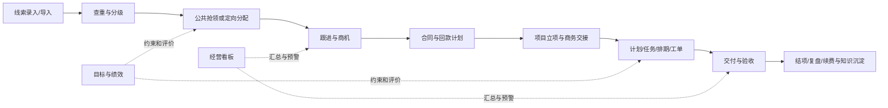

# CRM+OKR公司管理系统 PRD评审稿

版本：V0.9  
生成日期：2026-07-22  
适用范围：中泰旭鼎单一公司主体，约48名员工  
文档性质：评审稿，完成PRD确认前不得作为正式开发基线

## 目录

- [1 文档状态](#1-%E6%96%87%E6%A1%A3%E7%8A%B6%E6%80%81)
- [2 产品概述](#2-%E4%BA%A7%E5%93%81%E6%A6%82%E8%BF%B0)
- [3 用户角色与场景](#3-%E7%94%A8%E6%88%B7%E8%A7%92%E8%89%B2%E4%B8%8E%E5%9C%BA%E6%99%AF)
- [4 范围边界](#4-%E8%8C%83%E5%9B%B4%E8%BE%B9%E7%95%8C)
- [5 业务规则与业务模型结论](#5-%E4%B8%9A%E5%8A%A1%E8%A7%84%E5%88%99%E4%B8%8E%E4%B8%9A%E5%8A%A1%E6%A8%A1%E5%9E%8B%E7%BB%93%E8%AE%BA)
- [6 功能需求](#6-%E5%8A%9F%E8%83%BD%E9%9C%80%E6%B1%82)
- [7 原型与交互说明](#7-%E5%8E%9F%E5%9E%8B%E4%B8%8E%E4%BA%A4%E4%BA%92%E8%AF%B4%E6%98%8E)
- [8 权限需求](#8-%E6%9D%83%E9%99%90%E9%9C%80%E6%B1%82)
- [9 数据需求](#9-%E6%95%B0%E6%8D%AE%E9%9C%80%E6%B1%82)
- [10 非功能需求](#10-%E9%9D%9E%E5%8A%9F%E8%83%BD%E9%9C%80%E6%B1%82)
- [11 集成需求](#11-%E9%9B%86%E6%88%90%E9%9C%80%E6%B1%82)
- [12 验收标准](#12-%E9%AA%8C%E6%94%B6%E6%A0%87%E5%87%86)
- [13 风险与待补充项](#13-%E9%A3%8E%E9%99%A9%E4%B8%8E%E5%BE%85%E8%A1%A5%E5%85%85%E9%A1%B9)
- [14 来源产物清单](#14-%E6%9D%A5%E6%BA%90%E4%BA%A7%E7%89%A9%E6%B8%85%E5%8D%95)
- [15 推进确认状态](#15-%E6%8E%A8%E8%BF%9B%E7%A1%AE%E8%AE%A4%E7%8A%B6%E6%80%81)

## 1 文档状态

| 项目 | 状态 |
|---|---|
| 文档类型 | PRD评审稿 |
| 需求范围 | CRM、OKR、经营管理、员工执行、交付协作、线索池、AI知识库 |
| 系统需求确认 | 已完成 |
| PRD确认 | 评审中 |
| 功能基线 | 100项可验收功能需求 |
| 页面与路径基线 | 31个页面、10条核心路径 |
| 原型状态 | 高保真原型尚未生成，当前以页面需求和交互规则作为设计输入 |

## 2 产品概述

### 2.1 背景

公司主营AI产品销售、AI定制化开发和线上自媒体代运营。当前客户、线索、合同、收款、项目、交付、员工工作、绩效和跨部门协作分散在口头沟通、飞书聊天、飞书多维表格及零散文件中。管理层无法形成统一经营视图，中层难以及时掌握部门负荷与项目偏差，员工缺少清晰的每日执行入口，导致销售转化链路不可追踪、项目计划与实际脱节、绩效缺少可信数据、跨部门责任不清。

### 2.2 产品定位

建设一个面向单一公司的统一经营管理系统，以CRM+OKR为主系统，同时提供线索池和AI知识库两套配套能力。系统统一身份、组织、权限、业务对象、消息、审计和数据口径；通过飞书工作台进入，并与飞书通讯录、日历、考勤、消息、文档、多维表格及邮件发送能力集成。

### 2.3 产品目标

1. 将线索、客户、商机、合同、收款、项目、交付和售后形成端到端可追溯链路。
2. 让管理层按公司、部门、人员、项目、客户和周期查看经营数据、异常与纠偏结果。
3. 让中层管理者掌握本部门目标、人员工作、资源负荷、项目进度和协作工单。
4. 让员工在统一工作台完成每日任务、日报、工单、会议、讲师排期和目标更新。
5. 用经过授权、可审计的数据支撑绩效工资和奖金核算，但不直接改变固定工资。
6. 沉淀企业文件与飞书日常对话知识，形成可检索、可授权、可追溯的企业知识库。

### 2.4 成功指标

| 指标维度 | 上线后观察口径 |
|---|---|
| 经营透明度 | 核心项目、回款、交付、绩效、人员负荷均可从看板下钻至原始记录 |
| 销售管理 | 线索来源、领取、跟进、转化、释放、分配全链路留痕，重复客户可识别 |
| 项目交付 | 项目有计划、里程碑、任务、责任人、风险、验收和复盘，延期可预警 |
| 员工执行 | 每日工作、工单、目标、会议和排期在个人工作台集中处理 |
| 绩效可信度 | 绩效规则有版本，结果可校准、申诉、复核并关联工资条 |
| 协作效率 | 跨部门请求通过工单明确发起人、承接人、时限、状态和结果 |
| 知识复用 | 文件和授权飞书对话可入库，检索结果可定位来源且遵守数据权限 |

## 3 用户角色与场景

### 3.1 用户角色

| 角色 | 主要职责与系统诉求 |
|---|---|
| 董事会/经营管理层 | 查看全公司经营、资金、销售、交付、绩效和人员看板，审批重大例外并跟踪纠偏 |
| 部门负责人 | 管理部门目标、人员每日工作、资源负荷、项目与工单进度 |
| 全体员工 | 录入线索，处理本人任务、日报、工单、会议、排期、目标和知识 |
| 线索责任人 | 领取或接收分配线索，跟进、转化或释放自己当前负责的线索 |
| 商务责任人 | 管理客户、商机、报价、合同、回款计划和商务交接 |
| 财务人员 | 维护收款与付款核销、工资核算、复核和工资条发放数据 |
| 项目发起人 | 发起项目并提名项目负责人，提交立项与变更信息 |
| 项目负责人 | 编排计划、组织资源、更新进度、管理风险、交付与验收 |
| 交付人员 | 执行项目任务、提交产物、登记工时、反馈阻塞 |
| 直属负责人 | 审核员工工作、目标进度和绩效事实，处理日常偏差 |
| 综合管理部 | 管理组织人员、绩效规则、校准、申诉、劳动档案和制度 |
| 知识内容责任人 | 管理知识采集、清洗、权限、版本、发布和纠错 |
| 会议组织者 | 创建内部培训或外部沙龙会议，关联讲师并同步飞书日历 |
| 系统管理员 | 配置角色权限、字典、流程、集成、审计和运行参数，不替代业务审批 |

### 3.2 核心使用场景

1. 全员录入线索，系统查重并记录来源；普通公共线索按配置窗口抢领，重点客户或筛选商机由市场销售中心分配。
2. 销售从线索跟进到客户、商机、合同、回款，并将成交信息完整交接给项目团队。
3. 项目从发起、审批、计划、执行、交付、验收、结项到复盘形成闭环。
4. 自媒体代运营按账号、内容计划、脚本、制作、发布、数据和客户满意度管理交付。
5. AI定制项目按需求、里程碑、研发任务、联调、验收和变更管理交付。
6. 讲师培训、内部培训会议和外部沙龙统一排期，检测人员时间冲突并同步飞书日历。
7. 员工按日处理任务、工单、排期、考勤和日报；负责人查看计划完成度及异常。
8. 公司目标向部门和个人对齐，规则可配置，绩效结果经校准、申诉、财务复核后影响绩效工资或奖金。
9. 企业文件和授权飞书群聊内容进入知识库，经过清洗、权限与版本控制后供检索和引用。

## 4 范围边界

### 4.1 本期包含

- 单一公司组织、部门、岗位、员工档案及入职、转岗、离职、劳动合同、考勤基础管理。
- 线索池、客户、联系人、商机、合同、回款计划、收款记录、商务交接。
- 项目组合、项目立项、计划、任务、工时、风险、变更、交付、验收、结项、复盘。
- AI产品销售、AI定制开发、自媒体代运营三类业务的差异化交付模板。
- 工单、跨部门协作、SLA、催办、升级和闭环评价。
- 公司、部门、个人目标管理，KPI/OKR规则、过程复盘、绩效校准、申诉、工资核算衔接和工资条发布。
- 讲师档案、讲师工时、讲师排期、内部培训会议、外部沙龙会议及飞书日历同步。
- 经营、销售、项目、财务、绩效、人员和协作看板。
- AI知识库的文件采集、授权对话采集、清洗、分段、权限、版本、检索、引用和纠错。
- PC端完整功能、移动端高频处理、飞书工作台入口和云部署。

### 4.2 本期不包含

- 多公司、母子公司、法人账套或子公司隔离。
- 完整招聘候选人管理、招聘网站对接和人才库。
- 会议室、工位、车辆等物理资源预订。
- 企业微信、独立电子签、独立考勤、独立邮件系统和第三方财务系统对接。
- 历史客户、历史合同、历史员工档案迁移。
- 飞书邮件正文及附件采集入知识库。
- 自动替代管理者做绩效校准、薪资审批、合同法律审查或财务记账。

### 4.3 外部依赖与数据初始化

- 依赖飞书开放能力及“飞书CLI”的可用接口、授权范围、频控和稳定性，正式开发前需做技术验证。
- 现有项目从飞书多维表格迁移；具体字段、枚举、历史状态和附件映射需在迁移设计时确认。
- 客户、合同、员工档案和基础财务数据从上线日起重新录入。
- 组织、人员、考勤、日历、消息、文档、多维表格和邮件发送统一走飞书集成。
- 财务权威数据源在未完成业务核验前只作为候选来源，不得直接形成工资或经营结论。

## 5 业务规则与业务模型结论

### 5.1 核心业务闭环

### 5.2 线索与客户规则

- 全体员工均可录入线索；录入时按客户主体、统一社会信用代码、手机号、域名等组合查重，疑似重复进入人工确认。
- 普通公共线索可按权限抢领；重点客户或已筛选商机由市场销售中心分配；每个客户只保留一个主负责人。
- 公共线索开放时间、每次发放条数和批次由人工配置，系统按配置执行，不固化为固定时段。
- 每人每天最多抢领20条；每人处于保护期的线索最多100条。达到任一上限后禁止继续抢领，并说明原因。
- 每个人都可以释放自己当前领取或被分配的线索；不得释放他人线索。释放必须填写原因并保留完整历史。
- 领取、分配、转派、释放、保护期变化、跟进、退回、转化和作废均记录操作者、时间、前后状态、原因及证据。
- 线索转客户后，客户唯一性约束继续生效；负责人变更需保留交接记录，历史责任不被覆盖。

### 5.3 合同、收款与项目规则

- 合同必须关联客户、商机、责任人、金额、收款计划和交付范围；未完成必要审批不得标记生效。
- 收款以财务确认记录为准，业务人员可提交认领材料但不能自行确认到账或修改已核销金额。
- 项目发起人提名项目负责人，相关成员与部门负责人同意后，由项目负责人向总经理汇报；重大或紧急例外按授权流程处理。
- 项目必须具有计划开始/结束、里程碑、任务、责任人、交付物、验收标准和风险状态；实际进度不得仅由主观百分比构成。
- 项目变更需记录变更前后范围、工期、成本、责任和审批；不允许直接覆盖原计划。
- 交付物提交、客户确认、驳回、重提、验收和结项均保留版本与证据。

### 5.4 工单、排期与会议规则

- 跨部门请求必须转为工单，明确发起部门、承接部门、责任人、优先级、期望完成时间、SLA和验收人。
- 工单支持接单、转派、协办、退回、挂起、催办、升级、完成和评价；超时自动预警，不自动伪造完成。
- 讲师排期与会议排期共用人员可用性校验。会议分内部培训和外部沙龙两类，不管理会议室。
- 会议创建或变更时校验讲师、主播、组织者和参与人的时间冲突；冲突由有权限人员选择调整、例外继续或取消。
- 成功排期同步飞书日历；同步失败时保留内部记录并进入待重试状态，展示失败原因，不重复创建日历事件。
- 讲师与主播工时从已确认任务、排期和实际执行记录汇总，手工调整必须有原因和审核轨迹。

### 5.5 目标、绩效与工资规则

- 目标采用公司、部门、个人逐级对齐的主路径，同时允许经授权的跨部门协同目标和个人改进目标。
- OKR评分、KPI权重、评分人、周期、数据源、封顶/保底、校准方式均采用版本化配置；规则生效后不得追溯覆盖历史周期。
- 综合管理部维护绩效规则、组织月度考核、校准、申诉和结果发布；直属负责人提供事实评价；员工可举证和申诉。
- 绩效结果直接影响绩效工资或奖金，不影响固定工资。具体公式在薪酬方案配置后计算，系统必须保留输入值、规则版本、计算过程和人工调整原因。
- 财务负责工资核算、复核和发放；工资条仅在绩效流程完成且财务复核通过后发布。
- 系统管理员无权代替综合管理部校准绩效或代替财务确认工资。

### 5.6 主要对象状态

| 对象 | 核心状态 |
|---|---|
| 线索 | 草稿、待查重、公共、保护中、跟进中、已释放、已转化、已作废 |
| 商机 | 初步接触、需求确认、方案报价、商务谈判、赢单、输单、暂停 |
| 合同 | 草稿、审批中、已生效、履约中、已完成、已终止 |
| 项目 | 待立项、审批中、已立项、计划中、执行中、暂停、待验收、已结项、已取消 |
| 任务/工单 | 待接收、进行中、待确认、挂起、已完成、已关闭、已退回 |
| 排期/会议 | 草稿、待确认、已确认、同步中、同步失败、已完成、已取消 |
| 目标/绩效 | 草稿、制定中、执行中、自评中、评价中、校准中、申诉中、已确认、已归档 |
| 知识条目 | 待采集、处理中、待审核、已发布、已停用、已归档 |

### 5.7 统一审计与异常原则

- 关键业务对象采用不可覆盖的操作日志，至少记录主体、动作、前值、后值、时间、操作者、来源端、关联审批和失败原因。
- 并发修改采用版本号或等效机制；检测到冲突时不静默覆盖，提示刷新、比较或重新提交。
- 外部同步失败不回滚已合法完成的内部业务动作，进入异常队列并支持幂等重试、人工补偿和告警。
- 越权访问直接拒绝并记录安全审计；列表、导出、搜索和知识检索均遵循相同数据权限。
- 删除优先采用停用、作废或归档；法律、财务、薪酬、绩效和审计数据不得被普通用户物理删除。

## 6 功能需求

以下100项功能均为可独立验收的用户可见能力或业务规则能力。

### 6.1 经营态势识别与执行纠偏

让管理层、部门负责人和员工从统一业务事实识别偏差并形成行动。。

#### 6.1.1 FR-001 查看全公司经营总览
- 使用角色：董事会/经营管理层。
- 业务目的：掌握销售、回款、交付、绩效、人员和协作状态。
- 前置条件：用户已通过飞书身份进入系统，账号有效且具备对应功能与数据范围权限。
- 功能说明：在PAGE-002、PATH-010完成查看全公司经营总览；查看处理结果与历史记录；功能类型为统计分析功能。
- 规则约束：A5、B1.1；状态变化必须满足当前业务对象生命周期。
- 异常处理：显示规则不满足、状态冲突、数据缺失或无权限的明确原因；不得静默失败，不得因重试生成重复业务记录。
- 数据要求：读写或汇总项目、项目财务汇总、目标、绩效结果、工单、审计记录；记录来源、操作者、发生时间、当前状态与版本号，统计口径沿用数据字典。
- 权限要求：仅董事会/经营管理层可在授权数据范围内操作；跨部门、财务、薪酬、绩效及敏感客户数据按最小权限和字段级脱敏控制。
- 验收条件：选择周期和范围；形成统一经营视图；操作、状态变化和责任轨迹可追溯；成功时反馈业务结果和当前状态；失败、待处理、冲突或无权限时反馈原因与可采取动作。
- 来源追溯：用户故事：US-001、US-035；用例：UC-MGT-001；业务过程：B1.1公司经营与执行闭环及对应子流程。

#### 6.1.2 FR-002 下钻经营异常
- 使用角色：董事会/经营管理层。
- 业务目的：从异常指标定位部门、项目、员工和原始记录。
- 前置条件：用户已通过飞书身份进入系统，账号有效且具备对应功能与数据范围权限。
- 功能说明：在PAGE-002、PATH-010完成下钻经营异常；查看处理结果与历史记录；功能类型为统计分析功能。
- 规则约束：A5、OPS规则；状态变化必须满足当前业务对象生命周期。
- 异常处理：显示规则不满足、状态冲突、数据缺失或无权限的明确原因；不得静默失败，不得因重试生成重复业务记录。
- 数据要求：读写或汇总项目、项目财务汇总、目标、绩效结果、工单、审计记录；记录来源、操作者、发生时间、当前状态与版本号，统计口径沿用数据字典。
- 权限要求：仅董事会/经营管理层可在授权数据范围内操作；跨部门、财务、薪酬、绩效及敏感客户数据按最小权限和字段级脱敏控制。
- 验收条件：选择异常；返回可追溯业务事实；操作、状态变化和责任轨迹可追溯；成功时反馈业务结果和当前状态；失败、待处理、冲突或无权限时反馈原因与可采取动作。
- 来源追溯：用户故事：US-001、US-035；用例：UC-MGT-002；业务过程：B1.1公司经营与执行闭环及对应子流程。

#### 6.1.3 FR-003 创建并跟踪纠偏行动
- 使用角色：董事会/经营管理层。
- 业务目的：把复盘问题转成有责任和期限的行动。
- 前置条件：用户已通过飞书身份进入系统，账号有效且具备对应功能与数据范围权限。
- 功能说明：在PAGE-003、PATH-010完成创建并跟踪纠偏行动；查看处理结果与历史记录；功能类型为用户交互功能。
- 规则约束：B1.1、B1.6；状态变化必须满足当前业务对象生命周期。
- 异常处理：显示规则不满足、状态冲突、数据缺失或无权限的明确原因；不得静默失败，不得因重试生成重复业务记录。
- 数据要求：读写或汇总项目、项目财务汇总、目标、绩效结果、工单、审计记录；记录来源、操作者、发生时间、当前状态与版本号，统计口径沿用数据字典。
- 权限要求：仅董事会/经营管理层可在授权数据范围内操作；跨部门、财务、薪酬、绩效及敏感客户数据按最小权限和字段级脱敏控制。
- 验收条件：确认异常；形成任务或工单并跟踪关闭；操作、状态变化和责任轨迹可追溯；成功时反馈业务结果和当前状态；失败、待处理、冲突或无权限时反馈原因与可采取动作。
- 来源追溯：用户故事：US-001、US-002；用例：UC-MGT-003；业务过程：B1.1公司经营与执行闭环及对应子流程。

#### 6.1.4 FR-004 查看部门执行总览
- 使用角色：部门负责人。
- 业务目的：掌握本部门目标、员工、项目、工单、排期和日报。
- 前置条件：用户已通过飞书身份进入系统，账号有效且具备对应功能与数据范围权限。
- 功能说明：在PAGE-002、PATH-010完成查看部门执行总览；查看处理结果与历史记录；功能类型为统计分析功能。
- 规则约束：A5；状态变化必须满足当前业务对象生命周期。
- 异常处理：显示规则不满足、状态冲突、数据缺失或无权限的明确原因；不得静默失败，不得因重试生成重复业务记录。
- 数据要求：读写或汇总部门、员工、项目、工单、排期、目标、每日工作记录；记录来源、操作者、发生时间、当前状态与版本号，统计口径沿用数据字典。
- 权限要求：仅部门负责人可在授权数据范围内操作；跨部门、财务、薪酬、绩效及敏感客户数据按最小权限和字段级脱敏控制。
- 验收条件：进入部门范围；形成异常与负荷视图；操作、状态变化和责任轨迹可追溯；成功时反馈业务结果和当前状态；失败、待处理、冲突或无权限时反馈原因与可采取动作。
- 来源追溯：用户故事：US-002；用例：UC-DEPT-001；业务过程：B1.1公司经营与执行闭环及对应子流程。

#### 6.1.5 FR-005 协调部门资源与冲突
- 使用角色：部门负责人。
- 业务目的：处理人员负荷、项目和排期冲突。
- 前置条件：用户已通过飞书身份进入系统，账号有效且具备对应功能与数据范围权限。
- 功能说明：在PAGE-003、PATH-010完成协调部门资源与冲突；查看处理结果与历史记录；功能类型为用户交互功能。
- 规则约束：B1.1、B1.5；状态变化必须满足当前业务对象生命周期。
- 异常处理：显示规则不满足、状态冲突、数据缺失或无权限的明确原因；不得静默失败，不得因重试生成重复业务记录。
- 数据要求：读写或汇总部门、员工、项目、工单、排期、目标、每日工作记录；记录来源、操作者、发生时间、当前状态与版本号，统计口径沿用数据字典。
- 权限要求：仅部门负责人可在授权数据范围内操作；跨部门、财务、薪酬、绩效及敏感客户数据按最小权限和字段级脱敏控制。
- 验收条件：发现冲突；形成替代人员、时间或升级结论；操作、状态变化和责任轨迹可追溯；成功时反馈业务结果和当前状态；失败、待处理、冲突或无权限时反馈原因与可采取动作。
- 来源追溯：用户故事：US-002、US-014、US-021；用例：UC-DEPT-002；业务过程：B1.1公司经营与执行闭环及对应子流程。

#### 6.1.6 FR-006 查看个人工作总览
- 使用角色：全体员工。
- 业务目的：汇总本人目标、任务、工单、会议、排期和考勤。
- 前置条件：用户已通过飞书身份进入系统，账号有效且具备对应功能与数据范围权限。
- 功能说明：在PAGE-001、PATH-001完成查看个人工作总览；查看处理结果与历史记录；功能类型为用户交互功能。
- 规则约束：A5、B1.1；状态变化必须满足当前业务对象生命周期。
- 异常处理：显示规则不满足、状态冲突、数据缺失或无权限的明确原因；不得静默失败，不得因重试生成重复业务记录。
- 数据要求：读写或汇总员工、每日工作记录、项目任务、工单、排期、目标、考勤记录；记录来源、操作者、发生时间、当前状态与版本号，统计口径沿用数据字典。
- 权限要求：仅全体员工可在授权数据范围内操作；跨部门、财务、薪酬、绩效及敏感客户数据按最小权限和字段级脱敏控制。
- 验收条件：员工开始工作；得到个人待办和异常；操作、状态变化和责任轨迹可追溯；成功时反馈业务结果和当前状态；失败、待处理、冲突或无权限时反馈原因与可采取动作。
- 来源追溯：用户故事：US-003；用例：UC-EMP-001；业务过程：B1.1公司经营与执行闭环及对应子流程。

#### 6.1.7 FR-007 记录每日工作
- 使用角色：全体员工。
- 业务目的：用最小填报记录今日工作、明日计划和产出引用。
- 前置条件：用户已通过飞书身份进入系统，账号有效且具备对应功能与数据范围权限。
- 功能说明：在PAGE-001、PATH-001完成记录每日工作；查看处理结果与历史记录；功能类型为用户交互功能。
- 规则约束：A5、HR-010；状态变化必须满足当前业务对象生命周期。
- 异常处理：显示规则不满足、状态冲突、数据缺失或无权限的明确原因；不得静默失败，不得因重试生成重复业务记录。
- 数据要求：读写或汇总员工、每日工作记录、项目任务、工单、排期、目标、考勤记录；记录来源、操作者、发生时间、当前状态与版本号，统计口径沿用数据字典。
- 权限要求：仅全体员工可在授权数据范围内操作；跨部门、财务、薪酬、绩效及敏感客户数据按最小权限和字段级脱敏控制。
- 验收条件：日终；形成每日工作记录；操作、状态变化和责任轨迹可追溯；成功时反馈业务结果和当前状态；失败、待处理、冲突或无权限时反馈原因与可采取动作。
- 来源追溯：用户故事：US-029；用例：UC-EMP-002；业务过程：B1.1公司经营与执行闭环及对应子流程。

#### 6.1.8 FR-008 处理个人安排冲突
- 使用角色：全体员工。
- 业务目的：对重叠任务、会议和排期发起协调。
- 前置条件：用户已通过飞书身份进入系统，账号有效且具备对应功能与数据范围权限。
- 功能说明：在PAGE-001、PATH-001完成处理个人安排冲突；查看处理结果与历史记录；功能类型为用户交互功能。
- 规则约束：B1.1、B1.6；状态变化必须满足当前业务对象生命周期。
- 异常处理：显示规则不满足、状态冲突、数据缺失或无权限的明确原因；不得静默失败，不得因重试生成重复业务记录。
- 数据要求：读写或汇总员工、每日工作记录、项目任务、工单、排期、目标、考勤记录；记录来源、操作者、发生时间、当前状态与版本号，统计口径沿用数据字典。
- 权限要求：仅全体员工可在授权数据范围内操作；跨部门、财务、薪酬、绩效及敏感客户数据按最小权限和字段级脱敏控制。
- 验收条件：发现冲突；安排调整或升级；操作、状态变化和责任轨迹可追溯；成功时反馈业务结果和当前状态；失败、待处理、冲突或无权限时反馈原因与可采取动作。
- 来源追溯：用户故事：US-003、US-021；用例：UC-EMP-003；业务过程：B1.1公司经营与执行闭环及对应子流程。

### 6.2 客户机会沉淀与转化推进

把全员发现的机会转为可查重、可分配、可保护、可跟进和可移交的公司资产。。

#### 6.2.1 FR-009 录入新线索
- 使用角色：全体员工。
- 业务目的：将潜在客户沉淀为公司资产。
- 前置条件：用户已通过飞书身份进入系统，账号有效且具备对应功能与数据范围权限。
- 功能说明：在PAGE-004、PATH-002完成录入新线索；查看处理结果与历史记录；功能类型为用户交互功能。
- 规则约束：A5；状态变化必须满足当前业务对象生命周期。
- 异常处理：显示规则不满足、状态冲突、数据缺失或无权限的明确原因；不得静默失败，不得因重试生成重复业务记录。
- 数据要求：读写或汇总客户、联系人、线索、线索跟进；记录来源、操作者、发生时间、当前状态与版本号，统计口径沿用数据字典。
- 权限要求：仅全体员工可在授权数据范围内操作；跨部门、财务、薪酬、绩效及敏感客户数据按最小权限和字段级脱敏控制。
- 验收条件：获得客户信息；形成待查重线索；操作、状态变化和责任轨迹可追溯；成功时反馈业务结果和当前状态；失败、待处理、冲突或无权限时反馈原因与可采取动作。
- 来源追溯：用户故事：US-004；用例：UC-LEAD-001；业务过程：B1.1公司经营与执行闭环及对应子流程。

#### 6.2.2 FR-010 查重并建立客户关系
- 使用角色：按岗位授权用户。
- 业务目的：判断合并、同客户不同商机、疑似重复或新建。
- 前置条件：用户已通过飞书身份进入系统，账号有效且具备对应功能与数据范围权限。
- 功能说明：在PAGE-004、PATH-002完成查重并建立客户关系；查看处理结果与历史记录；功能类型为用户交互功能。
- 规则约束：LEAD-001至LEAD-005；状态变化必须满足当前业务对象生命周期。
- 异常处理：显示规则不满足、状态冲突、数据缺失或无权限的明确原因；不得静默失败，不得因重试生成重复业务记录。
- 数据要求：读写或汇总客户、联系人、线索、线索跟进；记录来源、操作者、发生时间、当前状态与版本号，统计口径沿用数据字典。
- 权限要求：仅按岗位授权用户可在授权数据范围内操作；跨部门、财务、薪酬、绩效及敏感客户数据按最小权限和字段级脱敏控制。
- 验收条件：线索提交；形成客户/联系人/线索关系；操作、状态变化和责任轨迹可追溯；成功时反馈业务结果和当前状态；失败、待处理、冲突或无权限时反馈原因与可采取动作。
- 来源追溯：用户故事：US-004；用例：UC-LEAD-002；业务过程：B1.1公司经营与执行闭环及对应子流程。

#### 6.2.3 FR-011 撤销错误合并
- 使用角色：按岗位授权用户。
- 业务目的：恢复被误合并的客户/联系人和线索关系。
- 前置条件：用户已通过飞书身份进入系统，账号有效且具备对应功能与数据范围权限。
- 功能说明：在PAGE-005完成撤销错误合并；查看处理结果与历史记录；功能类型为用户交互功能。
- 规则约束：已确认Q-B1.6-001；状态变化必须满足当前业务对象生命周期。
- 异常处理：显示规则不满足、状态冲突、数据缺失或无权限的明确原因；不得静默失败，不得因重试生成重复业务记录。
- 数据要求：读写或汇总客户、联系人、线索、线索跟进；记录来源、操作者、发生时间、当前状态与版本号，统计口径沿用数据字典。
- 权限要求：仅按岗位授权用户可在授权数据范围内操作；跨部门、财务、薪酬、绩效及敏感客户数据按最小权限和字段级脱敏控制。
- 验收条件：确认误合并；恢复原关系并保留历史；操作、状态变化和责任轨迹可追溯；成功时反馈业务结果和当前状态；失败、待处理、冲突或无权限时反馈原因与可采取动作。
- 来源追溯：用户故事：US-004；用例：UC-LEAD-011；业务过程：B1.1公司经营与执行闭环及对应子流程。

#### 6.2.4 FR-012 配置公共池开放规则
- 使用角色：按岗位授权用户。
- 业务目的：设置开放时间和每批发放条数。
- 前置条件：用户已通过飞书身份进入系统，账号有效且具备对应功能与数据范围权限。
- 功能说明：在PAGE-006完成配置公共池开放规则；查看处理结果与历史记录；功能类型为配置管理功能。
- 规则约束：已确认Q-A1-017；状态变化必须满足当前业务对象生命周期。
- 异常处理：显示规则不满足、状态冲突、数据缺失或无权限的明确原因；不得静默失败，不得因重试生成重复业务记录。
- 数据要求：读写或汇总客户、联系人、线索、线索跟进；记录来源、操作者、发生时间、当前状态与版本号，统计口径沿用数据字典。
- 权限要求：仅按岗位授权用户可在授权数据范围内操作；跨部门、财务、薪酬、绩效及敏感客户数据按最小权限和字段级脱敏控制。
- 验收条件：管理规则；形成生效配置版本；操作、状态变化和责任轨迹可追溯；成功时反馈业务结果和当前状态；失败、待处理、冲突或无权限时反馈原因与可采取动作。
- 来源追溯：用户故事：US-007；用例：UC-LEAD-003；业务过程：B1.1公司经营与执行闭环及对应子流程。

#### 6.2.5 FR-013 配置线索权限与分配原则
- 使用角色：按岗位授权用户。
- 业务目的：控制普通抢领和重点商机分配。
- 前置条件：用户已通过飞书身份进入系统，账号有效且具备对应功能与数据范围权限。
- 功能说明：在PAGE-006完成配置线索权限与分配原则；查看处理结果与历史记录；功能类型为配置管理功能。
- 规则约束：已确认线索机制；状态变化必须满足当前业务对象生命周期。
- 异常处理：显示规则不满足、状态冲突、数据缺失或无权限的明确原因；不得静默失败，不得因重试生成重复业务记录。
- 数据要求：读写或汇总客户、联系人、线索、线索跟进；记录来源、操作者、发生时间、当前状态与版本号，统计口径沿用数据字典。
- 权限要求：仅按岗位授权用户可在授权数据范围内操作；跨部门、财务、薪酬、绩效及敏感客户数据按最小权限和字段级脱敏控制。
- 验收条件：规则调整；形成授权范围；操作、状态变化和责任轨迹可追溯；成功时反馈业务结果和当前状态；失败、待处理、冲突或无权限时反馈原因与可采取动作。
- 来源追溯：用户故事：US-007；用例：UC-LEAD-004；业务过程：B1.1公司经营与执行闭环及对应子流程。

#### 6.2.6 FR-014 抢领普通公共线索
- 使用角色：线索责任人。
- 业务目的：在有效窗口公平获得客户机会。
- 前置条件：用户已通过飞书身份进入系统，账号有效且具备对应功能与数据范围权限。
- 功能说明：在PAGE-004、PATH-002完成抢领普通公共线索；查看处理结果与历史记录；功能类型为用户交互功能。
- 规则约束：LEAD-007至LEAD-013；状态变化必须满足当前业务对象生命周期。
- 异常处理：显示规则不满足、状态冲突、数据缺失或无权限的明确原因；不得静默失败，不得因重试生成重复业务记录。
- 数据要求：读写或汇总客户、联系人、线索、线索跟进；记录来源、操作者、发生时间、当前状态与版本号，统计口径沿用数据字典。
- 权限要求：仅线索责任人可在授权数据范围内操作；跨部门、财务、薪酬、绩效及敏感客户数据按最小权限和字段级脱敏控制。
- 验收条件：发起抢领；成为唯一主负责人或收到拒绝原因；操作、状态变化和责任轨迹可追溯；成功时反馈业务结果和当前状态；失败、待处理、冲突或无权限时反馈原因与可采取动作。
- 来源追溯：用户故事：US-005；用例：UC-LEAD-005；业务过程：B1.1公司经营与执行闭环及对应子流程。

#### 6.2.7 FR-015 分配重点商机
- 使用角色：按岗位授权用户。
- 业务目的：将重点客户交给确定主负责人。
- 前置条件：用户已通过飞书身份进入系统，账号有效且具备对应功能与数据范围权限。
- 功能说明：在PAGE-004完成分配重点商机；查看处理结果与历史记录；功能类型为用户交互功能。
- 规则约束：LEAD-007、LEAD-010；状态变化必须满足当前业务对象生命周期。
- 异常处理：显示规则不满足、状态冲突、数据缺失或无权限的明确原因；不得静默失败，不得因重试生成重复业务记录。
- 数据要求：读写或汇总客户、联系人、线索、线索跟进；记录来源、操作者、发生时间、当前状态与版本号，统计口径沿用数据字典。
- 权限要求：仅按岗位授权用户可在授权数据范围内操作；跨部门、财务、薪酬、绩效及敏感客户数据按最小权限和字段级脱敏控制。
- 验收条件：商机筛选完成；形成分配和保护期；操作、状态变化和责任轨迹可追溯；成功时反馈业务结果和当前状态；失败、待处理、冲突或无权限时反馈原因与可采取动作。
- 来源追溯：用户故事：US-007；用例：UC-LEAD-006；业务过程：B1.1公司经营与执行闭环及对应子流程。

#### 6.2.8 FR-016 公共线索抢领资格判断
- 使用角色：按岗位授权用户。
- 业务目的：在抢领前校验窗口、权限、日限额和保护期上限。
- 前置条件：用户已通过飞书身份进入系统，账号有效且具备对应功能与数据范围权限。
- 功能说明：在PAGE-004、PATH-002完成查看执行状态与处理记录；功能类型为系统自动功能。
- 规则约束：LEAD-009至LEAD-013；状态变化必须满足当前业务对象生命周期。
- 异常处理：显示规则不满足、状态冲突、数据缺失或无权限的明确原因；不得静默失败，不得因重试生成重复业务记录。
- 数据要求：读写或汇总客户、联系人、线索、线索跟进；记录来源、操作者、发生时间、当前状态与版本号，统计口径沿用数据字典。
- 权限要求：仅按岗位授权用户可在授权数据范围内操作；跨部门、财务、薪酬、绩效及敏感客户数据按最小权限和字段级脱敏控制。
- 验收条件：发起抢领；返回允许或明确拒绝原因；操作、状态变化和责任轨迹可追溯；成功时反馈业务结果和当前状态；失败、待处理、冲突或无权限时反馈原因与可采取动作。
- 来源追溯：用户故事：US-005；用例：UC-LEAD-013；业务过程：B1.1公司经营与执行闭环及对应子流程。

#### 6.2.9 FR-017 记录线索跟进
- 使用角色：线索责任人。
- 业务目的：保存沟通事实和下一步行动。
- 前置条件：用户已通过飞书身份进入系统，账号有效且具备对应功能与数据范围权限。
- 功能说明：在PAGE-005、PATH-002完成记录线索跟进；查看处理结果与历史记录；功能类型为用户交互功能。
- 规则约束：LEAD-016至LEAD-019；状态变化必须满足当前业务对象生命周期。
- 异常处理：显示规则不满足、状态冲突、数据缺失或无权限的明确原因；不得静默失败，不得因重试生成重复业务记录。
- 数据要求：读写或汇总客户、联系人、线索、线索跟进；记录来源、操作者、发生时间、当前状态与版本号，统计口径沿用数据字典。
- 权限要求：仅线索责任人可在授权数据范围内操作；跨部门、财务、薪酬、绩效及敏感客户数据按最小权限和字段级脱敏控制。
- 验收条件：完成沟通；形成有效跟进记录；操作、状态变化和责任轨迹可追溯；成功时反馈业务结果和当前状态；失败、待处理、冲突或无权限时反馈原因与可采取动作。
- 来源追溯：用户故事：US-006；用例：UC-LEAD-007；业务过程：B1.1公司经营与执行闭环及对应子流程。

#### 6.2.10 FR-018 处理保护期提醒与延期
- 使用角色：线索责任人。
- 业务目的：防止线索因疏忽退回并处理持续谈判。
- 前置条件：用户已通过飞书身份进入系统，账号有效且具备对应功能与数据范围权限。
- 功能说明：在PAGE-005、PATH-002完成处理保护期提醒与延期；查看处理结果与历史记录；功能类型为用户交互功能。
- 规则约束：LEAD-018至LEAD-021；状态变化必须满足当前业务对象生命周期。
- 异常处理：显示规则不满足、状态冲突、数据缺失或无权限的明确原因；不得静默失败，不得因重试生成重复业务记录。
- 数据要求：读写或汇总客户、联系人、线索、线索跟进；记录来源、操作者、发生时间、当前状态与版本号，统计口径沿用数据字典。
- 权限要求：仅线索责任人可在授权数据范围内操作；跨部门、财务、薪酬、绩效及敏感客户数据按最小权限和字段级脱敏控制。
- 验收条件：达到提醒/到期；跟进、延期或退回；操作、状态变化和责任轨迹可追溯；成功时反馈业务结果和当前状态；失败、待处理、冲突或无权限时反馈原因与可采取动作。
- 来源追溯：用户故事：US-008；用例：UC-LEAD-008；业务过程：B1.1公司经营与执行闭环及对应子流程。

#### 6.2.11 FR-019 手动释放本人线索
- 使用角色：线索责任人。
- 业务目的：主动放弃自己领取或被分配的线索。
- 前置条件：用户已通过飞书身份进入系统，账号有效且具备对应功能与数据范围权限。
- 功能说明：在PAGE-004、PATH-002完成手动释放本人线索；查看处理结果与历史记录；功能类型为用户交互功能。
- 规则约束：LEAD-014、LEAD-015；状态变化必须满足当前业务对象生命周期。
- 异常处理：显示规则不满足、状态冲突、数据缺失或无权限的明确原因；不得静默失败，不得因重试生成重复业务记录。
- 数据要求：读写或汇总客户、联系人、线索、线索跟进；记录来源、操作者、发生时间、当前状态与版本号，统计口径沿用数据字典。
- 权限要求：仅线索责任人可在授权数据范围内操作；跨部门、财务、薪酬、绩效及敏感客户数据按最小权限和字段级脱敏控制。
- 验收条件：提交释放原因；线索回公共池；操作、状态变化和责任轨迹可追溯；成功时反馈业务结果和当前状态；失败、待处理、冲突或无权限时反馈原因与可采取动作。
- 来源追溯：用户故事：US-005、US-008；用例：UC-LEAD-009；业务过程：B1.1公司经营与执行闭环及对应子流程。

#### 6.2.12 FR-020 自动退回超期线索
- 使用角色：按岗位授权用户。
- 业务目的：释放未及时跟进或到期机会。
- 前置条件：用户已通过飞书身份进入系统，账号有效且具备对应功能与数据范围权限。
- 功能说明：在PAGE-004、PATH-002完成查看执行状态与处理记录；功能类型为系统自动功能。
- 规则约束：LEAD-017至LEAD-020；状态变化必须满足当前业务对象生命周期。
- 异常处理：显示规则不满足、状态冲突、数据缺失或无权限的明确原因；不得静默失败，不得因重试生成重复业务记录。
- 数据要求：读写或汇总客户、联系人、线索、线索跟进；记录来源、操作者、发生时间、当前状态与版本号，统计口径沿用数据字典。
- 权限要求：仅按岗位授权用户可在授权数据范围内操作；跨部门、财务、薪酬、绩效及敏感客户数据按最小权限和字段级脱敏控制。
- 验收条件：命中退回规则；线索回公共池并留痕；操作、状态变化和责任轨迹可追溯；成功时反馈业务结果和当前状态；失败、待处理、冲突或无权限时反馈原因与可采取动作。
- 来源追溯：用户故事：US-008；用例：UC-LEAD-010；业务过程：B1.1公司经营与执行闭环及对应子流程。

#### 6.2.13 FR-021 将成交线索移交商务与项目
- 使用角色：线索责任人、商务责任人。
- 业务目的：连续传递客户承诺、合同条件和交付信息。
- 前置条件：用户已通过飞书身份进入系统，账号有效且具备对应功能与数据范围权限。
- 功能说明：在PAGE-005、PAGE-007、PATH-003完成将成交线索移交商务与项目；查看处理结果与历史记录；功能类型为用户交互功能。
- 规则约束：B1.1、B1.5；状态变化必须满足当前业务对象生命周期。
- 异常处理：显示规则不满足、状态冲突、数据缺失或无权限的明确原因；不得静默失败，不得因重试生成重复业务记录。
- 数据要求：读写或汇总客户、联系人、线索、线索跟进；记录来源、操作者、发生时间、当前状态与版本号，统计口径沿用数据字典。
- 权限要求：仅线索责任人、商务责任人可在授权数据范围内操作；跨部门、财务、薪酬、绩效及敏感客户数据按最小权限和字段级脱敏控制。
- 验收条件：商机成交；形成完整成交移交；操作、状态变化和责任轨迹可追溯；成功时反馈业务结果和当前状态；失败、待处理、冲突或无权限时反馈原因与可采取动作。
- 来源追溯：用户故事：US-009；用例：UC-LEAD-012；业务过程：B1.1公司经营与执行闭环及对应子流程。

### 6.3 合同资金履约与风险识别

连接合同、应收、实收、票据、退款、成本利润和项目启动条件。。

#### 6.3.1 FR-022 建立并审核客户合同
- 使用角色：商务责任人、财务人员。
- 业务目的：形成有效合同和交付范围。
- 前置条件：用户已通过飞书身份进入系统，账号有效且具备对应功能与数据范围权限。
- 功能说明：在PAGE-007、PAGE-008、PATH-003完成建立并审核客户合同；查看处理结果与历史记录；功能类型为用户交互功能。
- 规则约束：FIN-001、FIN-002；状态变化必须满足当前业务对象生命周期。
- 异常处理：显示规则不满足、状态冲突、数据缺失或无权限的明确原因；不得静默失败，不得因重试生成重复业务记录。
- 数据要求：读写或汇总客户合同、应收计划、收款记录、开票记录、退款记录、项目财务汇总；记录来源、操作者、发生时间、当前状态与版本号，统计口径沿用数据字典。
- 权限要求：仅商务责任人、财务人员可在授权数据范围内操作；跨部门、财务、薪酬、绩效及敏感客户数据按最小权限和字段级脱敏控制。
- 验收条件：成交移交；合同生效或退回；操作、状态变化和责任轨迹可追溯；成功时反馈业务结果和当前状态；失败、待处理、冲突或无权限时反馈原因与可采取动作。
- 来源追溯：用户故事：US-010、US-011；用例：UC-FIN-001；业务过程：B1.1公司经营与执行闭环及对应子流程。

#### 6.3.2 FR-023 建立应收计划
- 使用角色：商务责任人。
- 业务目的：将付款条件转成应收节点。
- 前置条件：用户已通过飞书身份进入系统，账号有效且具备对应功能与数据范围权限。
- 功能说明：在PAGE-007、PAGE-008、PATH-003完成建立应收计划；查看处理结果与历史记录；功能类型为用户交互功能。
- 规则约束：B1.3、B1.4；状态变化必须满足当前业务对象生命周期。
- 异常处理：显示规则不满足、状态冲突、数据缺失或无权限的明确原因；不得静默失败，不得因重试生成重复业务记录。
- 数据要求：读写或汇总客户合同、应收计划、收款记录、开票记录、退款记录、项目财务汇总；记录来源、操作者、发生时间、当前状态与版本号，统计口径沿用数据字典。
- 权限要求：仅商务责任人可在授权数据范围内操作；跨部门、财务、薪酬、绩效及敏感客户数据按最小权限和字段级脱敏控制。
- 验收条件：合同审核；形成应收金额和日期；操作、状态变化和责任轨迹可追溯；成功时反馈业务结果和当前状态；失败、待处理、冲突或无权限时反馈原因与可采取动作。
- 来源追溯：用户故事：US-010、US-011；用例：UC-FIN-002；业务过程：B1.1公司经营与执行闭环及对应子流程。

#### 6.3.3 FR-024 核验项目财务启动条件
- 使用角色：财务人员。
- 业务目的：判断合同和收款是否允许正式交付。
- 前置条件：用户已通过飞书身份进入系统，账号有效且具备对应功能与数据范围权限。
- 功能说明：在PAGE-008、PATH-003完成核验项目财务启动条件；查看处理结果与历史记录；功能类型为用户交互功能。
- 规则约束：FIN-006、FIN-007；状态变化必须满足当前业务对象生命周期。
- 异常处理：显示规则不满足、状态冲突、数据缺失或无权限的明确原因；不得静默失败，不得因重试生成重复业务记录。
- 数据要求：读写或汇总客户合同、应收计划、收款记录、开票记录、退款记录、项目财务汇总；记录来源、操作者、发生时间、当前状态与版本号，统计口径沿用数据字典。
- 权限要求：仅财务人员可在授权数据范围内操作；跨部门、财务、薪酬、绩效及敏感客户数据按最小权限和字段级脱敏控制。
- 验收条件：立项申请；返回满足/不满足/特批满足；操作、状态变化和责任轨迹可追溯；成功时反馈业务结果和当前状态；失败、待处理、冲突或无权限时反馈原因与可采取动作。
- 来源追溯：用户故事：US-011、US-013；用例：UC-FIN-007；业务过程：B1.1公司经营与执行闭环及对应子流程。

#### 6.3.4 FR-025 记录并核验收款
- 使用角色：财务人员。
- 业务目的：形成可靠已收金额和项目启动依据。
- 前置条件：用户已通过飞书身份进入系统，账号有效且具备对应功能与数据范围权限。
- 功能说明：在PAGE-009完成记录并核验收款；查看处理结果与历史记录；功能类型为用户交互功能。
- 规则约束：FIN-003；状态变化必须满足当前业务对象生命周期。
- 异常处理：显示规则不满足、状态冲突、数据缺失或无权限的明确原因；不得静默失败，不得因重试生成重复业务记录。
- 数据要求：读写或汇总客户合同、应收计划、收款记录、开票记录、退款记录、项目财务汇总；记录来源、操作者、发生时间、当前状态与版本号，统计口径沿用数据字典。
- 权限要求：仅财务人员可在授权数据范围内操作；跨部门、财务、薪酬、绩效及敏感客户数据按最小权限和字段级脱敏控制。
- 验收条件：收到到账事实；核验通过或驳回；操作、状态变化和责任轨迹可追溯；成功时反馈业务结果和当前状态；失败、待处理、冲突或无权限时反馈原因与可采取动作。
- 来源追溯：用户故事：US-011；用例：UC-FIN-003；业务过程：B1.1公司经营与执行闭环及对应子流程。

#### 6.3.5 FR-026 处理开票
- 使用角色：财务人员。
- 业务目的：记录开票申请、完成、作废或红冲。
- 前置条件：用户已通过飞书身份进入系统，账号有效且具备对应功能与数据范围权限。
- 功能说明：在PAGE-009完成处理开票；查看处理结果与历史记录；功能类型为用户交互功能。
- 规则约束：B1.3、B1.4；状态变化必须满足当前业务对象生命周期。
- 异常处理：显示规则不满足、状态冲突、数据缺失或无权限的明确原因；不得静默失败，不得因重试生成重复业务记录。
- 数据要求：读写或汇总客户合同、应收计划、收款记录、开票记录、退款记录、项目财务汇总；记录来源、操作者、发生时间、当前状态与版本号，统计口径沿用数据字典。
- 权限要求：仅财务人员可在授权数据范围内操作；跨部门、财务、薪酬、绩效及敏感客户数据按最小权限和字段级脱敏控制。
- 验收条件：业务申请；形成开票状态和凭证；操作、状态变化和责任轨迹可追溯；成功时反馈业务结果和当前状态；失败、待处理、冲突或无权限时反馈原因与可采取动作。
- 来源追溯：用户故事：US-011；用例：UC-FIN-004；业务过程：B1.1公司经营与执行闭环及对应子流程。

#### 6.3.6 FR-027 处理退款
- 使用角色：财务人员。
- 业务目的：管理退款原因、审批和财务影响。
- 前置条件：用户已通过飞书身份进入系统，账号有效且具备对应功能与数据范围权限。
- 功能说明：在PAGE-009完成处理退款；查看处理结果与历史记录；功能类型为用户交互功能。
- 规则约束：B1.3、B1.4；状态变化必须满足当前业务对象生命周期。
- 异常处理：显示规则不满足、状态冲突、数据缺失或无权限的明确原因；不得静默失败，不得因重试生成重复业务记录。
- 数据要求：读写或汇总客户合同、应收计划、收款记录、开票记录、退款记录、项目财务汇总；记录来源、操作者、发生时间、当前状态与版本号，统计口径沿用数据字典。
- 权限要求：仅财务人员可在授权数据范围内操作；跨部门、财务、薪酬、绩效及敏感客户数据按最小权限和字段级脱敏控制。
- 验收条件：退款申请；形成完成/驳回结论；操作、状态变化和责任轨迹可追溯；成功时反馈业务结果和当前状态；失败、待处理、冲突或无权限时反馈原因与可采取动作。
- 来源追溯：用户故事：US-011；用例：UC-FIN-005；业务过程：B1.1公司经营与执行闭环及对应子流程。

#### 6.3.7 FR-028 更正财务业务记录
- 使用角色：按岗位授权用户。
- 业务目的：修复错误金额并重算影响而不覆盖原记录。
- 前置条件：用户已通过飞书身份进入系统，账号有效且具备对应功能与数据范围权限。
- 功能说明：在PAGE-009完成更正财务业务记录；查看处理结果与历史记录；功能类型为用户交互功能。
- 规则约束：已确认Q-B1.6-001；状态变化必须满足当前业务对象生命周期。
- 异常处理：显示规则不满足、状态冲突、数据缺失或无权限的明确原因；不得静默失败，不得因重试生成重复业务记录。
- 数据要求：读写或汇总客户合同、应收计划、收款记录、开票记录、退款记录、项目财务汇总；记录来源、操作者、发生时间、当前状态与版本号，统计口径沿用数据字典。
- 权限要求：仅按岗位授权用户可在授权数据范围内操作；跨部门、财务、薪酬、绩效及敏感客户数据按最小权限和字段级脱敏控制。
- 验收条件：发现错误；形成更正版本；操作、状态变化和责任轨迹可追溯；成功时反馈业务结果和当前状态；失败、待处理、冲突或无权限时反馈原因与可采取动作。
- 来源追溯：用户故事：US-011、US-012；用例：UC-FIN-009；业务过程：B1.1公司经营与执行闭环及对应子流程。

#### 6.3.8 FR-029 归集项目成本与利润
- 使用角色：财务人员。
- 业务目的：形成项目经营财务结果。
- 前置条件：用户已通过飞书身份进入系统，账号有效且具备对应功能与数据范围权限。
- 功能说明：在PAGE-009完成归集项目成本与利润；查看处理结果与历史记录；功能类型为用户交互功能。
- 规则约束：FIN-005；状态变化必须满足当前业务对象生命周期。
- 异常处理：显示规则不满足、状态冲突、数据缺失或无权限的明确原因；不得静默失败，不得因重试生成重复业务记录。
- 数据要求：读写或汇总客户合同、应收计划、收款记录、开票记录、退款记录、项目财务汇总；记录来源、操作者、发生时间、当前状态与版本号，统计口径沿用数据字典。
- 权限要求：仅财务人员可在授权数据范围内操作；跨部门、财务、薪酬、绩效及敏感客户数据按最小权限和字段级脱敏控制。
- 验收条件：成本/收入确认；形成利润汇总；操作、状态变化和责任轨迹可追溯；成功时反馈业务结果和当前状态；失败、待处理、冲突或无权限时反馈原因与可采取动作。
- 来源追溯：用户故事：US-011、US-012；用例：UC-FIN-006；业务过程：B1.1公司经营与执行闭环及对应子流程。

#### 6.3.9 FR-030 跟踪应收逾期
- 使用角色：商务责任人。
- 业务目的：识别逾期并推动收款。
- 前置条件：用户已通过飞书身份进入系统，账号有效且具备对应功能与数据范围权限。
- 功能说明：在PAGE-008完成跟踪应收逾期；查看处理结果与历史记录；功能类型为用户交互功能。
- 规则约束：FIN-004；状态变化必须满足当前业务对象生命周期。
- 异常处理：显示规则不满足、状态冲突、数据缺失或无权限的明确原因；不得静默失败，不得因重试生成重复业务记录。
- 数据要求：读写或汇总客户合同、应收计划、收款记录、开票记录、退款记录、项目财务汇总；记录来源、操作者、发生时间、当前状态与版本号，统计口径沿用数据字典。
- 权限要求：仅商务责任人可在授权数据范围内操作；跨部门、财务、薪酬、绩效及敏感客户数据按最小权限和字段级脱敏控制。
- 验收条件：应收到期；形成逾期或收清结论；操作、状态变化和责任轨迹可追溯；成功时反馈业务结果和当前状态；失败、待处理、冲突或无权限时反馈原因与可采取动作。
- 来源追溯：用户故事：US-010至US-012；用例：UC-FIN-008；业务过程：B1.1公司经营与执行闭环及对应子流程。

#### 6.3.10 FR-031 查看资金与利润分析
- 使用角色：董事会/经营管理层。
- 业务目的：按合同和项目追溯应收、实收、成本和利润。
- 前置条件：用户已通过飞书身份进入系统，账号有效且具备对应功能与数据范围权限。
- 功能说明：在PAGE-009完成查看资金与利润分析；查看处理结果与历史记录；功能类型为统计分析功能。
- 规则约束：A5、OPS规则；状态变化必须满足当前业务对象生命周期。
- 异常处理：显示规则不满足、状态冲突、数据缺失或无权限的明确原因；不得静默失败，不得因重试生成重复业务记录。
- 数据要求：读写或汇总客户合同、应收计划、收款记录、开票记录、退款记录、项目财务汇总；记录来源、操作者、发生时间、当前状态与版本号，统计口径沿用数据字典。
- 权限要求：仅董事会/经营管理层可在授权数据范围内操作；跨部门、财务、薪酬、绩效及敏感客户数据按最小权限和字段级脱敏控制。
- 验收条件：经营复盘；形成资金风险视图；操作、状态变化和责任轨迹可追溯；成功时反馈业务结果和当前状态；失败、待处理、冲突或无权限时反馈原因与可采取动作。
- 来源追溯：用户故事：US-012、US-035；用例：UC-FIN-010；业务过程：B1.1公司经营与执行闭环及对应子流程。

### 6.4 项目承诺形成与交付控制

让成交业务形成资源可承诺、计划可执行、成果可验收的项目闭环。。

#### 6.4.1 FR-032 发起项目立项
- 使用角色：项目发起人。
- 业务目的：基于成交业务提出目标、范围、时间和成员需求。
- 前置条件：用户已通过飞书身份进入系统，账号有效且具备对应功能与数据范围权限。
- 功能说明：在PAGE-010、PATH-003完成发起项目立项；查看处理结果与历史记录；功能类型为用户交互功能。
- 规则约束：PROJ-001；状态变化必须满足当前业务对象生命周期。
- 异常处理：显示规则不满足、状态冲突、数据缺失或无权限的明确原因；不得静默失败，不得因重试生成重复业务记录。
- 数据要求：读写或汇总项目、项目角色分配、项目里程碑、项目任务、交付成果、验收记录、工时记录；记录来源、操作者、发生时间、当前状态与版本号，统计口径沿用数据字典。
- 权限要求：仅项目发起人可在授权数据范围内操作；跨部门、财务、薪酬、绩效及敏感客户数据按最小权限和字段级脱敏控制。
- 验收条件：具备成交信息；形成立项申请；操作、状态变化和责任轨迹可追溯；成功时反馈业务结果和当前状态；失败、待处理、冲突或无权限时反馈原因与可采取动作。
- 来源追溯：用户故事：US-013；用例：UC-PROJ-001；业务过程：B1.1公司经营与执行闭环及对应子流程。

#### 6.4.2 FR-033 确认部门资源投入
- 使用角色：部门负责人。
- 业务目的：评估成员能力、负荷和排期并承诺资源。
- 前置条件：用户已通过飞书身份进入系统，账号有效且具备对应功能与数据范围权限。
- 功能说明：在PAGE-010完成确认部门资源投入；查看处理结果与历史记录；功能类型为用户交互功能。
- 规则约束：PROJ-003、PROJ-006；状态变化必须满足当前业务对象生命周期。
- 异常处理：显示规则不满足、状态冲突、数据缺失或无权限的明确原因；不得静默失败，不得因重试生成重复业务记录。
- 数据要求：读写或汇总项目、项目角色分配、项目里程碑、项目任务、交付成果、验收记录、工时记录；记录来源、操作者、发生时间、当前状态与版本号，统计口径沿用数据字典。
- 权限要求：仅部门负责人可在授权数据范围内操作；跨部门、财务、薪酬、绩效及敏感客户数据按最小权限和字段级脱敏控制。
- 验收条件：收到成员申请；同意、拒绝或替代；操作、状态变化和责任轨迹可追溯；成功时反馈业务结果和当前状态；失败、待处理、冲突或无权限时反馈原因与可采取动作。
- 来源追溯：用户故事：US-014；用例：UC-PROJ-002；业务过程：B1.1公司经营与执行闭环及对应子流程。

#### 6.4.3 FR-034 确认项目负责人
- 使用角色：项目发起人。
- 业务目的：建立项目管理主责任。
- 前置条件：用户已通过飞书身份进入系统，账号有效且具备对应功能与数据范围权限。
- 功能说明：在PAGE-010完成确认项目负责人；查看处理结果与历史记录；功能类型为用户交互功能。
- 规则约束：PROJ-004；状态变化必须满足当前业务对象生命周期。
- 异常处理：显示规则不满足、状态冲突、数据缺失或无权限的明确原因；不得静默失败，不得因重试生成重复业务记录。
- 数据要求：读写或汇总项目、项目角色分配、项目里程碑、项目任务、交付成果、验收记录、工时记录；记录来源、操作者、发生时间、当前状态与版本号，统计口径沿用数据字典。
- 权限要求：仅项目发起人可在授权数据范围内操作；跨部门、财务、薪酬、绩效及敏感客户数据按最小权限和字段级脱敏控制。
- 验收条件：发起人提议；确认或重新提议；操作、状态变化和责任轨迹可追溯；成功时反馈业务结果和当前状态；失败、待处理、冲突或无权限时反馈原因与可采取动作。
- 来源追溯：用户故事：US-013、US-015；用例：UC-PROJ-003；业务过程：B1.1公司经营与执行闭环及对应子流程。

#### 6.4.4 FR-035 制定项目计划基线
- 使用角色：项目负责人。
- 业务目的：建立里程碑、任务、依赖、责任、工时和验收点。
- 前置条件：用户已通过飞书身份进入系统，账号有效且具备对应功能与数据范围权限。
- 功能说明：在PAGE-011、PATH-004完成制定项目计划基线；查看处理结果与历史记录；功能类型为用户交互功能。
- 规则约束：PROJ-005、PROJ-007；状态变化必须满足当前业务对象生命周期。
- 异常处理：显示规则不满足、状态冲突、数据缺失或无权限的明确原因；不得静默失败，不得因重试生成重复业务记录。
- 数据要求：读写或汇总项目、项目角色分配、项目里程碑、项目任务、交付成果、验收记录、工时记录；记录来源、操作者、发生时间、当前状态与版本号，统计口径沿用数据字典。
- 权限要求：仅项目负责人可在授权数据范围内操作；跨部门、财务、薪酬、绩效及敏感客户数据按最小权限和字段级脱敏控制。
- 验收条件：负责人确认；形成可执行基线；操作、状态变化和责任轨迹可追溯；成功时反馈业务结果和当前状态；失败、待处理、冲突或无权限时反馈原因与可采取动作。
- 来源追溯：用户故事：US-015；用例：UC-PROJ-004；业务过程：B1.1公司经营与执行闭环及对应子流程。

#### 6.4.5 FR-036 分派并执行项目任务
- 使用角色：项目负责人、交付人员。
- 业务目的：推进任务并提交成果和工时。
- 前置条件：用户已通过飞书身份进入系统，账号有效且具备对应功能与数据范围权限。
- 功能说明：在PAGE-011、PATH-004完成分派并执行项目任务；查看处理结果与历史记录；功能类型为用户交互功能。
- 规则约束：B1.1、B1.4；状态变化必须满足当前业务对象生命周期。
- 异常处理：显示规则不满足、状态冲突、数据缺失或无权限的明确原因；不得静默失败，不得因重试生成重复业务记录。
- 数据要求：读写或汇总项目、项目角色分配、项目里程碑、项目任务、交付成果、验收记录、工时记录；记录来源、操作者、发生时间、当前状态与版本号，统计口径沿用数据字典。
- 权限要求：仅项目负责人、交付人员可在授权数据范围内操作；跨部门、财务、薪酬、绩效及敏感客户数据按最小权限和字段级脱敏控制。
- 验收条件：项目启动；任务完成或暴露阻塞；操作、状态变化和责任轨迹可追溯；成功时反馈业务结果和当前状态；失败、待处理、冲突或无权限时反馈原因与可采取动作。
- 来源追溯：用户故事：US-015、US-022；用例：UC-PROJ-005；业务过程：B1.1公司经营与执行闭环及对应子流程。

#### 6.4.6 FR-037 管理风险、问题与变更
- 使用角色：项目负责人。
- 业务目的：控制延期、资源和范围偏差。
- 前置条件：用户已通过飞书身份进入系统，账号有效且具备对应功能与数据范围权限。
- 功能说明：在PAGE-011、PATH-004完成管理风险、问题与变更；查看处理结果与历史记录；功能类型为用户交互功能。
- 规则约束：PROJ-006、PROJ-008、PROJ-016；状态变化必须满足当前业务对象生命周期。
- 异常处理：显示规则不满足、状态冲突、数据缺失或无权限的明确原因；不得静默失败，不得因重试生成重复业务记录。
- 数据要求：读写或汇总项目、项目角色分配、项目里程碑、项目任务、交付成果、验收记录、工时记录；记录来源、操作者、发生时间、当前状态与版本号，统计口径沿用数据字典。
- 权限要求：仅项目负责人可在授权数据范围内操作；跨部门、财务、薪酬、绩效及敏感客户数据按最小权限和字段级脱敏控制。
- 验收条件：发现风险/新增需求；形成纠偏或新基线；操作、状态变化和责任轨迹可追溯；成功时反馈业务结果和当前状态；失败、待处理、冲突或无权限时反馈原因与可采取动作。
- 来源追溯：用户故事：US-016；用例：UC-PROJ-006；业务过程：B1.1公司经营与执行闭环及对应子流程。

#### 6.4.7 FR-038 执行AI产品销售交付
- 使用角色：交付人员。
- 业务目的：完成开通/部署、指导、确认和售后承接。
- 前置条件：用户已通过飞书身份进入系统，账号有效且具备对应功能与数据范围权限。
- 功能说明：在PAGE-012、PATH-004完成执行AI产品销售交付；查看处理结果与历史记录；功能类型为用户交互功能。
- 规则约束：PROJ-009；状态变化必须满足当前业务对象生命周期。
- 异常处理：显示规则不满足、状态冲突、数据缺失或无权限的明确原因；不得静默失败，不得因重试生成重复业务记录。
- 数据要求：读写或汇总项目、项目角色分配、项目里程碑、项目任务、交付成果、验收记录、工时记录；记录来源、操作者、发生时间、当前状态与版本号，统计口径沿用数据字典。
- 权限要求：仅交付人员可在授权数据范围内操作；跨部门、财务、薪酬、绩效及敏感客户数据按最小权限和字段级脱敏控制。
- 验收条件：项目类型为AI产品；形成客户可用产品；操作、状态变化和责任轨迹可追溯；成功时反馈业务结果和当前状态；失败、待处理、冲突或无权限时反馈原因与可采取动作。
- 来源追溯：用户故事：US-018；用例：UC-PROJ-007；业务过程：B1.1公司经营与执行闭环及对应子流程。

#### 6.4.8 FR-039 执行AI定制开发交付
- 使用角色：交付人员。
- 业务目的：完成需求、方案、开发、测试、上线和验收。
- 前置条件：用户已通过飞书身份进入系统，账号有效且具备对应功能与数据范围权限。
- 功能说明：在PAGE-012、PATH-004完成执行AI定制开发交付；查看处理结果与历史记录；功能类型为用户交互功能。
- 规则约束：PROJ-010、PROJ-012；状态变化必须满足当前业务对象生命周期。
- 异常处理：显示规则不满足、状态冲突、数据缺失或无权限的明确原因；不得静默失败，不得因重试生成重复业务记录。
- 数据要求：读写或汇总项目、项目角色分配、项目里程碑、项目任务、交付成果、验收记录、工时记录；记录来源、操作者、发生时间、当前状态与版本号，统计口径沿用数据字典。
- 权限要求：仅交付人员可在授权数据范围内操作；跨部门、财务、薪酬、绩效及敏感客户数据按最小权限和字段级脱敏控制。
- 验收条件：项目类型为AI定制；形成上线成果；操作、状态变化和责任轨迹可追溯；成功时反馈业务结果和当前状态；失败、待处理、冲突或无权限时反馈原因与可采取动作。
- 来源追溯：用户故事：US-019；用例：UC-PROJ-008；业务过程：B1.1公司经营与执行闭环及对应子流程。

#### 6.4.9 FR-040 执行自媒体代运营交付
- 使用角色：交付人员。
- 业务目的：完成月度计划、内容生产、运营和复盘。
- 前置条件：用户已通过飞书身份进入系统，账号有效且具备对应功能与数据范围权限。
- 功能说明：在PAGE-012、PATH-004完成执行自媒体代运营交付；查看处理结果与历史记录；功能类型为用户交互功能。
- 规则约束：PROJ-011；状态变化必须满足当前业务对象生命周期。
- 异常处理：显示规则不满足、状态冲突、数据缺失或无权限的明确原因；不得静默失败，不得因重试生成重复业务记录。
- 数据要求：读写或汇总项目、项目角色分配、项目里程碑、项目任务、交付成果、验收记录、工时记录；记录来源、操作者、发生时间、当前状态与版本号，统计口径沿用数据字典。
- 权限要求：仅交付人员可在授权数据范围内操作；跨部门、财务、薪酬、绩效及敏感客户数据按最小权限和字段级脱敏控制。
- 验收条件：项目类型为代运营；形成周期成果；操作、状态变化和责任轨迹可追溯；成功时反馈业务结果和当前状态；失败、待处理、冲突或无权限时反馈原因与可采取动作。
- 来源追溯：用户故事：US-020；用例：UC-PROJ-009；业务过程：B1.1公司经营与执行闭环及对应子流程。

#### 6.4.10 FR-041 提交和管理交付成果
- 使用角色：项目负责人、交付人员。
- 业务目的：保存成果类型、引用、版本和状态。
- 前置条件：用户已通过飞书身份进入系统，账号有效且具备对应功能与数据范围权限。
- 功能说明：在PAGE-013、PATH-004完成提交和管理交付成果；查看处理结果与历史记录；功能类型为用户交互功能。
- 规则约束：B1.3、B1.4；状态变化必须满足当前业务对象生命周期。
- 异常处理：显示规则不满足、状态冲突、数据缺失或无权限的明确原因；不得静默失败，不得因重试生成重复业务记录。
- 数据要求：读写或汇总项目、项目角色分配、项目里程碑、项目任务、交付成果、验收记录、工时记录；记录来源、操作者、发生时间、当前状态与版本号，统计口径沿用数据字典。
- 权限要求：仅项目负责人、交付人员可在授权数据范围内操作；跨部门、财务、薪酬、绩效及敏感客户数据按最小权限和字段级脱敏控制。
- 验收条件：任务完成；形成可验收成果；操作、状态变化和责任轨迹可追溯；成功时反馈业务结果和当前状态；失败、待处理、冲突或无权限时反馈原因与可采取动作。
- 来源追溯：用户故事：US-015、US-018至US-020；用例：UC-PROJ-010；业务过程：B1.1公司经营与执行闭环及对应子流程。

#### 6.4.11 FR-042 记录计划与实际工时
- 使用角色：交付人员。
- 业务目的：支撑负荷、偏差、成本和绩效证据。
- 前置条件：用户已通过飞书身份进入系统，账号有效且具备对应功能与数据范围权限。
- 功能说明：在PAGE-013、PATH-004完成记录计划与实际工时；查看处理结果与历史记录；功能类型为用户交互功能。
- 规则约束：B1.4、SCH-014；状态变化必须满足当前业务对象生命周期。
- 异常处理：显示规则不满足、状态冲突、数据缺失或无权限的明确原因；不得静默失败，不得因重试生成重复业务记录。
- 数据要求：读写或汇总项目、项目角色分配、项目里程碑、项目任务、交付成果、验收记录、工时记录；记录来源、操作者、发生时间、当前状态与版本号，统计口径沿用数据字典。
- 权限要求：仅交付人员可在授权数据范围内操作；跨部门、财务、薪酬、绩效及敏感客户数据按最小权限和字段级脱敏控制。
- 验收条件：计划或完成业务事项；形成工时记录；操作、状态变化和责任轨迹可追溯；成功时反馈业务结果和当前状态；失败、待处理、冲突或无权限时反馈原因与可采取动作。
- 来源追溯：用户故事：US-022；用例：UC-PROJ-011；业务过程：B1.1公司经营与执行闭环及对应子流程。

#### 6.4.12 FR-043 组织客户验收
- 使用角色：商务责任人、项目负责人。
- 业务目的：形成客户对成果范围的正式结论。
- 前置条件：用户已通过飞书身份进入系统，账号有效且具备对应功能与数据范围权限。
- 功能说明：在PAGE-013、PATH-004完成组织客户验收；查看处理结果与历史记录；功能类型为用户交互功能。
- 规则约束：PROJ-014、PROJ-016；状态变化必须满足当前业务对象生命周期。
- 异常处理：显示规则不满足、状态冲突、数据缺失或无权限的明确原因；不得静默失败，不得因重试生成重复业务记录。
- 数据要求：读写或汇总项目、项目角色分配、项目里程碑、项目任务、交付成果、验收记录、工时记录；记录来源、操作者、发生时间、当前状态与版本号，统计口径沿用数据字典。
- 权限要求：仅商务责任人、项目负责人可在授权数据范围内操作；跨部门、财务、薪酬、绩效及敏感客户数据按最小权限和字段级脱敏控制。
- 验收条件：成果提交；通过、整改或变更；操作、状态变化和责任轨迹可追溯；成功时反馈业务结果和当前状态；失败、待处理、冲突或无权限时反馈原因与可采取动作。
- 来源追溯：用户故事：US-017至US-020；用例：UC-PROJ-012；业务过程：B1.1公司经营与执行闭环及对应子流程。

#### 6.4.13 FR-044 结项并核对财务
- 使用角色：项目发起人、项目负责人。
- 业务目的：确认业务结果、财务事项和遗留责任。
- 前置条件：用户已通过飞书身份进入系统，账号有效且具备对应功能与数据范围权限。
- 功能说明：在PAGE-013、PATH-004完成结项并核对财务；查看处理结果与历史记录；功能类型为用户交互功能。
- 规则约束：PROJ-015；状态变化必须满足当前业务对象生命周期。
- 异常处理：显示规则不满足、状态冲突、数据缺失或无权限的明确原因；不得静默失败，不得因重试生成重复业务记录。
- 数据要求：读写或汇总项目、项目角色分配、项目里程碑、项目任务、交付成果、验收记录、工时记录；记录来源、操作者、发生时间、当前状态与版本号，统计口径沿用数据字典。
- 权限要求：仅项目发起人、项目负责人可在授权数据范围内操作；跨部门、财务、薪酬、绩效及敏感客户数据按最小权限和字段级脱敏控制。
- 验收条件：验收通过；形成结项结论；操作、状态变化和责任轨迹可追溯；成功时反馈业务结果和当前状态；失败、待处理、冲突或无权限时反馈原因与可采取动作。
- 来源追溯：用户故事：US-017；用例：UC-PROJ-013；业务过程：B1.1公司经营与执行闭环及对应子流程。

#### 6.4.14 FR-045 复盘项目并沉淀经验
- 使用角色：项目负责人。
- 业务目的：识别范围、质量、进度和协作偏差。
- 前置条件：用户已通过飞书身份进入系统，账号有效且具备对应功能与数据范围权限。
- 功能说明：在PAGE-013、PATH-004完成复盘项目并沉淀经验；查看处理结果与历史记录；功能类型为用户交互功能。
- 规则约束：B1.1、OPS-005；状态变化必须满足当前业务对象生命周期。
- 异常处理：显示规则不满足、状态冲突、数据缺失或无权限的明确原因；不得静默失败，不得因重试生成重复业务记录。
- 数据要求：读写或汇总项目、项目角色分配、项目里程碑、项目任务、交付成果、验收记录、工时记录；记录来源、操作者、发生时间、当前状态与版本号，统计口径沿用数据字典。
- 权限要求：仅项目负责人可在授权数据范围内操作；跨部门、财务、薪酬、绩效及敏感客户数据按最小权限和字段级脱敏控制。
- 验收条件：结项；形成纠偏和知识候选；操作、状态变化和责任轨迹可追溯；成功时反馈业务结果和当前状态；失败、待处理、冲突或无权限时反馈原因与可采取动作。
- 来源追溯：用户故事：US-017；用例：UC-PROJ-014；业务过程：B1.1公司经营与执行闭环及对应子流程。

#### 6.4.15 FR-046 管理售后与续约
- 使用角色：商务责任人。
- 业务目的：明确服务期限、问题入口和续约机会。
- 前置条件：用户已通过飞书身份进入系统，账号有效且具备对应功能与数据范围权限。
- 功能说明：在PAGE-013、PATH-004完成管理售后与续约；查看处理结果与历史记录；功能类型为用户交互功能。
- 规则约束：B1.1；状态变化必须满足当前业务对象生命周期。
- 异常处理：显示规则不满足、状态冲突、数据缺失或无权限的明确原因；不得静默失败，不得因重试生成重复业务记录。
- 数据要求：读写或汇总项目、项目角色分配、项目里程碑、项目任务、交付成果、验收记录、工时记录；记录来源、操作者、发生时间、当前状态与版本号，统计口径沿用数据字典。
- 权限要求：仅商务责任人可在授权数据范围内操作；跨部门、财务、薪酬、绩效及敏感客户数据按最小权限和字段级脱敏控制。
- 验收条件：项目完成；形成售后责任或续约线索；操作、状态变化和责任轨迹可追溯；成功时反馈业务结果和当前状态；失败、待处理、冲突或无权限时反馈原因与可采取动作。
- 来源追溯：用户故事：US-017、US-018；用例：UC-PROJ-015；业务过程：B1.1公司经营与执行闭环及对应子流程。

### 6.5 跨部门请求响应与闭环

让临时协作请求具备明确责任、SLA、成果确认和服务评价。。

#### 6.5.1 FR-047 创建跨部门工单
- 使用角色：全体员工。
- 业务目的：提出有目标部门、期限和验收标准的协作请求。
- 前置条件：用户已通过飞书身份进入系统，账号有效且具备对应功能与数据范围权限。
- 功能说明：在PAGE-014、PATH-005完成创建跨部门工单；查看处理结果与历史记录；功能类型为用户交互功能。
- 规则约束：WO-001；状态变化必须满足当前业务对象生命周期。
- 异常处理：显示规则不满足、状态冲突、数据缺失或无权限的明确原因；不得静默失败，不得因重试生成重复业务记录。
- 数据要求：读写或汇总工单、工单流转记录；记录来源、操作者、发生时间、当前状态与版本号，统计口径沿用数据字典。
- 权限要求：仅全体员工可在授权数据范围内操作；跨部门、财务、薪酬、绩效及敏感客户数据按最小权限和字段级脱敏控制。
- 验收条件：产生协作需求；形成待分派工单；操作、状态变化和责任轨迹可追溯；成功时反馈业务结果和当前状态；失败、待处理、冲突或无权限时反馈原因与可采取动作。
- 来源追溯：用户故事：US-030；用例：UC-WO-001；业务过程：B1.1公司经营与执行闭环及对应子流程。

#### 6.5.2 FR-048 分派工单处理人
- 使用角色：部门负责人。
- 业务目的：为本部门工单确定处理责任。
- 前置条件：用户已通过飞书身份进入系统，账号有效且具备对应功能与数据范围权限。
- 功能说明：在PAGE-015、PATH-005完成分派工单处理人；查看处理结果与历史记录；功能类型为用户交互功能。
- 规则约束：WO-002；状态变化必须满足当前业务对象生命周期。
- 异常处理：显示规则不满足、状态冲突、数据缺失或无权限的明确原因；不得静默失败，不得因重试生成重复业务记录。
- 数据要求：读写或汇总工单、工单流转记录；记录来源、操作者、发生时间、当前状态与版本号，统计口径沿用数据字典。
- 权限要求：仅部门负责人可在授权数据范围内操作；跨部门、财务、薪酬、绩效及敏感客户数据按最小权限和字段级脱敏控制。
- 验收条件：收到待分派工单；形成处理人；操作、状态变化和责任轨迹可追溯；成功时反馈业务结果和当前状态；失败、待处理、冲突或无权限时反馈原因与可采取动作。
- 来源追溯：用户故事：US-031；用例：UC-WO-002；业务过程：B1.1公司经营与执行闭环及对应子流程。

#### 6.5.3 FR-049 受理并处理工单
- 使用角色：交付人员。
- 业务目的：在SLA内处理并提交成果。
- 前置条件：用户已通过飞书身份进入系统，账号有效且具备对应功能与数据范围权限。
- 功能说明：在PAGE-015、PATH-005完成受理并处理工单；查看处理结果与历史记录；功能类型为用户交互功能。
- 规则约束：WO-002、WO-010；状态变化必须满足当前业务对象生命周期。
- 异常处理：显示规则不满足、状态冲突、数据缺失或无权限的明确原因；不得静默失败，不得因重试生成重复业务记录。
- 数据要求：读写或汇总工单、工单流转记录；记录来源、操作者、发生时间、当前状态与版本号，统计口径沿用数据字典。
- 权限要求：仅交付人员可在授权数据范围内操作；跨部门、财务、薪酬、绩效及敏感客户数据按最小权限和字段级脱敏控制。
- 验收条件：被分派；形成待确认结果；操作、状态变化和责任轨迹可追溯；成功时反馈业务结果和当前状态；失败、待处理、冲突或无权限时反馈原因与可采取动作。
- 来源追溯：用户故事：US-030、US-031；用例：UC-WO-003；业务过程：B1.1公司经营与执行闭环及对应子流程。

#### 6.5.4 FR-050 转派或升级工单
- 使用角色：按岗位授权用户。
- 业务目的：在能力不足、责任变化或超时时调整处理。
- 前置条件：用户已通过飞书身份进入系统，账号有效且具备对应功能与数据范围权限。
- 功能说明：在PAGE-015、PATH-005完成转派或升级工单；查看处理结果与历史记录；功能类型为用户交互功能。
- 规则约束：WO-007至WO-009；状态变化必须满足当前业务对象生命周期。
- 异常处理：显示规则不满足、状态冲突、数据缺失或无权限的明确原因；不得静默失败，不得因重试生成重复业务记录。
- 数据要求：读写或汇总工单、工单流转记录；记录来源、操作者、发生时间、当前状态与版本号，统计口径沿用数据字典。
- 权限要求：仅按岗位授权用户可在授权数据范围内操作；跨部门、财务、薪酬、绩效及敏感客户数据按最小权限和字段级脱敏控制。
- 验收条件：触发转派/超时；形成新责任或升级；操作、状态变化和责任轨迹可追溯；成功时反馈业务结果和当前状态；失败、待处理、冲突或无权限时反馈原因与可采取动作。
- 来源追溯：用户故事：US-031；用例：UC-WO-004；业务过程：B1.1公司经营与执行闭环及对应子流程。

#### 6.5.5 FR-051 确认并关闭工单
- 使用角色：按岗位授权用户。
- 业务目的：验收处理结果并结束协作。
- 前置条件：用户已通过飞书身份进入系统，账号有效且具备对应功能与数据范围权限。
- 功能说明：在PAGE-015、PATH-005完成确认并关闭工单；查看处理结果与历史记录；功能类型为用户交互功能。
- 规则约束：WO-003、WO-011；状态变化必须满足当前业务对象生命周期。
- 异常处理：显示规则不满足、状态冲突、数据缺失或无权限的明确原因；不得静默失败，不得因重试生成重复业务记录。
- 数据要求：读写或汇总工单、工单流转记录；记录来源、操作者、发生时间、当前状态与版本号，统计口径沿用数据字典。
- 权限要求：仅按岗位授权用户可在授权数据范围内操作；跨部门、财务、薪酬、绩效及敏感客户数据按最小权限和字段级脱敏控制。
- 验收条件：处理人提交；关闭或退回处理；操作、状态变化和责任轨迹可追溯；成功时反馈业务结果和当前状态；失败、待处理、冲突或无权限时反馈原因与可采取动作。
- 来源追溯：用户故事：US-030、US-031；用例：UC-WO-005；业务过程：B1.1公司经营与执行闭环及对应子流程。

#### 6.5.6 FR-052 评价跨部门服务
- 使用角色：按岗位授权用户。
- 业务目的：对已关闭服务工单给出1至5分。
- 前置条件：用户已通过飞书身份进入系统，账号有效且具备对应功能与数据范围权限。
- 功能说明：在PAGE-015、PATH-005完成评价跨部门服务；查看处理结果与历史记录；功能类型为用户交互功能。
- 规则约束：WO-012；状态变化必须满足当前业务对象生命周期。
- 异常处理：显示规则不满足、状态冲突、数据缺失或无权限的明确原因；不得静默失败，不得因重试生成重复业务记录。
- 数据要求：读写或汇总工单、工单流转记录；记录来源、操作者、发生时间、当前状态与版本号，统计口径沿用数据字典。
- 权限要求：仅按岗位授权用户可在授权数据范围内操作；跨部门、财务、薪酬、绩效及敏感客户数据按最小权限和字段级脱敏控制。
- 验收条件：工单关闭；形成满意度；操作、状态变化和责任轨迹可追溯；成功时反馈业务结果和当前状态；失败、待处理、冲突或无权限时反馈原因与可采取动作。
- 来源追溯：用户故事：US-030；用例：UC-WO-006；业务过程：B1.1公司经营与执行闭环及对应子流程。

#### 6.5.7 FR-053 重开工单
- 使用角色：按岗位授权用户。
- 业务目的：在3个工作日内要求继续处理。
- 前置条件：用户已通过飞书身份进入系统，账号有效且具备对应功能与数据范围权限。
- 功能说明：在PAGE-015、PATH-005完成重开工单；查看处理结果与历史记录；功能类型为用户交互功能。
- 规则约束：WO-013；状态变化必须满足当前业务对象生命周期。
- 异常处理：显示规则不满足、状态冲突、数据缺失或无权限的明确原因；不得静默失败，不得因重试生成重复业务记录。
- 数据要求：读写或汇总工单、工单流转记录；记录来源、操作者、发生时间、当前状态与版本号，统计口径沿用数据字典。
- 权限要求：仅按岗位授权用户可在授权数据范围内操作；跨部门、财务、薪酬、绩效及敏感客户数据按最小权限和字段级脱敏控制。
- 验收条件：关闭结果复发/不足；原工单重开；操作、状态变化和责任轨迹可追溯；成功时反馈业务结果和当前状态；失败、待处理、冲突或无权限时反馈原因与可采取动作。
- 来源追溯：用户故事：US-030；用例：UC-WO-007；业务过程：B1.1公司经营与执行闭环及对应子流程。

#### 6.5.8 FR-054 监控SLA与升级
- 使用角色：部门负责人。
- 业务目的：查看50%、80%提醒和超时影响。
- 前置条件：用户已通过飞书身份进入系统，账号有效且具备对应功能与数据范围权限。
- 功能说明：在PAGE-014、PATH-005完成监控SLA与升级；查看处理结果与历史记录；功能类型为用户交互功能。
- 规则约束：WO-004至WO-008；状态变化必须满足当前业务对象生命周期。
- 异常处理：显示规则不满足、状态冲突、数据缺失或无权限的明确原因；不得静默失败，不得因重试生成重复业务记录。
- 数据要求：读写或汇总工单、工单流转记录；记录来源、操作者、发生时间、当前状态与版本号，统计口径沿用数据字典。
- 权限要求：仅部门负责人可在授权数据范围内操作；跨部门、财务、薪酬、绩效及敏感客户数据按最小权限和字段级脱敏控制。
- 验收条件：时限消耗；提醒或升级；操作、状态变化和责任轨迹可追溯；成功时反馈业务结果和当前状态；失败、待处理、冲突或无权限时反馈原因与可采取动作。
- 来源追溯：用户故事：US-031；用例：UC-WO-008；业务过程：B1.1公司经营与执行闭环及对应子流程。

### 6.6 人员时间协调与会议履约

统一讲师、主播及交付人员占用，并保持会议安排与飞书日历一致。。

#### 6.6.1 FR-055 创建人员排期需求
- 使用角色：会议组织者。
- 业务目的：安排项目、培训、沙龙、直播或拍摄人员。
- 前置条件：用户已通过飞书身份进入系统，账号有效且具备对应功能与数据范围权限。
- 功能说明：在PAGE-016、PATH-006完成创建人员排期需求；查看处理结果与历史记录；功能类型为用户交互功能。
- 规则约束：SCH-001；状态变化必须满足当前业务对象生命周期。
- 异常处理：显示规则不满足、状态冲突、数据缺失或无权限的明确原因；不得静默失败，不得因重试生成重复业务记录。
- 数据要求：读写或汇总排期、会议、排期参与人、日历同步记录、工时记录；记录来源、操作者、发生时间、当前状态与版本号，统计口径沿用数据字典。
- 权限要求：仅会议组织者可在授权数据范围内操作；跨部门、财务、薪酬、绩效及敏感客户数据按最小权限和字段级脱敏控制。
- 验收条件：业务需要人员；形成草稿排期；操作、状态变化和责任轨迹可追溯；成功时反馈业务结果和当前状态；失败、待处理、冲突或无权限时反馈原因与可采取动作。
- 来源追溯：用户故事：US-021、US-041；用例：UC-SCH-001；业务过程：B1.1公司经营与执行闭环及对应子流程。

#### 6.6.2 FR-056 检查人员冲突与负荷
- 使用角色：部门负责人。
- 业务目的：识别重叠占用并协调替代。
- 前置条件：用户已通过飞书身份进入系统，账号有效且具备对应功能与数据范围权限。
- 功能说明：在PAGE-016、PATH-006完成检查人员冲突与负荷；查看处理结果与历史记录；功能类型为用户交互功能。
- 规则约束：SCH-005、SCH-006；状态变化必须满足当前业务对象生命周期。
- 异常处理：显示规则不满足、状态冲突、数据缺失或无权限的明确原因；不得静默失败，不得因重试生成重复业务记录。
- 数据要求：读写或汇总排期、会议、排期参与人、日历同步记录、工时记录；记录来源、操作者、发生时间、当前状态与版本号，统计口径沿用数据字典。
- 权限要求：仅部门负责人可在授权数据范围内操作；跨部门、财务、薪酬、绩效及敏感客户数据按最小权限和字段级脱敏控制。
- 验收条件：排期提交/变更；形成无冲突或待协调；操作、状态变化和责任轨迹可追溯；成功时反馈业务结果和当前状态；失败、待处理、冲突或无权限时反馈原因与可采取动作。
- 来源追溯：用户故事：US-021；用例：UC-SCH-002；业务过程：B1.1公司经营与执行闭环及对应子流程。

#### 6.6.3 FR-057 确认讲师档期
- 使用角色：按岗位授权用户。
- 业务目的：接受、拒绝或请求协调本人时间。
- 前置条件：用户已通过飞书身份进入系统，账号有效且具备对应功能与数据范围权限。
- 功能说明：在PAGE-016、PATH-006完成确认讲师档期；查看处理结果与历史记录；功能类型为用户交互功能。
- 规则约束：SCH-007；状态变化必须满足当前业务对象生命周期。
- 异常处理：显示规则不满足、状态冲突、数据缺失或无权限的明确原因；不得静默失败，不得因重试生成重复业务记录。
- 数据要求：读写或汇总排期、会议、排期参与人、日历同步记录、工时记录；记录来源、操作者、发生时间、当前状态与版本号，统计口径沿用数据字典。
- 权限要求：仅按岗位授权用户可在授权数据范围内操作；跨部门、财务、薪酬、绩效及敏感客户数据按最小权限和字段级脱敏控制。
- 验收条件：收到待确认安排；形成确认结论；操作、状态变化和责任轨迹可追溯；成功时反馈业务结果和当前状态；失败、待处理、冲突或无权限时反馈原因与可采取动作。
- 来源追溯：用户故事：US-021、US-041；用例：UC-SCH-003；业务过程：B1.1公司经营与执行闭环及对应子流程。

#### 6.6.4 FR-058 创建内部培训会议
- 使用角色：会议组织者。
- 业务目的：组织内部培训并关联讲师和内部参与人。
- 前置条件：用户已通过飞书身份进入系统，账号有效且具备对应功能与数据范围权限。
- 功能说明：在PAGE-017、PATH-006完成创建内部培训会议；查看处理结果与历史记录；功能类型为用户交互功能。
- 规则约束：SCH-002；状态变化必须满足当前业务对象生命周期。
- 异常处理：显示规则不满足、状态冲突、数据缺失或无权限的明确原因；不得静默失败，不得因重试生成重复业务记录。
- 数据要求：读写或汇总排期、会议、排期参与人、日历同步记录、工时记录；记录来源、操作者、发生时间、当前状态与版本号，统计口径沿用数据字典。
- 权限要求：仅会议组织者可在授权数据范围内操作；跨部门、财务、薪酬、绩效及敏感客户数据按最小权限和字段级脱敏控制。
- 验收条件：培训需求；形成待确认会议；操作、状态变化和责任轨迹可追溯；成功时反馈业务结果和当前状态；失败、待处理、冲突或无权限时反馈原因与可采取动作。
- 来源追溯：用户故事：US-041；用例：UC-SCH-004；业务过程：B1.1公司经营与执行闭环及对应子流程。

#### 6.6.5 FR-059 创建外部沙龙会议
- 使用角色：会议组织者。
- 业务目的：组织线下产品会议并记录外部联系人和地址。
- 前置条件：用户已通过飞书身份进入系统，账号有效且具备对应功能与数据范围权限。
- 功能说明：在PAGE-017、PATH-006完成创建外部沙龙会议；查看处理结果与历史记录；功能类型为用户交互功能。
- 规则约束：SCH-003、SCH-004、SCH-011；状态变化必须满足当前业务对象生命周期。
- 异常处理：显示规则不满足、状态冲突、数据缺失或无权限的明确原因；不得静默失败，不得因重试生成重复业务记录。
- 数据要求：读写或汇总排期、会议、排期参与人、日历同步记录、工时记录；记录来源、操作者、发生时间、当前状态与版本号，统计口径沿用数据字典。
- 权限要求：仅会议组织者可在授权数据范围内操作；跨部门、财务、薪酬、绩效及敏感客户数据按最小权限和字段级脱敏控制。
- 验收条件：沙龙需求；形成待确认会议；操作、状态变化和责任轨迹可追溯；成功时反馈业务结果和当前状态；失败、待处理、冲突或无权限时反馈原因与可采取动作。
- 来源追溯：用户故事：US-041；用例：UC-SCH-005；业务过程：B1.1公司经营与执行闭环及对应子流程。

#### 6.6.6 FR-060 确认会议并同步飞书
- 使用角色：会议组织者。
- 业务目的：在无冲突且讲师确认后保持一致日程。
- 前置条件：用户已通过飞书身份进入系统，账号有效且具备对应功能与数据范围权限。
- 功能说明：在PAGE-017、PATH-006完成确认会议并同步飞书；查看处理结果与历史记录；功能类型为外部集成功能。
- 规则约束：SCH-009、SCH-010、SCH-015至SCH-017；状态变化必须满足当前业务对象生命周期。
- 异常处理：显示规则不满足、状态冲突、数据缺失或无权限的明确原因；外部同步失败时保留内部业务结果，显示失败状态并允许查看重试记录；不得静默失败，不得因重试生成重复业务记录。
- 数据要求：读写或汇总排期、会议、排期参与人、日历同步记录、工时记录；记录来源、操作者、发生时间、当前状态与版本号，统计口径沿用数据字典。
- 权限要求：仅会议组织者可在授权数据范围内操作；跨部门、财务、薪酬、绩效及敏感客户数据按最小权限和字段级脱敏控制。
- 验收条件：会议确认；创建飞书事件或记录失败；操作、状态变化和责任轨迹可追溯；成功时反馈业务结果和当前状态；失败、待处理、冲突或无权限时反馈原因与可采取动作。
- 来源追溯：用户故事：US-041；用例：UC-SCH-006；业务过程：B1.1公司经营与执行闭环及对应子流程。

#### 6.6.7 FR-061 变更会议安排
- 使用角色：会议组织者。
- 业务目的：修改时间或讲师并重新确认。
- 前置条件：用户已通过飞书身份进入系统，账号有效且具备对应功能与数据范围权限。
- 功能说明：在PAGE-017、PATH-006完成变更会议安排；查看处理结果与历史记录；功能类型为外部集成功能。
- 规则约束：SCH-012、SCH-015；状态变化必须满足当前业务对象生命周期。
- 异常处理：显示规则不满足、状态冲突、数据缺失或无权限的明确原因；外部同步失败时保留内部业务结果，显示失败状态并允许查看重试记录；不得静默失败，不得因重试生成重复业务记录。
- 数据要求：读写或汇总排期、会议、排期参与人、日历同步记录、工时记录；记录来源、操作者、发生时间、当前状态与版本号，统计口径沿用数据字典。
- 权限要求：仅会议组织者可在授权数据范围内操作；跨部门、财务、薪酬、绩效及敏感客户数据按最小权限和字段级脱敏控制。
- 验收条件：会议变化；更新原飞书事件；操作、状态变化和责任轨迹可追溯；成功时反馈业务结果和当前状态；失败、待处理、冲突或无权限时反馈原因与可采取动作。
- 来源追溯：用户故事：US-041；用例：UC-SCH-007；业务过程：B1.1公司经营与执行闭环及对应子流程。

#### 6.6.8 FR-062 取消会议排期
- 使用角色：会议组织者。
- 业务目的：取消活动、释放人员并取消飞书事件。
- 前置条件：用户已通过飞书身份进入系统，账号有效且具备对应功能与数据范围权限。
- 功能说明：在PAGE-017、PATH-006完成取消会议排期；查看处理结果与历史记录；功能类型为外部集成功能。
- 规则约束：SCH-013、SCH-018；状态变化必须满足当前业务对象生命周期。
- 异常处理：显示规则不满足、状态冲突、数据缺失或无权限的明确原因；外部同步失败时保留内部业务结果，显示失败状态并允许查看重试记录；不得静默失败，不得因重试生成重复业务记录。
- 数据要求：读写或汇总排期、会议、排期参与人、日历同步记录、工时记录；记录来源、操作者、发生时间、当前状态与版本号，统计口径沿用数据字典。
- 权限要求：仅会议组织者可在授权数据范围内操作；跨部门、财务、薪酬、绩效及敏感客户数据按最小权限和字段级脱敏控制。
- 验收条件：会议取消；占用释放并同步取消；操作、状态变化和责任轨迹可追溯；成功时反馈业务结果和当前状态；失败、待处理、冲突或无权限时反馈原因与可采取动作。
- 来源追溯：用户故事：US-041；用例：UC-SCH-008；业务过程：B1.1公司经营与执行闭环及对应子流程。

#### 6.6.9 FR-063 处理飞书同步异常
- 使用角色：会议组织者。
- 业务目的：保留业务排期并恢复外部日历一致性。
- 前置条件：用户已通过飞书身份进入系统，账号有效且具备对应功能与数据范围权限。
- 功能说明：在PAGE-018、PATH-006完成处理飞书同步异常；查看处理结果与历史记录；功能类型为外部集成功能。
- 规则约束：SCH-016至SCH-020；状态变化必须满足当前业务对象生命周期。
- 异常处理：显示规则不满足、状态冲突、数据缺失或无权限的明确原因；外部同步失败时保留内部业务结果，显示失败状态并允许查看重试记录；不得静默失败，不得因重试生成重复业务记录。
- 数据要求：读写或汇总排期、会议、排期参与人、日历同步记录、工时记录；记录来源、操作者、发生时间、当前状态与版本号，统计口径沿用数据字典。
- 权限要求：仅会议组织者可在授权数据范围内操作；跨部门、财务、薪酬、绩效及敏感客户数据按最小权限和字段级脱敏控制。
- 验收条件：同步失败；重试并通知；操作、状态变化和责任轨迹可追溯；成功时反馈业务结果和当前状态；失败、待处理、冲突或无权限时反馈原因与可采取动作。
- 来源追溯：用户故事：US-039、US-041；用例：UC-SCH-009；业务过程：B1.1公司经营与执行闭环及对应子流程。

#### 6.6.10 FR-064 完成活动并确认工时
- 使用角色：按岗位授权用户。
- 业务目的：记录实际投入和业务结果。
- 前置条件：用户已通过飞书身份进入系统，账号有效且具备对应功能与数据范围权限。
- 功能说明：在PAGE-017、PATH-006完成完成活动并确认工时；查看处理结果与历史记录；功能类型为用户交互功能。
- 规则约束：SCH-014；状态变化必须满足当前业务对象生命周期。
- 异常处理：显示规则不满足、状态冲突、数据缺失或无权限的明确原因；不得静默失败，不得因重试生成重复业务记录。
- 数据要求：读写或汇总排期、会议、排期参与人、日历同步记录、工时记录；记录来源、操作者、发生时间、当前状态与版本号，统计口径沿用数据字典。
- 权限要求：仅按岗位授权用户可在授权数据范围内操作；跨部门、财务、薪酬、绩效及敏感客户数据按最小权限和字段级脱敏控制。
- 验收条件：活动结束；排期完成并形成工时；操作、状态变化和责任轨迹可追溯；成功时反馈业务结果和当前状态；失败、待处理、冲突或无权限时反馈原因与可采取动作。
- 来源追溯：用户故事：US-021、US-022、US-041；用例：UC-SCH-010；业务过程：B1.1公司经营与执行闭环及对应子流程。

### 6.7 目标绩效评定与薪酬衔接

把公司到个人目标、证据评分、校准申诉和绩效工资结果连接成月度闭环。。

#### 6.7.1 FR-065 维护绩效规则版本
- 使用角色：综合管理部。
- 业务目的：配置岗位KPI、OKR、协作权重和系数。
- 前置条件：用户已通过飞书身份进入系统，账号有效且具备对应功能与数据范围权限。
- 功能说明：在PAGE-019、PATH-007完成维护绩效规则版本；查看处理结果与历史记录；功能类型为配置管理功能。
- 规则约束：PERF-003至PERF-007；状态变化必须满足当前业务对象生命周期。
- 异常处理：显示规则不满足、状态冲突、数据缺失或无权限的明确原因；不得静默失败，不得因重试生成重复业务记录。
- 数据要求：读写或汇总考核周期、绩效规则、目标、KPI任务、绩效证据、绩效结果、绩效申诉；记录来源、操作者、发生时间、当前状态与版本号，统计口径沿用数据字典。
- 权限要求：仅综合管理部可在授权数据范围内操作；跨部门、财务、薪酬、绩效及敏感客户数据按最小权限和字段级脱敏控制。
- 验收条件：新周期准备；规则生效或退回；操作、状态变化和责任轨迹可追溯；成功时反馈业务结果和当前状态；失败、待处理、冲突或无权限时反馈原因与可采取动作。
- 来源追溯：用户故事：US-027、US-036；用例：UC-PERF-001；业务过程：B1.1公司经营与执行闭环及对应子流程。

#### 6.7.2 FR-066 制定公司月度目标
- 使用角色：董事会/经营管理层。
- 业务目的：明确公司经营方向。
- 前置条件：用户已通过飞书身份进入系统，账号有效且具备对应功能与数据范围权限。
- 功能说明：在PAGE-019、PATH-007完成制定公司月度目标；查看处理结果与历史记录；功能类型为用户交互功能。
- 规则约束：PERF-001、PERF-002；状态变化必须满足当前业务对象生命周期。
- 异常处理：显示规则不满足、状态冲突、数据缺失或无权限的明确原因；不得静默失败，不得因重试生成重复业务记录。
- 数据要求：读写或汇总考核周期、绩效规则、目标、KPI任务、绩效证据、绩效结果、绩效申诉；记录来源、操作者、发生时间、当前状态与版本号，统计口径沿用数据字典。
- 权限要求：仅董事会/经营管理层可在授权数据范围内操作；跨部门、财务、薪酬、绩效及敏感客户数据按最小权限和字段级脱敏控制。
- 验收条件：周期开始；形成公司目标；操作、状态变化和责任轨迹可追溯；成功时反馈业务结果和当前状态；失败、待处理、冲突或无权限时反馈原因与可采取动作。
- 来源追溯：用户故事：US-023；用例：UC-PERF-002；业务过程：B1.1公司经营与执行闭环及对应子流程。

#### 6.7.3 FR-067 承接并分解部门目标
- 使用角色：部门负责人。
- 业务目的：对齐公司目标并形成部门责任。
- 前置条件：用户已通过飞书身份进入系统，账号有效且具备对应功能与数据范围权限。
- 功能说明：在PAGE-019、PATH-007完成承接并分解部门目标；查看处理结果与历史记录；功能类型为用户交互功能。
- 规则约束：PERF-002；状态变化必须满足当前业务对象生命周期。
- 异常处理：显示规则不满足、状态冲突、数据缺失或无权限的明确原因；不得静默失败，不得因重试生成重复业务记录。
- 数据要求：读写或汇总考核周期、绩效规则、目标、KPI任务、绩效证据、绩效结果、绩效申诉；记录来源、操作者、发生时间、当前状态与版本号，统计口径沿用数据字典。
- 权限要求：仅部门负责人可在授权数据范围内操作；跨部门、财务、薪酬、绩效及敏感客户数据按最小权限和字段级脱敏控制。
- 验收条件：公司目标确认；形成部门目标；操作、状态变化和责任轨迹可追溯；成功时反馈业务结果和当前状态；失败、待处理、冲突或无权限时反馈原因与可采取动作。
- 来源追溯：用户故事：US-024；用例：UC-PERF-003；业务过程：B1.1公司经营与执行闭环及对应子流程。

#### 6.7.4 FR-068 制定个人目标与KPI
- 使用角色：直属负责人。
- 业务目的：确保员工目标对齐部门并适用岗位KPI。
- 前置条件：用户已通过飞书身份进入系统，账号有效且具备对应功能与数据范围权限。
- 功能说明：在PAGE-019、PATH-007完成制定个人目标与KPI；查看处理结果与历史记录；功能类型为用户交互功能。
- 规则约束：PERF-002、PERF-004至PERF-006；状态变化必须满足当前业务对象生命周期。
- 异常处理：显示规则不满足、状态冲突、数据缺失或无权限的明确原因；不得静默失败，不得因重试生成重复业务记录。
- 数据要求：读写或汇总考核周期、绩效规则、目标、KPI任务、绩效证据、绩效结果、绩效申诉；记录来源、操作者、发生时间、当前状态与版本号，统计口径沿用数据字典。
- 权限要求：仅直属负责人可在授权数据范围内操作；跨部门、财务、薪酬、绩效及敏感客户数据按最小权限和字段级脱敏控制。
- 验收条件：部门目标/规则生效；形成个人考核项；操作、状态变化和责任轨迹可追溯；成功时反馈业务结果和当前状态；失败、待处理、冲突或无权限时反馈原因与可采取动作。
- 来源追溯：用户故事：US-024、US-036；用例：UC-PERF-004；业务过程：B1.1公司经营与执行闭环及对应子流程。

#### 6.7.5 FR-069 更新目标进度与证据
- 使用角色：全体员工。
- 业务目的：让绩效结果引用真实业务成果。
- 前置条件：用户已通过飞书身份进入系统，账号有效且具备对应功能与数据范围权限。
- 功能说明：在PAGE-020、PATH-007完成更新目标进度与证据；查看处理结果与历史记录；功能类型为用户交互功能。
- 规则约束：PERF-008、PERF-009；状态变化必须满足当前业务对象生命周期。
- 异常处理：显示规则不满足、状态冲突、数据缺失或无权限的明确原因；不得静默失败，不得因重试生成重复业务记录。
- 数据要求：读写或汇总考核周期、绩效规则、目标、KPI任务、绩效证据、绩效结果、绩效申诉；记录来源、操作者、发生时间、当前状态与版本号，统计口径沿用数据字典。
- 权限要求：仅全体员工可在授权数据范围内操作；跨部门、财务、薪酬、绩效及敏感客户数据按最小权限和字段级脱敏控制。
- 验收条件：周期执行；形成进度和证据；操作、状态变化和责任轨迹可追溯；成功时反馈业务结果和当前状态；失败、待处理、冲突或无权限时反馈原因与可采取动作。
- 来源追溯：用户故事：US-025；用例：UC-PERF-005；业务过程：B1.1公司经营与执行闭环及对应子流程。

#### 6.7.6 FR-070 完成绩效初评
- 使用角色：直属负责人。
- 业务目的：按规则和证据形成有理由评分。
- 前置条件：用户已通过飞书身份进入系统，账号有效且具备对应功能与数据范围权限。
- 功能说明：在PAGE-020、PATH-007完成完成绩效初评；查看处理结果与历史记录；功能类型为用户交互功能。
- 规则约束：PERF-010；状态变化必须满足当前业务对象生命周期。
- 异常处理：显示规则不满足、状态冲突、数据缺失或无权限的明确原因；不得静默失败，不得因重试生成重复业务记录。
- 数据要求：读写或汇总考核周期、绩效规则、目标、KPI任务、绩效证据、绩效结果、绩效申诉；记录来源、操作者、发生时间、当前状态与版本号，统计口径沿用数据字典。
- 权限要求：仅直属负责人可在授权数据范围内操作；跨部门、财务、薪酬、绩效及敏感客户数据按最小权限和字段级脱敏控制。
- 验收条件：周期评估；形成待校准结果；操作、状态变化和责任轨迹可追溯；成功时反馈业务结果和当前状态；失败、待处理、冲突或无权限时反馈原因与可采取动作。
- 来源追溯：用户故事：US-026；用例：UC-PERF-006；业务过程：B1.1公司经营与执行闭环及对应子流程。

#### 6.7.7 FR-071 校准绩效结果
- 使用角色：综合管理部。
- 业务目的：处理尺度、证据、重复计分和特殊情况。
- 前置条件：用户已通过飞书身份进入系统，账号有效且具备对应功能与数据范围权限。
- 功能说明：在PAGE-021、PATH-007完成校准绩效结果；查看处理结果与历史记录；功能类型为用户交互功能。
- 规则约束：PERF-011；状态变化必须满足当前业务对象生命周期。
- 异常处理：显示规则不满足、状态冲突、数据缺失或无权限的明确原因；不得静默失败，不得因重试生成重复业务记录。
- 数据要求：读写或汇总考核周期、绩效规则、目标、KPI任务、绩效证据、绩效结果、绩效申诉；记录来源、操作者、发生时间、当前状态与版本号，统计口径沿用数据字典。
- 权限要求：仅综合管理部可在授权数据范围内操作；跨部门、财务、薪酬、绩效及敏感客户数据按最小权限和字段级脱敏控制。
- 验收条件：初评完成；形成待员工确认结果；操作、状态变化和责任轨迹可追溯；成功时反馈业务结果和当前状态；失败、待处理、冲突或无权限时反馈原因与可采取动作。
- 来源追溯：用户故事：US-027；用例：UC-PERF-007；业务过程：B1.1公司经营与执行闭环及对应子流程。

#### 6.7.8 FR-072 确认绩效结果
- 使用角色：按岗位授权用户。
- 业务目的：让员工确认本人绩效结果或表达异议。
- 前置条件：用户已通过飞书身份进入系统，账号有效且具备对应功能与数据范围权限。
- 功能说明：在PAGE-020、PATH-007完成确认绩效结果；查看处理结果与历史记录；功能类型为用户交互功能。
- 规则约束：PERF-012；状态变化必须满足当前业务对象生命周期。
- 异常处理：显示规则不满足、状态冲突、数据缺失或无权限的明确原因；不得静默失败，不得因重试生成重复业务记录。
- 数据要求：读写或汇总考核周期、绩效规则、目标、KPI任务、绩效证据、绩效结果、绩效申诉；记录来源、操作者、发生时间、当前状态与版本号，统计口径沿用数据字典。
- 权限要求：仅按岗位授权用户可在授权数据范围内操作；跨部门、财务、薪酬、绩效及敏感客户数据按最小权限和字段级脱敏控制。
- 验收条件：员工查看评分；确认或发起申诉；操作、状态变化和责任轨迹可追溯；成功时反馈业务结果和当前状态；失败、待处理、冲突或无权限时反馈原因与可采取动作。
- 来源追溯：用户故事：US-027；用例：UC-PERF-008；业务过程：B1.1公司经营与执行闭环及对应子流程。

#### 6.7.9 FR-073 处理一票否决
- 使用角色：直属负责人。
- 业务目的：对严重违规形成有证据的联合结论。
- 前置条件：用户已通过飞书身份进入系统，账号有效且具备对应功能与数据范围权限。
- 功能说明：在PAGE-021、PATH-007完成处理一票否决；查看处理结果与历史记录；功能类型为用户交互功能。
- 规则约束：PERF-013至PERF-015；状态变化必须满足当前业务对象生命周期。
- 异常处理：显示规则不满足、状态冲突、数据缺失或无权限的明确原因；不得静默失败，不得因重试生成重复业务记录。
- 数据要求：读写或汇总考核周期、绩效规则、目标、KPI任务、绩效证据、绩效结果、绩效申诉；记录来源、操作者、发生时间、当前状态与版本号，统计口径沿用数据字典。
- 权限要求：仅直属负责人可在授权数据范围内操作；跨部门、财务、薪酬、绩效及敏感客户数据按最小权限和字段级脱敏控制。
- 验收条件：提出否决；生效、撤销或进入申诉；操作、状态变化和责任轨迹可追溯；成功时反馈业务结果和当前状态；失败、待处理、冲突或无权限时反馈原因与可采取动作。
- 来源追溯：用户故事：US-027；用例：UC-PERF-009；业务过程：B1.1公司经营与执行闭环及对应子流程。

#### 6.7.10 FR-074 锁定绩效结果
- 使用角色：综合管理部。
- 业务目的：形成财务可使用的最终绩效输入。
- 前置条件：用户已通过飞书身份进入系统，账号有效且具备对应功能与数据范围权限。
- 功能说明：在PAGE-021、PATH-007完成锁定绩效结果；查看处理结果与历史记录；功能类型为用户交互功能。
- 规则约束：PERF-012、PAY-001；状态变化必须满足当前业务对象生命周期。
- 异常处理：显示规则不满足、状态冲突、数据缺失或无权限的明确原因；不得静默失败，不得因重试生成重复业务记录。
- 数据要求：读写或汇总考核周期、绩效规则、目标、KPI任务、绩效证据、绩效结果、绩效申诉；记录来源、操作者、发生时间、当前状态与版本号，统计口径沿用数据字典。
- 权限要求：仅综合管理部可在授权数据范围内操作；跨部门、财务、薪酬、绩效及敏感客户数据按最小权限和字段级脱敏控制。
- 验收条件：校准和申诉完成；结果锁定；操作、状态变化和责任轨迹可追溯；成功时反馈业务结果和当前状态；失败、待处理、冲突或无权限时反馈原因与可采取动作。
- 来源追溯：用户故事：US-027；用例：UC-PERF-010；业务过程：B1.1公司经营与执行闭环及对应子流程。

#### 6.7.11 FR-075 计算绩效工资系数
- 使用角色：按岗位授权用户。
- 业务目的：按锁定评分和分档规则形成系数。
- 前置条件：用户已通过飞书身份进入系统，账号有效且具备对应功能与数据范围权限。
- 功能说明：在PAGE-021、PATH-007完成查看执行状态与处理记录；功能类型为系统自动功能。
- 规则约束：B1.5系数决策表；状态变化必须满足当前业务对象生命周期。
- 异常处理：显示规则不满足、状态冲突、数据缺失或无权限的明确原因；不得静默失败，不得因重试生成重复业务记录。
- 数据要求：读写或汇总考核周期、绩效规则、目标、KPI任务、绩效证据、绩效结果、绩效申诉；记录来源、操作者、发生时间、当前状态与版本号，统计口径沿用数据字典。
- 权限要求：仅按岗位授权用户可在授权数据范围内操作；跨部门、财务、薪酬、绩效及敏感客户数据按最小权限和字段级脱敏控制。
- 验收条件：结果锁定；形成0至1.2系数；操作、状态变化和责任轨迹可追溯；成功时反馈业务结果和当前状态；失败、待处理、冲突或无权限时反馈原因与可采取动作。
- 来源追溯：用户故事：US-027、US-028；用例：UC-PERF-011；业务过程：B1.1公司经营与执行闭环及对应子流程。

#### 6.7.12 FR-076 处理绩效申诉
- 使用角色：综合管理部。
- 业务目的：对员工异议完成受理、复核和结案。
- 前置条件：用户已通过飞书身份进入系统，账号有效且具备对应功能与数据范围权限。
- 功能说明：在PAGE-021、PATH-007完成处理绩效申诉；查看处理结果与历史记录；功能类型为用户交互功能。
- 规则约束：PERF-012至PERF-015；状态变化必须满足当前业务对象生命周期。
- 异常处理：显示规则不满足、状态冲突、数据缺失或无权限的明确原因；不得静默失败，不得因重试生成重复业务记录。
- 数据要求：读写或汇总考核周期、绩效规则、目标、KPI任务、绩效证据、绩效结果、绩效申诉；记录来源、操作者、发生时间、当前状态与版本号，统计口径沿用数据字典。
- 权限要求：仅综合管理部可在授权数据范围内操作；跨部门、财务、薪酬、绩效及敏感客户数据按最小权限和字段级脱敏控制。
- 验收条件：员工不确认结果；维持或调整绩效结果；操作、状态变化和责任轨迹可追溯；成功时反馈业务结果和当前状态；失败、待处理、冲突或无权限时反馈原因与可采取动作。
- 来源追溯：用户故事：US-027；用例：UC-PERF-012；业务过程：B1.1公司经营与执行闭环及对应子流程。

#### 6.7.13 FR-077 工资核算与结果确认
- 使用角色：财务人员。
- 业务目的：将锁定绩效结果准确进入工资。
- 前置条件：用户已通过飞书身份进入系统，账号有效且具备对应功能与数据范围权限。
- 功能说明：在PAGE-022、PATH-007完成工资核算与结果确认；查看处理结果与历史记录；功能类型为用户交互功能。
- 规则约束：PAY-001至PAY-005；状态变化必须满足当前业务对象生命周期。
- 异常处理：显示规则不满足、状态冲突、数据缺失或无权限的明确原因；不得静默失败，不得因重试生成重复业务记录。
- 数据要求：读写或汇总工资核算记录、工资条、绩效结果；记录来源、操作者、发生时间、当前状态与版本号，统计口径沿用数据字典。
- 权限要求：仅财务人员可在授权数据范围内操作；跨部门、财务、薪酬、绩效及敏感客户数据按最小权限和字段级脱敏控制。
- 验收条件：收到锁定结果；形成已复核工资；操作、状态变化和责任轨迹可追溯；成功时反馈业务结果和当前状态；失败、待处理、冲突或无权限时反馈原因与可采取动作。
- 来源追溯：用户故事：US-028；用例：UC-PAY-001；业务过程：B1.1公司经营与执行闭环及对应子流程。

#### 6.7.14 FR-078 记录工资发放并发布工资条
- 使用角色：财务人员。
- 业务目的：在双方流程完成后向本人发布。
- 前置条件：用户已通过飞书身份进入系统，账号有效且具备对应功能与数据范围权限。
- 功能说明：在PAGE-022、PATH-007完成记录工资发放并发布工资条；查看处理结果与历史记录；功能类型为用户交互功能。
- 规则约束：PAY-006、PAY-007；状态变化必须满足当前业务对象生命周期。
- 异常处理：显示规则不满足、状态冲突、数据缺失或无权限的明确原因；不得静默失败，不得因重试生成重复业务记录。
- 数据要求：读写或汇总工资核算记录、工资条、绩效结果；记录来源、操作者、发生时间、当前状态与版本号，统计口径沿用数据字典。
- 权限要求：仅财务人员可在授权数据范围内操作；跨部门、财务、薪酬、绩效及敏感客户数据按最小权限和字段级脱敏控制。
- 验收条件：发放完成；工资条向本人可见；操作、状态变化和责任轨迹可追溯；成功时反馈业务结果和当前状态；失败、待处理、冲突或无权限时反馈原因与可采取动作。
- 来源追溯：用户故事：US-028；用例：UC-PAY-002；业务过程：B1.1公司经营与执行闭环及对应子流程。

#### 6.7.15 FR-079 更正工资结果与工资条
- 使用角色：按岗位授权用户。
- 业务目的：对申诉或错误导致的结果变化形成更正版。
- 前置条件：用户已通过飞书身份进入系统，账号有效且具备对应功能与数据范围权限。
- 功能说明：在PAGE-022、PATH-007完成更正工资结果与工资条；查看处理结果与历史记录；功能类型为用户交互功能。
- 规则约束：PAY-008、Q-B1.6-001；状态变化必须满足当前业务对象生命周期。
- 异常处理：显示规则不满足、状态冲突、数据缺失或无权限的明确原因；不得静默失败，不得因重试生成重复业务记录。
- 数据要求：读写或汇总工资核算记录、工资条、绩效结果；记录来源、操作者、发生时间、当前状态与版本号，统计口径沿用数据字典。
- 权限要求：仅按岗位授权用户可在授权数据范围内操作；跨部门、财务、薪酬、绩效及敏感客户数据按最小权限和字段级脱敏控制。
- 验收条件：发现差异；重算并发布更正版；操作、状态变化和责任轨迹可追溯；成功时反馈业务结果和当前状态；失败、待处理、冲突或无权限时反馈原因与可采取动作。
- 来源追溯：用户故事：US-027、US-028；用例：UC-PAY-003；业务过程：B1.1公司经营与执行闭环及对应子流程。

### 6.8 员工身份建立与履职连续

保持入转离、劳动合同、档案、考勤和业务责任使用一致员工基线。。

#### 6.8.1 FR-080 办理员工入职建档
- 使用角色：综合管理部。
- 业务目的：建立员工、部门岗位、劳动合同、档案和考勤身份。
- 前置条件：用户已通过飞书身份进入系统，账号有效且具备对应功能与数据范围权限。
- 功能说明：在PAGE-023、PATH-008完成办理员工入职建档；查看处理结果与历史记录；功能类型为用户交互功能。
- 规则约束：HR-001、HR-002；状态变化必须满足当前业务对象生命周期。
- 异常处理：显示规则不满足、状态冲突、数据缺失或无权限的明确原因；不得静默失败，不得因重试生成重复业务记录。
- 数据要求：读写或汇总部门、岗位、员工、劳动合同、员工变动、考勤记录；记录来源、操作者、发生时间、当前状态与版本号，统计口径沿用数据字典。
- 权限要求：仅综合管理部可在授权数据范围内操作；跨部门、财务、薪酬、绩效及敏感客户数据按最小权限和字段级脱敏控制。
- 验收条件：员工入职；形成有效基础数据；操作、状态变化和责任轨迹可追溯；成功时反馈业务结果和当前状态；失败、待处理、冲突或无权限时反馈原因与可采取动作。
- 来源追溯：用户故事：US-040；用例：UC-HR-001；业务过程：B1.1公司经营与执行闭环及对应子流程。

#### 6.8.2 FR-081 维护劳动合同与员工档案
- 使用角色：按岗位授权用户。
- 业务目的：保持合同和必要档案准确。
- 前置条件：用户已通过飞书身份进入系统，账号有效且具备对应功能与数据范围权限。
- 功能说明：在PAGE-023、PATH-008完成维护劳动合同与员工档案；查看处理结果与历史记录；功能类型为用户交互功能。
- 规则约束：B1.1、B1.4；状态变化必须满足当前业务对象生命周期。
- 异常处理：显示规则不满足、状态冲突、数据缺失或无权限的明确原因；不得静默失败，不得因重试生成重复业务记录。
- 数据要求：读写或汇总部门、岗位、员工、劳动合同、员工变动、考勤记录；记录来源、操作者、发生时间、当前状态与版本号，统计口径沿用数据字典。
- 权限要求：仅按岗位授权用户可在授权数据范围内操作；跨部门、财务、薪酬、绩效及敏感客户数据按最小权限和字段级脱敏控制。
- 验收条件：信息变化/到期；形成新版本或待补；操作、状态变化和责任轨迹可追溯；成功时反馈业务结果和当前状态；失败、待处理、冲突或无权限时反馈原因与可采取动作。
- 来源追溯：用户故事：US-040；用例：UC-HR-002；业务过程：B1.1公司经营与执行闭环及对应子流程。

#### 6.8.3 FR-082 办理员工转岗
- 使用角色：综合管理部。
- 业务目的：按生效时间切换组织关系和业务责任。
- 前置条件：用户已通过飞书身份进入系统，账号有效且具备对应功能与数据范围权限。
- 功能说明：在PAGE-024、PATH-008完成办理员工转岗；查看处理结果与历史记录；功能类型为用户交互功能。
- 规则约束：HR-004；状态变化必须满足当前业务对象生命周期。
- 异常处理：显示规则不满足、状态冲突、数据缺失或无权限的明确原因；不得静默失败，不得因重试生成重复业务记录。
- 数据要求：读写或汇总部门、岗位、员工、劳动合同、员工变动、考勤记录；记录来源、操作者、发生时间、当前状态与版本号，统计口径沿用数据字典。
- 权限要求：仅综合管理部可在授权数据范围内操作；跨部门、财务、薪酬、绩效及敏感客户数据按最小权限和字段级脱敏控制。
- 验收条件：转岗确认；新部门岗位生效；操作、状态变化和责任轨迹可追溯；成功时反馈业务结果和当前状态；失败、待处理、冲突或无权限时反馈原因与可采取动作。
- 来源追溯：用户故事：US-040；用例：UC-HR-003；业务过程：B1.1公司经营与执行闭环及对应子流程。

#### 6.8.4 FR-083 办理员工离职与责任交接
- 使用角色：综合管理部。
- 业务目的：移交业务责任并在确定时间停用账号。
- 前置条件：用户已通过飞书身份进入系统，账号有效且具备对应功能与数据范围权限。
- 功能说明：在PAGE-024、PATH-008完成办理员工离职与责任交接；查看处理结果与历史记录；功能类型为用户交互功能。
- 规则约束：HR-005至HR-007；状态变化必须满足当前业务对象生命周期。
- 异常处理：显示规则不满足、状态冲突、数据缺失或无权限的明确原因；不得静默失败，不得因重试生成重复业务记录。
- 数据要求：读写或汇总部门、岗位、员工、劳动合同、员工变动、考勤记录；记录来源、操作者、发生时间、当前状态与版本号，统计口径沿用数据字典。
- 权限要求：仅综合管理部可在授权数据范围内操作；跨部门、财务、薪酬、绩效及敏感客户数据按最小权限和字段级脱敏控制。
- 验收条件：离职申请；完成交接和离职生效；操作、状态变化和责任轨迹可追溯；成功时反馈业务结果和当前状态；失败、待处理、冲突或无权限时反馈原因与可采取动作。
- 来源追溯：用户故事：US-040；用例：UC-HR-004；业务过程：B1.1公司经营与执行闭环及对应子流程。

#### 6.8.5 FR-084 汇总员工考勤
- 使用角色：按岗位授权用户。
- 业务目的：形成员工当期考勤事实。
- 前置条件：用户已通过飞书身份进入系统，账号有效且具备对应功能与数据范围权限。
- 功能说明：在PAGE-025、PATH-008完成查看执行状态与处理记录；功能类型为系统自动功能。
- 规则约束：HR-008；状态变化必须满足当前业务对象生命周期。
- 异常处理：显示规则不满足、状态冲突、数据缺失或无权限的明确原因；不得静默失败，不得因重试生成重复业务记录。
- 数据要求：读写或汇总部门、岗位、员工、劳动合同、员工变动、考勤记录；记录来源、操作者、发生时间、当前状态与版本号，统计口径沿用数据字典。
- 权限要求：仅按岗位授权用户可在授权数据范围内操作；跨部门、财务、薪酬、绩效及敏感客户数据按最小权限和字段级脱敏控制。
- 验收条件：工作日结束/周期汇总；形成考勤记录；操作、状态变化和责任轨迹可追溯；成功时反馈业务结果和当前状态；失败、待处理、冲突或无权限时反馈原因与可采取动作。
- 来源追溯：用户故事：US-040；用例：UC-HR-005；业务过程：B1.1公司经营与执行闭环及对应子流程。

#### 6.8.6 FR-085 说明并确认考勤异常
- 使用角色：综合管理部。
- 业务目的：处理缺卡、外出等异常而不误入工资。
- 前置条件：用户已通过飞书身份进入系统，账号有效且具备对应功能与数据范围权限。
- 功能说明：在PAGE-025、PATH-008完成说明并确认考勤异常；查看处理结果与历史记录；功能类型为用户交互功能。
- 规则约束：HR-008、HR-009；状态变化必须满足当前业务对象生命周期。
- 异常处理：显示规则不满足、状态冲突、数据缺失或无权限的明确原因；不得静默失败，不得因重试生成重复业务记录。
- 数据要求：读写或汇总部门、岗位、员工、劳动合同、员工变动、考勤记录；记录来源、操作者、发生时间、当前状态与版本号，统计口径沿用数据字典。
- 权限要求：仅综合管理部可在授权数据范围内操作；跨部门、财务、薪酬、绩效及敏感客户数据按最小权限和字段级脱敏控制。
- 验收条件：出现异常；形成已确认或待处理结论；操作、状态变化和责任轨迹可追溯；成功时反馈业务结果和当前状态；失败、待处理、冲突或无权限时反馈原因与可采取动作。
- 来源追溯：用户故事：US-040；用例：UC-HR-006；业务过程：B1.1公司经营与执行闭环及对应子流程。

#### 6.8.7 FR-086 调整变动后的业务关系
- 使用角色：按岗位授权用户。
- 业务目的：同步目标、审批、排期和权限责任。
- 前置条件：用户已通过飞书身份进入系统，账号有效且具备对应功能与数据范围权限。
- 功能说明：在PAGE-024、PATH-008完成调整变动后的业务关系；查看处理结果与历史记录；功能类型为用户交互功能。
- 规则约束：HR-004至HR-006；状态变化必须满足当前业务对象生命周期。
- 异常处理：显示规则不满足、状态冲突、数据缺失或无权限的明确原因；不得静默失败，不得因重试生成重复业务记录。
- 数据要求：读写或汇总部门、岗位、员工、劳动合同、员工变动、考勤记录；记录来源、操作者、发生时间、当前状态与版本号，统计口径沿用数据字典。
- 权限要求：仅按岗位授权用户可在授权数据范围内操作；跨部门、财务、薪酬、绩效及敏感客户数据按最小权限和字段级脱敏控制。
- 验收条件：转岗/离职生效；关系一致；操作、状态变化和责任轨迹可追溯；成功时反馈业务结果和当前状态；失败、待处理、冲突或无权限时反馈原因与可采取动作。
- 来源追溯：用户故事：US-037、US-040；用例：UC-HR-007；业务过程：B1.1公司经营与执行闭环及对应子流程。

#### 6.8.8 FR-087 查看员工基础数据一致性
- 使用角色：按岗位授权用户。
- 业务目的：发现账号、组织、绩效和工资人员基线差异。
- 前置条件：用户已通过飞书身份进入系统，账号有效且具备对应功能与数据范围权限。
- 功能说明：在PAGE-023、PATH-008完成查看员工基础数据一致性；查看处理结果与历史记录；功能类型为用户交互功能。
- 规则约束：B1.2、B1.6；状态变化必须满足当前业务对象生命周期。
- 异常处理：显示规则不满足、状态冲突、数据缺失或无权限的明确原因；不得静默失败，不得因重试生成重复业务记录。
- 数据要求：读写或汇总部门、岗位、员工、劳动合同、员工变动、考勤记录；记录来源、操作者、发生时间、当前状态与版本号，统计口径沿用数据字典。
- 权限要求：仅按岗位授权用户可在授权数据范围内操作；跨部门、财务、薪酬、绩效及敏感客户数据按最小权限和字段级脱敏控制。
- 验收条件：日常检查；形成纠正事项；操作、状态变化和责任轨迹可追溯；成功时反馈业务结果和当前状态；失败、待处理、冲突或无权限时反馈原因与可采取动作。
- 来源追溯：用户故事：US-037、US-040；用例：UC-HR-008；业务过程：B1.1公司经营与执行闭环及对应子流程。

### 6.9 授权知识沉淀与可信应用

把企业文件、授权工作群和云文档沉淀为可治理、可追溯、按权检索的知识。。

#### 6.9.1 FR-088 申请接入知识来源
- 使用角色：知识内容责任人。
- 业务目的：将企业文件、工作群或云文档提交授权。
- 前置条件：用户已通过飞书身份进入系统，账号有效且具备对应功能与数据范围权限。
- 功能说明：在PAGE-027、PATH-009完成申请接入知识来源；查看处理结果与历史记录；功能类型为用户交互功能。
- 规则约束：KNOW-001至KNOW-005；状态变化必须满足当前业务对象生命周期。
- 异常处理：显示规则不满足、状态冲突、数据缺失或无权限的明确原因；不得静默失败，不得因重试生成重复业务记录。
- 数据要求：读写或汇总知识来源、知识内容、知识版本、知识反馈、审计记录；记录来源、操作者、发生时间、当前状态与版本号，统计口径沿用数据字典。
- 权限要求：仅知识内容责任人可在授权数据范围内操作；跨部门、财务、薪酬、绩效及敏感客户数据按最小权限和字段级脱敏控制。
- 验收条件：发现可沉淀来源；形成待审批申请；操作、状态变化和责任轨迹可追溯；成功时反馈业务结果和当前状态；失败、待处理、冲突或无权限时反馈原因与可采取动作。
- 来源追溯：用户故事：US-032；用例：UC-KNOW-001；业务过程：B1.1公司经营与执行闭环及对应子流程。

#### 6.9.2 FR-089 审批知识来源与范围
- 使用角色：知识内容责任人。
- 业务目的：确认采集和最小查看范围。
- 前置条件：用户已通过飞书身份进入系统，账号有效且具备对应功能与数据范围权限。
- 功能说明：在PAGE-027、PATH-009完成审批知识来源与范围；查看处理结果与历史记录；功能类型为用户交互功能。
- 规则约束：KNOW-004、KNOW-005；状态变化必须满足当前业务对象生命周期。
- 异常处理：显示规则不满足、状态冲突、数据缺失或无权限的明确原因；不得静默失败，不得因重试生成重复业务记录。
- 数据要求：读写或汇总知识来源、知识内容、知识版本、知识反馈、审计记录；记录来源、操作者、发生时间、当前状态与版本号，统计口径沿用数据字典。
- 权限要求：仅知识内容责任人可在授权数据范围内操作；跨部门、财务、薪酬、绩效及敏感客户数据按最小权限和字段级脱敏控制。
- 验收条件：收到申请；批准、拒绝或待共同授权；操作、状态变化和责任轨迹可追溯；成功时反馈业务结果和当前状态；失败、待处理、冲突或无权限时反馈原因与可采取动作。
- 来源追溯：用户故事：US-032；用例：UC-KNOW-002；业务过程：B1.1公司经营与执行闭环及对应子流程。

#### 6.9.3 FR-090 执行知识技术接入与采集
- 使用角色：系统管理员。
- 业务目的：在授权后采集且排除个人聊天。
- 前置条件：用户已通过飞书身份进入系统，账号有效且具备对应功能与数据范围权限。
- 功能说明：在PAGE-027、PATH-009完成执行知识技术接入与采集；查看处理结果与历史记录；功能类型为外部集成功能。
- 规则约束：KNOW-002、KNOW-006至KNOW-008；状态变化必须满足当前业务对象生命周期。
- 异常处理：显示规则不满足、状态冲突、数据缺失或无权限的明确原因；外部同步失败时保留内部业务结果，显示失败状态并允许查看重试记录；不得静默失败，不得因重试生成重复业务记录。
- 数据要求：读写或汇总知识来源、知识内容、知识版本、知识反馈、审计记录；记录来源、操作者、发生时间、当前状态与版本号，统计口径沿用数据字典。
- 权限要求：仅系统管理员可在授权数据范围内操作；跨部门、财务、薪酬、绩效及敏感客户数据按最小权限和字段级脱敏控制。
- 验收条件：授权生效；形成采集状态和来源引用；操作、状态变化和责任轨迹可追溯；成功时反馈业务结果和当前状态；失败、待处理、冲突或无权限时反馈原因与可采取动作。
- 来源追溯：用户故事：US-032、US-039；用例：UC-KNOW-003；业务过程：B1.1公司经营与执行闭环及对应子流程。

#### 6.9.4 FR-091 整理并发布知识
- 使用角色：知识内容责任人。
- 业务目的：处理重复、失效和敏感内容并发布。
- 前置条件：用户已通过飞书身份进入系统，账号有效且具备对应功能与数据范围权限。
- 功能说明：在PAGE-028、PATH-009完成整理并发布知识；查看处理结果与历史记录；功能类型为用户交互功能。
- 规则约束：KNOW-009、KNOW-010；状态变化必须满足当前业务对象生命周期。
- 异常处理：显示规则不满足、状态冲突、数据缺失或无权限的明确原因；不得静默失败，不得因重试生成重复业务记录。
- 数据要求：读写或汇总知识来源、知识内容、知识版本、知识反馈、审计记录；记录来源、操作者、发生时间、当前状态与版本号，统计口径沿用数据字典。
- 权限要求：仅知识内容责任人可在授权数据范围内操作；跨部门、财务、薪酬、绩效及敏感客户数据按最小权限和字段级脱敏控制。
- 验收条件：采集完成；形成授权知识版本；操作、状态变化和责任轨迹可追溯；成功时反馈业务结果和当前状态；失败、待处理、冲突或无权限时反馈原因与可采取动作。
- 来源追溯：用户故事：US-032、US-033；用例：UC-KNOW-004；业务过程：B1.1公司经营与执行闭环及对应子流程。

#### 6.9.5 FR-092 反馈并纠正知识
- 使用角色：知识内容责任人。
- 业务目的：处理错误、过期、重复或缺失内容。
- 前置条件：用户已通过飞书身份进入系统，账号有效且具备对应功能与数据范围权限。
- 功能说明：在PAGE-028、PATH-009完成反馈并纠正知识；查看处理结果与历史记录；功能类型为用户交互功能。
- 规则约束：KNOW-013；状态变化必须满足当前业务对象生命周期。
- 异常处理：显示规则不满足、状态冲突、数据缺失或无权限的明确原因；不得静默失败，不得因重试生成重复业务记录。
- 数据要求：读写或汇总知识来源、知识内容、知识版本、知识反馈、审计记录；记录来源、操作者、发生时间、当前状态与版本号，统计口径沿用数据字典。
- 权限要求：仅知识内容责任人可在授权数据范围内操作；跨部门、财务、薪酬、绩效及敏感客户数据按最小权限和字段级脱敏控制。
- 验收条件：员工反馈；形成新版本、失效或下架；操作、状态变化和责任轨迹可追溯；成功时反馈业务结果和当前状态；失败、待处理、冲突或无权限时反馈原因与可采取动作。
- 来源追溯：用户故事：US-033、US-034；用例：UC-KNOW-006；业务过程：B1.1公司经营与执行闭环及对应子流程。

#### 6.9.6 FR-093 撤销知识来源授权
- 使用角色：知识内容责任人。
- 业务目的：停止新增采集并治理既有内容。
- 前置条件：用户已通过飞书身份进入系统，账号有效且具备对应功能与数据范围权限。
- 功能说明：在PAGE-028、PATH-009完成撤销知识来源授权；查看处理结果与历史记录；功能类型为用户交互功能。
- 规则约束：KNOW-014；状态变化必须满足当前业务对象生命周期。
- 异常处理：显示规则不满足、状态冲突、数据缺失或无权限的明确原因；不得静默失败，不得因重试生成重复业务记录。
- 数据要求：读写或汇总知识来源、知识内容、知识版本、知识反馈、审计记录；记录来源、操作者、发生时间、当前状态与版本号，统计口径沿用数据字典。
- 权限要求：仅知识内容责任人可在授权数据范围内操作；跨部门、财务、薪酬、绩效及敏感客户数据按最小权限和字段级脱敏控制。
- 验收条件：来源撤权；停采并形成治理结论；操作、状态变化和责任轨迹可追溯；成功时反馈业务结果和当前状态；失败、待处理、冲突或无权限时反馈原因与可采取动作。
- 来源追溯：用户故事：US-032、US-033；用例：UC-KNOW-007；业务过程：B1.1公司经营与执行闭环及对应子流程。

#### 6.9.7 FR-094 删除知识来源或内容
- 使用角色：知识内容责任人。
- 业务目的：在合法确认后删除并保留治理轨迹。
- 前置条件：用户已通过飞书身份进入系统，账号有效且具备对应功能与数据范围权限。
- 功能说明：在PAGE-028、PATH-009完成删除知识来源或内容；查看处理结果与历史记录；功能类型为用户交互功能。
- 规则约束：KNOW-015、KNOW-016；状态变化必须满足当前业务对象生命周期。
- 异常处理：显示规则不满足、状态冲突、数据缺失或无权限的明确原因；不得静默失败，不得因重试生成重复业务记录。
- 数据要求：读写或汇总知识来源、知识内容、知识版本、知识反馈、审计记录；记录来源、操作者、发生时间、当前状态与版本号，统计口径沿用数据字典。
- 权限要求：仅知识内容责任人可在授权数据范围内操作；跨部门、财务、薪酬、绩效及敏感客户数据按最小权限和字段级脱敏控制。
- 验收条件：删除请求；执行或拒绝；操作、状态变化和责任轨迹可追溯；成功时反馈业务结果和当前状态；失败、待处理、冲突或无权限时反馈原因与可采取动作。
- 来源追溯：用户故事：US-033；用例：UC-KNOW-008；业务过程：B1.1公司经营与执行闭环及对应子流程。

#### 6.9.8 FR-095 检索并查看授权知识
- 使用角色：全体员工。
- 业务目的：获得有来源、版本和更新时间的可信内容。
- 前置条件：用户已通过飞书身份进入系统，账号有效且具备对应功能与数据范围权限。
- 功能说明：在PAGE-026、PATH-009完成检索并查看授权知识；查看处理结果与历史记录；功能类型为用户交互功能。
- 规则约束：KNOW-011、KNOW-012；状态变化必须满足当前业务对象生命周期。
- 异常处理：显示规则不满足、状态冲突、数据缺失或无权限的明确原因；不得静默失败，不得因重试生成重复业务记录。
- 数据要求：读写或汇总知识来源、知识内容、知识版本、知识反馈、审计记录；记录来源、操作者、发生时间、当前状态与版本号，统计口径沿用数据字典。
- 权限要求：仅全体员工可在授权数据范围内操作；跨部门、财务、薪酬、绩效及敏感客户数据按最小权限和字段级脱敏控制。
- 验收条件：提交检索；返回授权结果或拒绝；操作、状态变化和责任轨迹可追溯；成功时反馈业务结果和当前状态；失败、待处理、冲突或无权限时反馈原因与可采取动作。
- 来源追溯：用户故事：US-034；用例：UC-KNOW-005；业务过程：B1.1公司经营与执行闭环及对应子流程。

#### 6.9.9 FR-096 知识访问范围判定
- 使用角色：按岗位授权用户。
- 业务目的：在返回知识前按员工、部门、岗位和指定授权过滤。
- 前置条件：用户已通过飞书身份进入系统，账号有效且具备对应功能与数据范围权限。
- 功能说明：在PAGE-026、PATH-009完成知识访问范围判定；查看处理结果与历史记录；功能类型为用户交互功能。
- 规则约束：KNOW-011、KNOW-012；状态变化必须满足当前业务对象生命周期。
- 异常处理：显示规则不满足、状态冲突、数据缺失或无权限的明确原因；不得静默失败，不得因重试生成重复业务记录。
- 数据要求：读写或汇总知识来源、知识内容、知识版本、知识反馈、审计记录；记录来源、操作者、发生时间、当前状态与版本号，统计口径沿用数据字典。
- 权限要求：仅按岗位授权用户可在授权数据范围内操作；跨部门、财务、薪酬、绩效及敏感客户数据按最小权限和字段级脱敏控制。
- 验收条件：发起检索；返回允许范围或拒绝；操作、状态变化和责任轨迹可追溯；成功时反馈业务结果和当前状态；失败、待处理、冲突或无权限时反馈原因与可采取动作。
- 来源追溯：用户故事：US-034；用例：UC-KNOW-009；业务过程：B1.1公司经营与执行闭环及对应子流程。

### 6.10 统一身份运行与责任追溯

保障主系统、线索池和AI知识库使用一致身份，并提供关键运行状态和争议追溯入口。。

#### 6.10.1 FR-097 维护员工账号与组织基础
- 使用角色：系统管理员。
- 业务目的：让主系统和两个子系统使用一致身份。
- 前置条件：用户已通过飞书身份进入系统，账号有效且具备对应功能与数据范围权限。
- 功能说明：在PAGE-029完成维护员工账号与组织基础；查看处理结果与历史记录；功能类型为配置管理功能。
- 规则约束：A5、HR规则；状态变化必须满足当前业务对象生命周期。
- 异常处理：显示规则不满足、状态冲突、数据缺失或无权限的明确原因；不得静默失败，不得因重试生成重复业务记录。
- 数据要求：读写或汇总部门、岗位、员工、审计记录、知识来源、日历同步记录；记录来源、操作者、发生时间、当前状态与版本号，统计口径沿用数据字典。
- 权限要求：仅系统管理员可在授权数据范围内操作；跨部门、财务、薪酬、绩效及敏感客户数据按最小权限和字段级脱敏控制。
- 验收条件：入转离/组织变化；账号关系一致；操作、状态变化和责任轨迹可追溯；成功时反馈业务结果和当前状态；失败、待处理、冲突或无权限时反馈原因与可采取动作。
- 来源追溯：用户故事：US-037、US-040；用例：UC-SYS-001；业务过程：B1.1公司经营与执行闭环及对应子流程。

#### 6.10.2 FR-098 查看关键操作历史
- 使用角色：系统管理员。
- 业务目的：在争议时还原责任和变更过程。
- 前置条件：用户已通过飞书身份进入系统，账号有效且具备对应功能与数据范围权限。
- 功能说明：在PAGE-030完成查看关键操作历史；查看处理结果与历史记录；功能类型为用户交互功能。
- 规则约束：OPS-006、OPS-007；状态变化必须满足当前业务对象生命周期。
- 异常处理：显示规则不满足、状态冲突、数据缺失或无权限的明确原因；不得静默失败，不得因重试生成重复业务记录。
- 数据要求：读写或汇总部门、岗位、员工、审计记录、知识来源、日历同步记录；记录来源、操作者、发生时间、当前状态与版本号，统计口径沿用数据字典。
- 权限要求：仅系统管理员可在授权数据范围内操作；跨部门、财务、薪酬、绩效及敏感客户数据按最小权限和字段级脱敏控制。
- 验收条件：发生争议；返回权限内操作轨迹；操作、状态变化和责任轨迹可追溯；成功时反馈业务结果和当前状态；失败、待处理、冲突或无权限时反馈原因与可采取动作。
- 来源追溯：用户故事：US-038；用例：UC-SYS-002；业务过程：B1.1公司经营与执行闭环及对应子流程。

#### 6.10.3 FR-099 监控知识来源与同步状态
- 使用角色：系统管理员。
- 业务目的：发现授权失效、采集失败或异常来源。
- 前置条件：用户已通过飞书身份进入系统，账号有效且具备对应功能与数据范围权限。
- 功能说明：在PAGE-031完成查看执行状态与处理记录；功能类型为系统自动功能。
- 规则约束：KNOW规则、B1.6；状态变化必须满足当前业务对象生命周期。
- 异常处理：显示规则不满足、状态冲突、数据缺失或无权限的明确原因；不得静默失败，不得因重试生成重复业务记录。
- 数据要求：读写或汇总部门、岗位、员工、审计记录、知识来源、日历同步记录；记录来源、操作者、发生时间、当前状态与版本号，统计口径沿用数据字典。
- 权限要求：仅系统管理员可在授权数据范围内操作；跨部门、财务、薪酬、绩效及敏感客户数据按最小权限和字段级脱敏控制。
- 验收条件：状态异常；形成处理事项；操作、状态变化和责任轨迹可追溯；成功时反馈业务结果和当前状态；失败、待处理、冲突或无权限时反馈原因与可采取动作。
- 来源追溯：用户故事：US-039；用例：UC-SYS-003；业务过程：B1.1公司经营与执行闭环及对应子流程。

#### 6.10.4 FR-100 监控飞书日历同步状态
- 使用角色：系统管理员。
- 业务目的：识别创建、更新或取消同步失败。
- 前置条件：用户已通过飞书身份进入系统，账号有效且具备对应功能与数据范围权限。
- 功能说明：在PAGE-031完成查看执行状态与处理记录；功能类型为系统自动功能。
- 规则约束：SCH-016至SCH-020；状态变化必须满足当前业务对象生命周期。
- 异常处理：显示规则不满足、状态冲突、数据缺失或无权限的明确原因；不得静默失败，不得因重试生成重复业务记录。
- 数据要求：读写或汇总部门、岗位、员工、审计记录、知识来源、日历同步记录；记录来源、操作者、发生时间、当前状态与版本号，统计口径沿用数据字典。
- 权限要求：仅系统管理员可在授权数据范围内操作；跨部门、财务、薪酬、绩效及敏感客户数据按最小权限和字段级脱敏控制。
- 验收条件：同步异常；形成重试/通知记录；操作、状态变化和责任轨迹可追溯；成功时反馈业务结果和当前状态；失败、待处理、冲突或无权限时反馈原因与可采取动作。
- 来源追溯：用户故事：US-039、US-041；用例：UC-SYS-004；业务过程：B1.1公司经营与执行闭环及对应子流程。

## 7 原型与交互说明

### 7.1 交互范围

交互规格覆盖PC端完整管理和移动端高频处理，共31个页面、10条核心路径，映射FR-001至FR-100。统一工作台按角色显示菜单、待办、预警和快捷入口；详情页必须提供当前状态、可执行动作、关联记录和操作历史。

### 7.2 原型入口与版本

高保真原型尚未生成，因此当前没有可引用的原型地址、版本或页面截图。本评审稿以本节页面清单、核心路径、状态反馈和表单规则作为后续高保真设计基线。后续原型只能表达已确认需求，不得自行增加业务规则；完成后需补充原型链接、版本、覆盖FR和评审状态。

### 7.3 页面清单与功能映射

| 页面ID | 页面名称 | 所属端 | 主要角色 | 核心数据对象 | 承载FR |
|---|---|---|---|---|---|
| PAGE-001 | 个人工作台 | 统一工作台 | 董事会/经营管理层、部门负责人、全体员工、线索责任人、商务责任人、财务人员、项目发起人、项目负责人、交付人员、直属负责人、综合管理部、知识内容责任人、会议组织者、系统管理员 | 员工、工单、排期、每日工作记录、目标、考勤记录、项目任务 | FR-006、FR-007、FR-008 |
| PAGE-002 | 经营与部门执行看板 | 统一工作台 | 董事会/经营管理层、部门负责人 | 员工、审计记录、工单、排期、每日工作记录、目标、绩效结果、部门、项目、项目财务汇总 | FR-001、FR-002、FR-004 |
| PAGE-003 | 纠偏与资源协调处理 | 统一工作台 | 董事会/经营管理层、部门负责人 | 员工、审计记录、工单、排期、每日工作记录、目标、绩效结果、部门、项目、项目财务汇总 | FR-003、FR-005 |
| PAGE-004 | 线索池与责任取得 | 统一工作台 | 董事会/经营管理层、全体员工、线索责任人、商务责任人 | 客户、线索、线索跟进、联系人 | FR-009、FR-010、FR-014、FR-015、FR-019、FR-020、FR-016 |
| PAGE-005 | 线索详情与跟进 | 统一工作台 | 董事会/经营管理层、线索责任人、商务责任人 | 客户、线索、线索跟进、联系人 | FR-017、FR-018、FR-011、FR-021 |
| PAGE-006 | 线索池规则配置 | 统一工作台 | 董事会/经营管理层 | 客户、线索、线索跟进、联系人 | FR-012、FR-013 |
| PAGE-007 | 客户合同工作台 | 统一工作台 | 董事会/经营管理层、线索责任人、商务责任人、财务人员 | 客户、客户合同、应收计划、开票记录、收款记录、线索、线索跟进、联系人、退款记录、项目财务汇总 | FR-021、FR-022、FR-023 |
| PAGE-008 | 合同应收与启动条件 | 统一工作台 | 董事会/经营管理层、商务责任人、财务人员 | 客户合同、应收计划、开票记录、收款记录、退款记录、项目财务汇总 | FR-022、FR-023、FR-024、FR-030 |
| PAGE-009 | 资金事项与利润分析 | 统一工作台 | 董事会/经营管理层、财务人员 | 客户合同、应收计划、开票记录、收款记录、退款记录、项目财务汇总 | FR-025、FR-026、FR-027、FR-029、FR-028、FR-031 |
| PAGE-010 | 项目组合与立项 | 统一工作台 | 董事会/经营管理层、部门负责人、商务责任人、项目发起人、项目负责人、交付人员 | 交付成果、工时记录、项目、项目任务、项目角色分配、项目里程碑、验收记录 | FR-032、FR-033、FR-034 |
| PAGE-011 | 项目计划与偏差控制 | 统一工作台 | 董事会/经营管理层、项目负责人、交付人员 | 交付成果、工时记录、项目、项目任务、项目角色分配、项目里程碑、验收记录 | FR-035、FR-036、FR-037 |
| PAGE-012 | 分类交付执行工作台 | 统一工作台 | 董事会/经营管理层、交付人员 | 交付成果、工时记录、项目、项目任务、项目角色分配、项目里程碑、验收记录 | FR-038、FR-039、FR-040 |
| PAGE-013 | 成果验收与项目收尾 | 统一工作台 | 董事会/经营管理层、商务责任人、项目发起人、项目负责人、交付人员 | 交付成果、工时记录、项目、项目任务、项目角色分配、项目里程碑、验收记录 | FR-041、FR-042、FR-043、FR-044、FR-045、FR-046 |
| PAGE-014 | 跨部门工单工作台 | 统一工作台 | 董事会/经营管理层、部门负责人、全体员工、交付人员 | 工单、工单流转记录 | FR-047、FR-054 |
| PAGE-015 | 工单处理与确认 | 统一工作台 | 董事会/经营管理层、部门负责人、交付人员 | 工单、工单流转记录 | FR-048、FR-049、FR-050、FR-051、FR-052、FR-053 |
| PAGE-016 | 人员排期日历 | 统一工作台 | 董事会/经营管理层、部门负责人、会议组织者 | 会议、工时记录、排期、排期参与人、日历同步记录 | FR-055、FR-056、FR-057 |
| PAGE-017 | 会议安排与讲师确认 | 统一工作台 | 董事会/经营管理层、会议组织者 | 会议、工时记录、排期、排期参与人、日历同步记录 | FR-058、FR-059、FR-060、FR-061、FR-062、FR-064 |
| PAGE-018 | 飞书日历同步状态 | 统一工作台 | 董事会/经营管理层、会议组织者 | 会议、工时记录、排期、排期参与人、日历同步记录 | FR-063 |
| PAGE-019 | 目标与考核规则工作台 | 统一工作台 | 董事会/经营管理层、部门负责人、全体员工、财务人员、直属负责人、综合管理部 | KPI任务、目标、绩效申诉、绩效结果、绩效规则、绩效证据、考核周期 | FR-065、FR-066、FR-067、FR-068 |
| PAGE-020 | 绩效证据与初评 | 统一工作台 | 董事会/经营管理层、全体员工、直属负责人 | KPI任务、目标、绩效申诉、绩效结果、绩效规则、绩效证据、考核周期 | FR-069、FR-070、FR-072 |
| PAGE-021 | 绩效校准申诉与锁定 | 统一工作台 | 董事会/经营管理层、直属负责人、综合管理部 | KPI任务、目标、绩效申诉、绩效结果、绩效规则、绩效证据、考核周期 | FR-071、FR-073、FR-074、FR-075、FR-076 |
| PAGE-022 | 工资核算与工资条 | 统一工作台 | 董事会/经营管理层、财务人员 | 工资条、工资核算记录、绩效结果 | FR-077、FR-078、FR-079 |
| PAGE-023 | 员工与档案工作台 | 统一工作台 | 董事会/经营管理层、综合管理部 | 劳动合同、员工、员工变动、岗位、考勤记录、部门 | FR-080、FR-081、FR-087 |
| PAGE-024 | 员工入转离处理 | 统一工作台 | 董事会/经营管理层、综合管理部 | 劳动合同、员工、员工变动、岗位、考勤记录、部门 | FR-082、FR-083、FR-086 |
| PAGE-025 | 考勤与异常确认 | 统一工作台 | 董事会/经营管理层、综合管理部 | 劳动合同、员工、员工变动、岗位、考勤记录、部门 | FR-084、FR-085 |
| PAGE-026 | AI知识检索 | 统一工作台 | 董事会/经营管理层、全体员工、知识内容责任人、系统管理员 | 审计记录、知识内容、知识反馈、知识来源、知识版本 | FR-095、FR-096 |
| PAGE-027 | 知识来源授权与采集 | 统一工作台 | 董事会/经营管理层、知识内容责任人、系统管理员 | 审计记录、知识内容、知识反馈、知识来源、知识版本 | FR-088、FR-089、FR-090 |
| PAGE-028 | 知识内容治理 | 统一工作台 | 董事会/经营管理层、知识内容责任人 | 审计记录、知识内容、知识反馈、知识来源、知识版本 | FR-091、FR-092、FR-093、FR-094 |
| PAGE-029 | 统一账号与组织基础 | 统一工作台 | 董事会/经营管理层、系统管理员 | 员工、审计记录、岗位、日历同步记录、知识来源、部门 | FR-097 |
| PAGE-030 | 关键操作历史 | 统一工作台 | 董事会/经营管理层、系统管理员 | 员工、审计记录、岗位、日历同步记录、知识来源、部门 | FR-098 |
| PAGE-031 | 外部同步运行监控 | 统一工作台 | 董事会/经营管理层、系统管理员 | 员工、审计记录、岗位、日历同步记录、知识来源、部门 | FR-099、FR-100 |

### 7.4 核心用户路径

| 路径ID | 路径名称 | 目标角色 | 经过页面 | 覆盖FR |
|---|---|---|---|---|
| PATH-001 | 员工每日执行闭环 | 全体员工 | PAGE-001 | FR-006、FR-007、FR-008 |
| PATH-002 | 线索录入到保护期跟进 | 线索责任人 | PAGE-004 → PAGE-005 | FR-009、FR-010、FR-014、FR-017、FR-018、FR-019、FR-020、FR-016 |
| PATH-003 | 成交移交到项目立项 | 商务责任人 | PAGE-005 → PAGE-007 → PAGE-008 → PAGE-010 | FR-021、FR-022、FR-023、FR-024、FR-032 |
| PATH-004 | 项目计划到验收收尾 | 项目负责人 | PAGE-010 → PAGE-011 → PAGE-012 → PAGE-013 | FR-035、FR-036、FR-037、FR-038、FR-039、FR-040、FR-041、FR-042、FR-043、FR-044、FR-045、FR-046 |
| PATH-005 | 跨部门工单处理闭环 | 部门负责人 | PAGE-014 → PAGE-015 | FR-047、FR-048、FR-049、FR-050、FR-051、FR-052、FR-053、FR-054 |
| PATH-006 | 会议与讲师排期闭环 | 会议组织者 | PAGE-016 → PAGE-017 → PAGE-018 | FR-055、FR-056、FR-057、FR-058、FR-059、FR-060、FR-061、FR-062、FR-063、FR-064 |
| PATH-007 | 月度目标到工资条发布 | 综合管理部 | PAGE-019 → PAGE-020 → PAGE-021 → PAGE-022 | FR-065、FR-066、FR-067、FR-068、FR-069、FR-070、FR-071、FR-072、FR-073、FR-074、FR-075、FR-076、FR-077、FR-078、FR-079 |
| PATH-008 | 员工入转离与关系调整 | 综合管理部 | PAGE-023 → PAGE-024 → PAGE-025 | FR-080、FR-081、FR-082、FR-083、FR-084、FR-085、FR-086、FR-087 |
| PATH-009 | 知识来源授权到可信检索 | 知识内容责任人 | PAGE-027 → PAGE-028 → PAGE-026 | FR-088、FR-089、FR-090、FR-091、FR-095、FR-092、FR-093、FR-094、FR-096 |
| PATH-010 | 经营异常到纠偏行动 | 董事会/经营管理层 | PAGE-002 → PAGE-003 | FR-001、FR-002、FR-003、FR-004、FR-005 |

### 7.5 通用交互规则

- 列表页支持权限范围内的搜索、筛选、排序、分页、保存视图和受控导出；敏感字段默认脱敏。
- 表单明确必填、格式、唯一性、枚举和跨字段约束；错误定位到字段并保留用户已填内容。
- 操作提交后显示处理中、成功、失败或部分成功；长任务提供进度及结果入口。
- 空状态需说明无数据、无权限、筛选无结果或尚未配置的差异，并给出当前角色可执行的下一步。
- 状态冲突、并发修改和重复提交必须阻止覆盖，提示刷新或查看最新记录。
- 审批、驳回、释放、转派、例外放行、绩效调整、财务确认等关键动作要求填写原因。
- 移动端优先支持领取/跟进线索、处理待办、更新任务、提交日报、确认会议、查看工资条和知识检索；复杂配置在PC端完成。
- 飞书消息中的业务链接进入系统后仍需重新校验身份、功能权限、数据范围和对象状态。

## 8 权限需求

### 8.1 权限模型

采用“角色权限 + 组织数据范围 + 对象责任关系 + 字段级保护 + 状态动作权限”组合模型。一个用户可有多个角色，但权限合并不得突破职责分离和敏感字段限制。

| 权限层 | 控制内容 |
|---|---|
| 功能权限 | 是否可见菜单、页面、按钮、接口和批量操作 |
| 数据权限 | 本人、本部门及下级部门、参与项目、负责客户、指定范围或全公司 |
| 对象权限 | 主负责人、协作人、审批人、项目成员、工单承接人等关系 |
| 字段权限 | 合同金额、回款、成本、利润、绩效、工资、身份证件等查看与编辑 |
| 状态权限 | 不同状态下可创建、提交、撤回、审批、驳回、转派、作废或归档 |
| 导出权限 | 按数据类型单独授权，导出文件带操作者和时间水印并写入审计 |

### 8.2 职责分离

- 销售可提交收款认领，不可确认到账；财务确认到账和核销。
- 直属负责人评价员工，综合管理部校准与处理申诉；财务核算、复核并发布工资条。
- 项目负责人更新项目，不得单人完成重大范围、预算或结项例外审批。
- 知识内容责任人审核发布，普通采集人不可绕过审核公开敏感知识。
- 系统管理员配置技术权限，不天然获得客户、财务、绩效、工资和知识正文的业务查看权。

### 8.3 四类例外授权

1. 临时代理：限定代理人、业务范围、开始和结束时间，到期自动失效。
2. 紧急放行：仅用于业务连续性，必须填写原因、限定动作并触发事后复核。
3. 跨部门授权：由数据责任部门审批，限定对象或项目，不扩展到无关数据。
4. 敏感数据特批：对财务、工资、绩效、身份证件和重点客户设置更短期限与更强审计。

所有例外授权都必须可撤销、可追溯、不可转授权，并在到期、组织变更或离职时自动回收。

## 9 数据需求

### 9.1 核心数据对象

| 数据域 | 核心对象 |
|---|---|
| 组织人员 | 公司、部门、岗位、员工、员工档案、劳动合同、人员变动、考勤记录 |
| 销售CRM | 线索、线索责任关系、跟进记录、客户、联系人、商机、报价、合同 |
| 财务回款 | 收款计划、收款记录、核销记录、项目财务汇总、工资批次、工资条 |
| 项目交付 | 项目、项目成员、里程碑、项目任务、工时记录、风险、变更、交付物、验收、复盘 |
| 协作排期 | 工单、工单流转、排期、讲师、主播、会议、日历同步任务 |
| 目标绩效 | 目标、关键结果、指标定义、规则版本、评价、校准、申诉、绩效结果 |
| 内容运营 | 客户账号、内容计划、脚本、素材、作品、发布记录、运营指标、满意度 |
| 知识管理 | 知识源、采集任务、文档、对话片段、知识条目、知识版本、权限标签、引用记录 |
| 平台治理 | 角色、权限、配置、消息、审批、附件、审计记录、异常任务 |

### 9.2 数据约束与口径

- 客户主体采用内部唯一ID；统一社会信用代码存在时应唯一，手机号、企业名称和域名用于疑似重复识别。
- 线索责任关系必须保存生效与失效时间，当前同一线索仅有一个主责任人，但可配置协作人。
- 金额统一保存币种、含税/未税口径和最小货币单位；合同额、计划收款、实收、核销和退款分别存储。
- 项目进度由里程碑、任务完成、交付验收和风险共同构成；计划值与实际值分开保存。
- 工时保存人员、日期、开始/结束或时长、来源任务、确认状态和调整记录，排期不直接等同实际工时。
- 绩效结果保存周期、指标快照、规则版本、原始值、评分、权重、校准值、申诉结果和最终值。
- 所有统计指标必须明确时间范围、组织范围、业务状态、去重主体、金额口径和数据更新时间。
- 关键引用使用稳定ID；名称变更不得破坏历史报表和关联关系。

### 9.3 初始化与迁移

| 数据 | 处理方式 |
|---|---|
| 现有项目 | 从飞书多维表格迁移，先完成字段映射、清洗、枚举转换、附件策略和抽样核对 |
| 客户与联系人 | 不迁移，系统上线后重新录入 |
| 历史合同 | 不迁移，新合同进入系统 |
| 员工档案 | 不迁移，重新创建；组织与人员基础信息可由飞书同步 |
| 财务与邮件历史 | 不迁移；邮件仅用于系统通知发送 |
| 考勤 | 以飞书考勤同步数据为外部来源，并保留同步批次和异常状态 |

### 9.4 数据质量、审计与保留

- 迁移项目需执行总量核对、必填完整率、唯一性、关联完整性、状态分布和金额抽样；失败批次不得部分冒充成功。
- 外部数据保存来源系统ID、同步时间、同步批次、原始摘要和当前处理状态。
- 审计记录、合同、财务、工资、绩效和员工档案的最终保留年限需依据公司制度及法律要求确认；确认前不得实现自动物理删除。
- 备份、恢复和归档后仍需保持对象关联、权限隔离与审计可读性。

## 10 非功能需求

| 类别 | 需求 |
|---|---|
| 用户规模 | 首期支持100个账号、50个并发在线用户，并可在不改业务模型的情况下扩容 |
| 页面性能 | 常规列表/详情P95不超过2秒，复杂看板P95不超过3秒，大批量或复杂分析P95不超过5秒 |
| 可用性 | 月度服务可用性不低于99.5%，计划维护窗口单独公告 |
| 容灾 | 恢复时间目标4小时，恢复点目标1小时；定期验证备份可恢复 |
| 会话安全 | 连续30分钟无操作自动失效；高风险操作可要求再次确认身份 |
| 故障发现 | 核心接口、同步、消息和任务故障5分钟内被监控发现并告警 |
| 一致性 | 合同、回款、绩效、工资和权限使用事务或可补偿的一致性机制，禁止重复入账或重复发布 |
| 安全 | 传输与存储加密、最小权限、敏感字段脱敏、导出水印、审计和异常访问告警 |
| 易用性 | 角色工作台聚合高频任务；关键动作不超过必要步骤；错误信息说明原因和解决方式 |
| 可维护性 | 业务字典、线索规则、绩效规则、流程、SLA、消息模板和看板口径尽量配置化并版本管理 |
| 可追溯性 | 每项功能可追溯到用户故事、用例或业务过程；关键数据可追溯到来源与处理轨迹 |
| 兼容性 | PC支持公司统一指定的主流浏览器稳定版本；移动端通过飞书工作台完成高频任务 |

## 11 集成需求

所有对接统一通过飞书能力及飞书CLI实施，不对接企业微信、独立电子签、独立考勤、独立邮件或外部财务系统。

| 集成对象 | 数据方向与触发 | 时效目标 | 失败处理与边界 |
|---|---|---|---|
| 飞书身份与通讯录 | 飞书→系统；登录、组织/人员变更 | 身份与组织变更15分钟内 | 禁用账号立即拒绝新会话；同步失败告警并保留上次有效组织版本 |
| 飞书工作台 | 双向入口；用户打开应用或消息链接 | 实时 | 系统内重新鉴权，不因飞书可见而越权 |
| 飞书日历 | 系统→飞书为主；会议/讲师排期创建、变更、取消 | 5分钟内 | 幂等创建，失败进入重试队列；不管理会议室 |
| 飞书考勤 | 飞书→系统；按周期增量同步 | 以考勤结算需要为准 | 原始考勤不在本系统篡改，异常由授权人员确认 |
| 飞书消息 | 系统→飞书；待办、预警、审批、催办、结果通知 | 常规5分钟，紧急1分钟 | 失败重试并在站内保留待办，不以消息送达代替业务完成 |
| 飞书文档 | 飞书→知识库；授权文件新增或变更 | 30分钟内 | 保存权限与版本；无权限、删除或失效时停止展示 |
| 飞书群聊 | 飞书→知识库；仅采集获授权范围 | 15分钟内 | 不采集未授权会话；按成员和知识权限隔离，支持撤回/停用同步 |
| 飞书多维表格 | 飞书→系统；首批项目迁移和必要的过渡同步 | 迁移方案确定后配置 | 字段映射未确认前只做试迁移，不写入正式项目数据 |
| 飞书邮件发送 | 系统→飞书；通知或业务邮件发送 | 5分钟内 | 记录发送状态并重试；不采集邮件正文和附件 |

### 11.1 集成通用要求

- 凭证、租户标识和密钥进入安全配置，不写入业务日志或前端。
- 所有写入型集成使用业务幂等键，支持限流、退避重试、死信队列和人工补偿。
- 系统保存外部对象ID、请求批次、响应摘要、重试次数和最后错误，不保存不必要的个人信息。
- 飞书CLI对上述能力的具体支持范围、调用方式和稳定性必须在开发前形成验证报告；验证不通过时回到业务方确认降级方案。

## 12 验收标准

### 12.1 业务验收

1. 能从线索来源追踪到领取/分配、跟进、商机、合同、收款、项目、交付和复盘，关键节点操作记录完整。
2. 线索开放窗口、发放条数、每日20条抢领上限、100条保护上限和本人释放规则均可按已确认规则验证。
3. 客户仅有一个当前主负责人，转派不覆盖历史；重复客户能够被阻止或进入人工确认。
4. 项目计划、实际、里程碑、任务、风险、变更、交付和验收可独立查看，延期与阻塞触发预警。
5. 内部培训和外部沙龙会议可关联讲师排期并同步飞书日历；系统不出现会议室功能。
6. 工单跨部门流转具备责任人、状态、SLA、催办、升级、结果和评价。
7. 目标对齐、规则版本、评价、校准、申诉、绩效工资/奖金影响和工资条发布具备完整轨迹与职责分离。
8. 文件和授权飞书对话可进入知识处理流程；搜索结果显示来源且无权用户无法检索正文。
9. 管理层、中层和员工分别看到与角色相符的工作台、数据范围、待办和异常。

### 12.2 功能与交互验收

- FR-001至FR-100逐项通过“正常、空数据、无权限、规则不满足、状态冲突、外部失败”适用场景验证。
- 31个页面均能找到承载FR的入口、数据区块、操作、结果和历史；10条核心路径可从起点完成至业务结论。
- 必填、格式、唯一性和跨字段校验清晰；失败不清空已填内容；重复提交不产生重复数据。
- PC端完成全部管理功能，移动端完成规定高频任务，消息深链进入正确页面并再次鉴权。

### 12.3 数据、权限与集成验收

- 权限矩阵按功能、组织、对象、字段、状态、导出逐层验证；四类例外授权可到期回收并留痕。
- 项目试迁移通过总量、必填、唯一、关联、枚举、金额和抽样核对后才允许正式迁移。
- 飞书身份、日历、消息、文档、群聊、多维表格、考勤和邮件发送分别验证正常、重复、限流、超时、无权限和恢复场景。
- 性能、并发、可用性、备份恢复、会话失效、故障发现、安全审计达到第10章指标。

### 12.4 上线准入

- 100项功能验收均有结果，严重级缺陷清零；一般缺陷有责任人和修复计划。
- 权限矩阵、数据字典、绩效规则、线索规则、项目迁移映射和飞书集成验证已批准。
- 完成备份恢复演练、关键数据核对、管理员培训和业务角色培训。
- 高保真原型、开发实现、测试用例和本PRD之间的FR映射无缺失。

## 13 风险与待补充项

| 编号 | 事项 | 当前处理 | 关闭条件 |
|---|---|---|---|
| R-01 | 现有飞书多维表格项目字段尚未形成最终映射 | 不阻断PRD评审，阻断正式项目迁移 | 完成字段、枚举、附件、状态及数据清洗映射并试迁移通过 |
| R-02 | 飞书CLI是否完整支持身份、日历、考勤、消息、文档、群聊、多维表格和邮件发送尚需技术验证 | 作为开发前置验证，不假定全部可用 | 形成能力清单、授权范围、频控、错误码、稳定性与降级方案报告 |
| R-03 | 合同、财务、工资、绩效、员工档案和审计数据的保留年限未定 | 禁止实现自动物理删除，先支持归档 | 综合管理部、财务和法务口径确认并形成配置 |
| R-04 | 各岗位最终KPI指标、权重、目标值和工资影响公式仍需定版 | 先实现版本化配置、校准和计算框架 | 综合管理部发布岗位绩效方案，财务确认薪资计算与复核口径 |
| R-05 | 高保真原型尚未生成 | 本稿以31页、10路径和交互规则作为设计基线 | 原型覆盖FR-001至FR-100并完成评审 |

## 14 来源产物清单

以下文件用于需求追溯；评审以本PRD正文为准。

| 来源主题 | 来源文件 |
|---|---|
| 背景、目标、角色与范围 | [需求澄清](../A需求理解/需求澄清/需求澄清-CRM+OKR公司管理系统.md)、[目标与成功指标](../A需求理解/目标与成功指标/目标与成功指标-CRM+OKR公司管理系统.md)、[干系人分析](../A需求理解/干系人分析/干系人分析-CRM+OKR公司管理系统.md)、[用户场景与旅程](../A需求理解/用户场景与旅程分析/用户场景与旅程-CRM+OKR公司管理系统.md)、[用户故事](../A需求理解/用户故事分析/user-stories-CRM+OKR公司经营管理全域.md)、[范围边界](../A需求理解/范围边界/范围边界-CRM+OKR公司管理系统.md) |
| 过程、规则、数据与异常 | [业务过程](../B业务建模/B1结构化业务分析/业务过程分析/业务过程-CRM+OKR公司经营管理全域.md)、[数据流](../B业务建模/B1结构化业务分析/数据流分析/数据流-CRM+OKR公司经营管理全域.md)、[数据字典](../B业务建模/B1结构化业务分析/数据字典与数据定义/数据字典-CRM+OKR公司经营管理全域.md)、[逻辑数据模型](../B业务建模/B1结构化业务分析/逻辑数据模型分析/逻辑数据模型-CRM+OKR公司经营管理全域.md)、[决策与业务规则](../B业务建模/B1结构化业务分析/决策与业务规则分析/决策与业务规则-CRM+OKR公司经营管理全域.md)、[异常与边界](../B业务建模/B1结构化业务分析/异常与边界分析/异常与边界-CRM+OKR公司经营管理全域.md) |
| 用例、对象与生命周期 | [用例分析](../B业务建模/B2面向对象业务分析/用例分析/用例分析-CRM+OKR公司经营管理全域.md)、[业务对象识别](../B业务建模/B2面向对象业务分析/业务对象识别/业务对象识别-CRM+OKR公司经营管理全域.md)、[对象关系](../B业务建模/B2面向对象业务分析/对象关系分析/对象关系分析-CRM+OKR公司经营管理全域.md)、[生命周期与状态](../B业务建模/B2面向对象业务分析/生命周期与状态分析/生命周期与状态-CRM+OKR公司经营管理全域.md)、[对象行为](../B业务建模/B2面向对象业务分析/对象行为分析/对象行为-CRM+OKR公司经营管理全域.md)、[业务模型审查](../B业务建模/B3业务模型审查/业务模型一致性审查-CRM+OKR公司经营管理全域.md) |
| 功能与交互 | [系统功能分析](../C系统需求/系统功能分析/function-analysis-CRM+OKR公司经营管理全域.md)、[功能结构数据](../C系统需求/系统功能分析/系统功能-CRM+OKR公司经营管理全域.json)、[交互与原型需求](../C系统需求/交互与原型需求分析/CRM+OKR公司管理系统-交互与原型需求分析.md)、[页面映射数据](../C系统需求/交互与原型需求分析/CRM+OKR公司管理系统-交互与原型需求分析.json) |
| 权限、数据、质量、集成与验收 | [权限需求](../C系统需求/权限需求分析/permission-requirements-CRM+OKR公司管理系统.md)、[系统数据需求](../C系统需求/系统数据需求分析/system-data-requirements-CRM+OKR公司经营管理全域.md)、[非功能需求](../C系统需求/非功能需求分析/nonfunctional-requirements-CRM+OKR公司管理系统.md)、[集成需求](../C系统需求/集成需求分析/integration-requirements-CRM+OKR公司管理系统.md)、[验收条件](../C系统需求/验收条件分析/acceptance-criteria-CRM+OKR公司管理系统.md) |
| 推进确认 | [系统需求确认审查稿](../推进确认/确认点四-系统需求确认审查稿.md) |

## 15 推进确认状态

| 确认事项 | 状态 |
|---|---|
| 需求理解 | 已确认 |
| 建模路线 | 已确认 |
| 业务模型 | 已确认 |
| 系统需求 | 已确认 |
| PRD | 评审中，等待业务确认 |

评审结论填写：  
- 结论：通过 / 修改后通过 / 不通过  
- 修改意见：  
- 确认人：  
- 日期：

